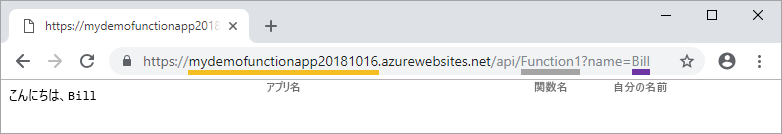

# クイック スタート:Visual Studio を使用して Azure で初めての関数を作成する

Azure Functions を使用すると、最初に VM を作成したり Web アプリケーションを発行したりしなくても、サーバーレス環境でコードを実行できます。

このクイックスタートでは、Visual Studio 2019 を使用して、"hello world" の HTTP によってトリガーされる C# 関数アプリをローカルで作成およびテストしてから、Azure に発行する方法を学習します。 

このクイックスタートは、Visual Studio 2019 用に設計されています。 

## 前提条件

このチュートリアルを完了するには、まず、[Visual Studio 2019](https://azure.microsoft.com/downloads/) をインストールします。 インストール時に **[Azure の開発]** ワークロードを確実に選択してください。 代わりに Visual Studio 2017 を使用して Azure Functions プロジェクトを作成する場合は、まず、[最新の Azure Functions ツール](functions-develop-vs.md#check-your-tools-version)をインストールする必要があります。

[Azure サブスクリプション](../guides/developer/azure-developer-guide.md#understanding-accounts-subscriptions-and-billing)をお持ちでない場合は、開始する前に[無料アカウント](https://azure.microsoft.com/free/dotnet/)を作成してください。

## 関数アプリ プロジェクトを作成する

[!INCLUDE [Create a project using the Azure Functions template](../../includes/functions-vstools-create.md)]

Visual Studio によってプロジェクトとクラスが作成されます。クラスの中には、HTTP トリガー関数型のスケルトン コードが含まれています。 `FunctionName` メソッド属性は、関数の名前を設定します。これは、既定では `Function1` です。 `HttpTrigger`属性は、関数が HTTP 要求によってトリガーされることを指定します。 スケルトン コードは、要求本文またはクエリ文字列の値を含む HTTP 応答を送信します。

メソッドに適切な属性を適用することによって、入力バインディングと出力バインディングを使用して関数の機能を拡張します。 詳細については、[Azure Functions C# 開発者向けリファレンス](functions-dotnet-class-library.md)の「[トリガーとバインド](functions-dotnet-class-library.md#triggers-and-bindings)」のセクションを参照してください。

関数プロジェクトと、HTTP トリガー関数を作成できたので、この関数をローカル コンピューターでテストすることができます。

## 関数をローカルで実行する

完全な Azure Functions ランタイムを使用してローカルで関数をテストできるように、Visual Studio は Azure Functions Core Tools と統合されます。  

[!INCLUDE [functions-run-function-test-local-vs](../../includes/functions-run-function-test-local-vs.md)]

関数がローカル コンピューター上で正常に動作することを確認したら、プロジェクトを Azure に発行します。

## Azure にプロジェクトを発行する

プロジェクトを発行するには、Azure サブスクリプションに関数アプリが存在する必要があります。 初めてプロジェクトを発行するときに、Visual Studio の発行機能によって、関数アプリが自動的に作成されます。

[!INCLUDE [Publish the project to Azure](../../includes/functions-vstools-publish.md)]

## Azure で関数をテストする

1. **[発行]** プロファイル ページから関数アプリのベース URL をコピーします。 関数をローカルでテストするために使用した URL の `localhost:port` 部分を新しいベース URL に置き換えます。 この URL にクエリ文字列 `?name=<YOUR_NAME>` を追加して、要求を実行します。

    HTTP トリガー関数を呼び出す URL は、次の形式になります。

    `http://<APP_NAME>.azurewebsites.net/api/<FUNCTION_NAME>?name=<YOUR_NAME>`

2. HTTP 要求のこの新しい URL をブラウザーのアドレス バーに貼り付けます。 次の画像で、関数によって返されたリモート GET 要求に対するブラウザーでの応答を示します。

    

## リソースをクリーンアップする

[!INCLUDE [Clean-up resources](../../includes/functions-quickstart-cleanup.md)]

## 次のステップ

このクイックスタートでは、Visual Studio を使用して、シンプルな HTTP トリガー関数を含む C# 関数アプリを作成し、Azure に発行しました。 

次の記事に進み、Azure Storage キュー バインドを関数に追加する方法を学習してください。
> [!div class="nextstepaction"]
> [関数に Azure Storage キュー バインドを追加する](functions-add-output-binding-storage-queue-vs.md)

