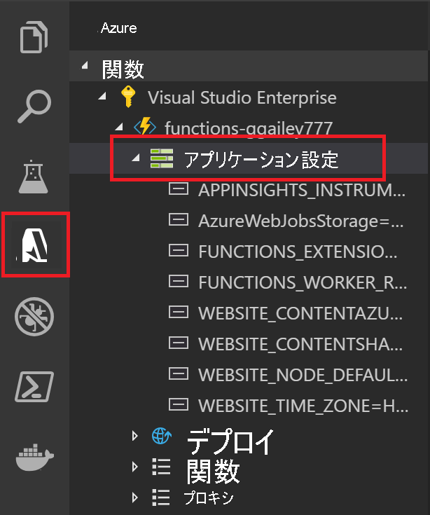

# <a name="develop-azure-functions-using-visual-studio-code"></a>Visual Studio Code を使用する Azure Functions の開発

[Visual Studio Code 用 Azure Functions 拡張機能]を使用すると、関数をローカルで開発して、Azure にデプロイできます。 Azure Functions を初めて使用する場合は、詳細について、「[Azure Functions の概要](functions-overview.md)」を参照してください。

Azure Functions 拡張機能には、次のような利点があります。 

* ローカル開発用コンピューターで関数を編集、作成、および実行できます。 
* Azure に直接 Azure Functions プロジェクトを発行できます。 
* Visual Studio Code のすべての利点を得ながら、さまざまな言語で関数を作成できます。 

拡張機能は、Azure Functions バージョン 2.x ランタイムでサポートされている次の言語で使用できます。 

* [C# コンパイル済み](functions-dotnet-class-library.md) 
* [C# スクリプト](functions-reference-csharp.md)<sup>*</sup>
* [JavaScript](functions-reference-node.md)
* [Java](functions-reference-java.md)
* [PowerShell](functions-reference-powershell.md)
* [Python](functions-reference-python.md)

<sup>*</sup>[C# スクリプトを既定のプロジェクト言語として設定](#c-script-projects)する必要があります。

この記事の例は現在、JavaScript (Node.js) と C# クラス ライブラリの関数でのみ使用可能です。  

この記事では、Azure Functions 拡張機能を使って関数を開発して Azure に発行する方法に関する詳細情報を提供します。 この記事を読む前に、[Visual Studio Code を使って最初の関数を作成](functions-create-first-function-vs-code.md)してください。

> [!IMPORTANT]
> 同じ関数アプリにローカル開発とポータル開発を混在させないでください。 ローカル プロジェクトから関数アプリに発行すると、ポータルで開発した関数がデプロイ プロセスによって上書きされます。

## <a name="prerequisites"></a>前提条件

[Azure Functions 拡張機能][visual studio code 用 azure functions 拡張機能]をインストールして実行する前に、次の要件を満たす必要があります。

* [サポートされているプラットフォーム](https://code.visualstudio.com/docs/supporting/requirements#_platforms)のいずれかにインストールされた [Visual Studio Code](https://code.visualstudio.com/)。

* 有効な Azure サブスクリプション

[!INCLUDE [quickstarts-free-trial-note](../../includes/quickstarts-free-trial-note.md)]

Azure Storage アカウントなどのその他の必要なリソースは、[Visual Studio Code を使って発行](#publish-to-azure)するときに、お使いのサブスクリプションに作成されます。

> [!IMPORTANT]
> 関数をローカルで開発し、それらをローカルで開始して実行することなく、Azure に発行できます。 関数をローカルで実行するには、Azure Functions Core Tools の自動ダウンロードなどの追加の要件があります。 詳細については、「[ローカルで実行するための追加の要件](#additional-requirements-to-run-locally)」を参照してください。 

[!INCLUDE [functions-install-vs-code-extension](../../includes/functions-install-vs-code-extension.md)]

## <a name="create-an-azure-functions-project"></a>Azure Functions プロジェクトを作成する

Functions の拡張機能により、最初の関数と共に関数アプリ プロジェクトを作成できます。 次の手順では、新しい関数プロジェクトに、HTTP によってトリガーされる関数を作成する方法を示します。 [HTTP トリガー](functions-bindings-http-webhook.md)は、実演する最も単純な関数トリガー テンプレートです。

1. **[Azure:Functions]** で [関数の作成] アイコンを選択します。

    

1. 関数アプリ プロジェクト用のフォルダーを選択し、次に**関数プロジェクト用の言語を選択します**。 

1. **HTTP トリガー**関数テンプレートを選択するか、 **[Skip for now]\(今はしない\)** を選択して、関数なしでプロジェクトを作成できます。 後でいつでも、[プロジェクトに関数を追加](#add-a-function-to-your-project)できます。 

    

1. 関数名として `HTTPTrigger` を入力して Enter キーを押してから、 **[関数]** の承認を選択します。 この承認レベルでは、関数エンドポイントを呼び出すときに[関数キー](functions-bindings-http-webhook.md#authorization-keys)を指定する必要があります。

    

    HTTP によってトリガーされる関数のテンプレートを使用して、選択した言語で関数が作成されます。

    

このプロジェクト テンプレートは、選択した言語でプロジェクトを作成し、必要な依存関係をインストールします。 どの言語の場合も、新しいプロジェクトには次のファイルが含まれます。

* **host.json**:Functions のホストを構成できます。 これらの設定は、ローカルでの実行時と Azure での実行時の両方に適用されます。 詳細については、[host.json](functions-host-json.md) のリファレンスを参照してください。

* **local.settings.json**:関数をローカルで実行するときに使用される設定を保持します。 これらの設定は、ローカルで実行するときにのみ使用されます。 詳細については、「[ローカル設定ファイル](#local-settings-file)」を参照してください。

    >[!IMPORTANT]
    >local.settings.json ファイルにはシークレットを含めることができるため、それをプロジェクト ソース管理から除外する必要があります。

この時点で、[function.json ファイルを変更する](#javascript-2)か、[パラメーターを C# クラス ライブラリ関数に追加する](#c-class-library-2)ことにより、関数に入出力バインドを追加できます。

また、[新しい関数をプロジェクトに追加する](#add-a-function-to-your-project)こともできます。

## <a name="install-binding-extensions"></a>バインディング拡張機能をインストールする

HTTP トリガーとタイマー トリガーを除き、バインドは拡張機能パッケージで実装されます。 拡張機能パッケージは、それらを必要とするトリガーおよびバインド用のものをインストールする必要があります。 バインドの拡張機能をインストールする方法は、プロジェクト言語によって異なります。

### <a name="javascript"></a>JavaScript

[!INCLUDE [functions-extension-bundles](../../includes/functions-extension-bundles.md)]

### <a name="c-class-library"></a>C\# クラス ライブラリ

ターミナル ウィンドウで [dotnet add package](/dotnet/core/tools/dotnet-add-package) コマンドを実行して、プロジェクトに必要な拡張機能パッケージをインストールします。 次の例では、Blob Storage、Queue Storage、Table Storage のバインドを実装する Azure Storage 拡張機能をインストールします。

```bash
dotnet add package Microsoft.Azure.WebJobs.Extensions.Storage --version 3.0.4
```

## <a name="add-a-function-to-your-project"></a>プロジェクトに関数を追加する

定義済みの Functions トリガー テンプレートのいずれかを使用して、既存のプロジェクトに新しい関数を追加できます。 新しい関数トリガーを追加するには、F1 キーを押してコマンド パレットを開き、次にコマンド **Azure Functions:Create Function...** を検索して実行します。プロンプトに従ってトリガーの種類を選択し、そのトリガーの必要な属性を定義します。 トリガーで、サービスに接続するためのアクセス キーまたは接続文字列が必要な場合は、関数トリガーを作成する前にそれを準備しておいてください。 

この操作の結果は、お使いのプロジェクト言語によって異なります。

### <a name="javascript"></a>JavaScript

プロジェクトに新しいフォルダーが作成され、新しい function.json ファイルと新しい JavaScript コード ファイルが含まれています。

### <a name="c-class-library"></a>C\# クラス ライブラリ

新しい C# クラス ライブラリ (.cs) ファイルがプロジェクトに追加されます。

## <a name="add-input-and-output-bindings"></a>入出力バインドを追加する

入出力バインドを追加することで、関数を拡張できます。 その方法は、お使いのプロジェクト言語によって異なります。 バインドの詳細については、「[Azure Functions でのトリガーとバインドの概念](functions-triggers-bindings.md)」を参照してください。 

次の例では、`outqueue` という名前のストレージ キューに接続します。ここで、ストレージ アカウントの接続文字列は、local.settings.json の `MyStorageConnection` アプリケーション設定に指定されています。 

### <a name="javascript"></a>JavaScript

Visual Studio Code では、便利な一連のプロンプトに従って、function.json ファイルにバインドを追加できます。 バインドを作成するには、関数フォルダー内の `function.json` ファイルを右クリック (macOS では Ctrl を押しながらクリック) して、 **[バインドの追加]** を選択します。 


以下は、新しいストレージ出力バインドを定義するためのプロンプト例です。

| Prompt | 値 | 説明 |
| -------- | ----- | ----------- |
| **Select binding direction (バインド方向を選択する)** | `out` | バインドは出力バインドです。 |
| **Select binding with direction... (方向を使用してバインドを選択する...)** | `Azure Queue Storage` | バインドは Azure Storage キュー バインドです。 |
| **コードでこのバインドの特定に使用する名前** | `msg` | コードで参照されているバインド パラメーターを識別する名前。 |
| **The queue to which the message will be sent (メッセージの送信先のキュー)** | `outqueue` | バインドが書き込むキューの名前。 *queueName* が存在しない場合は、バインドによって最初に使用されるときに作成されます。 |
| **Select setting from "local.setting.json" ("local.setting.json" から設定を選択する)** | `MyStorageConnection` | ストレージ アカウントの接続文字列を含むアプリケーション設定の名前。 `AzureWebJobsStorage` 設定には、関数アプリで作成したストレージ アカウントの接続文字列が含まれています。 |

この例では、次のバインドが function.json ファイルの `bindings` 配列に追加されます。

```javascript
{
    "type": "queue",
    "direction": "out",
    "name": "msg",
    "queueName": "outqueue",
    "connection": "MyStorageConnection"
}
```

また、同じバインド定義を function.json に直接追加することもできます。

関数コードで、`msg` バインドは次の例のように `context` からアクセスされます。

```javascript
context.bindings.msg = "Name passed to the function: " req.query.name;
```

詳細については、[キュー ストレージの出力バインド](functions-bindings-storage-queue.md#output---javascript-example)の参照をご覧ください。

### <a name="c-class-library"></a>C\# クラス ライブラリ

次のパラメーターを `Run` メソッド定義に追加する関数メソッドを更新します。

```cs
[Queue("outqueue"),StorageAccount("MyStorageConnection")] ICollector<string> msg
```

このコードでは、次の `using` ステートメントを追加する必要があります。

```cs
using Microsoft.Azure.WebJobs.Extensions.Storage;
```

`msg` パラメーターは、`ICollector<T>` 型です。これは、関数が完了するときに出力バインドに書き込まれるメッセージのコレクションを表します。 関数が完了するときにキューに送信される 1 つ以上のメッセージをコレクションに追加します。

詳細については、[キュー ストレージの出力バインド](functions-bindings-storage-queue.md#output---c-example)の参照をご覧ください。

[!INCLUDE [Supported triggers and bindings](../../includes/functions-bindings.md)]

## <a name="publish-to-azure"></a>Azure に発行する

Visual Studio Code を使用すると、関数プロジェクトを Azure に直接発行できます。 このプロセスでは、Azure サブスクリプションに関数アプリと関連リソースを作成します。 関数アプリは、関数の実行コンテキストを提供します。 プロジェクトがパッケージ化され、Azure サブスクリプション内の新しい関数アプリにデプロイされます。

Visual Studio Code から発行するとき、2 つのデプロイ メソッドのうちの 1 つが使用されます。

* [Run-From-Package を有効にした Zip デプロイ](functions-deployment-technologies.md#zip-deploy): ほとんどの Azure Functions デプロイに使用されます。
* [外部パッケージ URL](functions-deployment-technologies.md#external-package-url): [従量課金プラン](functions-scale.md#consumption-plan)で Linux アプリへのデプロイに使用されます。

### <a name="quick-function-app-creation"></a>関数アプリのクイック作成

既定では、Visual Studio Code は、関数アプリに必要な Azure リソースの値を自動的に生成します。 これらの値は、選択した関数アプリ名に基づきます。 既定値を使ってプロジェクトを Azure の新しい関数アプリに発行する例については、[Visual Studio Code のクイックスタートに関する記事](functions-create-first-function-vs-code.md#publish-the-project-to-azure)を参照してください。

作成したリソースに明示的な名前を指定する場合は、拡張オプションを使用した発行を有効にする必要があります。

### <a name="enabled-publishing-with-advanced-create-options"></a>拡張作成オプションを使用した発行の有効化

Azure Functions アプリの作成に関連した設定を制御するには、拡張設定を有効にするように Azure Functions の拡張機能を更新します。

1. **[ファイル] > [Preferences]\(基本設定\) > [設定]** をクリックします

1. **[User Settings]\(ユーザー設定\) > [Extensions]\(拡張機能\) > [Azure Functions]** の順に移動します

1. **[Azure Function:Advanced Creation]\(Azure Function: 高度な作成\)** のチェック ボックスをオンにします

### <a name="publish-to-a-new-function-app-in-azure-with-advanced-creation"></a>高度な作成を使用して Azure で新しい関数アプリを発行する

次の手順では、高度な作成オプションを使用して作成された新しい関数アプリにプロジェクトを発行します。

1. **[Azure: Functions]** 領域で、[Deploy to Function App]\(Function App にデプロイ\) アイコンを選択します。

    

1. サインインしていない場合、**Azure にサインイン**するよう求められます。 **無料の Azure アカウントを作成**することもできます。 ブラウザーから正常にサインインしたら、Visual Studio Code に戻ります。

1. 複数のサブスクリプションがある場合、関数アプリ用の **[サブスクリプションを選択]** してから、 **[+ Create New Function App in Azure]\(+ Azure で新しい Function App を作成\)** を選択します。

1. プロンプトに従って、次の情報を入力します。

    | Prompt | 値 | 説明 |
    | ------ | ----- | ----------- |
    | Select function app in Azure (Azure で関数アプリを選択する) | + Create New Function App in Azure (+ Azure で新しい関数アプリを作成する) | 次のプロンプトで、新しい関数アプリを識別するグローバルに一意の名前を入力し、Enter キーを押します。 関数アプリ名の有効な文字は、`a-z`、`0-9`、`-` です。 |
    | Select an OS (OS を選択する) | Windows | Windows で実行する関数アプリ |
    | Select a hosting plan (ホスティング プランを選択する) | 従量課金プラン | サーバーレス[従量課金プランでのホスティング](functions-scale.md#consumption-plan)が使用されます。 |
    | Select a runtime for your new app (新しいアプリのランタイムを選択する) | プロジェクトの言語 | ランタイムは、発行するプロジェクトに一致している必要があります。 |
    | Select a resource group for new resources (新しいリソースのリソース グループを選択する) | 新しいリソース グループの作成 | 次のプロンプトで、`myResourceGroup` のようなリソース グループ名を入力し、Enter キーを押します。 既存のリソース グループを選択することもできます。 |
    | Select a storage account (ストレージ アカウントを選択する) | 新しいストレージ アカウントを作成する | 次のプロンプトで、関数アプリで使用する新しいストレージ アカウントのグローバルに一意の名前を入力して、Enter キーを押します。 ストレージ アカウント名の長さは 3 ～ 24 文字で、数字と小文字のみを使用できます。 既存のアカウントを選択することもできます。 |
    | Select a location for new resources (新しいリソースの場所を選択する) | region | 最寄りの[リージョン](https://azure.microsoft.com/regions/)または関数がアクセスする他のサービスの近くのリージョン内の場所を選択します。 |

    関数アプリが作成され、展開パッケージが適用されると、通知が表示されます。 この通知の **[View Output]\(出力の表示\)** を選択すると、作成済みの Azure リソースなど、作成とデプロイの結果が表示されます。

## <a name="republish-project-files"></a>プロジェクト ファイルを再発行する

[継続的なデプロイ](functions-continuous-deployment.md)をセットアップすると、接続されているソースの場所でソース ファイルが更新されると必ず Azure の関数アプリが更新されます。 この開発手法が推奨されますが、Visual Studio Code からプロジェクト ファイルの更新を再発行することもできます。 

> [!IMPORTANT]
> 既存の関数アプリに発行すると、Azure のそのアプリのコンテンツが上書きされます。

1. Visual Studio Code で F1 を押して、コマンド パレットを開きます。 コマンド パレットで、`Azure Functions: Deploy to function app...` を検索して選択します。

1. サインインしていない場合、**Azure にサインイン**するよう求められます。 ブラウザーから正常にサインインしたら、Visual Studio Code に戻ります。 複数のサブスクリプションがある場合は、自分の関数アプリが含まれている**サブスクリプションを選択**します。

1. Azure で既存の関数アプリを選択します。 関数アプリ内のすべてのファイルが上書きされるという警告が表示された場合は、 **[デプロイ]** を選択して警告を確認して続行します。 

プロジェクトが再構築され、再パッケージされて、Azure にアップロードされます。 既存のプロジェクトが新しいパッケージに置き換えられて、関数アプリが再起動します。

## <a name="get-deployed-function-url"></a>デプロイされた関数 URL を取得する

HTTP によってトリガーされる関数を呼び出せるようにするには、関数アプリにデプロイされたときの関数の URL が必要です。 この URL には、必要なすべての[関数キー](functions-bindings-http-webhook.md#authorization-keys)が含まれています。 デプロイした関数のこれらの URL を取得するには、拡張機能を使用できます。

1. F1 キーを押してコマンド パレットを開き、次にコマンド **Azure Functions:Copy Function URL** を検索して実行します。

1. プロンプトに従って、Azure で関数アプリを選択し、次に、起動する特定の HTTP トリガーを選択します。 

`code` クエリ パラメーターを使って渡された必要なキーとともに、関数の URL がクリップボードにコピーされます。 HTTP ツールを使って POST 要求を送信するか、ブラウザーを使って GET 要求をリモート関数に送信します。  

## <a name="run-functions-locally"></a>関数をローカルで実行する

Azure Functions 拡張機能を使用すると、ローカルの開発用コンピューターで Functions プロジェクトを実行できます。 ローカル ランタイムは、Azure で関数アプリをホストしているのと同じランタイムです。 ローカル設定は、[local.settings.json ファイル](#local-settings-file)から読み取られます。

### <a name="additional-requirements-to-run-locally"></a>ローカルで実行するための追加の要件

Functions プロジェクトをローカルで実行できるようにするには、次の追加要件も満たす必要があります。

* [Azure Functions Core Tools](functions-run-local.md#v2) のバージョン 2.x をインストールします。 プロジェクトをローカルで開始すると、Core Tools パッケージが自動的にダウンロードされてインストールされます。 Core Tools には、Azure Functions ランタイム全体が含まれているため、ダウンロードとインストールにはしばらく時間がかかる場合があります。

* 選択した言語に固有の要件をインストールします。

    | 言語 | 要件 |
    | -------- | --------- |
    | **C#** | [C# 拡張機能](https://marketplace.visualstudio.com/items?itemName=ms-vscode.csharp)<br/>[.NET Core CLI ツール](https://docs.microsoft.com/dotnet/core/tools/?tabs=netcore2x)   |
    | **Java** | [Debugger for Java 拡張機能](https://marketplace.visualstudio.com/items?itemName=vscjava.vscode-java-debug)<br/>[Java 8](https://aka.ms/azure-jdks)<br/>[Maven 3+](https://maven.apache.org/) |
    | **JavaScript** | [Node.js](https://nodejs.org/)<sup>*</sup> |  
    | **Python** | [Python 拡張機能](https://marketplace.visualstudio.com/items?itemName=ms-python.python)<br/>[Python 3.6 以降](https://www.python.org/downloads/)|

    <sup>*</sup>アクティブ LTS およびメンテナンス LTS のバージョン (8.11.1 および 10.14.1 を推奨)。

### <a name="configure-the-project-to-run-locally"></a>ローカルで実行するようにプロジェクトを構成する

Functions ランタイムは、HTTP と Webhook を除くすべてのトリガーの種類に対して内部で Azure Storage アカウントを使用します。 つまり、**Values.AzureWebJobsStorage** キーを、有効な Azure Storage アカウントの接続文字列に設定する必要があります。

このセクションでは、[Visual Studio Code 用の Azure Storage 拡張機能](https://marketplace.visualstudio.com/items?itemName=ms-azuretools.vscode-azurestorage)を [Microsoft Azure Storage Explorer](https://storageexplorer.com/) と共に使用して、ストレージ接続文字列の接続と取得を行います。   

ストレージ アカウントの接続文字列を設定するには、次のようにします。

1. Visual Studio で **Cloud Explorer** を開き、 **[ストレージ アカウント]**  >  **[Your Storage Account]\(ストレージ アカウント\)** を展開し、 **[プロパティ]** を選択し、 **[プライマリ接続文字列]** 値をコピーします。

2. プロジェクトで、local.settings.json ファイルを開き、コピーした接続文字列に **AzureWebJobsStorage** キーの値を設定します。

3. 前の手順を繰り返し、関数に必要なその他のすべての接続について、**Values** 配列に一意のキーを追加します。

詳細については、「[ローカル設定ファイル](#local-settings-file)」を参照してください。

### <a name="debugging-functions-locally"></a>関数をローカルでデバッグする  

関数をデバッグするには、F5 キーを押します。 [Core Tools][Azure Functions Core Tools] をまだダウンロードしていない場合は、そうするよう求められます。 Core Tools がインストールされて実行されると、ターミナルに出力が表示されます。 これは、`func host start` Core Tools コマンドをターミナルから実行するのと同じですが、追加のビルド タスクと、接続されたデバッガーが含まれます。  

プロジェクトが実行されていると、Azure にデプロイしたときと同様に関数をトリガーすることができます。 デバッグ モードで実行している場合は、予期したとおりに Visual Studio Code でブレークポイントがヒットします。

HTTP トリガーの要求 URL がターミナルの出力に表示されます。 ローカルで実行しているときは、HTTP トリガーの Function キーは使用されません。 詳細については、「[Azure Functions のコードをテストするための戦略](functions-test-a-function.md)」を参照してください。  

詳細については、「[Azure Functions Core Tools の操作][Azure Functions Core Tools]」を参照してください。

[!INCLUDE [functions-local-settings-file](../../includes/functions-local-settings-file.md)]

既定では、プロジェクトが Azure に発行されても、これらの設定は自動的に移行されません。 発行が完了すると、local.settings.json から Azure の関数アプリに設定を発行するオプションが提供されます。 詳細については、「[アプリケーション設定を発行する](#publish-application-settings)」を参照してください。

**ConnectionStrings** 内の値は発行されません。

関数アプリケーションの設定値は、コード内で環境変数として読み取ることもできます。 詳細については、次の言語固有のリファレンス記事の「環境変数」のセクションを参照してください。

* [C# プリコンパイル済み](functions-dotnet-class-library.md#environment-variables)
* [C# スクリプト (.csx)](functions-reference-csharp.md#environment-variables)
* [Java](functions-reference-java.md#environment-variables)
* [JavaScript](functions-reference-node.md#environment-variables)

## <a name="application-settings-in-azure"></a>Azure のアプリケーション設定

プロジェクトでの local.settings.json ファイルの設定は、Azure の関数アプリのアプリケーション設定と同じである必要があります。 local.settings.json に追加したすべての設定は、Azure の関数アプリにも追加する必要があります。 プロジェクトを発行するとき、これらの設定は自動的にアップロードされません。 同様に、[ポータル内](functions-how-to-use-azure-function-app-settings.md#settings)の関数アプリで作成する設定はすべて、ローカル プロジェクトにダウンロードする必要があります。

### <a name="publish-application-settings"></a>アプリケーション設定を発行する

Azure の関数アプリに必要な設定を発行する最も簡単な方法は、プロジェクトが正常に発行された後に表示される **[アップロードの設定]\(Upload settings\)** リンクを使用することです。


また、コマンド パレットで `Azure Functions: Upload Local Setting` コマンドを使って設定を発行することもできます。 `Azure Functions: Add New Setting...` コマンドを使用すると、個別の設定が Azure のアプリケーション設定に追加されます。 

> [!TIP]
> 発行する前に local.settings.json ファイルを必ず保存してください。

ローカル ファイルが暗号化されている場合は、復号化され、発行されて、再び暗号化されます。 両方の場所に異なる値の設定が存在する場合は、処理方法を選択するよう求められます。

お使いのサブスクリプション、関数アプリ、 **[アプリケーションの設定]** を展開して、**Azure:Functions** 領域で既存のアプリ設定を表示します。



### <a name="download-settings-from-azure"></a>Azure から設定をダウンロードする

Azure でアプリケーション設定を作成した場合は、 `Azure Functions: Download Remote Settings...` コマンドを使用して local.settings.json ファイルにダウンロードできます。 

アップロードと同様に、ローカル ファイルが暗号化されている場合は、復号化され、更新されて、再び暗号化されます。 両方の場所に異なる値の設定が存在する場合は、処理方法を選択するよう求められます。

## <a name="monitoring-functions"></a>関数の監視

[ローカルで実行](#run-functions-locally)しているときに、ログ データがターミナル コンソールにストリーミングされます。 また、関数プロジェクトが Azure の関数アプリで実行されているときにもログ データを取得できます。 Azure のストリーミング ログに接続してほぼリアルタイムのログ データを表示するか、関数アプリの動作をより完全に把握するために Application Insights を有効にすることができます。

### <a name="streaming-logs"></a>ストリーミング ログ

アプリケーションの開発中に、ログ情報をほぼリアルタイムで参照すると役立つことがよくあります。 関数によって生成されているログ ファイルのストリームを表示できます。 次の出力は、HTTP によってトリガーされた関数への要求のストリーミング ログの例です。

 

詳細については、「[ストリーミング ログ](functions-monitoring.md#streaming-logs)」を参照してください。 

[!INCLUDE [functions-enable-log-stream-vs-code](../../includes/functions-enable-log-stream-vs-code.md)]

> [!NOTE]
> ストリーミング ログでは、Functions ホストの 1 つのインスタンスしかサポートされません。 関数が複数のインスタンスにスケール調整されている場合、他のインスタンスからのデータはログ ストリームに表示されません。 Application Insights の [Live Metrics Stream](../azure-monitor/app/live-stream.md) では、複数のインスタンスがサポートされます。 これもほぼリアルタイムですが、ストリーミング分析は[サンプリングされたデータ](functions-monitoring.md#configure-sampling)にも基づいています。

### <a name="application-insights"></a>Application Insights

関数の実行を監視するための推奨される方法は、関数アプリを Azure Application Insights と統合することです。 Azure Portal で関数アプリを作成する場合、この統合は、既定で自動的に行われます。 ただし、Visual Studio の発行中に関数アプリを作成する場合は、Azure で関数アプリの統合は実行されません。

[!INCLUDE [functions-connect-new-app-insights.md](../../includes/functions-connect-new-app-insights.md)]

詳細については、「[Azure Functions を監視する](functions-monitoring.md)」を参照してください。

## <a name="c-script-projects"></a>C\# スクリプト プロジェクト

既定では、すべての C# プロジェクトは [C# コンパイル済みクラス ライブラリ プロジェクト](functions-dotnet-class-library.md)として作成されます。 代わりに C# スクリプト プロジェクトを操作したい場合は、Azure Functions 拡張機能設定で、既定言語として C# スクリプトを選択する必要があります。

1. **[ファイル] > [Preferences]\(基本設定\) > [設定]** をクリックします。

1. **[User Settings]\(ユーザー設定\) > [Extensions]\(拡張機能\) > [Azure Functions]** の順に移動します。

1. **[Azure Function:Project Language]\(Azure Function:プロジェクト言語\)** から **[C#Script]** を選択します。

この時点で、基盤となる Core Tools への呼び出しには、C# スクリプト (.csx) プロジェクト ファイルを生成して発行する `--csx` オプションが含まれます。 既定の言語を指定すると、作成されるすべてのプロジェクトは既定で C# スクリプト プロジェクトになります。 既定が設定されているときは、プロジェクト言語を選択するよう求められません。 他の言語のプロジェクトを作成するには、この設定を変更するか、ユーザーの settings.json ファイルから削除する必要があります。 この設定を削除すると、プロジェクトを作成するときに、言語を選択するよう再び求められます。

## <a name="command-palette-reference"></a>コマンド パレットのリファレンス

Azure Functions 拡張機能には、Azure の関数アプリと対話するための便利なグラフィカル インターフェイスが Azure 領域に用意されています。 同じ機能が、コマンド パレット (F1) のコマンドとしても使用できます。 次の Azure Functions 固有のコマンドが使用可能です。

|Azure Functions のコマンド  | 説明  |
|---------|---------|
|**Add New Settings...**  |  Azure に新しいアプリケーション設定を作成します。 詳細については、「[アプリケーション設定を発行する](#publish-application-settings)」を参照してください。 また、[この設定をローカル設定にダウンロード](#download-settings-from-azure)する必要がある場合もあります。 |
| **Configure Deployment Source...** | Azure の関数アプリをローカル Git リポジトリに接続します。 詳細については、「[Azure Functions の継続的なデプロイ](functions-continuous-deployment.md)」をご覧ください。 |
| **Connect to GitHub Repository...** | 関数アプリを GitHub リポジトリに接続します。 |
| **Copy Function URL** | Azure で実行されている HTTP によってトリガーされる関数のリモート URL を取得します。 詳細については、[デプロイした関数 URL を取得する](#get-deployed-function-url)方法に関するセクションを参照してください。 |
| **Create function app in Azure...** | Azure のサブスクリプションに新しいアプリを作成します。 詳細については、[Azure で新しい関数を発行する](#publish-to-azure)方法に関するセクションを参照してください。        |
| **Decrypt Settings** | `Azure Functions: Encrypt Settings` を使って暗号化された[ローカル設定](#local-settings-file)を復号化します。  |
| **Delete Function App...** | Azure のサブスクリプションから既存の関数アプリを削除します。 App Service プランに他のアプリがない場合は、それも削除することを選択できます。 ストレージ アカウントやリソース グループなどの他のリソースは削除されません。 すべてのリソースを削除するには、代わりに[リソース グループを削除](functions-add-output-binding-storage-queue-vs-code.md#clean-up-resources)してください。 ローカル プロジェクトには影響はありません。 |
|**Delete Function...**  | Azure の関数アプリから既存の関数を削除します。 この削除はローカル プロジェクトに影響を与えないため、代わりに、関数をローカルで削除してから、[プロジェクトを再発行する](#republish-project-files)ことを検討してください。 |
| **Delete Proxy...** | Azure の関数アプリから Azure Functions プロキシを削除します。 プロキシについて詳しくは、「[Azure Functions プロキシの操作](functions-proxies.md)」をご覧ください。 |
| **Delete Setting...** | Azure の関数アプリケーションの設定を削除します。 local.settings.json ファイルの設定には影響はありません。 |
| **Disconnect from Repo...**  | Azure の関数アプリとソース管理リポジトリの間の[継続的デプロイ](functions-continuous-deployment.md)接続を削除します。 |
| **Download Remote Settings...** | Azure の選択した関数アプリから local.settings.json ファイルに設定をダウンロードします。 ローカル ファイルが暗号化されている場合は、復号化され、更新されて、再び暗号化されます。 両方の場所に異なる値の設定が存在する場合は、処理方法を選択するよう求められます。 このコマンドを実行する前に、local.settings.json ファイルに変更を保存したことを確認してください。 |
| **Edit settings...** | Azure の既存の関数アプリケーション設定の値を変更します。 local.settings.json ファイルの設定には影響はありません。  |
| **Encrypt settings** | [ローカル設定](#local-settings-file)で `Values` 配列の個別の項目を暗号化します。 このファイルでは、`IsEncrypted` も `true` に設定されます。これにより、ローカル ランタイムに、設定を使用する前に復号化するよう指示します。 貴重な情報が漏洩するリスクを減らすために、ローカル設定を暗号化します。 Azure では、アプリケーション設定は常に、暗号化されて格納されます。 |
| **Execute Function Now** | Azure で[タイマーによってトリガーされる関数](functions-bindings-timer.md)をテスト目的で手動で開始します。 Azure での HTTP 以外の関数のトリガーついては、「[HTTP によってトリガーされない関数を手動で実行する](functions-manually-run-non-http.md)」をご覧ください。 |
| **Initialize Project for Use with VS Code...** | 必要な Visual Studio Code プロジェクト ファイルを既存の Functions プロジェクトに追加します。 このコマンドは、Core Tools を使用して作成したプロジェクトを操作するために使用します。 |
| **Install of Update Azure Functions Core Tools** | ローカルで実行するために使用される [Azure Functions Core Tools] をインストールまたは更新します。 |
| **Redeploy**  | 接続された Git リポジトリから Azure の特定のデプロイにプロジェクト ファイルを再デプロイできます。 Visual Studio Code からローカル更新を再発行するには、[プロジェクトを再発行](#republish-project-files)します。 |
| **Rename Settings...** | Azure の既存の関数アプリケーション設定のキー名を変更します。 local.settings.json ファイルの設定には影響はありません。 Azure で設定の名前を変更したら、[それらの変更をローカル プロジェクトにダウンロードする](#download-settings-from-azure)必要があります。 |
| **Restart** | Azure で関数アプリを再起動します。 更新をデプロイしても関数アプリが再起動されます。 |
| **Set AzureWebJobStorage...**| `AzureWebJobStorage` アプリケーション設定の値を設定します。 この設定は Azure Functions に必要であり、関数アプリが Azure に作成されると設定されます。 |
| **Start** | Azure の停止された関数アプリを起動します。 | 
| **Start Streaming Logs** | Azure の関数アプリのストリーム ログを開始します。 この情報をほぼリアルタイムで確認する必要がある場合は、Azure でのリモート トラブルシューティング中にストリーミング ログを使用します。 詳細については、「[ストリーミング ログ](#streaming-logs)」を参照してください。 |
| **Stop** | Azure で実行されている関数アプリをシャットダウンします。 |
| **Stop Streaming Logs** | Azure の関数アプリのストリーム ログを停止します。 |
| **Toggle as Slot Setting** | 有効になっている場合は、指定したデプロイ スロットに対してアプリケーション設定が保持されるようにします。 |
| **Uninstall Azure Functions Core Tools** | 拡張機能に必要な Azure Functions Core Tools を削除します。 |
| **Upload Local Settings...** | local.settings.json ファイルから、選択した Azure の関数アプリに設定をアップロードします。 ローカル ファイルが暗号化されている場合は、復号化され、アップロードされて、再び暗号化されます。 両方の場所に異なる値の設定が存在する場合は、処理方法を選択するよう求められます。 このコマンドを実行する前に、local.settings.json ファイルに変更を保存したことを確認してください。 |
| **View Commit in GitHub** | 関数アプリがリポジトリに接続されているとき、特定のデプロイでの最新のコミットを表示します。 |
| **View Deployment Logs** | Azure の関数アプリへの具体的なデプロイ用のログを表示します。 |

## <a name="next-steps"></a>次の手順

Azure Functions Core Tools の詳細については、「[Azure Functions をローカルでコーディングしてテストする](functions-run-local.md)」を参照してください。

.NET クラス ライブラリとしての関数の開発の詳細については、「[Azure Functions C# developer reference (Azure Functions C# 開発者向けリファレンス)](functions-dotnet-class-library.md)」を参照してください。 この記事は、Azure Functions でサポートされる各種バインドを宣言するための属性の使用例にもリンクしています。    

[Visual Studio Code 用 Azure Functions 拡張機能]: https://marketplace.visualstudio.com/items?itemName=ms-azuretools.vscode-azurefunctions
[Azure Functions Core Tools]: functions-run-local.md