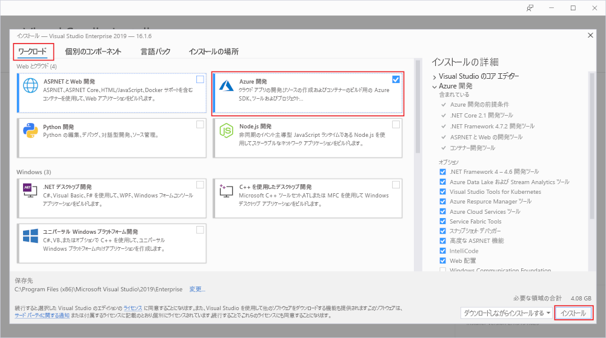
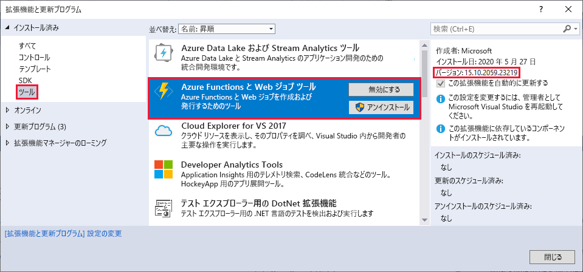
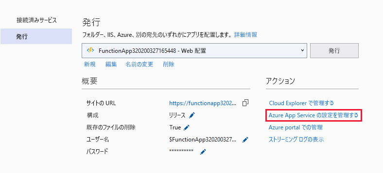
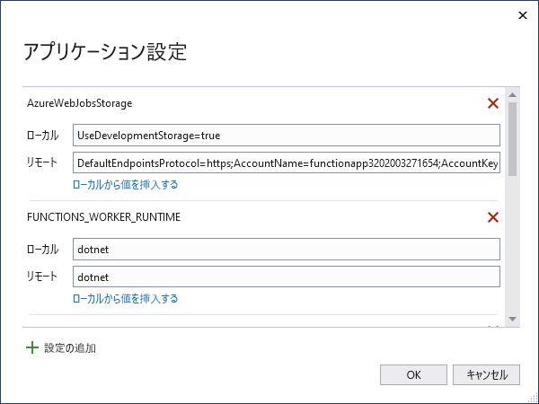

# <a name="develop-azure-functions-using-visual-studio"></a>Visual Studio を使用する Azure Functions の開発  

Azure Functions Tools は、C# 関数の開発、テスト、Azure へのデプロイを可能にする Visual Studio の拡張機能です。 Azure Functions を初めて使用する場合は、詳細について、「[Azure Functions の概要](functions-overview.md)」を参照してください。

Azure Functions Tools には、次のような利点があります。 

* ローカル開発用コンピューターで関数を編集、作成、および実行できます。 
* Azure に直接 Azure Functions プロジェクトを発行できます。 
* WebJobs 属性を使用して、定義をバインドするために個別に function.json を維持するのではなく、C# コードで直接関数バインディングを宣言できます。
* コンパイル済み C# 関数を開発およびデプロイできます。 コンパイル済み関数では、C# スクリプト ベースの関数より優れたコールド スタート パフォーマンスが得られます。 
* Visual Studio 開発のすべての利点を得ながら、C# で関数をコーディングできます。 

この記事では、Azure Functions Tools for Visual Studio 2019 を使用して C# 関数を開発し、それを Azure に発行する方法に関する詳細情報を提供します。 この記事を読む前に、[Visual Studio 用の関数クイック スタート](functions-create-your-first-function-visual-studio.md)に関するページを完了する 必要があります。 

> [!IMPORTANT]
> 同じ関数アプリにローカル開発とポータル開発を混在させないでください。 ローカル プロジェクトから関数アプリに発行すると、ポータルで開発した関数がデプロイ プロセスによって上書きされます。

## <a name="prerequisites"></a>前提条件

Azure Functions Tools は、[Visual Studio 2017 ](https://www.visualstudio.com/vs/) 以降のバージョンの Azure 開発ワークロードに含まれています。 Visual Studio 2019 のインストールには、必ず **Azure 開発**ワークロードを含めてください。



Visual Studio が最新であり、Azure Functions ツールの[最新バージョン](#check-your-tools-version)を使用していることを確認します。

### <a name="azure-resources"></a>Azure リソース

[!INCLUDE [quickstarts-free-trial-note](../../includes/quickstarts-free-trial-note.md)]

Azure Storage アカウントなど、他の必要なリソースは、発行プロセス中にサブスクリプションに作成されます。

### <a name="check-your-tools-version"></a>ツールのバージョンを確認する

1. **[ツール]** メニューの **[拡張機能と更新プログラム]** を選択します。 **[インストール済み]**  >  **[ツール]** メニューを展開し、 **[Azure Functions と Web ジョブ ツール]** を選択します。

    

2. インストールされている**バージョン**を確認します。 このバージョンと[リリース ノート](https://github.com/Azure/Azure-Functions/blob/master/VS-AzureTools-ReleaseNotes.md)に記載されている最新バージョンを比較します。 

3. インストールされているバージョンが古い場合は、次のセクションの説明に従って Visual Studio でツールを更新します。

### <a name="update-your-tools"></a>ツールを更新する

1. **[拡張機能と更新プログラム]** ダイアログで、 **[更新プログラム]**  >  **[Visual Studio Marketplace]** を展開し、 **[Azure Functions と Web ジョブ ツール]** 、 **[更新]** の順に選択します。

       

2. ツールの更新プログラムをダウンロードしたら、Visual Studio を終了し、VSIX インストーラーを使用してツールの更新プログラムを起動します。

3. インストーラーで **[OK]** を選択して開始し、 **[変更]** を選択してツールを更新します。 

4. 更新が完了したら、 **[閉じる]** を選択して Visual Studio を再起動します。

## <a name="create-an-azure-functions-project"></a>Azure Functions プロジェクトを作成する

[!INCLUDE [Create a project using the Azure Functions](../../includes/functions-vstools-create.md)]

プロジェクト テンプレートでは、C# プロジェクトの作成、`Microsoft.NET.Sdk.Functions` NuGet パッケージのインストール、およびターゲット フレームワークの設定が行われます。 Functions 1.x の対象は .NET Framework で、Functions 2.x の対象は .NET Standard です。 新しいプロジェクトには次のファイルが含まれます。

* **host.json**:Functions のホストを構成できます。 これらの設定は、ローカルでの実行時と Azure での実行時の両方に適用されます。 詳細については、[host.json](functions-host-json.md) のリファレンスを参照してください。

* **local.settings.json**:関数をローカルで実行するときに使用される設定を保持します。 Azure で実行している場合、これらの設定は使用されません。 詳細については、「[ローカル設定ファイル](#local-settings-file)」を参照してください。

    >[!IMPORTANT]
    >local.settings.json ファイルにはシークレットを含めることができるため、それをプロジェクト ソース管理から除外する必要があります。 このファイルの **[出力ディレクトリにコピー]** 設定は、常に **[新しい場合はコピーする]** にする必要があります。 

詳細については、「[関数クラス ライブラリ プロジェクト](functions-dotnet-class-library.md#functions-class-library-project)」を参照してください。

[!INCLUDE [functions-local-settings-file](../../includes/functions-local-settings-file.md)]

プロジェクトを発行しても local.settings.json の設定は自動的にアップロードされません。 これらの設定が Azure の関数アプリにも確実に存在するようにするには、プロジェクトを発行した後にそれらをアップロードする必要があります。 詳細については、「[Function App の設定](#function-app-settings)」を参照してください。

**ConnectionStrings** 内の値は発行されません。

関数アプリの設定値は、コードの中で環境変数として読み込むこともできます。 詳細については、「[環境変数](functions-dotnet-class-library.md#environment-variables)」を参照してください。

## <a name="configure-the-project-for-local-development"></a>ローカル開発用のプロジェクトを構成する

Functions ランタイムでは内部的に Azure Storage アカウントを使用します。 HTTP と webhook 以外のすべてのトリガーの種類については、**Values.AzureWebJobsStorage** キーを有効な Azure Storage アカウントの接続文字列に設定する必要があります。 関数アプリで、プロジェクトに必要な **AzureWebJobsStorage** 接続設定に [Azure Storage エミュレーター](../storage/common/storage-use-emulator.md)を使用することもできます。 エミュレーターを使用するには、**AzureWebJobsStorage** の値を `UseDevelopmentStorage=true` に設定します。 この設定は、デプロイの前に実際のストレージ接続に変更します。

ストレージ アカウントの接続文字列を設定するには、次のようにします。

1. Visual Studio で **Cloud Explorer** を開き、 **[ストレージ アカウント]**  >  **[Your Storage Account]\(ストレージ アカウント\)** を展開し、 **[プロパティ]** を選択し、 **[プライマリ接続文字列]** 値をコピーします。

2. プロジェクトで、local.settings.json ファイルを開き、コピーした接続文字列に **AzureWebJobsStorage** キーの値を設定します。

3. 前の手順を繰り返し、関数に必要なその他のすべての接続について、**Values** 配列に一意のキーを追加します。

## <a name="add-a-function-to-your-project"></a>プロジェクトに関数を追加する

コンパイル済みの関数では、関数で使用されるバインディングはコードで属性を適用することで定義されます。 Azure Functions Tools を使用して提供されているテンプレートから関数を作成する場合は、これらの属性が適用されます。 

1. **ソリューション エクスプローラー**で、プロジェクト ノードを右クリックし、 **[追加]**  >  **[新しいアイテム]** の順に選択します。 **[Azure 関数]** を選択し、クラスの **[名前]** を入力して **[追加]** をクリックします。

2. トリガーを選択し、バインドのプロパティを設定して、 **[作成]** をクリックします。 次の例は、Queue Storage によってトリガーされる関数を作成する場合の設定を示しています。 

    

    このトリガーの例では、**QueueStorage** という名前のキーと共に接続文字列を使用します。 この接続文字列の設定は、[local.settings.json ファイル](functions-run-local.md#local-settings-file)で定義する必要があります。

3. 新しく追加されたクラスを確認します。 **FunctionName** 属性に関連付けられている、静的な **Run** メソッドが表示されています。 この属性は、メソッドが関数のエントリ ポイントであることを示します。

    たとえば、次の C# クラスは基本的な Queue Storage トリガー関数を表します。

    ```csharp
    using System;
    using Microsoft.Azure.WebJobs;
    using Microsoft.Azure.WebJobs.Host;
    using Microsoft.Extensions.Logging;

    namespace FunctionApp1
    {
        public static class Function1
        {
            [FunctionName("QueueTriggerCSharp")]
            public static void Run([QueueTrigger("myqueue-items", Connection = "QueueStorage")]string myQueueItem, ILogger log)
            {
                log.LogInformation($"C# Queue trigger function processed: {myQueueItem}");
            }
        }
    }
    ```

    バインド固有の属性は、エントリ ポイント メソッドに指定された各バインド パラメーターに適用されます。 属性ではパラメーターとしてバインド情報を取ります。 前の例では、最初のパラメーターに **QueueTrigger** 属性が適用されています。これは、キューによってトリガーされる関数を意味します。 キュー名および接続文字列の設定名は、パラメーターとして **QueueTrigger** 属性に渡されます。 詳細については、[Azure Functions での Azure Queue ストレージのバインド](functions-bindings-storage-queue.md#trigger---c-example)に関する記事を参照してください。

上記の手順を使用して、複数の関数を関数アプリ プロジェクトに追加できます。 プロジェクト内の各関数で異なるトリガーを使用できますが、1 つの関数には 1 つのトリガーのみを使用する必要があります。 詳しくは、「[Azure Functions でのトリガーとバインドの概念](functions-triggers-bindings.md)」をご覧ください。

## <a name="add-bindings"></a>バインドの追加

トリガーと同じように、入力バインドと出力バインドも、バインド属性として関数に追加されます。 以下のように、関数にバインドを追加します。

1. [プロジェクトをローカル開発用に構成](#configure-the-project-for-local-development)したことを確認します。

2. 特定のバインディングに適した NuGet 拡張機能パッケージを追加します。 詳細については、「Azure Functions でのトリガーとバインドの概念」の記事の「[Visual Studio を使用したローカルでの C# 開発](./functions-bindings-register.md#local-csharp)」を参照してください。 バインド固有の NuGet パッケージの要件については、バインドの参照記事で確認できます。 たとえば、Event Hubs トリガーのパッケージ要件については、[Event Hubs のバインドの参照記事](functions-bindings-event-hubs.md)を参照してください。

3. バインドが必要なアプリ設定がある場合は、[ローカル ファイルの設定](functions-run-local.md#local-settings-file)の **Values** コレクションに追加します。 関数がローカルで実行される場合は、これらの値が使用されます。 関数が Azure の関数アプリ で実行される場合は、[関数アプリの設定](#function-app-settings)が使用されます。

4. 適切なバインド属性をメソッド シグネチャに追加します。 次の例では、キュー メッセージによって関数がトリガーされ、出力バインドによって、同じテキストの新しいキュー メッセージが別のキューに作成されます。

    ```csharp
    public static class SimpleExampleWithOutput
    {
        [FunctionName("CopyQueueMessage")]
        public static void Run(
            [QueueTrigger("myqueue-items-source", Connection = "AzureWebJobsStorage")] string myQueueItem, 
            [Queue("myqueue-items-destination", Connection = "AzureWebJobsStorage")] out string myQueueItemCopy,
            ILogger log)
        {
            log.LogInformation($"CopyQueueMessage function processed: {myQueueItem}");
            myQueueItemCopy = myQueueItem;
        }
    }
    ```
   Queue Storage への接続は、`AzureWebJobsStorage` 設定から取得されます。 詳しくは、特定のバインドの参照記事をご覧ください。 

[!INCLUDE [Supported triggers and bindings](../../includes/functions-bindings.md)]

## <a name="testing-functions"></a>関数のテスト

Azure Functions Core Tools を使用すると、ローカルの開発用コンピューター上で Azure Functions プロジェクトを実行できます。 Visual Studio から初めて関数を開始すると、これらのツールをインストールするよう求めるメッセージが表示されます。

関数をテストするには、F5 キーを押します。 メッセージが表示されたら、Visual Studio からの要求に同意し、Azure Functions Core (CLI) ツールをダウンロードしてインストールします。 また、ツールで HTTP 要求を処理できるようにファイアウォールの例外を有効にすることが必要になる場合もあります。

プロジェクトを実行して、デプロイ済みの関数をテストする場合と同じように、コードをテストできます。 詳細については、「[Azure Functions のコードをテストするための戦略](functions-test-a-function.md)」を参照してください。 デバッグ モードで実行している場合は、予期したとおりに Visual Studio でブレークポイントがヒットします。 

<!---
For an example of how to test a queue triggered function, see the [queue triggered function quickstart tutorial](functions-create-storage-queue-triggered-function.md#test-the-function).  
-->

Azure Functions Core Tools の使用の詳細については、「[Azure Functions をローカルでコーディングしてテストする](functions-run-local.md)」を参照してください。

## <a name="publish-to-azure"></a>Azure に発行する

Visual Studio から発行するときは、2 つのデプロイ方法のいずれかが使用されます。

* [Web 配置](functions-deployment-technologies.md#web-deploy-msdeploy): Windows アプリをパッケージ化して任意の IIS サーバーに配置します。
* [Run-From-Package を有効にした Zip デプロイ](functions-deployment-technologies.md#zip-deploy): Azure Functions のデプロイに推奨されます。

次の手順を使用して、プロジェクトを Azure 内の関数アプリに発行します。

[!INCLUDE [Publish the project to Azure](../../includes/functions-vstools-publish.md)]

## <a name="function-app-settings"></a>Function App の設定

Local.settings.json で追加したすべての設定は、Azure の関数アプリにも追加する必要があります。 プロジェクトを発行するとき、これらの設定は自動的にアップロードされません。

Azure の関数アプリに必要な設定をアップロードする最も簡単な方法として、プロジェクトが正常に発行された後に表示される **[アプリケーション設定の管理]** リンクを使用できます。



これにより、関数アプリの **[アプリケーションの設定]** ダイアログが表示され、ここで新しいアプリケーション設定を追加したり、既存の設定を変更したりできます。



**[ローカル]** は local.settings.json ファイル内の設定値を表し、 **[リモート]** は Azure での関数アプリにおける現在の設定です。  新しいアプリ設定を作成するには、 **[設定の追加]** を選択します。 **[ローカルから値を挿入する]** リンクを使用して、設定値を **[リモート]** フィールドにコピーします。 **[OK]** を選択すると、保留中の変更がローカル設定ファイルと関数アプリに書き込まれます。

以下のいずれかの方法を使用して、アプリケーション設定を管理することもできます。

* [Azure Portal の使用](functions-how-to-use-azure-function-app-settings.md#settings)。
* [Azure Functions Core ツールでの `--publish-local-settings` 発行オプションの使用](functions-run-local.md#publish)。
* [Azure CLI の使用](/cli/azure/functionapp/config/appsettings#az-functionapp-config-appsettings-set)。

## <a name="monitoring-functions"></a>関数の監視

関数の実行を監視するための推奨される方法は、関数アプリを Azure Application Insights と統合することです。 Azure Portal で関数アプリを作成する場合、この統合は、既定で自動的に行われます。 ただし、Visual Studio の発行中に関数アプリを作成する場合は、Azure で関数アプリの統合は実行されません。

関数アプリ用に Application Insights を有効にするには:

[!INCLUDE [functions-connect-new-app-insights.md](../../includes/functions-connect-new-app-insights.md)]

詳細については、「[Azure Functions を監視する](functions-monitoring.md)」を参照してください。

## <a name="next-steps"></a>次の手順

Azure Functions Core Tools の詳細については、「[Azure Functions をローカルでコーディングしてテストする](functions-run-local.md)」を参照してください。

.NET クラス ライブラリとしての関数の開発の詳細については、「[Azure Functions C# developer reference (Azure Functions C# 開発者向けリファレンス)](functions-dotnet-class-library.md)」を参照してください。 この記事は、Azure Functions でサポートされる各種バインドを宣言するための属性の使用例にもリンクしています。    
