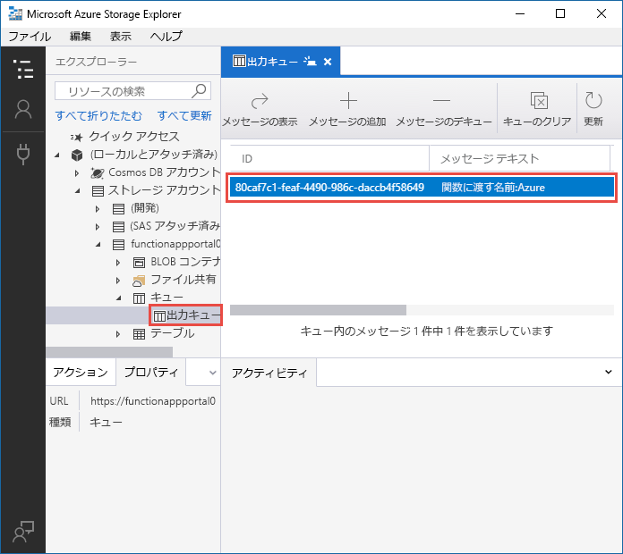
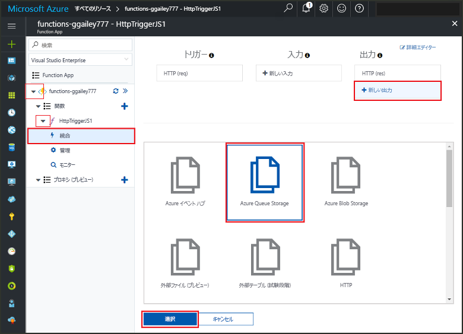
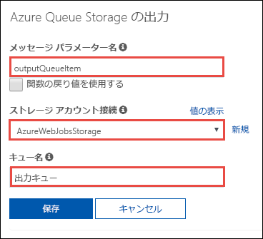
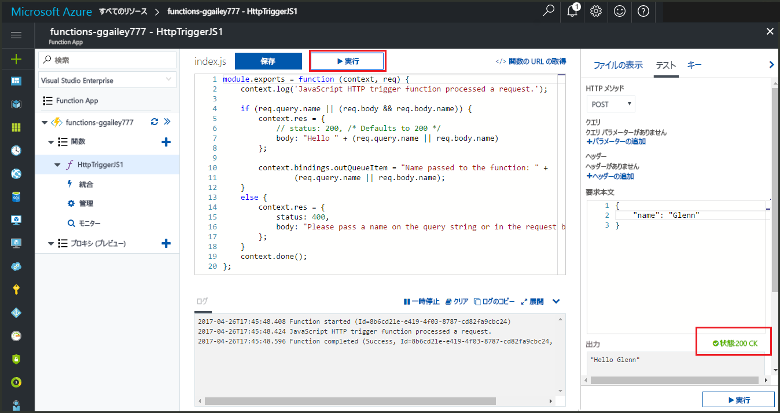
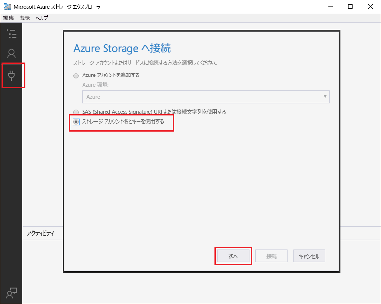
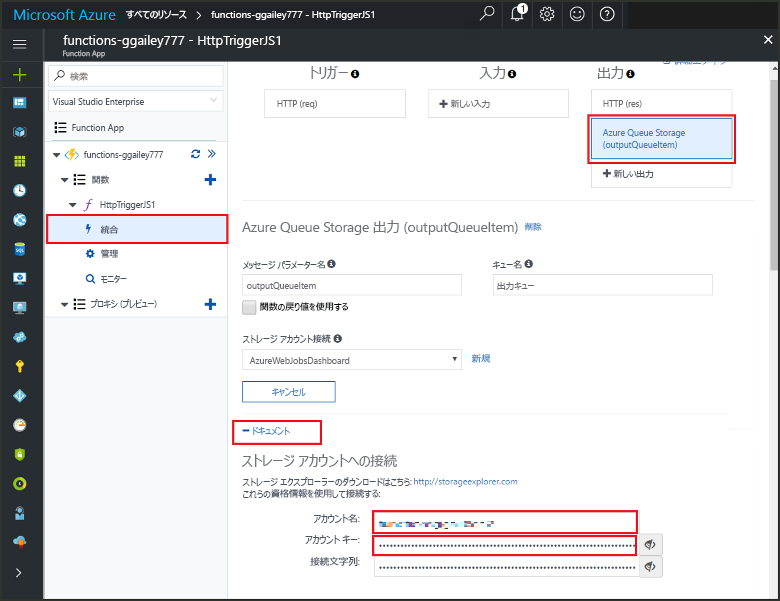
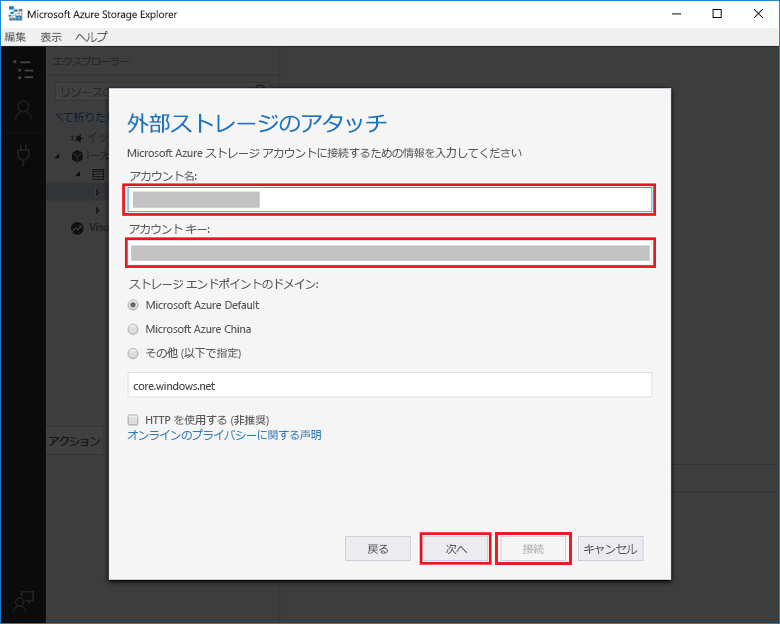

# <a name="add-messages-to-an-azure-storage-queue-using-functions"></a>Functions を使用して Azure Storage キューにメッセージを追加する

Azure Functions では、入力および出力バインディングによって、外部サービスからのデータをコードに使用できるようにする宣言方法が提供されます。 このクイックスタートでは、出力バインディングを使用して、関数が HTTP 要求によってトリガーされたときにキューにメッセージを作成します。 関数で作成するキュー メッセージを表示するには、Azure ストレージ エクスプローラーを使用します。



## <a name="prerequisites"></a>前提条件 

このクイック スタートを完了するには、以下が必要です。

* 「[Azure Portal で初めての関数を作成する](functions-create-first-azure-function.md)」の指示に従い、「**リソースのクリーンアップ**」の手順は実行しないでください。 ここで使用する関数と Function App は、そのクイックスタートで作成します。

* [Microsoft Azure ストレージ エクスプローラー](http://storageexplorer.com/)をインストールします。 これは、出力バインディングで作成するキュー メッセージの調査に使用するツールです。

## <a name="add-binding"></a>出力バインディングを追加する

このセクションでは、Portal UI を使用して、前に作成した関数にキュー ストレージの出力バインディングを追加します。 このバインディングにより、最小限のコードの記述でキューにメッセージを作成できるようになります。 ストレージ接続のオープン、キューの作成、キューへの参照の取得などのタスクのためにコードを記述する必要はありません。 Azure Functions ランタイムおよびキューの出力バインディングが、ユーザーに代わってこれらのタスクを処理します。

1. Azure Portal で、「[Azure Portal で初めての関数を作成する](functions-create-first-azure-function.md)」で作成した Function App の Function App ページを開きます。 そのためには、**[すべてのサービス]、[Function App]** の順に選択して、関数アプリを選択します。

2. 前のクイックスタートで作成した関数を選択します。

1. **[統合] > [新しい出力] > [Azure Queue Storage]** の順に選択します。

1. **[選択]** をクリックします。
    
    

3. **[Azure Queue Storage の出力]** の下で、このスクリーンショットの次の表で指定されている設定を使用します。 

    

    | Setting      |  推奨値   | 説明                              |
    | ------------ |  ------- | -------------------------------------------------- |
    | **メッセージ パラメーター名** | outputQueueItem | 出力バインディング パラメーターの名前。 | 
    | **ストレージ アカウント接続** | AzureWebJobsStorage | Function App によって既に使用されているストレージ アカウント接続を使用するか、新しく作成できます。  |
    | **キュー名**   | outqueue    | ストレージ アカウント内の接続先のキューの名前。 |

4. **[保存]** をクリックしてバインディングを追加します。
 
出力バインディングが定義されたので、コードを更新し、バインディングを使用して、メッセージをキューに追加する必要があります。  

## <a name="add-code-that-uses-the-output-binding"></a>出力バインディングを使用するコードを追加する

このセクションでは、出力キューにメッセージを書き込むコードを追加します。 メッセージには、クエリ文字列の HTTP トリガーに渡される値が含まれています。 たとえば、クエリ文字列に `name=Azure` が含まれる場合、キュー メッセージは *Name passed to the function: Azure* になります。

1. 関数を選択し、エディターに関数コードを表示します。 

2. C# 関数の場合、バインディングのメソッド パラメーターを追加して、使用するコードを記述します。

   次の例で示すように、**outputQueueItem** パラメーターをメソッド シグネチャに追加します。 パラメーター名は、バインディングを作成したときに **[メッセージ パラメーター名]** に入力したものと同じです。

   ```cs   
   public static async Task<HttpResponseMessage> Run(HttpRequestMessage req, 
       ICollector<string> outputQueueItem, TraceWriter log)
   {
       ...
   }
   ```

   `return` ステートメントの直前の C# 関数の本体で、パラメーターを使用してキュー メッセージを作成するコードを追加します。

   ```cs
   outputQueueItem.Add("Name passed to the function: " + name);     
   ```

3. JavaScript 関数の場合は、`context.bindings` オブジェクトの出力バインディングを使用してキュー メッセージを作成するコードを追加します。 このコードを `context.done` ステートメントの前に追加します。

   ```javascript
   context.bindings.outputQueueItem = "Name passed to the function: " + 
               (req.query.name || req.body.name);
   ```

4. **[保存]** を選択して変更を保存します。
 
## <a name="test-the-function"></a>関数をテストする 

1. コードの変更が保存されたら、**[実行]** を選択します。 

    

   **要求本文**に `name` 値 *Azure* が含まれていることに注意してください。 この値は、関数が呼び出されたときに作成されるキュー メッセージに表示されます。

   ここで **[実行]** を選択する代わりに、ブラウザーで URL を入力してクエリ文字列に `name` 値を指定することで、関数を呼び出すことができます。 このブラウザーの方法は、[前のクイック スタート](functions-create-first-azure-function.md#test-the-function)で示されています。

2. ログを確認して、関数が成功したことを確認します。 

出力バインディングを最初に使用するときに、**outqueue** という名前の新しいキューが、Functions ランタイムによってストレージ アカウントに作成されます。 キューとその中のメッセージが作成されたことを確認するには、ストレージ エクスプローラーを使用します。

### <a name="connect-storage-explorer-to-your-account"></a>ストレージ エクスプローラーをアカウントに接続する

ストレージ エクスプ ローラーが既にインストールされていて、このクイックスタートで使用するストレージ アカウントに接続されている場合は、このセクションをスキップしてください。

2. [Microsoft Azure ストレージ エクスプローラー](http://storageexplorer.com/) ツールを実行し、左側の接続アイコンをクリックして、**[Use a storage account name and key]\(ストレージ アカウント名とキーを使用\)** を選択し、**[次へ]** を選択します。

    

1. Azure Portal の Function App ページで、関数を選択し、**[統合]** を選択します。

1. 前の手順で追加した **Azure Queue Storage** 出力バインディングを選択します。

1. ページの下部の **[ドキュメント]** セクションを展開します。 

   ストレージ エクスプローラーでストレージ アカウントへの接続に使用できる資格情報が、Portal に表示されます。

   

1. Portal の **[アカウント名]** の値をコピーして、ストレージ エクスプローラ－の **[アカウント名]** ボックスに貼り付けます。
 
1. **[アカウント キー]** の横にある表示/非表示アイコンをクリックして値を表示し、**[アカウント キー]** の値をコピーして、ストレージ エクスプローラーの **[アカウント キー]** ボックスに貼り付けます。
  
3. **[次へ] > [接続]** の順に選択します。

   

### <a name="examine-the-output-queue"></a>出力キューを確認する

4. ストレージ エクスプローラーで、このクイックスタートに使用するストレージ アカウントを選択します。

1. **[キュー]** ノードを展開して、**outqueue** という名前のキューを選択します。 

   このキューには、HTTP によってトリガーされる関数を実行したときにキューの出力バインディングが作成されたというメッセージが含まれます。 *Azure* の既定の `name` 値で関数を呼び出した場合、キュー メッセージは *Name passed to the function: Azure* です。

    

2. 関数を再度実行すると、キューに新しいメッセージが表示されます。  

## <a name="clean-up-resources"></a>リソースのクリーンアップ

[!INCLUDE [Clean up resources](../../includes/functions-quickstart-cleanup.md)]

## <a name="next-steps"></a>次の手順

このクイックスタートでは、既存の関数に出力バインディングを追加しました。 Queue Storage へのバインディングの詳細については、「[Azure Functions における Storage キュー バインド](functions-bindings-storage-queue.md)」を参照してください。 

[!INCLUDE [Next steps note](../../includes/functions-quickstart-next-steps.md)]
