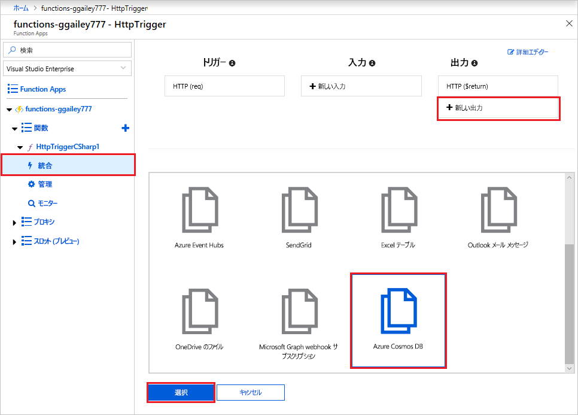
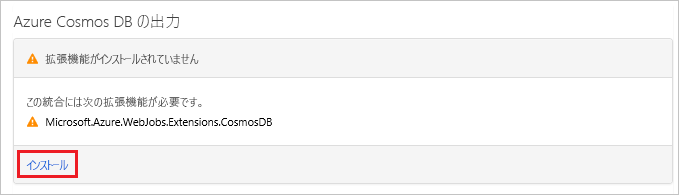
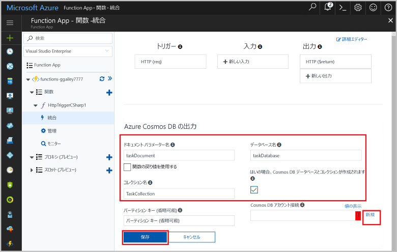
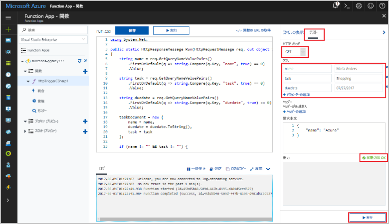
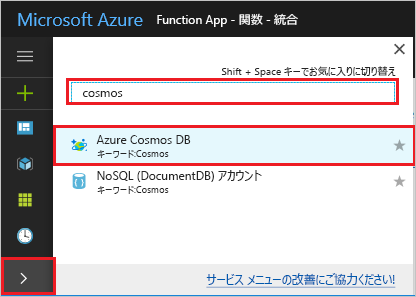
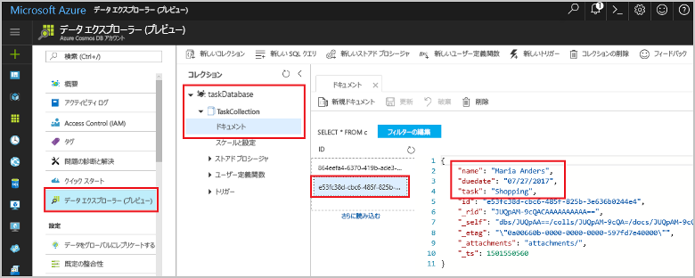

# <a name="store-unstructured-data-using-azure-functions-and-azure-cosmos-db"></a>Azure Functions と Azure Cosmos DB を使用して非構造化データを格納する

[Azure Cosmos DB](https://azure.microsoft.com/services/cosmos-db/) は、非構造化 JSON データを格納するうえで最適な手段です。 Cosmos DB は、Azure Functions と連携させると、リレーショナル データベースにデータを格納する場合よりもはるかに少ないコードですばやく簡単にデータを格納することができます。

> [!NOTE]
> 現時点で、Azure Cosmos DB トリガー、入力バインディング、出力バインディングは、SQL API アカウントと Graph API アカウントにのみ使用できます。

Azure Functions では、入力および出力バインディングによって、関数から外部サービス データに接続する宣言方法が提供されます。 この記事では、Azure Cosmos DB ドキュメント内に非構造化データを格納する出力バインディングを追加するように既存の関数を更新する方法について説明します。


## <a name="prerequisites"></a>前提条件

このチュートリアルを完了するには、以下が必要です。

[!INCLUDE [Previous quickstart note](../../includes/functions-quickstart-previous-topics.md)]

## <a name="create-an-azure-cosmos-db-account"></a>Azure Cosmos DB アカウントを作成する

出力バインディングを作成する前に、SQL API を使用する Azure Cosmos DB アカウントが必要です。

[!INCLUDE [cosmos-db-create-dbaccount](../../includes/cosmos-db-create-dbaccount.md)]

## <a name="add-an-output-binding"></a>出力バインディングを追加する

1. ポータルで、以前に作成した関数アプリに移動し、関数アプリと関数の両方を展開します。

1. **[統合]** を選択し、ページの右上にある **[新規出力]** を選択します。 **[Azure Cosmos DB]** を選択し、**[選択]** をクリックします。

    

1. メッセージ "**拡張機能がインストールされていません**" が表示された場合は、**[インストール]** を選択して、関数アプリに Azure Cosmos DB バインディング拡張機能をインストールします。 インストールには、1、2 分かかる場合があります。

    

1. **[Azure Cosmos DB output]\(Azure Cosmos DB 出力\)** の設定を使用して、次の表で指定されているように設定します。

    

    | Setting      | 推奨値  | 説明                                |
    | ------------ | ---------------- | ------------------------------------------ |
    | **[ドキュメント パラメーター名]** | taskDocument | コード内で Cosmos DB オブジェクトを指す名前。 |
    | **データベース名** | taskDatabase | ドキュメントを保存するデータベースの名前。 |
    | **[コレクション名]** | TaskCollection | データベース コレクションの名前 |
    | **[If true, creates the Cosmos DB database and collection]\(オンの場合、Cosmos DB データベースとコレクションを作成する\)** | オン | コレクションはまだ存在していないため、作成します。 |
    | **Azure Cosmos DB アカウント接続** | 新しい設定 | **[新規]** を選択し、使用する**サブスクリプション**、前の手順で作成した**データベース アカウント**、**[選択]** の順に選択します。 アカウントの接続のアプリケーション設定を作成します。 この設定は、データベースへの接続へのバインディングによって使用されます。 |
    | **コレクションのスループット** |400 RU| 待ち時間を短縮する場合、後でスループットをスケールアップできます。 |

1. **[保存]** を選択してバインディングを作成します。

## <a name="update-the-function-code"></a>関数コードを更新する

既存の関数コードを、次の選択した言語のコードに置き換えます。

# <a name="ctabcsharp"></a>[C#](#tab/csharp)

既存の C# 関数を次のコードに置き換えます。

```csharp
#r "Newtonsoft.Json"

using Microsoft.AspNetCore.Mvc;
using Microsoft.AspNetCore.Http;
using Microsoft.Extensions.Logging;

public static IActionResult Run(HttpRequest req, out object taskDocument, ILogger log)
{
    string name = req.Query["name"];
    string task = req.Query["task"];
    string duedate = req.Query["duedate"];

    // We need both name and task parameters.
    if (!string.IsNullOrEmpty(name) && !string.IsNullOrEmpty(task))
    {
        taskDocument = new
        {
            name,
            duedate,
            task
        };

        return (ActionResult)new OkResult();
    }
    else
    {
        taskDocument = null;
        return (ActionResult)new BadRequestResult();
    }
}
```

# <a name="javascripttabjavascript"></a>[JavaScript](#tab/javascript)

既存の JavaScript 関数を次のコードに置き換えます。

```js
module.exports = async function (context, req) {

    // We need both name and task parameters.
    if (req.query.name && req.query.task) {

        // Set the output binding data from the query object.
        context.bindings.taskDocument = req.query;

        // Success.
        context.res = {
            status: 200
        };
    }
    else {
        context.res = {
            status: 400,
            body: "The query options 'name' and 'task' are required."
        };
    }
};
```
---

このサンプル コードは、HTTP 要求のクエリ文字列を読み取り、それらを `taskDocument` オブジェクトのフィールドに代入します。 `taskDocument` バインディングは、このバインディング パラメーターのオブジェクト データを、バインドされたドキュメント データベースに格納されるように送信します。 データベースは、関数が初めて実行されるときに作成されます。

## <a name="test-the-function-and-database"></a>関数とデータベースをテストする

1. 右側のウィンドウを展開し、**[テスト]** を選択します。 **[クエリ]** の下の **[+ パラメーターの追加]** をクリックし、クエリ文字列に以下のパラメーターを追加します。

    + `name`
    + `task`
    + `duedate`

1. **[実行]** をクリックして、200 状態が返されることを確認します。

    

1. Azure Portal の左側のアイコン バーを展開し、検索フィールドに「`cosmos`」と入力して、**[Azure Cosmos DB]** を選択します。

    

1. Azure Cosmos DB アカウントを選択してから、**[データ エクスプローラー]** を選択します。

1. **[コレクション]** ノードを展開して新しいドキュメントを選択し、ドキュメントにクエリ文字列値といくつかの追加のメタデータが含まれていることを確認します。

    

Azure Cosmos DB に非構造化データを格納するバインディングを HTTP トリガーに正常に追加できました。

[!INCLUDE [Clean-up section](../../includes/clean-up-section-portal.md)]

## <a name="next-steps"></a>次の手順

[!INCLUDE [functions-quickstart-next-steps](../../includes/functions-quickstart-next-steps.md)]

Cosmos DB データベースへのバインドの詳細については、「[Azure Functions における Cosmos DB のバインド](functions-bindings-cosmosdb.md)」を参照してください。
