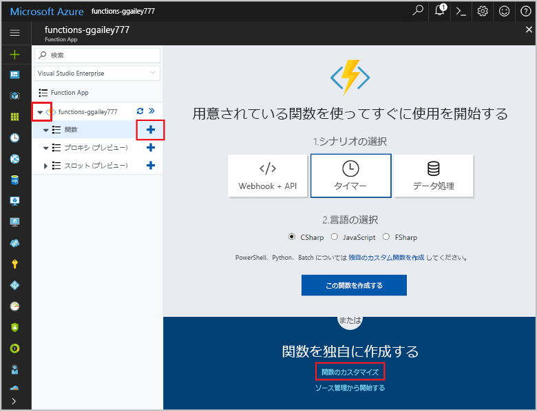

# <a name="create-an-openapi-definition-for-a-function"></a>関数の OpenAPI 定義の作成
REST API は、多くの場合、OpenAPI 定義 (以前の [Swagger](http://swagger.io/) ファイル) を使用して記述されます。 この定義には、API で使用できる操作の情報と、API の要求データと応答データを構造化する方法に関する情報が含まれています。

このチュートリアルでは、風力タービンの応急修復がコスト効率に優れているかどうかを確認する関数を作成します。 その後、その関数を他のアプリやサービスから呼び出せるように、関数アプリの OpenAPI 定義を作成します。

このチュートリアルで学習する内容は次のとおりです。

> [!div class="checklist"]
> * Azure で関数を作成する
> * OpenAPI ツールを使用して OpenAPI 定義を生成する
> * 定義を変更して追加のメタデータを提供する
> * 関数を呼び出して定義をテストする

## <a name="create-a-function-app"></a>Function App を作成する

関数の実行をホストするための Function App が存在する必要があります。 Function App を使用すると、リソースの管理、デプロイ、スケーリング、および共有を容易にするためのロジック ユニットとして関数をグループ化できます。 

[!INCLUDE [Create function app Azure portal](../../includes/functions-create-function-app-portal.md)]


## <a name="create-the-function"></a>関数を作成する

このチュートリアルでは、タービン修復の推定所要時間 (時間単位) とタービンの容量 (キロワット単位) の 2 つのパラメーターを取る HTTP トリガー関数を使用します。 この関数は、修復コストと、タービンによってもたらされる 24 時間あたり収益を計算します。

1. Function App を展開し、**[関数]** の横にある **[+]** ボタンを選択します。 これが Function App で初めての関数の場合、**[カスタム関数]** を選びます。 関数テンプレートの完全なセットが表示されます。 

    

2. 検索フィールドに「`http`」と入力し、HTTP トリガー テンプレートとして **C#** を選択します。 
 
    

3. 関数の **[名前]** として「`TurbineRepair`」と入力し、**[[認証レベル]](functions-bindings-http-webhook.md#http-auth)** として `Function` を選択し、**[作成]** を選択します。  

    

1. この run.csx ファイルの内容を次のコードに置き換えて、**[保存]** をクリックします。

    ```csharp
    using System.Net;

    const double revenuePerkW = 0.12; 
    const double technicianCost = 250; 
    const double turbineCost = 100;

    public static async Task<HttpResponseMessage> Run(HttpRequestMessage req, TraceWriter log)
    {   

        //Get request body
        dynamic data = await req.Content.ReadAsAsync<object>();
        int hours = data.hours;
        int capacity = data.capacity;

        //Formulas to calculate revenue and cost
        double revenueOpportunity = capacity * revenuePerkW * 24;  
        double costToFix = (hours * technicianCost) +  turbineCost;
        string repairTurbine;

        if (revenueOpportunity > costToFix){
            repairTurbine = "Yes";
        }
        else {
            repairTurbine = "No";
        }

        return req.CreateResponse(HttpStatusCode.OK, new{
            message = repairTurbine,
            revenueOpportunity = "$"+ revenueOpportunity,
            costToFix = "$"+ costToFix         
        }); 
    }
    ```
    この関数コードは、応急修復がコスト効率に優れているかを示すメッセージ `Yes` または `No` のほか、タービンによって創出される収益機会とタービンの修復コストを返します。 

1. 関数をテストするには、一番右の **[テスト]** をクリックして、テスト タブを展開します。**要求本文**で次の値を入力し、**[実行]** をクリックします。

    ```json
    {
    "hours": "6",
    "capacity": "2500"
    }
    ```

    

    応答本文で次の値が返されます。

    ```json
    {"message":"Yes","revenueOpportunity":"$7200","costToFix":"$1600"}
    ```

これで、応急修復のコスト効率性を確認する関数が作成されました。 次は、関数アプリの OpenAPI 定義を生成し、変更します。

## <a name="generate-the-openapi-definition"></a>OpenAPI 定義を生成する

OpenAPI 定義を生成する準備ができています。 この定義は、API Apps、[PowerApps](functions-powerapps-scenario.md)、[Microsoft Flow](../azure-functions/app-service-export-api-to-powerapps-and-flow.md) など、他の Microsoft テクノロジだけでなく、サード パーティ製の開発者ツール、たとえば、[Postman](https://www.getpostman.com/docs/importing_swagger) や[その他多数のパッケージ](http://swagger.io/tools/)でも使用できます。

1. API がサポートする "*動詞*" (ここでは POST) のみを選択します。 これにより、生成された API 定義がさらにきれいになります。

    1. 新しい HTTP トリガー関数の **[統合]** タブで、**[許可されている HTTP メソッド]** を **[選択したメソッド]** に変更します

    1. **[選択した HTTP メソッド]** で、**[POST]** 以外のオプションをすべてオフにし、**[保存]** をクリックします。

        ![[選択した HTTP メソッド]](media/functions-openapi-definition/selected-http-methods.png)
        
1. 関数アプリ名 (**function-demo-energy** など) > **[プラットフォーム機能]**  >  **[API 定義]** をクリックします。

    ![[API の定義]](media/functions-openapi-definition/api-definition.png)

1. **[API 定義]** タブで、**[関数]** をクリックします。

    

    この手順により、関数アプリのドメインから OpenAPI ファイルをホストするエンドポイント、[OpenAPI エディター](http://editor.swagger.io)のインライン コピー、API 定義テンプレート ジェネレーターなど、関数アプリの一連の OpenAPI オプションが有効になります。

1. **[API 定義テンプレートを生成する]**  >  **[保存]** をクリックします。

    

    Azure による関数アプリのスキャンによって、HTTP トリガー関数がないかどうかが確認されます。その後、functions.json 内の情報を使用して OpenAPI 定義が生成されます。 生成された定義を次に示します。

    ```yaml
    swagger: '2.0'
    info:
    title: function-demo-energy.azurewebsites.net
    version: 1.0.0
    host: function-demo-energy.azurewebsites.net
    basePath: /
    schemes:
    - https
    - http
    paths:
    /api/TurbineRepair:
        post:
        operationId: /api/TurbineRepair/post
        produces: []
        consumes: []
        parameters: []
        description: >-
            Replace with Operation Object
            #http://swagger.io/specification/#operationObject
        responses:
            '200':
            description: Success operation
        security:
            - apikeyQuery: []
    definitions: {}
    securityDefinitions:
    apikeyQuery:
        type: apiKey
        name: code
        in: query
    ```

    この定義を完全な OpenAPI 定義にするには、さらにメタデータが必要であるため、これは "_テンプレート_" として記述されています。 次の手順でこの定義を変更します。

## <a name="modify-the-openapi-definition"></a>OpenAPI 定義を変更する
テンプレートの定義が生成されたので、次は、その定義を変更して、API の操作とデータ構造に関する追加のメタデータを指定します。 **[API 定義]** で、生成された定義を `post` から定義の一番下まで削除し、下のコンテンツを貼り付けて **[保存]** をクリックします。

```yaml
    post:
      operationId: CalculateCosts
      description: Determines if a technician should be sent for repair
      summary: Calculates costs
      x-ms-summary: Calculates costs
      x-ms-visibility: important
      produces:
        - application/json
      consumes:
        - application/json
      parameters:
        - name: body
          in: body
          description: Hours and capacity used to calculate costs
          x-ms-summary: Hours and capacity
          x-ms-visibility: important
          required: true
          schema:
            type: object
            properties:
              hours:
                description: The amount of effort in hours required to conduct repair
                type: number
                x-ms-summary: Hours
                x-ms-visibility: important
              capacity:
                description: The max output of a turbine in kilowatts
                type: number
                x-ms-summary: Capacity
                x-ms-visibility: important
      responses:
        200:
          description: Message with cost and revenue numbers
          x-ms-summary: Message
          schema:
           type: object
           properties:
            message:
              type: string
              description: Returns Yes or No depending on calculations
              x-ms-summary: Message 
            revenueOpportunity:
              type: string
              description: The revenue opportunity cost
              x-ms-summary: RevenueOpportunity 
            costToFix:
              type: string
              description: The cost in $ to fix the turbine
              x-ms-summary: CostToFix
      security:
        - apikeyQuery: []
definitions: {}
securityDefinitions:
  apikeyQuery:
    type: apiKey
    name: code
    in: query
```

この場合、更新されたメタデータを貼り付けるだけで済みますが、どのような変更を既定のテンプレートに加えたかを理解することは重要です。

+ API が JSON 形式のデータを生成して使用することを指定しました。

+ 必須パラメーターと、その名前およびデータ型を指定しました。

+ 成功応答の戻り値と、その名前およびデータ型を指定しました。

+ API と、その操作およびパラメーターのわかりやすい概要と説明を入力しました。 これは、この関数を使用するユーザーにとって重要です。

+ x-ms-summary と x-ms-visibility を追加しました。これは、Microsoft Flow と Logic Apps の UI で使用されています。 詳細については、「[Microsoft Flow でのカスタム コネクタ用の OpenAPI 拡張](https://preview.flow.microsoft.com/documentation/customapi-how-to-swagger/)」を参照してください。

> [!NOTE]
> セキュリティ定義は、API キーの既定の認証方法のまま変更していません。 別の種類の認証を使用した場合は、この定義セクションで変更してください。

API 操作の定義の詳細については、[オープン API 仕様](https://swagger.io/specification/#operationObject)に関するページをご覧ください。

## <a name="test-the-openapi-definition"></a>OpenAPI 定義をテストする
API の定義を使用する前に、Azure Functions の UI でテストすることをお勧めします。

1. 関数の **[管理]** タブの **[ホスト キー]** で、**既定**のキーをコピーします。

    

    > [!NOTE]
    >このキーはテストのほか、アプリやサービスから API を呼び出すときにも使用します。

1. API 定義に戻ります (**function-demo-energy**  >  **[プラットフォーム機能]**  >  **[API 定義]**)。

1. 右側のウィンドウで、**[認証]** をクリックし、コピーした API キーを入力して、**[認証]** をクリックします。

    

1. 下にスクロールして、**[操作の再試行]** をクリックします。

    

1. **[時間]** と **[容量]** に値を入力します。

    

    API 定義の説明が UI でどのように使用されているかを確認してください。

1. **[要求の送信]** をクリックし、**[Pretty]\(整形\)** タブをクリックします。

    

## <a name="next-steps"></a>次の手順

このチュートリアルで学習した内容は次のとおりです。

> [!div class="checklist"]
> * Azure で関数を作成する
> * OpenAPI ツールを使用して OpenAPI 定義を生成する
> * 定義を変更して追加のメタデータを提供する
> * 関数を呼び出して定義をテストする

次のトピックに進み、作成した OpenAPI 定義を使用する PowerApps アプリを作成する方法を確認してください。
> [!div class="nextstepaction"]
> [PowerApps から関数を呼び出す](functions-powerapps-scenario.md)
