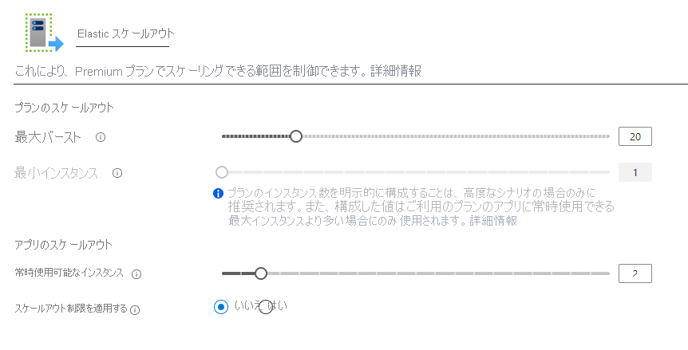

# <a name="azure-functions-premium-plan"></a>Azure Functions の Premium プラン

Azure Functions の Premium プラン (Elastic Premium プランとも呼ばれます) は、関数アプリのホスティング オプションです。 Premium プランでは、VNet 接続、コールド スタートなし、プレミアム ハードウェアなどの機能が提供されます。  複数の関数アプリを同じ Premium プランにデプロイできます。プランでは、コンピューティング インスタンス サイズ、基本プラン サイズ、および最大プラン サイズを構成できます。  Premium プランと、他のプランおよびホスティング タイプの比較については、[関数のスケールとホスティング オプション](functions-scale.md)に関するページを参照してください。

## <a name="create-a-premium-plan"></a>Premium プランを作成する

[!INCLUDE [functions-premium-create](../../includes/functions-premium-create.md)]

Premium プランは、Azure CLI から [az functionapp plan create](/cli/azure/functionapp/plan#az-functionapp-plan-create) を使用して作成することもできます。 次の例では、_Elastic Premium 1_ レベルのプランを作成しています。

```azurecli-interactive
az functionapp plan create --resource-group <RESOURCE_GROUP> --name <PLAN_NAME> \
--location <REGION> --sku EP1
```

この例の `<RESOURCE_GROUP>` と `<PLAN_NAME>` は、それぞれ実際のリソース グループおよびリソース グループ内で一意となる実際のプランの名前に置き換えてください。 [サポートされる `<REGION>`](#regions) を指定します。 Linux をサポートする Premium プランを作成するには、`--is-linux` オプションを指定します。

プランが作成されたら、[az functionapp create](/cli/azure/functionapp#az-functionapp-create) を使用して関数アプリを作成できます。 ポータルで、プランとアプリの両方が同時に作成されます。 完全な Azure CLI スクリプトの例については、「[Premium プランの関数アプリを作成する](scripts/functions-cli-create-premium-plan.md)」を参照してください。

## <a name="features"></a>[機能]

Premium プランにデプロイされた関数アプリでは、次の機能を利用できます。

### <a name="pre-warmed-instances"></a>事前ウォーミングされたインスタンス

従量課金プランで今日はイベントも実行も発生しない場合、ゼロ インスタンスまでアプリをスケール ダウンできます。 新しいイベントが発生したら、新しいインスタンスを専用化して、そこでアプリを実行する必要があります。  アプリによっては、新しいインスタンスの専用化に時間がかかる場合があります。  最初の呼び出しでこのように待機時間が長くなることを、アプリのコールド スタートと呼ぶことがよくあります。

Premium プランでは、最小プラン サイズまで、指定された数のインスタンスでアプリを事前ウォーミングしておくことができます。  インスタンスの事前ウォーミングによって、高負荷になる前にアプリを事前スケールすることもできます。 アプリがスケール アウトするとき、アプリはまず、事前ウォーミングされたインスタンスにスケールします。 次のスケール操作に備えて、追加のインスタンスが引き続き、すぐにバッファー アウトおよびウォーミングされます。 事前ウォーミングされたインスタンスのバッファーを確保しておくことで、コールド スタートの待機時間を効果的に回避できます。  事前ウォーミングされたインスタンスは Premium プランの機能であり、お客様には、プランがアクティブなときは常に、少なくとも 1 つのインスタンスが実行されていて利用可能である状態を維持していただく必要があります。

Azure portal 上で事前ウォーミングされたインスタンスの数を構成するには、選択した**関数アプリ**から、 **[プラットフォーム機能]** タブへ移動して、 **[スケールアウト]** オプションを選択します。 関数アプリの編集ウィンドウでは、事前ウォーミングされたインスタンスはそのアプリ固有ですが、最小および最大のインスタンスはプラン全体に適用されます。



アプリの事前ウォーミングされたインスタンスは、Azure CLI を使用して構成することもできます。

```azurecli-interactive
az resource update -g <resource_group> -n <function_app_name>/config/web --set properties.preWarmedInstanceCount=<desired_prewarmed_count> --resource-type Microsoft.Web/sites
```

### <a name="private-network-connectivity"></a>プライベート ネットワーク接続

Premium プランにデプロイされた Azure Functions では、[Web アプリ向けの新しい VNet 統合](../app-service/web-sites-integrate-with-vnet.md)を利用します。  構成すると、アプリを VNet 内のリソースと通信させる、またはサービス エンドポイントを介してセキュリティで保護することができます。  受信トラフィックを制限するための IP 制限もアプリで利用できます。

Premium プランで関数アプリにサブネットを割り当てるときは、個々の潜在的インスタンスのための十分な IP アドレスがあるサブネットが必要です。 使用可能なアドレスが 100 以上の IP ブロックが必要です。

詳細については、[関数アプリと VNet の統合](functions-create-vnet.md)に関するページを参照してください。

### <a name="rapid-elastic-scale"></a>高速エラスティック スケール

従量課金プランと同じ高速スケーリング ロジックを使用して、追加のコンピューティング インスタンスが自動的にアプリのために追加されます。  スケーリングのしくみの詳細については、[関数のスケールとホスティング](./functions-scale.md#how-the-consumption-and-premium-plans-work)に関するページを参照してください。

### <a name="longer-run-duration"></a>実行継続時間の延長

Azure Functions の従量課金プランでは、1 回の実行が 10 分までに制限されています。  Premium プランでは、実行中の暴走を防ぐために、実行継続時間の既定値が 30 分になっています。 ただし、[host.json 構成を変更](./functions-host-json.md#functiontimeout)して、Premium プランのアプリでこれを 60 分にすることができます。

## <a name="plan-and-sku-settings"></a>プランと SKU の設定

プランを作成するときに、2 つの設定を構成します。インスタンスの最小数 (またはプラン サイズ) と最大バースト制限です。  最小インスタンスは予約されており、常に実行されています。

> [!IMPORTANT]
> 関数が実行されているかどうかにかかわらず、最小インスタンスで割り当てられているインスタンスごとに課金されます。

プラン サイズを超えるインスタンスがアプリに必要な場合、インスタンスの数が最大バースト制限に達するまでアプリのスケール アウトを続けることができます。  プラン サイズを超えたインスタンスに対する課金は、インスタンスが実行されていてお客様に貸し出されている間のみ発生します。  最小プランのインスタンスはお客様のアプリに対して保証されていますが、定義された最大制限までのアプリのスケール アウトに関してはベスト エフォートでの提供となります。

プラン サイズまたは最大値は Azure portal で構成できます。プランまたはそのプランにデプロイされている関数アプリの **[スケール アウト]** オプションを選択します ( **[プラットフォーム機能]** の下にあります)。

Azure CLI から最大バースト制限を増やすこともできます。

```azurecli-interactive
az resource update -g <resource_group> -n <premium_plan_name> --set properties.maximumElasticWorkerCount=<desired_max_burst> --resource-type Microsoft.Web/serverfarms 
```

### <a name="available-instance-skus"></a>利用可能インスタンス SKU

プランを作成またはスケーリングするときは、3 つのインスタンス サイズから選択できます。  合計コア数と 1 秒あたりのメモリ消費量に対して課金されます。  アプリは必要に応じて自動的に複数のインスタンスにスケール アウトできます。  

|SKU|コア|メモリ|ストレージ|
|--|--|--|--|
|EP1|1|3.5 GB|250 GB|
|EP2|2|7 GB|250 GB|
|EP3|4|14 GB|250 GB|

## <a name="regions"></a>リージョン

各 OS で現在サポートされているリージョンは次のとおりです。

|リージョン| Windows | Linux |
|--| -- | -- |
|オーストラリア中部| ✔<sup>1</sup> | |
|オーストラリア中部 2| ✔<sup>1</sup> | |
|オーストラリア東部| ✔ | |
|オーストラリア南東部 | ✔ | ✔<sup>1</sup> |
|ブラジル南部| ✔<sup>2</sup> |  |
|カナダ中部| ✔ |  |
|米国中部| ✔ |  |
|東アジア| ✔ |  |
|East US | ✔ | ✔<sup>1</sup> |
|米国東部 2| ✔ |  |
|フランス中部| ✔ |  |
|ドイツ中西部| ✔ | |
|東日本| ✔ | ✔<sup>1</sup> |
|西日本| ✔ | |
|韓国中部| ✔ |  |
|米国中北部| ✔ |  |
|北ヨーロッパ| ✔ | ✔<sup>1</sup> |
|米国中南部| ✔ | ✔<sup>1</sup> |
|インド南部 | ✔ | |
|東南アジア| ✔ | ✔<sup>1</sup> |
|英国南部| ✔ | |
|英国西部| ✔ |  |
|西ヨーロッパ| ✔ | ✔<sup>1</sup> |
|インド西部| ✔ |  |
|米国西部| ✔ | ✔<sup>1</sup> |
|米国西部 2| ✔ |  |

<sup>1</sup>最大スケールアウトは 20 個のインスタンスに制限されます。  
<sup>2</sup>最大スケールアウトは 60 個のインスタンスに制限されます。


## <a name="next-steps"></a>次のステップ

> [!div class="nextstepaction"]
> [Azure Functions のスケールとホスティングのオプションを理解する](functions-scale.md)
