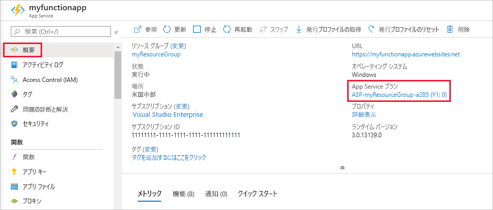

# <a name="azure-functions-scale-and-hosting"></a>Azure Functions のスケールとホスティング

Azure Functions は、2 つの異なるモードで実行できます。従量課金プランと Azure App Service プランです。 従量課金プランでは、コードの実行時にコンピューティング能力が自動的に割り当てられます。 アプリは、負荷を処理する必要があるときはスケールアウトし、コードが実行していないときはスケールダウンします。 アイドル状態の VM に対して課金されることはなく、事前に容量を予約する必要もありません。

> [!NOTE]  
> [Linux ホスティング](functions-create-first-azure-function-azure-cli-linux.md)は現在、App Service プランでのみ利用可能です。

Azure Functions に慣れていない場合は、「[Azure Functions の概要](functions-overview.md)」を参照してください。

関数アプリを作成するときに、アプリ内の関数のホスティング プランを選択します。 どちらのプランでも、関数は "*Azure Functions ホスト*" のインスタンスにより実行されます。 プランの種類のコントロール対象は次のとおりです。

* ホスト インスタンスをスケールアウトする方法。
* 各ホストで使用できるリソース。

> [!IMPORTANT]
> ホスティング プランの種類は、関数アプリの作成中に選択する必要があり、 後で変更することはできません。

App Service プランの階層間で拡大縮小して、さまざまな量のリソースを割り当てることができます。 従量課金プランでは、すべてのリソース割り当てが Azure Functions によって自動的に処理されます。 

## <a name="consumption-plan"></a>従量課金プラン

従量課金プランを使用する場合、Azure Functions ホストのインスタンスは、受信イベントの数に基づいて動的に追加および削除されます。 このサーバーレス プランではスケーリングが自動的に行われ、関数の実行中にのみコンピューティング リソースに対して料金が発生します。 従量課金プランでは、構成可能な期間が経過すると関数の実行はタイムアウトします。

> [!NOTE]
> 従量課金プランの関数に対する既定のタイムアウトは 5 分です。 [host.json](functions-host-json.md#functiontimeout) プロジェクト ファイルの `functionTimeout` プロパティを変更することにより、Function App に対するこの値を最大 10 分まで増やすことができます。

課金は、実行数、実行時間、およびメモリの使用量に基づいて行われ、 関数アプリ内のすべての関数にわたって集計されます。 詳細については、[Azure Functions の価格に関するページ]に関するページを参照してください。

従量課金プランは既定のホスティング プランであり、次の利点があります。

* 関数の実行中にのみ課金されます。
* 負荷が高い期間中であっても、自動的にスケールアウトされます。

## <a name="app-service-plan"></a>App Service プラン

専用 App Service プランでは、関数アプリは、他の App Service アプリと同様に、Basic、Standard、Premium、および Isolated SKU の専用 VM 上で実行されます。 専用 VM が関数アプリに割り当てられるので、Functions ホストは[継続的に実行](#always-on)できます。 App Service プランでは、Linux をサポートしています。

次のような場合に App Service プランを検討してください。

* 既に他の App Service インスタンスを実行している、使用率の低い既存の VM がある。
* 関数を継続的に、またはほぼ継続的に実行したい。 この場合、App Service プランは、さらにコスト効率性に優れています。
* 従量課金プランで提供されるよりも多くの CPU またはメモリのオプションが必要である。
* コードを従量課金プランで許可されている最大実行時間 (10 分) よりも長く実行する必要がある。
* App Service 環境、VNET/VPN 接続、大規模な VM のサポートなど、App Service プランでのみ使用できる機能が必要である。
* Linux 上で Function App を実行するか、または関数を実行するために Linux 上にカスタム イメージを提供したい。

VM を使用すると、コストが実行数、実行時間、メモリの使用量から切り離されます。 このため、割り当てた VM インスタンスのコストを超えて課金されることはありません。 App Service プランの仕組みの詳細については、「[Azure App Service プランの詳細な概要](../app-service/overview-hosting-plans.md)」を参照してください。 

App Service プランでは、VM インスタンスを追加して手動でスケールアウトするか、自動スケールを有効にすることができます。 詳細については、「[手動または自動によるインスタンス数のスケール変更](../azure-monitor/platform/autoscale-get-started.md?toc=%2fazure%2fapp-service%2ftoc.json)」を参照してください。 別の App Service プランを選択してスケールアップすることもできます。 詳細については、 [Azure でのアプリのスケールアップ](../app-service/web-sites-scale.md) に関するページを参照してください。 

App Service プランで JavaScript 関数を実行する場合は、CPUの少ないプランを選択してください。 詳細については、[シングルコア App Service プランの選択](functions-reference-node.md#considerations-for-javascript-functions)に関するページをご覧ください。  

<!-- Note: the portal links to this section via fwlink https://go.microsoft.com/fwlink/?linkid=830855 --> 
<a name="always-on"></a>
### <a name="always-on"></a>常時接続

App Service プランを実行する場合、関数アプリが正常に実行されるように、**常時接続** 設定を有効にする必要があります。 App Service プランでは、関数のランタイムは非アクティブな状態が数分続くとアイドル状態となるため、関数を "起こす" ことができるのは HTTP トリガーのみとなります。 常時接続は App Service プランでのみ使用可能です。 従量課金プランでは、関数アプリはプラットフォームにより自動的にアクティブ化されます。

## <a name="what-is-my-hosting-plan"></a>自分のホスティング プラン

自分の関数アプリが使用するホスティング プランを確認するには、[Azure Portal](https://portal.azure.com) で関数アプリの **[概要]** タブの **[App Service プラン / 価格レベル]** を表示します。 App Service プランについては価格レベルも示されます。 



次のように、プランを判断するのに、Azure CLI を使用することもできます。

```azurecli-interactive
appServicePlanId=$(az functionapp show --name <my_function_app_name> --resource-group <my_resource_group> --query appServicePlanId --output tsv)
az appservice plan list --query "[?id=='$appServicePlanId'].sku.tier" --output tsv
```  

このコマンドの出力が `dynamic` の場合、関数アプリは従量課金プランです。 その他すべての値は、App Service プランのレベルを意味します。

常時接続が有効になっている場合でも、個々の関数の実行タイムアウトは [host.json](functions-host-json.md#functiontimeout) プロジェクト ファイルの `functionTimeout` 設定によって制御できます。

## <a name="storage-account-requirements"></a>ストレージ アカウントの要件

関数アプリを使用するには、従量課金プランと App Service プランのどちらでも、Azure BLOB、Queue、Files、Table Storage をサポートする一般的な Azure ストレージ アカウントが必要です。 これは、Functions が、Azure Storage を利用してトリガーの管理や関数実行のログなどの操作を行っているためですが、ストレージ アカウントによってはキューと表はサポートされません。 そのようなアカウント (BLOB専用ストレージ アカウント (including premium storage) や、ゾーン冗長ストレージ レプリケーションを備えた汎用ストレージ アカウントなど) は、関数アプリを作成するときに既存の **[ストレージ アカウント]** の選択肢から除外されます。

<!-- JH: Does using a Premium Storage account improve perf? -->

ストレージ アカウントの種類の詳細については、[Azure Storage サービスの概要](../storage/common/storage-introduction.md#azure-storage-services)に関する記事をご覧ください。

## <a name="how-the-consumption-plan-works"></a>従量課金プランの仕組み

従量課金プランでは、関数がトリガーされるイベントの数に基づいて Functions ホストのインスタンスを追加することで、スケール コントローラーによって CPU とメモリのリソースが自動的に拡大縮小されます。 Functions ホストの各インスタンスのメモリは、1.5 GB に制限されています。  ホストのインスタンスは関数アプリです。つまり、関数アプリ内のすべての関数がインスタンス内のリソースを共有し、同時にスケールされます。 同じ従量課金プランを共有する関数アプリは、個別にスケーリングされます。  

従量課金ホスティング プランを使用する場合は、関数コード ファイルが、関数のメイン ストレージ アカウントの Azure Files 共有に保存されます。 関数アプリのメイン ストレージ アカウントを削除すると、関数コード ファイルは削除され、復元できません。

> [!NOTE]
> 従量課金プランで BLOB トリガーを使用しているとき、新しい BLOB の処理が最大で 10 分遅延する場合があります。 このような遅延が発生するのは、関数アプリがアイドルになったときです。 関数アプリが実行されると、BLOB は直ちに処理されます。 このコールド スタート遅延を避けるには、**常時接続**が有効な App Service プランを使用するか、Event Grid トリガーを使用します。 詳しくは、[BLOB トリガー バインディングのリファレンス記事](functions-bindings-storage-blob.md#trigger)をご覧ください。

### <a name="runtime-scaling"></a>実行時のスケーリング

Azure Functions は "*スケール コントローラー*" と呼ばれるコンポーネントを使用して、イベント レートを監視し、スケールアウトとスケールインのどちらを実行するかを決定します。 スケール コントローラーは、トリガーの種類ごとにヒューリスティックを使用します。 たとえば、Azure Queue Storage トリガーを使用した場合、拡大縮小はキューの長さや最も古いキュー メッセージの経過時間に基づいて実施されます。

スケーリングは Function App 単位で行われます。 関数アプリがスケールアウトするときは、Azure Functions ホストの複数のインスタンスを実行するための追加リソースが割り当てられます。 反対に、コンピューティングの需要が減ると、スケール コントローラーにより、関数ホストのインスタンスが削除されます。 Function App 内で関数が何も実行されていない場合、インスタンスの数は最終的に 0 にスケールダウンされます。


### <a name="understanding-scaling-behaviors"></a>スケーリングの動作について

スケーリングはさまざまな要因によって異なる可能性があり、選択したトリガーと言語に基づいて異なる方法でスケールします。 ただし、今日のシステムにはスケーリングのいくつかの側面があります。

* 1 つの関数アプリは、最大 200 インスタンスまでしかスケールアップできません。 1 つのインスタンスで一度に複数のメッセージや要求を処理できるので、同時実行の数に上限は設定されていません。
* 新しいインスタンスは、10 秒ごとに最大 1 回しか割り当てられません。

次の記事に記載されているように、トリガーごとにスケーリングの上限が異なる場合もあります。

* [イベント ハブ](functions-bindings-event-hubs.md#trigger---scaling)

### <a name="best-practices-and-patterns-for-scalable-apps"></a>スケーラブルなアプリのベスト プラクティスとパターン

関数アプリには、スケールに影響を及ぼすさまざまな側面 (ホスト構成、ランタイム フットプリント、リソースの効率など) があります。  詳細については、[パフォーマンスの考慮事項に関する記事のスケーラビリティのセクション](functions-best-practices.md#scalability-best-practices)をご覧ください。 関数アプリがスケールするにつれて、接続がどのように変化するかを認識する必要もあります。 詳細については、「[How to manage connections in Azure Functions](manage-connections.md)」(Azure Functions で接続を管理する方法) を参照してください。

### <a name="billing-model"></a>課金モデル

従量課金プランの課金の詳細については、[Azure Functions の価格に関するページ]に関するページをご覧ください。 使用量は Function App レベルで集計され、関数コードが実行されている期間のみカウントされます。 課金の単位は、次のとおりです。

* **ギガバイト/秒 (GB/秒) 単位でのリソース使用量**。 メモリ サイズと、関数アプリ内の全関数の実行時間の組み合わせとして計算されます。 
* **実行回数**。 イベント トリガーに応じて関数が実行されるたびにカウントされます。

[Azure Functions の価格に関するページ]: https://azure.microsoft.com/pricing/details/functions
