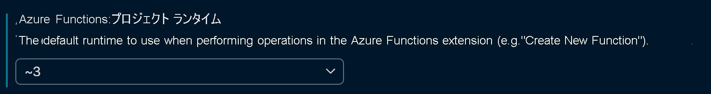

# <a name="azure-functions-runtime-versions-overview"></a>Azure Functions ランタイム バージョンの概要

Azure Functions ランタイムのメジャー バージョンは、そのランタイムのベースとなる .NET のバージョンに関連しています。 次の表は、ランタイムの現在のバージョン、リリース レベル、および関連する .NET バージョンを示しています。 

| ランタイム バージョン | リリース レベル<sup>1</sup> | .NET バージョン | 
| --------------- | ------------- | ------------ |
| 3.x | GA | .NET Core 3.1 | 
| 2.x | GA | .NET Core 2.2 |
| 1.x | GA<sup>2</sup> | .NET Framework 4.6<sup>3</sup> |

<sup>1</sup> GA リリースは運用環境シナリオでサポートされています。   
<sup>2</sup> バージョン 1.x はメンテナンス モードにあります。 拡張機能は、それ以降のバージョンでのみ提供されます。   
<sup>3</sup> Azure portal または Windows コンピューター上のローカルでの開発のみをサポートします。

この記事では、各種のバージョン間のいくつかの相違点、各バージョンを作成する方法、およびバージョンの変更方法について詳細に説明します。

## <a name="languages"></a>Languages

バージョン 2.x から、ランタイムでは言語拡張モデルが使用されており、関数アプリ内のすべての関数が同じ言語を共有する必要があります。 関数アプリ内の関数の言語はそのアプリの作成時に選択され、[FUNCTIONS\_WORKER\_RUNTIME](functions-app-settings.md#functions_worker_runtime) 設定に保持されます。 

Azure Functions 1.x の試験段階の言語は新しいモデルを使用できないため、2.x ではサポートされません。 次の表は、各ランタイム バージョンでどのプログラミング言語が現在サポートされているかを示しています。

[!INCLUDE [functions-supported-languages](../../includes/functions-supported-languages.md)]

詳細については、[サポートされている言語](supported-languages.md)に関するページを参照してください。

## <a name="creating-1x-apps"></a>特定のバージョンで実行する

既定では、Azure portal で Azure CLI によって作成された関数アプリはバージョン 2.x に設定されます。 このバージョンは必要に応じて変更できます。 ランタイムのバージョンを 1.x に変更できるのは、関数アプリを作成してから関数を追加するまでの間のみです。  2\.x と 3.x の間の移行は関数が含まれるアプリでも許可されますが、まず、新しいアプリでテストすることをお勧めします。

## <a name="migrating-from-1x-to-later-versions"></a>1\.x からそれ以降のバージョンへの移行

最新のバージョンではなくバージョン 1.x のランタイムを使用するように記述された既存のアプリを移行することができます。 必要な変更の大部分は、.NET Framework 4.7 と .NET Core 間の C# API の変更など、言語ランタイムの変更に関連する変更です。 また、コードとライブラリが、選択した言語ランタイムと互換性があることを確認する必要があります。 最後に、以下で示すトリガー、バインド、および機能での変更にも注意してください。 最適な移行結果を得るために、新しいバージョンで新しい関数アプリを作成し、既存のバージョン 1.x の関数コードを新しいアプリに移植してください。  

アプリ構成を手動で更新することで "インプレース" アップグレードすることが可能ですが、1.x から上位のバージョンへの移行には、いくつかの破壊的変更が含まれます。 たとえば、C# では、デバッグ オブジェクトが `TraceWriter` から `ILogger` に変更されています。 最新のバージョン 3.x のテンプレートに基づいて新しいバージョン 3.x プロジェクトを作成することで、更新された関数から始めます。

### <a name="changes-in-triggers-and-bindings-after-version-1x"></a>バージョン 1.x 後のトリガーとバインドの変更

バージョン 2.x 以降では、アプリの関数で使用される特定のトリガーとバインドの拡張機能をインストールする必要があります。 この例外は、拡張機能を必要としない HTTP トリガーとタイマー トリガーのみです。  詳細については、[バインド拡張機能の登録とインストール](./functions-bindings-register.md)に関するページを参照してください。

バージョン間には、関数の *function.json* や属性の変更もいくつかあります。 たとえば、イベント ハブの `path` のプロパティは `eventHubName` になりました。 各バインドのドキュメントへのリンクについては、[既存のバインド一覧](#bindings)を参照してください。

### <a name="changes-in-features-and-functionality-after-version-1x"></a>バージョン 1.x 後の機能の変更

バージョン 1.x 後、いくつかの機能が削除、更新、置換されました。 このセクションでは、バージョン 1.x の後に後続のバージョンを使用した場合に気づく変更点について詳しく説明します。

バージョン 2.x では次の点が変更されました。

* HTTP エンドポイントを呼び出すキーは、Azure Blob Storage 内で常に暗号化されて格納されます。 バージョン 1.x では、既定で Azure Files ストレージにキーが格納されていました。 アプリをバージョン 1.x からバージョン 2.x にアップグレードすると、ファイル ストレージ内の既存のシークレットはリセットされます。

* バージョン 2.x ランタイムには、Webhook プロバイダーの組み込みサポートは含まれていません。 この変更はパフォーマンスを向上するために行われました。 Webhook のエンドポイントとして HTTP トリガーを使用することもできます。

* ホスト構成ファイル (host.json) は空か、文字列 `"version": "2.0"` が含まれる必要があります。

* 監視を改善するために、[`AzureWebJobsDashboard`](functions-app-settings.md#azurewebjobsdashboard) 設定を使用したポータルの WebJobs ダッシュボードは、[`APPINSIGHTS_INSTRUMENTATIONKEY`](functions-app-settings.md#appinsights_instrumentationkey) 設定を使用する Azure Application Insights に置き換えられています。 詳しくは、「[Azure Functions を監視する](functions-monitoring.md)」をご覧ください。

* 関数アプリ内のすべての関数は、同じ言語を共有する必要があります。 関数アプリを作成するときに、そのアプリのランタイム スタックを選択する必要があります。 ランタイム スタックは、アプリケーション設定の [`FUNCTIONS_WORKER_RUNTIME`](functions-app-settings.md#functions_worker_runtime) 値によって指定されます。 メモリ占有領域と起動時間を改善するために、この要件が追加されました。 ローカルで開発する場合は、この設定も [local.settings.json ファイル](functions-run-local.md#local-settings-file) に含める必要があります。

* App Service プランでの関数に対する既定のタイムアウトは 30 分に変更されます。 host.json の [functionTimeout](functions-host-json.md#functiontimeout) 設定を使用して、手動でタイムアウトを無制限に変更することができます。

* 従量課金プラン機能の場合、HTTP 同時実行のスロットルは既定で実装され、インスタンスあたりの既定の同時要求数は 100 です。 これは host.json ファイルの [`maxConcurrentRequests`](functions-host-json.md#http) 設定で変更できます。

* [.NET Core の制限](https://github.com/Azure/azure-functions-host/issues/3414)があるため、F# スクリプト (.fsx) 関数のサポートが削除されました。 コンパイル済みの F# 関数 (.fs) は引き続きサポートされます。

* Event Grid トリガー Webhook の URL 形式は `https://{app}/runtime/webhooks/{triggerName}` に変更されました。

## <a name="migrating-from-2x-to-3x"></a>2\.x から 3.x への移行

Azure Functions バージョン 3.x は、バージョン 2.x との下位互換性が高くなっています。  多くのアプリは、コードを変更することなく、3.x に安全にアップグレードできるはずです。  3\.x への移行が推奨されますが、運用アプリでメジャー バージョンを変更する前に、広範囲なテストを必ず実行してください。

### <a name="breaking-changes-between-2x-and-3x"></a>2\.x と 3.x の間の破壊的変更

2\.x アプリを 3.x にアップグレードする前に次の変更点にご留意ください。

#### <a name="javascript"></a>JavaScript

* `context.done` 経由で割り当てられた出力バインディングまたは戻り値が `context.bindings` の設定と同じ動作をするようになりました。

* タイマー トリガー オブジェクトはパスカル ケースではなくキャメル ケースです。

* `dataType` バイナリが指定された、イベント ハブにトリガーされる関数の場合、`string` ではなく、`binary` の配列を受け取ります。

* HTTP 要求ペイロードには `context.bindingData.req` 経由でアクセスできなくなりました。  引き続き入力パラメーター `context.req` としてアクセスできるほか、`context.bindings` でアクセスできます。

* Node.js 8 のサポートが終了し、3.x 関数では実行されません。

#### <a name="net"></a>.NET

* [同期サーバー操作は既定では無効になっています](https://docs.microsoft.com/dotnet/core/compatibility/2.2-3.0#http-synchronous-io-disabled-in-all-servers)。

### <a name="changing-version-of-apps-in-azure"></a>Azure でのアプリのバージョンの変更

Azure の公開アプリから使用される Functions ランタイムのバージョンは、[`FUNCTIONS_EXTENSION_VERSION`](functions-app-settings.md#functions_extension_version) アプリケーションの設定によって決まります。 次のランタイムのメジャー バージョン値がサポートされています。

| 値 | ランタイム ターゲット |
| ------ | -------- |
| `~3` | 3.x |
| `~2` | 2.x |
| `~1` | 1.x |

>[!IMPORTANT]
> 他のアプリ設定の変更や関数のコード変更が必要になる可能性があるため、この設定を独断で変更しないでください。

### <a name="locally-developed-application-versions"></a>ローカルで開発されたアプリケーションのバージョン

関数アプリを次のように更新し、ターゲット バージョンをローカルで変更できます。

#### <a name="visual-studio-runtime-versions"></a>Visual Studio のランタイム バージョン

Visual Studio では、プロジェクトを作成するときにランタイムのバージョンを選択します。 Visual Studio 用の Azure Functions ツールは、ランタイムの両メジャー バージョンをサポートしています。 デバッグ時と公開時には、プロジェクトの設定に基づいて正しいバージョンが使用されます。 バージョン設定は、`.csproj` ファイルの次のプロパティで定義されています。

##### <a name="version-1x"></a>バージョン 1.x

```xml
<TargetFramework>net461</TargetFramework>
<AzureFunctionsVersion>v1</AzureFunctionsVersion>
```

##### <a name="version-2x"></a>バージョン 2.x

```xml
<TargetFramework>netcoreapp2.1</TargetFramework>
<AzureFunctionsVersion>v2</AzureFunctionsVersion>
```

##### <a name="version-3x"></a>バージョン 3.x

```xml
<TargetFramework>netcoreapp3.1</TargetFramework>
<AzureFunctionsVersion>v3</AzureFunctionsVersion>
```

> [!NOTE]
> Azure Functions 3.x と .NET では、`Microsoft.Sdk.NET.Functions` 拡張機能を `3.0.0` 以上にする必要があります。

###### <a name="updating-2x-apps-to-3x-in-visual-studio"></a>Visual Studio で 2.x アプリを 3.x に更新する

2\.x をターゲットにする既存の関数を開き、`.csproj` ファイルを編集し、上記の値を更新することで 3.x に移行できます。  Visual Studio では、プロジェクト メタデータに基づき、ランタイム バージョンがユーザーに代わって自動的に管理されます。  ただし、お使いのコンピューターの Visual Studio で 3.x 用のテンプレートとランタイムが設定される前に 3.x アプリを作成していない場合にのみ可能です。  "プロジェクトで指定されたバージョンと一致する、利用可能な Functions ランタイムはありません" のようなエラーが表示されることがあります。  最新のテンプレートとランタイムを取得するには、新しい関数プロジェクトを作成する操作を進めます。  バージョンとテンプレートの選択画面に進んだら、Visual Studio で最新テンプレートの取得が完了するまで待ちます。  最新の .NET Core 3 テンプレートが利用できるようになり、表示されたら、バージョン 3.x 用に構成されているプロジェクトの実行とデバッグができます。

> [!IMPORTANT]
> バージョン 3.x 関数は、バージョン 16.4 以降を使用している場合にのみ、Visual Studio で開発できます。

#### <a name="vs-code-and-azure-functions-core-tools"></a>VS Code と Azure Functions Core Tools

[Azure Functions Core Tools](functions-run-local.md) は、コマンド ラインの開発に使用されます。また、Visual Studio Code 用の [Azure Functions 拡張機能](https://marketplace.visualstudio.com/items?itemName=ms-azuretools.vscode-azurefunctions)からも使用されます。 バージョン 3.x に対して開発するには、Core Tools のバージョン 3.x をインストールします。 バージョン 2.x の開発には Core Tools のバージョン 2.x が必要です。他のバージョンも同様です。 詳細については、「[Azure Functions Core Tools のインストール](functions-run-local.md#install-the-azure-functions-core-tools)」を参照してください。

Visual Studio Code の開発の場合は、必要に応じてインストールされているツールのバージョンと一致するように `azureFunctions.projectRuntime` のユーザー設定を更新します。  この設定で、関数アプリの作成時に使用されるテンプレートと言語も更新されます。  `~3` でアプリを作成するには、`azureFunctions.projectRuntime` ユーザー設定を `~3` に更新します。



#### <a name="maven-and-java-apps"></a>Maven および Java アプリ

ローカル実行に必要な[コア ツールの 3.x バージョンをインストールする](functions-run-local.md#install-the-azure-functions-core-tools)ことで、Java アプリを 2.x から 3.x に移行できます。  バージョン 3.x でアプリが正しくローカル実行されることを確認したら、アプリの `POM.xml` ファイルを更新し、次の例のように、`FUNCTIONS_EXTENSION_VERSION` 設定を `~3` に変更します。

```xml
<configuration>
    <resourceGroup>${functionResourceGroup}</resourceGroup>
    <appName>${functionAppName}</appName>
    <region>${functionAppRegion}</region>
    <appSettings>
        <property>
            <name>WEBSITE_RUN_FROM_PACKAGE</name>
            <value>1</value>
        </property>
        <property>
            <name>FUNCTIONS_EXTENSION_VERSION</name>
            <value>~3</value>
        </property>
    </appSettings>
</configuration>
```

## <a name="bindings"></a>バインド

バージョン 2.x から、ランタイムでは、次の利点を提供する新しい[バインド拡張モデル](https://github.com/Azure/azure-webjobs-sdk-extensions/wiki/Binding-Extensions-Overview)が使用されています。

* サード パーティのバインド拡張のサポート。

* ランタイムとバインドの分離。 この変更により、バインド拡張を個別にバージョン管理したり、解放したりできます。 たとえば、基になる SDK の新しいバージョンに依存する拡張のバージョンにアップグレードするよう選択できます。

* より軽量な実行環境。ここでは、使用中のバインドのみがランタイムによって識別され、読み込まれます。

HTTP とタイマーのトリガーを除き、すべてのバインドを関数アプリ プロジェクトに明示的に追加するか、ポータルで登録する必要があります。 詳細については、「[バインディング拡張機能を登録する](./functions-bindings-expressions-patterns.md)」を参照してください。

各ランタイム バージョンでサポートされるバインドを次の表に示します。

[!INCLUDE [Full bindings table](../../includes/functions-bindings.md)]

[!INCLUDE [Timeout Duration section](../../includes/functions-timeout-duration.md)]

## <a name="next-steps"></a>次のステップ

詳細については、次のリソースを参照してください。

* [Azure Functions をローカルでコーディングしてテストする](functions-run-local.md)
* [Azure Functions Runtime バージョンをターゲットにする方法](set-runtime-version.md)
* [リリース ノート](https://github.com/Azure/azure-functions-host/releases)
