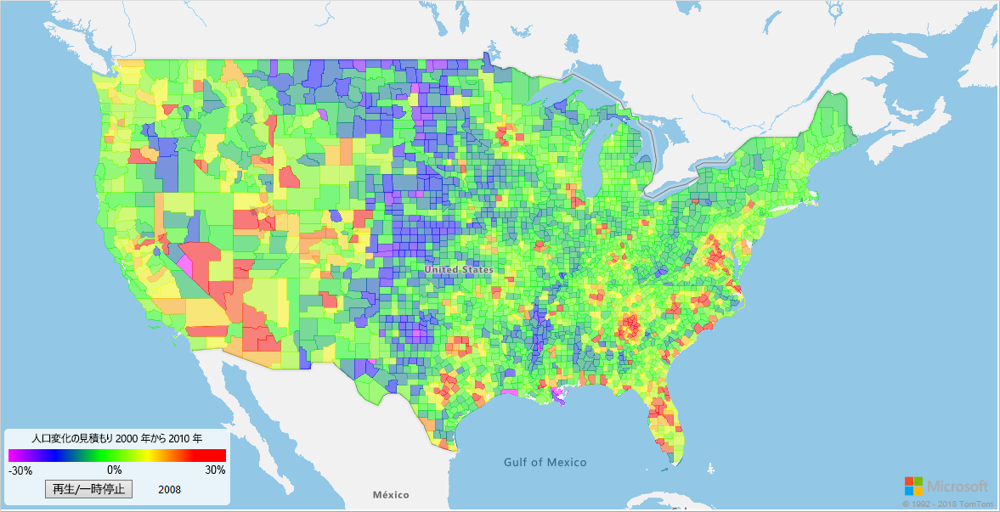
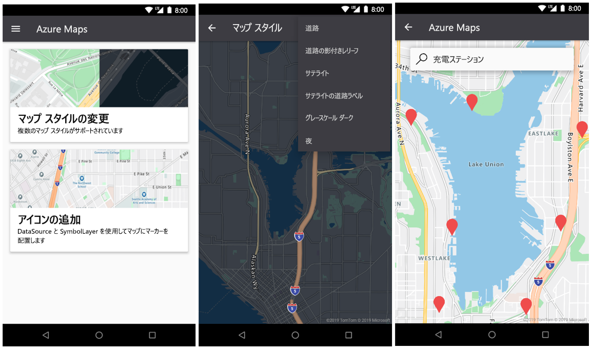

# <a name="what-is-azure-maps"></a>Azure Maps とは

Azure Maps は、最新のマッピング データを使用して、地理的なコンテキストを Web とモバイル アプリケーションに提供する一連の地理空間サービスです。 Azure Maps は以下を提供します。

* 複数のスタイルと衛星映像でマップをレンダリングするための REST API。
* 世界中の住所、場所、および目的地を見つけるための検索サービス。
* ポイント間、マルチポイント、マルチポイント最適化、等時線、商用車、影響を受ける交通、マトリックス ルーティングなど、さまざまなルーティングのオプション。
* トラフィック情報を必要とするアプリケーション向けのトラフィック フロー ビューとインシデントビュー。
* 公共の輸送ロジスティックを要求し、リアルタイムでルートを計画し、輸送の代替モードに関する情報を要求するための Mobility Service。
* タイム ゾーンと位置情報のサービスおよび場所のタイムゾーンへの変換。
* Azure 内でホストされている位置情報を使用した、ジオフェンシング サービスとマッピング データ ストレージ。 
* 地理空間分析による位置情報インテリジェンス。 

加えて、Azure Maps サービスは、Web SDK または Android SDK を介して使用できます。 これらのツールは、開発者が、位置情報を Azure ソリューションに統合するソリューションの開発とスケーリングを迅速に行うのに役立ちます。 

無料の [Azure Maps アカウント](https://azure.microsoft.com/services/azure-maps/)にサインアップして、開発を始めることができます。

次の動画では、Azure Maps について詳しく説明しています。

<br/>

<iframe src="https://channel9.msdn.com/Shows/Internet-of-Things-Show/Azure-Maps/player?format=ny" width="960" height="540" allowFullScreen frameBorder="0"></iframe>

## <a name="map-controls"></a>マップ コントロール

### <a name="web-sdk"></a>Web SDK

Azure Maps Web SDK では、独自のコンテンツや映像を使用して、インタラクティブ マップをカスタマイズすることができます。 この対話型マップは、Web とモバイル アプリケーションの両方に使用できます。 このマップ コントロールには、WebGL が利用されているため、大きなデータ セットをハイ パフォーマンスでレンダリングすることができます。 この SDK を使った開発は、JavaScript または TypeScript を使用して行います。



### <a name="android-sdk"></a>Android SDK

Azure Maps Android SDK は、モバイル マッピング アプリケーションの作成に使用します。 



## <a name="services-in-azure-maps"></a>Azure Maps のサービス

Azure Maps は、Azure アプリケーションに地理的なコンテキストを提供できる以下の 9 つのサービスで構成されます。

### <a name="data-service"></a>Data Service

データはマップに不可欠です。 Data Service は、空間演算や画像合成で使用する地理空間データをアップロードおよび格納するために使用します。  お客様のデータを Azure Maps サービスに近づけると、待ち時間が減少し、生産性が上がり、ご自分のアプリケーションで新しいシナリオが作成されます。 このサービスの詳細については、[Data Service API のドキュメント](https://docs.microsoft.com/rest/api/maps/data)を参照してください。

### <a name="mobility-service"></a>モビリティ サービス

Azure Maps Mobility Service を使用すると、リアルタイムで旅行を計画できます。 考えられる最善のルート オプションが返され、さまざまな移動手段が提示されます。 都市圏 (都市) の場合、こうした手段には徒歩、自転車、公共交通機関があります。 交通移動プラン、路線ジオメトリ、停留所のリスト、予定された到着、リアルタイムの到着、サービス アラートを要求できます。

このサービスでは、ある場所の周辺の特定のオブジェクトの種類を検索することもできます。 ユーザーは、ある場所を中心に共有の自転車、スクーター、または自動車を検索できます。 ユーザーは、利用可能な自転車が一番近くのドックに何台あるかを要求したり、利用可能なライドシェア用車両を検索したりすることができます。 また、先の車両予約状況や現在の燃料レベルなどの詳細を確認することもできます。

このサービスの詳細については、[Mobility API のドキュメント](https://docs.microsoft.com/rest/api/maps/mobility)を参照してください。

### <a name="render-service"></a>Render Service

Render Service は、開発者がマッピング機能を持つ Web およびモバイル アプリケーションを作成するのに役立ちます。 このサービスは、高品質のラスター グラフィックス イメージ、19 のズーム レベル、または完全にカスタマイズ可能なベクター形式のマップ イメージを使います。


Render Service では現在、開発者が衛星画像を操作できるプレビュー API が提供されています。 詳細については、[Render API のドキュメント](https://docs.microsoft.com/rest/api/maps/render)を参照してください。

### <a name="route-service"></a>Route Service

Route Service には、現実世界のインフラストラクチャに関する堅牢なジオメトリ計算と複数の輸送モードでの道案内が含まれています。 このサービスを使って、開発者は、自動車、トラック、自転車、徒歩などの複数の移動手段について指示を計算できます。 サービスでは、交通状況、重量制限、危険物輸送などの入力も検討されます。


Route Service では、次のような高度な機能のプレビューが提供されます。 

* 複数のルート要求のバッチ処理。
* 一連の出発点と目的地の間の移動時間と距離の行列。
* 時間または燃料の要件に基づいてユーザーが移動可能なルートまたは距離の検出。 

ルーティング機能の詳細については、[Route API のドキュメント](https://docs.microsoft.com/rest/api/maps/route)を参照してください。

### <a name="search-service"></a>検索サービス

Search Service は、開発者が住所、場所、名前またはカテゴリ別の事業所一覧、およびその他の地理情報を検索するのに役立ちます。 Search Service では、緯度と経度に基づいて住所や交差点の[逆引き地理コード](https://en.wikipedia.org/wiki/Reverse_geocoding)を行うことができます。


Search Service では、次のような高度な機能も提供されます。

* ルートに沿った検索。
* より広い範囲内での検索。
* 複数の検索要求のバッチ処理。
* ある一点の場所ではなく広い範囲での検索。 

バッチおよび範囲の検索の API は現在プレビュー段階です。 検索機能の詳細については、[Search API のドキュメント](https://docs.microsoft.com/rest/api/maps/search)を参照してください。

### <a name="spatial-operations-service"></a>Spatial Operations Service

Azure Maps の Spatial Operations サービスは、位置情報を取得します。 位置情報を素早く分析し、その時間と空間で発生している進行中のイベントをお客様にお知らせします。 ほぼリアルタイムの分析とイベントの予測モデリングを可能にします。 

このサービスでは、お客様が、一般的な地理空間数学計算のライブラリを使用して、位置情報のインテリジェンスを強化できます。 一般的な計算の例としては、最接近点、大圏距離、バッファーが挙げられます。 このサービスとそのさまざまな機能の詳細については、[Spatial Operations API のドキュメント](https://docs.microsoft.com/rest/api/maps/spatial)を参照してください。

### <a name="time-zone-service"></a>Time Zone Service

Time Zone Service では、現在、過去、未来のタイム ゾーン情報のクエリを実行できます。 緯度と経度のペアを使用するか、または [IANA ID](https://www.iana.org/) を使用することができます。 Time Zone Service では、次のこともできます。

* Windows タイム ゾーン ID を IANA タイム ゾーンに変換する。
* UTC に対するタイム ゾーン オフセットをフェッチする。
* 選択したタイム ゾーンにおける現在の時刻を取得する。 

Time Zone Service に対するクエリの一般的な JSON 応答は、次のサンプルのようになります。

```JSON
{
    "Version": "2017c",
    "ReferenceUtcTimestamp": "2017-11-20T23:09:48.686173Z",
    "TimeZones": [{
        "Id": "America/Los_Angeles",
        "ReferenceTime": {
            "Tag": "PST",
            "StandardOffset": "-08:00:00",
            "DaylightSavings": "00:00:00",
            "WallTime": "2017-11-20T15:09:48.686173-08:00",
            "PosixTzValidYear": 2017,
            "PosixTz": "PST+8PDT,M3.2.0,M11.1.0"
        }
    }]
}
```

このサービスの詳細については、[Time Zone API のドキュメント](https://docs.microsoft.com/rest/api/maps/timezone)を参照してください。

### <a name="traffic-service"></a>Traffic Service

Traffic Service は、交通情報を必要とする Web またはモバイル アプリケーションの開発に使用できる Web サービスのスイートです。 サービスでは、次の 2 つのデータ型が提供されます。

* トラフィック フロー:ネットワーク内のすべての主要道路で観察されたリアルタイムの速度と移動時間。
* トラフィック インシデント:道路ネットワークでの交通渋滞およびインシデントに関する最新のビュー。


詳細については、[Traffic API のドキュメント](https://docs.microsoft.com/rest/api/maps/traffic)を参照してください。

### <a name="ip-to-location-service"></a>IP to Location Service

IP to Location Service は、特定の IP アドレスに関して、取得した 2 文字の国番号をプレビューするのに使用します。 このサービスは、地理的な場所に基づいてカスタマイズされたアプリケーション コンテンツを提供することで、ユーザー エクスペリエンスを強化するのに役立てることができます。

REST API の IP to Location Service の詳細については、[Azure Maps Geolocation API のドキュメント](https://docs.microsoft.com/rest/api/maps/geolocation)を参照してください。

## <a name="programming-model"></a>プログラミング モデル

Azure Maps は、モビリティ向けに構築されており、クロスプラットフォーム アプリケーションの開発に役立てることができます。 言語に依存せず、[REST API シリーズ](https://docs.microsoft.com/rest/api/maps/)を介して JSON 出力をサポートするプログラミング モデルを使用します。

さらに、Azure Maps は、便利な [JavaScript マップ コントロール](https://docs.microsoft.com/javascript/api/azure-maps-control)を単純なプログラミング モデルで提供します。 Web アプリケーションであれ、モバイル アプリケーションであれ、すばやく簡単に開発することができます。

## <a name="usage"></a>使用法

[Azure portal](https://portal.azure.com) に移動して Azure Maps アカウントを作成すると、Azure Maps サービスにアクセスできます。

Azure Maps では、キーベースの認証スキームが使用されます。 ご自分のアカウントには 2 つのキーがあらかじめ生成されているため、いずれかのキーを使用します。 アプリケーションへのこれらの場所機能の統合を開始し、Azure Maps サービスへの要求を行ってください。

注: Azure Maps では、顧客が入力したアドレスおよび場所のクエリ ("クエリ") を、マップ機能の向上のためにサードパーティの TomTom と共有します。 クエリが TomTom と共有される際、クエリはどの顧客やエンドユーザーにもリンクさないため、個人を識別するために使用されることはありません。 Microsoft は現在、オンライン サービスの下請業者の一覧に TomTom を追加するプロセスを実行中です。 Moovit および AccuWeather との統合を含むモビリティおよび気象サービスは、現在[プレビュー](https://azure.microsoft.com/support/legal/preview-supplemental-terms/)の段階です。

## <a name="supported-regions"></a>サポートされているリージョン

Azure Maps API シリーズは現在、以下を除くすべての国と地域で利用できます。

* 中国
* 韓国

ご利用中の IP アドレスの場所が、サポート対象の国に含まれていることを確認してください。

## <a name="next-steps"></a>次のステップ

Azure Maps を紹介するサンプル アプリを試す。

> [!div class="nextstepaction"]
> [クイック スタート: Web アプリを作成する](quick-demo-map-app.md)

Azure Maps に関する最新情報を受け取る。 

> [!div class="nextstepaction"]
> [Azure Maps のブログ](https://azure.microsoft.com/blog/topics/azure-maps/)
