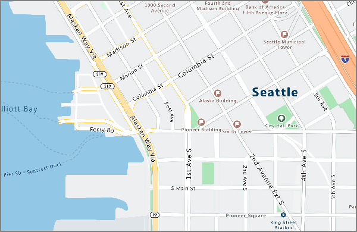

# <a name="what-is-azure-maps"></a>Azure Maps とは
Azure Maps は一連の地理空間サービスであり、最新のマッピング データによってサポートされているため、精度の高い地理的なコンテキストを Web アプリケーションとモバイル アプリケーションに提供できます。 ここには、マップをレンダリングするための REST API、目的地、目的地へのルート、交通状況、タイム ゾーンを検索するための REST API、IP to Location サービス用の REST API が含まれます。 これらの API と使い慣れたツールを使用して、位置情報を Azure ソリューションに統合するソリューションの開発とスケーリングを迅速に行えます。 REST API に加えて、開発を簡単かつ柔軟にし、複数のメディア間で移植可能にする Web ベースの JavaScript コントロールが提供されます。 

次の動画では、Azure Maps について詳しく説明しています。

<iframe src="https://channel9.msdn.com/Shows/Azure-Friday/Azure-Location-Based-Services/player" width="960" height="540" allowFullScreen frameBorder="0"></iframe>

## <a name="services-in-azure-maps"></a>Azure Maps のサービス

Azure Maps は、Azure アプリケーションに地理的なコンテキストを提供できる以下の 6 つのサービスで構成されます。 

### <a name="render-service"></a>Render Service

Render Service は、開発者がマッピングを中心とする Web アプリケーションおよびモバイル アプリケーションを作成できるように設計されています。 このサービスは、高品質のラスター グラフィックス イメージ、19 のズーム レベル、または完全にカスタマイズ可能なベクター形式のマップ イメージを使います。



Render Service では現在、開発者が衛星画像を操作できるプレビュー API が提供されています。 詳細については、[Azure Maps Render API](https://docs.microsoft.com/rest/api/maps/render) に関するページを参照してください。


### <a name="route-service"></a>Route Service 

Route Service には、現実世界のインフラストラクチャに関する堅牢なジオメトリ計算と複数の輸送モードでの道案内が含まれています。 このサービスを使って、開発者は、自動車、トラック、自転車、徒歩などの複数の移動手段について指示を計算できます。 サービスでは、交通状況、重量制限、危険物輸送などの入力も検討できます。


Route Service では現在、複数のルート要求のバッチ処理、一連の出発地と目的地の間における移動時間と距離のマトリックス、時間または燃料の要件に基づいた移動可能なルートまたは距離の検出など、高度な機能のプレビューが提供されています。 ルーティング機能の詳細については、[Azure Maps Route API](https://docs.microsoft.com/rest/api/maps/route) に関するページを参照してください。


### <a name="search-service"></a>検索サービス

Search Service は、開発者が住所、場所、名前またはカテゴリ別の事業所一覧、およびその他の地理情報を検索できるように設計されています。 Search Service では、緯度と経度に基づいて住所や交差点の[逆引き地理コード](https://en.wikipedia.org/wiki/Reverse_geocoding)を行うこともできます。 


Search Service ではさらに、ルートに沿った検索、より広い範囲内での検索、複数の検索要求のバッチ処理、ある一点の場所ではなく広い範囲での検索など、高度な機能が提供されています。 バッチおよび範囲の検索の API は現在プレビュー段階です。 検索機能の詳細については、[Azure Maps Search API](https://docs.microsoft.com/rest/api/maps/search) に関するページを参照してください。


### <a name="time-zone-service"></a>Time Zone Service

Time Zone Service では、緯度と経度の組み合わせまたは [IANA ID](http://www.iana.org/) を使って、現在、過去、未来のタイム ゾーン情報のクエリを実行できます。 また、Time Zone Service では、Microsoft Windows タイム ゾーン ID を IANA タイム ゾーンに変換したり、UTC に対するタイム ゾーン オフセットを取得したり、それぞれのタイム ゾーンで現在の時刻を取得したりすることもできます。 Time Zone Service に対するクエリの一般的な JSON 応答は、次の例のようになります。

```JSON
{
    "Version": "2017c",
    "ReferenceUtcTimestamp": "2017-11-20T23:09:48.686173Z",
    "TimeZones": [{
        "Id": "America/Los_Angeles",
        "ReferenceTime": {
            "Tag": "PST",
            "StandardOffset": "-08:00:00",
            "DaylightSavings": "00:00:00",
            "WallTime": "2017-11-20T15:09:48.686173-08:00",
            "PosixTzValidYear": 2017,
            "PosixTz": "PST+8PDT,M3.2.0,M11.1.0"
        }
    }]
}
```

このサービスの詳細については、[Azure Maps Timezone API](https://docs.microsoft.com/rest/api/maps/timezone) に関するページを参照してください。

### <a name="traffic-service"></a>Traffic Service

Traffic Service は、交通情報を必要とする Web アプリケーションおよびモバイル アプリケーションを開発者が作成できるように設計された Web サービスのスイートです。 サービスでは、次の 2 つのデータ型が提供されます。
    * トラフィック フロー - ネットワーク内のすべての主要道路で観察されたリアルタイムの速度と移動時間。 
    * トラフィック インシデント - 道路ネットワークでの交通渋滞およびインシデントに関する正確なビュー。


詳細については、[Azure Maps Traffic API](https://docs.microsoft.com/rest/api/maps/traffic) に関するページを参照してください。

### <a name="ip-to-location"></a>IP to Location

IP to Location は、特定の IP アドレスに関して 2 文字の国番号を取得できるプレビュー サービスです。 このサービスは、特別な地政学的制約に対応するためにアプリケーションを調整する場合に役立つほか、地理的な場所に基づいてアプリケーションのコンテンツを変更して、ユーザー エクスペリエンスを高める場合に役立ちます。 

IP to Location サービスの REST API については、[Azure Maps Geolocation API](https://docs.microsoft.com/rest/api/maps/geolocation) に関するページを参照してください。

## <a name="programming-model"></a>プログラミング モデル

モビリティを実現するよう設計された Azure Maps では、クロスプラットフォーム アプリケーションを強化できます。 言語に依存せず、[REST API](https://docs.microsoft.com/rest/api/maps/) を通じて JSON をサポートするプログラミング モデルが使用されます。 

さらに、Azure Maps は Web アプリケーションとモバイル アプリケーションの両方をすばやく簡単に開発できるように、単純なプログラミング モデルの便利な [JavaScript マップ コントロール](https://docs.microsoft.com/javascript/api/azure-maps-javascript/?view=azure-iot-typescript-latest)を提供します。 


## <a name="usage"></a>使用法

[Azure portal](http://portal.azure.com) に移動して Azure Maps アカウントを作成すると、Maps サービスにアクセスできます。 

Azure Maps では、キーベースの認証スキームが使用されます。 アカウントでは 2 つのキーがあらかじめ自動的に生成されます。 アプリケーションへのこれらの場所機能の直接統合を始めるには、Azure Maps サービスへの要求でどちらかのキーを使います。

## <a name="supported-regions"></a>サポートされているリージョン
Azure Maps API は現在、以下を除くすべての国で利用できます。 

* アルゼンチン
* 中国
* インド
* モロッコ
* パキスタン
* 韓国

現在の IP アドレスをチェックして、ご自身の IP アドレスの場所が上記のサポートされていない国に含まれていないことを確認してください。

## <a name="next-steps"></a>次の手順

- Azure Maps の新機能に関する詳細情報: 
    - [ルート マトリックス、等時線、IP 検索など](https://azure.microsoft.com/blog/route-matrix-isochrones-ip-lookup-and-more-added-to-azure-maps/)。 
- 続いて、サービスを例示するサンプル アプリをお試しください
    - [デモの対話形式の検索マップを起動する](quick-demo-map-app.md)
