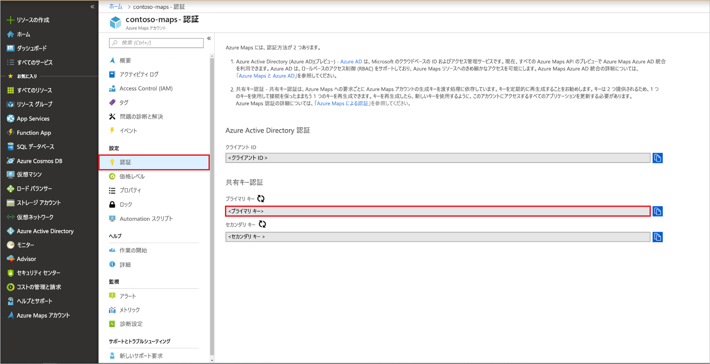

# クイック スタート:Azure Maps を使用して対話形式の検索マップを作成する

この記事では、対話形式で検索を行える、Azure Maps のマップ作成機能について説明します。 次の基本的な手順について説明します。
* 自分用の Azure Maps アカウントを作成する。
* デモ版の Web アプリケーションで使用するアカウント キーを取得する。

Azure サブスクリプションをお持ちでない場合は、開始する前に [無料アカウント](https://azure.microsoft.com/free/?WT.mc_id=A261C142F) を作成してください。

## Azure portal にサインインする

[Azure portal](https://portal.azure.com) にサインインします。

## Azure Maps でアカウントを作成する

次の手順で新しい Maps アカウントを作成します。

1. [Azure Portal](https://portal.azure.com) の左上隅にある **[リソースの作成]** をクリックします。
2. *[Marketplace を検索]* ボックスに「**Maps**」と入力します。
3. *[結果]* から **[Maps]** を選択します。 マップの下に表示される **[作成]** ボタンをクリックします。
4. **[Azure Maps アカウントの作成]** ページで、次の値を入力します。
    * このアカウントで使う "*サブスクリプション*"。
    * このアカウントの "*リソース グループ*" の名前。 *[新規作成]* を選んで新しく作成することも、 *[既存のものを使用]* を選んで既存のリソース グループを使うこともできます。
    * 新しいアカウントの "*名前*"。
    * このアカウントの "*価格レベル*"。
    * *[ライセンス]* と *[プライバシーに関する声明]* の内容を読み、チェック ボックスをオンにして条件に同意します。
    * **[作成]** ボタンをクリックします。

## アカウントの主キーを取得する

Maps アカウントが正常に作成されたら、Maps API のクエリを実行できるキーを取得します。 Azure Maps サービスを呼び出す際は、ご利用のアカウントの主キーをサブスクリプション キーに使用することをお勧めします。

1. ポータルで、Maps アカウントを開きます。
2. [設定] セクションで **[認証]** を選択します。
3. **[主キー]** をクリップボードにコピーします。 このチュートリアルで後ほど使用するためにローカルに保存します。

## アプリケーションのダウンロード

1. [interactiveSearch .html](https://github.com/Azure-Samples/AzureMapsCodeSamples/blob/master/AzureMapsCodeSamples/Tutorials/interactiveSearch.html) に移動し、それをクリックして、GitHub ユーザー インターフェイス内の内容を表示します。 **[Raw]** ボタンを右クリックし、ファイルの内容をコピーするか、[名前を付けて保存] をクリックしてファイルをダウンロードします。
2. このファイルの内容を **AzureMapDemo.html** としてローカルに保存します。 それをテキスト エディターで開きます。
3. `<Your Azure Maps Key>` という文字列を検索します。 これを前のセクションで取得した**主キー**の値に置き換えます。

## アプリケーションを開く

1. **AzureMapDemo.html** ファイルを任意のブラウザーで開きます。
2. 表示されたロサンゼルス市の地図を見てください。 拡大/縮小すると、ズームのレベルに応じて、マップに表示される情報が自動的に増減します。 
3. マップの既定の中心を変更します。 **AzureMapDemo.html** ファイルで **center** という名前の変数を検索します。 この変数の緯度と経度のペア値を、新しい値 **[-74.0060, 40.7128]** に置き換えます。 ファイルを保存し、ブラウザーを更新します。
4. これで、対話形式の検索を実行できます。 デモ版の Web アプリケーションの左上隅にある検索ボックスに「**レストラン**」と入力します。
5. 検索ボックスの下に表示された住所/場所のリストにマウスを合わせます。 対応するピンがマップに現れ、その場所に関する情報がポップアップに表示されることがわかります。 民間事業のプライバシー保護のために、架空の名前と住所が表示されています。

    

## リソースをクリーンアップする

チュートリアルでは、お使いのアカウントで Azure Maps を使用および構成する方法について詳しく説明します。 チュートリアルに進む場合は、このクイック スタートで作成したリソースをクリーンアップしないでください。 進まない場合は、次の手順に従ってリソースをクリーンアップしてください。

1. **AzureMapDemo.html** Web アプリケーションを実行しているブラウザーを閉じます。
2. Azure portal の左側のメニューから、 **[すべてのリソース]** を選択します。 次に、Azure Maps アカウントを選択します。 **[すべてのリソース]** ブレードの上部にある **[削除]** を選択します。

## 次のステップ

このクイック スタートでは、Azure Maps アカウントを作成し、デモ アプリを作成しました。 Azure Maps の詳細については、以下のチュートリアルを参照してください。

> [!div class="nextstepaction"]
> [Azure Maps を使用して近くの目的地を検索する](tutorial-search-location.md)

他のコード例や対話型のコーディング エクスペリエンスについては、以下のガイドを参照してください。

> [!div class="nextstepaction"]
> [Azure Maps Search サービスを使用して住所を検索する](how-to-search-for-address.md)

> [!div class="nextstepaction"]
> [Azure Maps のマップ コントロールを使用する](how-to-use-map-control.md)
