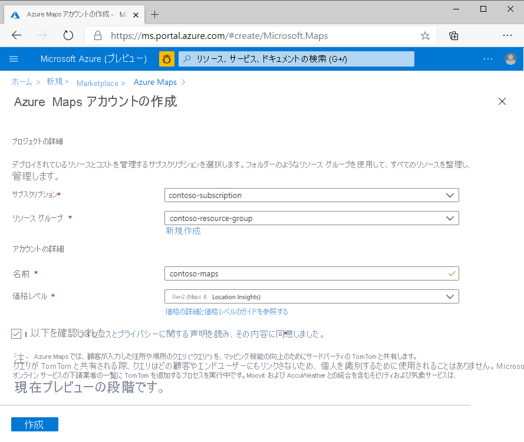
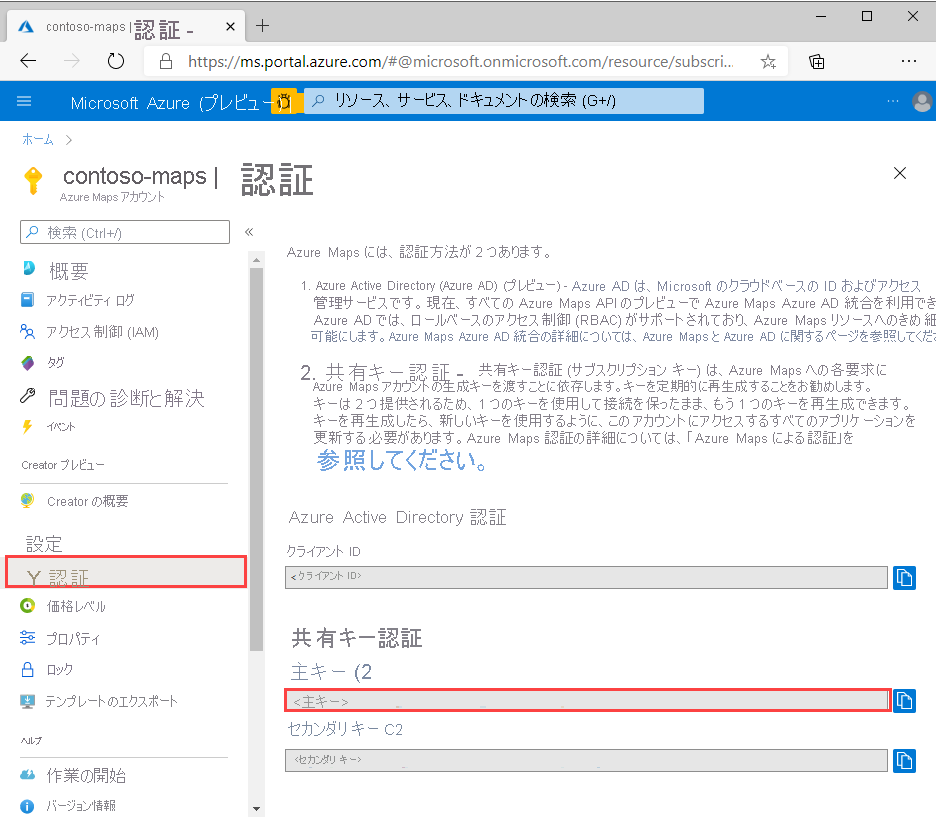
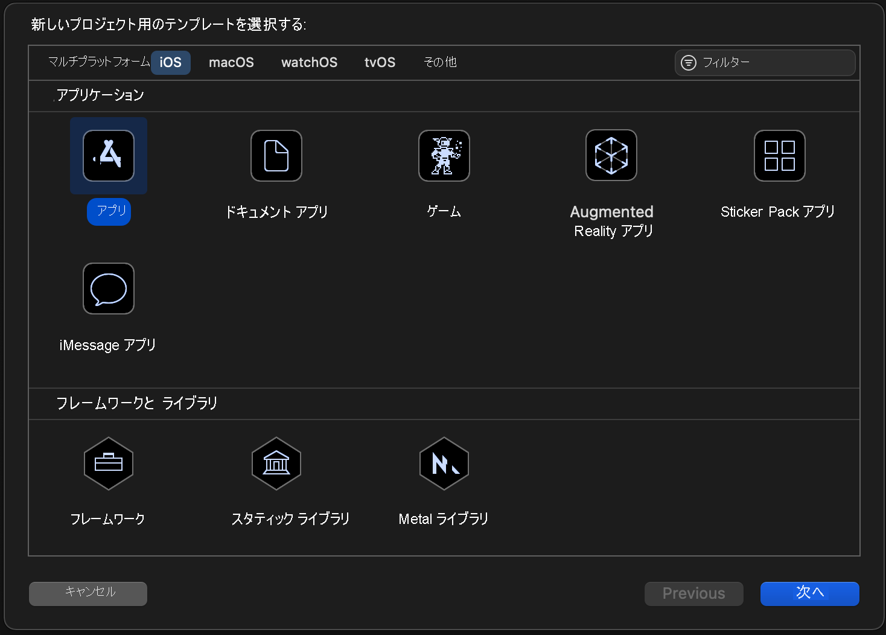
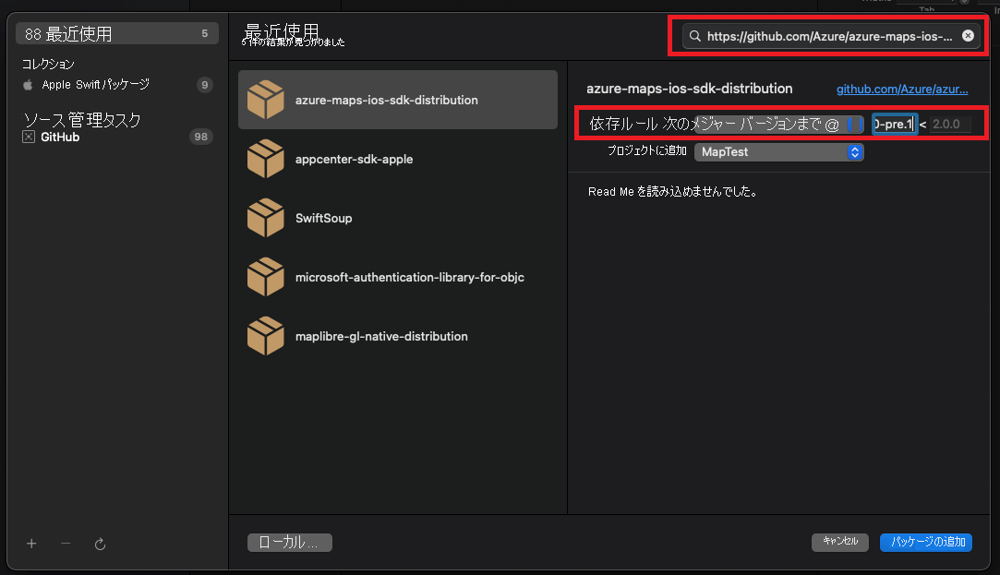
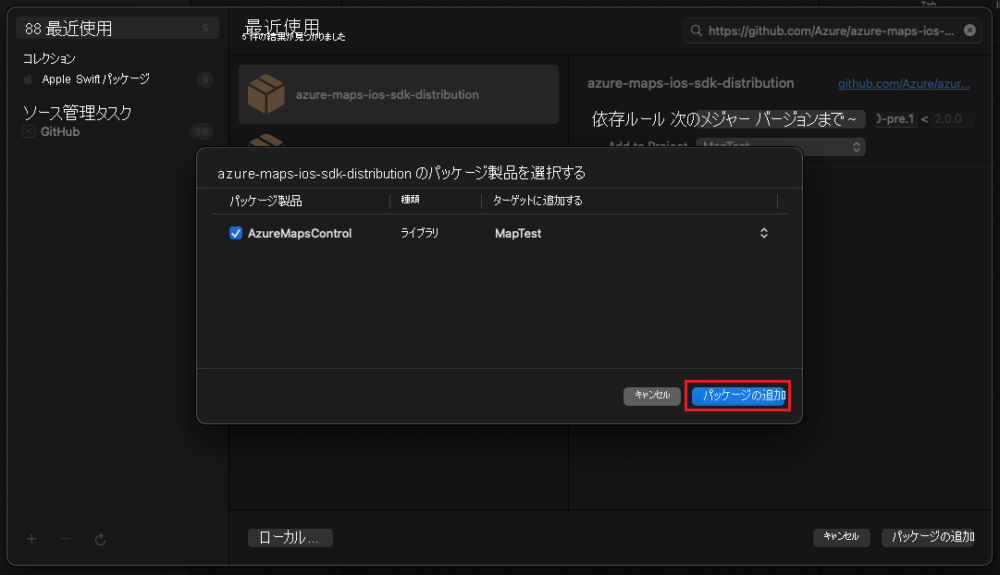
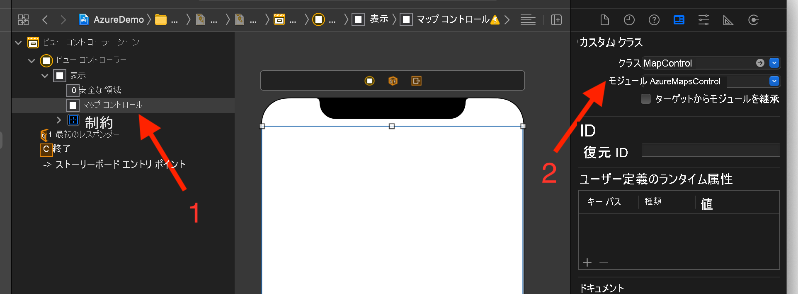

# iOS アプリを作成する (パブリック プレビュー)

この記事では、iOS アプリに Azure Maps を追加する方法について説明します。 次の基本的な手順について説明します。

* 使用する開発環境を設定する。
* 自分用の Azure Maps アカウントを作成する。
* アプリで使用する Azure Maps のプライマリ キーを取得する。
* プロジェクトから Azure Maps ライブラリを参照する。
* Azure Maps コントロールをアプリに追加する。

## [前提条件]

* [Azure portal](https://portal.azure.com/) にサインインして Azure Maps アカウントを作成します。 Azure サブスクリプションをお持ちでない場合は、開始する前に[無料アカウントを作成](https://azure.microsoft.com/free/)してください。
* [Azure Maps アカウントを作成します](quick-demo-map-app.md#create-an-azure-maps-account)
* [プライマリ サブスクリプション キーを取得します](quick-demo-map-app.md#get-the-primary-key-for-your-account) (主キーまたはサブスクリプション キーとも呼ばれます)。 Azure Maps での認証の詳細については、「[Azure Maps での認証の管理](how-to-manage-authentication.md)」を参照してください。
* [Mac App Store から Xcode](https://apps.apple.com/cz/app/xcode/id497799835?mt=12) を無料でダウンロードします。

## Azure Maps アカウントを作成する

次の手順で、新しい Azure Maps アカウントを作成します。

1. [Azure portal](https://portal.azure.com/) の左上隅にある **[リソースの作成]** を選択します。

2. _[Marketplace を検索]_ ボックスに「**Azure Maps**」と入力します。

3. _[結果]_ から **[Azure Maps]** を選択し、マップの下に表示される **[作成]** ボタンを選択します。

4. **[Azure Maps アカウントの作成]** ページで、次の値を入力します。

   * このアカウントで使う "_サブスクリプション_"。
   * このアカウントの "_リソース グループ_" の名前。 _[新規作成]_ を選んで新しく作成することも、 _[既存のものを使用]_ を選んで既存のリソース グループを使うこともできます。
   * 新しいアカウントの "_名前_"。
   * このアカウントの "_価格レベル_"。
   * _[ライセンス]_ と _[プライバシーに関する声明]_ の内容を読み、チェック ボックスをオンにして条件に同意します。
   * **[作成]** ボタンを選択します。

    

## アカウントの主キーを取得する

Maps アカウントが正常に作成されたら、Maps API のクエリを実行できる主キーを取得します。

1. ポータルで、Maps アカウントを開きます。

2. [設定] セクションで **[認証]** を選択します。

3. **[主キー]** をクリップボードにコピーします。 このチュートリアルで後ほど使用するためにローカルに保存します。

>[!NOTE]
> このクイックスタートでは、デモンストレーションの目的で[共有キー](azure-maps-authentication.md#shared-key-authentication)認証アプローチを使用しますが、どの運用環境でも推奨されるアプローチは [Azure Active Directory](azure-maps-authentication.md#azure-ad-authentication) 認証を使用することです。
<!--
> If you use the Azure subscription key instead of the Azure Maps primary key, your map won't render properly. Also, for security purposes, it is recommended that you rotate between your primary and secondary keys. To rotate keys, update your app to use the secondary key, deploy, then press the cycle/refresh button beside the primary key to generate a new primary key. The old primary key will be disabled. For more information on key rotation, see [Set up Azure Key Vault with key rotation and auditing](../key-vault/secrets/tutorial-rotation-dual.md)
-->

## Xcode でプロジェクトを作成する

最初に、新しい iOS アプリ プロジェクトを作成します。 Xcode プロジェクトを作成するには、次の手順を完了します。

1. **[File]\(ファイル\)** から、 **[New]\(新規作成\)**  ->  **[Project]\(プロジェクト\)** の順に選択します。

2. **[iOS]** タブで、 **[App]\(アプリ\)** 、 **[Next]\(次へ\)** の順に選択します。

3. アプリ名とバンドル ID を入力し、 **[Next]\(次へ\)** を選択します。

新しいプロジェクトの作成に関する詳細については、[アプリ用の Xcode プロジェクトを作成する](https://developer.apple.com/documentation/xcode/creating-an-xcode-project-for-an-app)方法に関する記事を参照してください。

## Azure Maps iOS SDK をインストールする

アプリケーションのビルドの次の手順は、Azure Maps iOS SDK をインストールすることです。 SDK をインストールするには、以下の手順を完了します。

1. **[Project navigator]\(プロジェクト ナビゲーター\)** で目的の Xcode iOS プロジェクトを選択して、**パッケージの依存関係を追加する** ために、 **+** ボタンを選択します。

   

2. 結果のダイアログに以下を入力します。
   * 右上隅に表示される検索バーに「`https://github.com/Azure/azure-maps-ios-sdk-distribution.git`」と入力します。
   * **[Dependency Rule]\(依存関係ルール\)** フィールドで `Up to Next Major Version` を選択します。
   * **[Dependency Rule]\(依存関係ルール\)** のバージョン フィールドに「`1.0.0-pre.1`」と入力します。

   

3. パッケージと一緒にその依存関係が解決されたら、 **[Add Package]\(パッケージの追加\)** ボタンを選択して、依存関係のセットアップを完了します。

   

## MapControl ビューを追加します

1. ビュー コントローラーにカスタム `UIView` を追加します

1. `AzureMapsControl` モジュールから `MapControl` クラスを選択します

   

1. **AppDelegate.swift** ファイルで、以下の操作を行う必要があります。

   * Azure Maps SDK のインポートを追加する
   * Azure Maps の認証情報を設定する

`AzureMaps.configure(subscriptionKey:)` または `AzureMaps.configure(aadClient:aadAppId:aadTenant:)` メソッドを使用して AzureMaps クラスにグローバルに認証情報を設定すると、すべてのビューで認証情報を追加する必要がなくなります。

1. 以下の図に示すように、実行ボタンを選択して (または `CMD` + `R` キーを押す)、アプリケーションをビルドします。

   

Xcode でアプリケーションをビルドするには、数秒かかります。 ビルドが完了した後、シミュレートされた iOS デバイスでアプリケーションをテストできます。 次のようなマップが表示されます。

## リソースをクリーンアップする

<!--
> [!WARNING]
> The tutorials listed in the [Next Steps](#next-steps) section detail how to use and configure Azure Maps with your account. Don't clean up the resources created in this quickstart if you plan to continue to the tutorials.
-->

このクイックスタートで作成したリソースをクリーンアップするには、こちらの手順を実行します。

1. Xcode を閉じ、作成したプロジェクトを削除します。

2. 外部のデバイスでアプリケーションをテストした場合は、そのデバイスからアプリケーションをアンインストールします。

今後 Azure Maps iOS SDK を使用した開発を行う予定がない場合は次の手順を実行します。

1. Azure portal ページに移動します。 ポータルのメイン ページで、 **[すべてのリソース]** を選択します。 または、左上隅のメニュー アイコン、 **[すべてのリソース]** の順に選択します。

2. Azure Maps アカウントを選択します。 ページの上部で、**[削除]** を選択します。

3. iOS アプリの開発を今後行う予定がない場合は、必要に応じて Xcode をアンインストールします。

## 関連情報

その他のコード例については、次の記事を参照してください。

* [Azure Maps での認証の管理](how-to-manage-authentication.md)

<!--
## Additional information

See the following articles for additional code examples:

* [Manage authentication in Azure Maps](how-to-manage-authentication.md)
* [Change map styles in iOS maps](set-map-style-ios-sdk.md)
* [Add a symbol layer](add-symbol-layer-ios.md)
* [Add a line layer](add-line-layer-to-map-ios.md)
* [Add a polygon layer](add-polygon-layer-map-ios.md)

## Next steps

In this quickstart, you created your Azure Maps account and created a demo application. Take a look at the following tutorials to learn more about Azure Maps:

> [!div class="nextstepaction"]

> [Load GeoJSON data into Azure Maps](tutorial-load-geojson-file-ios.md)
-->
