# DevOps のための Application Insights の概要

[Application Insights](../../azure-monitor/app/app-insights-overview.md) を使用すると、アプリを本稼働に移行したとき、その動作と利用状況をすばやく確認できます。 問題があれば、それを通知し、その問題による影響の分析と原因究明を支援します。

以下は、Web アプリケーションを開発しているチームからの説明です。

* *"当社は数日前に、"軽微" な修正プログラムをデプロイしました。広範なテストは実行しなかったのですが、困ったことに、予期しない変更がペイロードにマージされ、フロント エンドとバック エンドの間に非互換性の問題が発生しました。すぐにサーバーの例外が急増し、アラートが発行され、私たちは状況に気付きました。Application Insights ポータルで数回クリックしただけで、例外の呼び出し履歴から情報を取得し、問題を絞り込むことができました。私たちは直ちにロールバックし、損害を抑えることができました。Application Insights のおかげで、開発運用サイクルのこの部分がとても簡単で実用的なものになっています。"*

この記事では、オンライン バンキング システムを開発する Fabrikam Bank のチームを追跡し、このチームが Application Insights を使用して、顧客にすばやく対応し、更新を行う方法を確認します。  

チームは、次の図に示した DevOps 周期で運営されています。

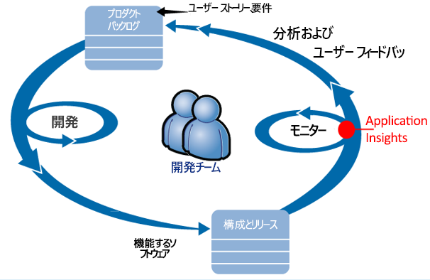

開発のバックログ (タスク一覧) に要件が取り込まれます。 チームは短期枠で作業し、開発中のソフトウェアを、通常は改善または機能強化として、既存のアプリケーションに実装します。 稼働中のアプリは新機能で頻繁に更新されます。 チームは Application Insights を利用し、稼働中のアプリの動作と利用状況を監視します。 この APM データが開発バックログに取り込まれます。

チームは Application Insights を利用し、稼働中の Web アプリケーションを厳重に監視します。

* パフォーマンス。 知りたいのは、応答時間が要求の数でどのように変わるか、CPU、ネットワーク、ディスク、その他のリソースはどのくらい使われているか、パフォーマンスを低下させているアプリケーション コードはどれか、ボトルネックとなっているのはどこかです。
* 失敗。 例外が発生したり、要求が失敗したり、パフォーマンス カウンターが適度な範囲を超えた場合、その事実を速やかに把握し、是正措置を講じる必要があります。
* 利用状況。 新しい機能を導入したら、それがどの程度利用されているか、ユーザーにとって難しくないか知る必要があります。

この周期のフィードバック部分に注目してみましょう。

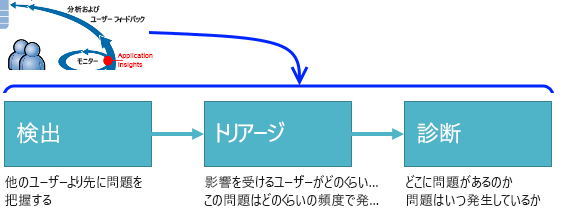

## 可用性の低下を検出する
Marcela Markova は OBS チームの上級開発者で、オンライン パフォーマンスの監視を主導しています。 彼女は次のような複数の[可用性テスト](../../azure-monitor/app/monitor-web-app-availability.md)を設定しました。

* アプリのメイン ランディング ページの単一 URL テスト (http://fabrikambank.com/onlinebanking/)。 Marcela は HTTP コード 200 と "ようこそ!" というテキストの条件を設定しました。 このテストに失敗した場合は、ネットワークまたはサーバーに重大な不具合があるか、デプロイメントの問題が発生しています  (または、他のメンバーが  Marcela に知らせずに、ページの "ようこそ" メッセージに変更を加えた可能性もあります)。
* 複数手順の詳細なテスト。ログインし、現在のアカウント一覧を取得して、各ページに関する主要な詳細情報を調べます。 このテストでは、アカウント データベースへの接続が機能していることを確認します。 架空の顧客 ID を使用し、その一部はテスト目的で保持されます。

これらのテストを設定することで、Marcela は、システムが停止してもチームがすぐに知ることができるという安心感を得られています。  

エラーは Web テストのチャートに赤い点として表示されます。

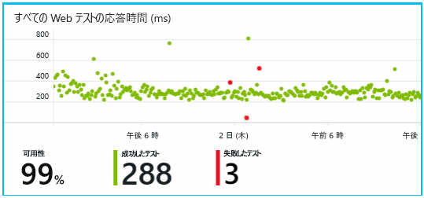

さらに重要なこととして、あらゆるエラーに関するアラートが開発チームに電子メールで送信されます。 このようにして、チームは、ほとんどの顧客よりも先にエラーの発生を把握できます。

## パフォーマンスの監視
Application Insights の概要ページには、さまざまな[主要メトリック](../../azure-monitor/app/web-monitor-performance.md)を示す 1 つのグラフがあります。

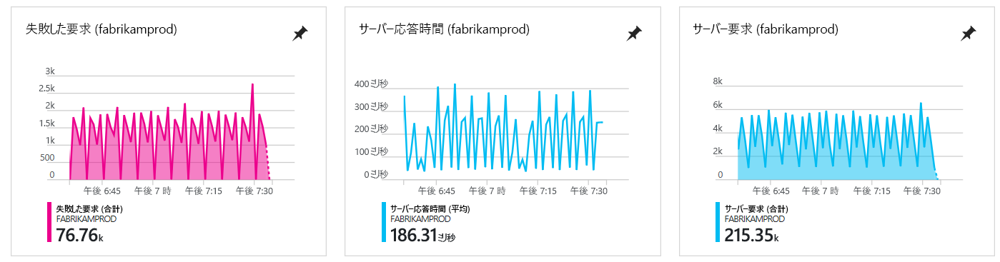

ブラウザーのページの読み込み時間は、Web ページから直接送信される製品利用統計情報から生成されます。 サーバー応答時間、サーバー要求の数、失敗した要求の数はすべて Web サーバーで計算され、そこから Application Insights に送信されます。

Marcela は、サーバー応答のグラフに少し懸念を抱いています。 このグラフには、サーバーがユーザーのブラウザーからの HTTP 要求を受信してから応答するまでの平均時間が表示されていますが、 グラフには、サーバーがユーザーのブラウザーからの HTTP 要求を受信してから応答するまでの平均時間が表示されていますが、通常、システムにかかる負荷の変動に応じて、このグラフが変動することはないからです。 この例では、要求数の微増と、応答時間の上昇に関連性があるようです。 これは、システムが限界に近い状態で動作していることを示している可能性があります。

そこで、サーバーのグラフを開きました。

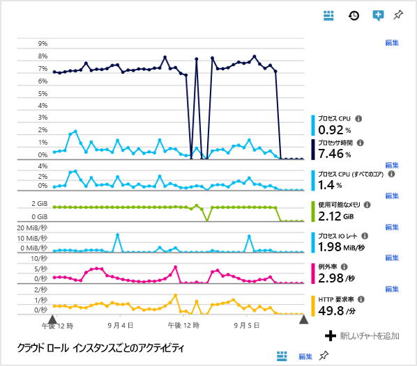

リソースの制限に達している兆候はないようなので、サーバー応答のグラフの急上昇は単に偶然かもしれません。

## 目標に合ったアラートの設定
それでも応答時間は監視し続けることにしました。 応答時間が遅くなりすぎた場合はすぐに把握したいので、

通常のしきい値を超える応答時間になった場合の[アラート](../../azure-monitor/app/metrics-explorer.md)を設定しました。 こうすることで、応答時間が遅くなった場合に確実に把握できるようになります。

![[アラート] ブレードの追加](./media/detect-triage-diagnose/07-alerts.png)

アラートは、他の多様なメトリックにも設定できます。 たとえば、例外数が多くなった場合や、使用可能なメモリが少なくなった場合、クライアントの要求が急増した場合に、電子メールを受け取ることができます。

## スマート検出アラートを使用して最新情報の入手
翌日、アラートの電子メールが Application Insights から送信されました。 ただ、この電子メールは、設定した応答時間のアラートではなく、 失敗した要求 (つまり、500 以上のエラー コードを返した要求) が急増したことを示す内容でした。

失敗した要求の数は、ユーザーがエラーに遭遇した件数を示しています。通常、このエラーは、コード内で例外がスローされた後に発生します。 おそらく、ユーザーには "申し訳ありませんが、詳細を更新できませんでした" という内容のメッセージが表示されます。 また、最悪の場合は、Web サーバーによってユーザーの画面にスタック ダンプが出力されます。

このアラートは予期しないことでした。なぜなら、最後に確認したときに失敗した要求数は低かったからです。 負荷が高いサーバーでは、少ないエラー数が期待されます。

また、このアラートを構成する必要がなかったことも意外でした。 Application Insights にはスマート検出が含まれています。 この機能はアプリケーションの通常のエラー パターンに合わせて自動的に調整され、特定のページに対するエラー、高負荷、他のメトリックとの関連性に "慣れ" ます。 その期待される値を上回った場合にのみ、アラートが発行されます。

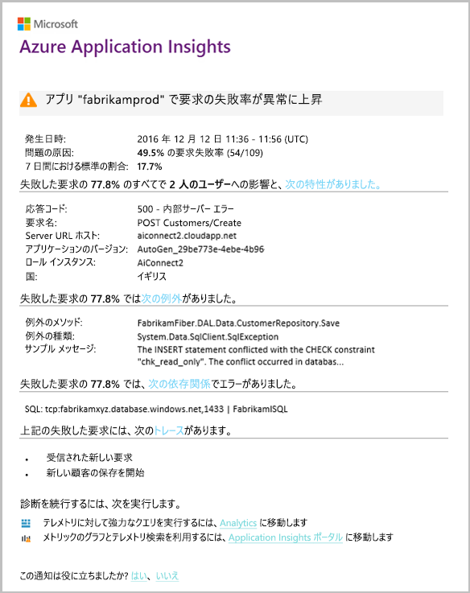

これはとても役に立つ電子メールです。 単にアラートを発行するだけではありません。 数多くのトリアージや診断の作業も行います。

たとえば、影響を受けるユーザー数や、該当する Web ページや操作が記載されます。 Marcela はその内容を読み、チーム全体で消防訓練としてこの問題に取り組むかどうか、または翌週まで無視できるかどうかを判断できます。

また、電子メールには、発生した具体的な例外や、さら重要な、特定のデータベースに対する呼び出しの失敗に関連しているエラーであることも記載されます。 これで、Marcela のチームが更新プログラムを最近デプロイしていないにもかかわらず、エラーが急増した理由がわかりました。

Marcella はこの電子メールに基づいてデータベース チームのリーダーに ping を実行します。 データベース チームは 30 分前に修正プログラムをリリースしていました。スキーマの小さな変更もあったようです。

問題の発生から 15 分以内で、ログの調査もしていませんが、問題は解決処理中です。 Marcela はリンクをクリックして Application Insights を開きます。 失敗した要求の画面が開き、依存関係の呼び出しの関連一覧に失敗したデータベースの呼び出しが表示されます。

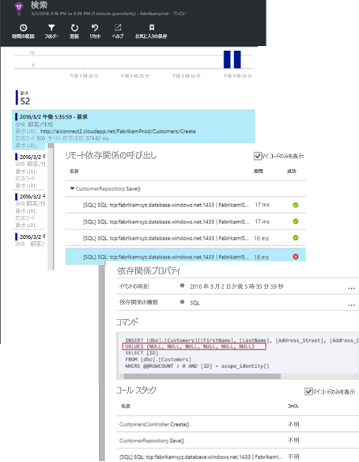

## 例外の検出
簡単なセットアップを行うことで、Application Insights に自動的に [例外](../../azure-monitor/app/asp-net-exceptions.md) が報告されるようになります。 [TrackException()](../../azure-monitor/app/api-custom-events-metrics.md#trackexception) への呼び出しをコードに挿入することで、明示的にキャプチャすることもできます。  

    var telemetry = new TelemetryClient();
    ...
    try
    { ...
    }
    catch (Exception ex)
    {
       // Set up some properties:
       var properties = new Dictionary <string, string>
         {{"Game", currentGame.Name}};

       var measurements = new Dictionary <string, double>
         {{"Users", currentGame.Users.Count}};

       // Send the exception telemetry:
       telemetry.TrackException(ex, properties, measurements);
    }

Fabrikam 銀行のチームは、明らかな回復が見られない限り、例外に関するテレメトリを必ず送信するという習慣を確立してきました。  

実際には、それよりはるかに広範な戦略となっており、コード内に対応する例外があるかどうかにかかわらず、希望していた結果について顧客が不満を示している場合は常にテレメトリを送信しています。 たとえば、(顧客の過失以外の) 運用上の理由により外部の銀行間振替システムから "このトランザクションを完了できません" という趣旨のメッセージが返された場合、チームはそのイベントを追跡します。

    var successCode = AttemptTransfer(transferAmount, ...);
    if (successCode < 0)
    {
       var properties = new Dictionary <string, string>
            {{ "Code", returnCode, ... }};
       var measurements = new Dictionary <string, double>
         {{"Value", transferAmount}};
       telemetry.TrackEvent("transfer failed", properties, measurements);
    }

TrackException はスタックのコピーを送信するので、例外を報告するために使用されます。 TrackEvent はその他のイベントを報告するために使用されます。 これらに、診断に役立つ可能性のあるプロパティをアタッチできます。

例外とイベントは、[[診断検索]](diagnostic-search.md) ブレードに表示されます。 ここで詳細を調査し、細かいプロパティとスタック トレースを確認できます。

![[診断検索] で、フィルターを使用して特定の型のデータを表示する](./media/detect-triage-diagnose/appinsights-333facets.png)

## 予防的な監視
Marcela は、ただ座ってアラートを待っているのではありません。 再デプロイの後には、いつもすぐに、例外数だけでなく、[応答時間](../../azure-monitor/app/web-monitor-performance.md)に関して、全体的な数値と最も遅い要求の表の両方を確認しています。  

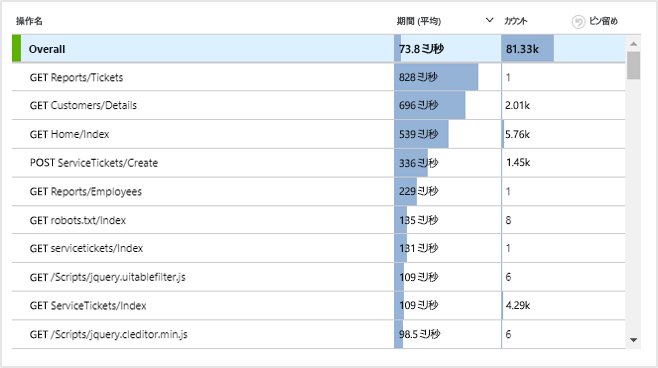

これをもとに、各デプロイメントがパフォーマンスに与える影響を評価できます。Marcela は通常は各週の値を前週の値と比較しています。 急な悪化が見られる場合は、関連する開発者に連絡します。

## トリアージの問題
トリアージとは、問題の重要度と影響範囲に関する評価のことで、検出後の最初のステップです。 深夜にチームを呼び出すべきか。 都合がつく次の空きまでバックログに残せるか。 トリアージには重要な問いが伴います。

どのくらいの頻度で発生していますか? [概要] ブレードのチャートを見れば、問題について特定の観点を得ることができます。 たとえば、ある晩、Fabrikam のアプリケーションによって 4 つの Web テスト アラートが生成されました。 翌朝チームはチャートを見て、テストの大半が緑色である中に赤い点がいくつかあることに気付きました。 可用性チャートを詳細に調べると、断続的な問題がすべて 1 つのテスト場所から発生していることがわかりました。 これは明らかに、ネットワークの問題が 1 つのルートのみに影響を与えているためで、自然に解決する可能性が高そうでした。  

一方、例外数や応答時間のグラフに急激な上昇が見られる場合は、当然、直ちに対処が必要です。

トリアージに役立つ戦術は、"自分でやってみる" です。 同じ問題に遭遇すれば、それが現実であることがわかります。

どれくらいの割合のユーザーが影響を受けているのか。 そのおおよその答えは、障害発生率をセッション数で割って得ることができます。

応答速度の低下の場合は、最も反応が遅い要求の表を各ページの使用頻度と比較します。

ブロックされたシナリオの重要度はどれくらいでしょうか。 特定のユーザー ストーリーをブロックしている機能上の問題は、重要度が高いのでしょうか。 顧客が請求書の支払いをできないのであれば重大です。画面の色の設定を変更できない場合は急がなくても大丈夫でしょう。 イベントや例外の詳細、または遅いページの ID を見れば、顧客に問題が発生している領域がわかります。

## 問題の診断
診断は、デバッグとまったく同じではありません。 コードのトレースを開始するには、まず、問題が発生している原因、場所、状況について大まかに理解する必要があります。

**どのような状況で発生するのか。** イベント チャートやメトリック チャートで提供される履歴ビューを使用すると、影響と考えられる原因とを関連付けるのが容易になります。 応答時間や例外率に断続的なピークが見られる場合は、要求数を確認します。 複数のピークが同時に発生している場合は、リソースの問題が考えられます。 CPU やメモリの割り当てを増やす必要があるか、 依存関係で負荷に対処できていないのかもしれません。

**自社システムが原因か。**  特定の種類の要求のパフォーマンスが急激に低下している場合、たとえば、顧客が口座明細書を必要としているときなどは、Web アプリケーションではなく外部のサブシステムが原因である可能性があります。 メトリック エクスプローラーで、[依存関係のエラー] の割合と [依存関係の期間] の割合を選択し、検出された問題を過去数時間または数日の履歴と比較します。 相関関係のある変更が見つかる場合は、外部のサブシステムに原因があると考えられます。  

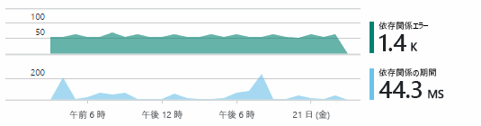

依存関係の速度低下の問題の中には、地理的な問題があります。 Fabrikam 銀行では Azure Virtual Machines を使用していますが、Web サーバーとアカウント サーバーが意図せず複数の国に配置されていることがわかりました。 そのうち 1 つを移行することで、速度は大幅に改善されました。

**何を実行したか。** 依存関係に問題が見つからない場合や、以前は常に問題があったわけではない場合、最近の変更が問題の原因である可能性があります。 メトリック チャートやイベント チャートで提供される履歴を確認すれば、急激な変化とデプロイメントの関連付けが容易になります。 これにより、問題の検索を絞り込むことができます。 アプリケーション コードのどの行がパフォーマンスを低下させているかを特定するには、Application Insights Profiler を有効にします。 「[Application Insights を使用して実行中の Azure Web アプリのプロファイリングを行う](./../../azure-monitor/app/profiler.md)」をご覧ください。 Profiler を有効にすると、次のようなトレースが表示されます。 この例では、メソッド *GetStorageTableData* が問題の原因となっていたことがすぐに分かります。  

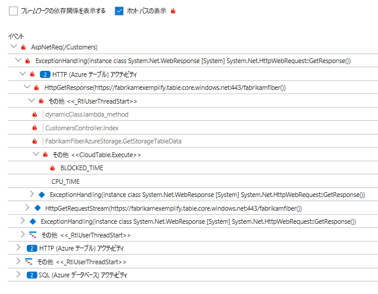

**何が起こっているのか。** 問題によっては、まれにしか発生しないために、オフラインでテストして追跡するが難しいものがあります。 このような場合は、ライブ環境で発生したときにバグをキャプチャするしかありません。 例外レポートでスタック ダンプを調査できます。 また、使い慣れたログ記録フレームワークか TrackTrace() または TrackEvent() を使用して、トレースの呼び出しを記述できます。  

Fabrikam では、口座間振替で断続的な問題が発生しましたが、該当するのは特定の種類の口座のみでした。 何が起こっていたかを詳しく理解するために、チームはコード内の主要ポイントに TrackTrace() の呼び出しを挿入し、各呼び出しにプロパティとして口座の種類をアタッチしました。 こうすることで、[診断検索] でトレースをフィルター処理しやすくなりました。 また、トレースの呼び出しにプロパティおよび測定値としてパラメーター値をアタッチしました。

## 検出された問題への対応
問題を診断したら、修正のためのプランを作成できます。 最近の変更をロールバックする必要があるかもしれませんし、修正を加えることができるかもしれません。 修正が済めば、Application Insights を使用して、成功したかどうかを確認できます。  

Fabrikam 銀行の開発チームは、Application Insights を使用する前と比べて、パフォーマンス測定に対するアプローチが次のように構造化されています。

* Application Insights の [概要] ページで特定の測定値についてパフォーマンスの目標を設定しました。
* "じょうご" 内のユーザーの進み具合を測定するメトリックなど、パフォーマンスの測定値を最初からアプリケーションに組み込みました。  

## ユーザー アクティビティの監視
応答時間が一貫して良好で例外がほとんどない場合、開発チームは使いやすさに目を向けることができます。 ユーザーの操作性の向上や、より多くのユーザーの目標達成を促進する方法について検討できます。

Application Insights を使用して、ユーザーによるアプリの使用状況を知ることもできます。 アプリが問題なく実行されているなら、チームは、どの機能に最も人気があるか、ユーザーは何を気に入っていて何がうまくいっていないか、どれくらいの頻度で使用しているかを知りたいと考えるでしょう。 それらを把握すれば、今後の作業に優先順位を付けるのに役立ちます。 開発サイクルの一環として、各機能の効果を評価する計画を立てることができます。

一例を挙げると、Web サイトを利用するユーザーは、明らかに "ふるい" にかけられたように流れていきます。 多数の顧客が各種ローンの金利を調べます。 そのうちの一部が見積もりフォームに入力します。 見積もりを取得した顧客のうちの一部が実際にローンを組みます。

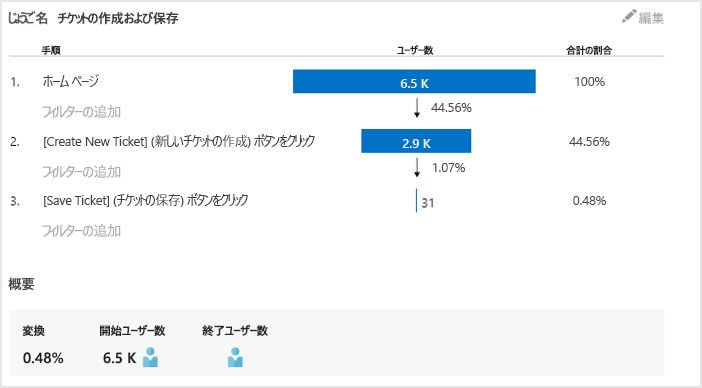

顧客の数が低下する場所を考慮することで、このじょうごの下部にわたりより多くのユーザーを確保する方法について、業務で取り組むことができます。 たとえば、[次へ] ボタンが簡単に見つからない、指示が明確でないなどのユーザーの操作性 (UX) の問題が原因である場合もあります。 ローンの金利が高すぎるなど、より重要なビジネス上の理由から低下している可能性もあります。

理由が何であれ、チームがユーザー行動を調べる際にデータを役立てることができます。 より多くの呼び出しの追跡を挿入すると、より広範な詳細を調べることができます。 TrackEvent() は、個々のボタンのクリックといった細かな詳細から、ローンの支払いなどの大きな達成事項まで、任意のユーザー操作をカウントする場合に使用できます。

チームにとって、ユーザー アクティビティに関する情報を得ることが業務の一環になり、 現在では新機能を設計するときは常に、使用についてのフィードバックを入手する方法にも取り組んでいます。 追跡呼び出しは、開始時から機能に設計されており、 各開発サイクルの機能向上にフィードバックを役立てています。

[詳しくは、使用状況の追跡をご覧ください](../../azure-monitor/app/usage-overview.md)。

## DevOps 周期の適用
この記事では、1 つのチームが Application Insights を使用して、個々の問題を修正するだけでなく、開発ライフサイクルを改善するようすを紹介しました。 皆様がアプリケーションでのアプリケーション パフォーマンス管理に Application Insights を活用する方法を理解するお役に立てればさいわいです。

## ビデオ

> [!VIDEO https://channel9.msdn.com/events/Connect/2016/112/player]

## 次の手順
アプリケーションの特性に応じて、いくつかの開始方法があります。 最適なものを選択してください。

* [ASP.NET Web アプリケーション](../../azure-monitor/app/asp-net.md)
* [Java Web アプリケーション](../../azure-monitor/app/java-get-started.md)
* [Node.js Web アプリケーション](../../azure-monitor/app/nodejs.md)
* [IIS](../../azure-monitor/app/monitor-web-app-availability.md)、[J2EE](../../azure-monitor/app/java-live.md) または [Azure](../../azure-monitor/app/app-insights-overview.md) でホストされているデプロイ済みのアプリ。
* [Web ページ](../../azure-monitor/app/javascript.md) (シングル ページ アプリまたは通常の Web ページ) - 単独で、または任意のサーバー オプションに加えて使用します。
* [可用性テスト](../../azure-monitor/app/monitor-web-app-availability.md) - パブリック インターネットからアプリをテストします。
