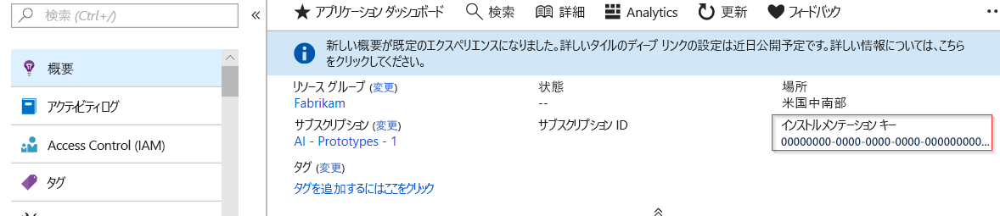
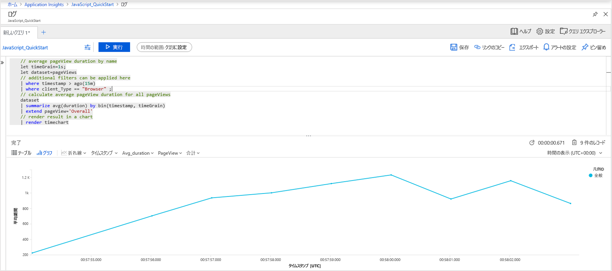
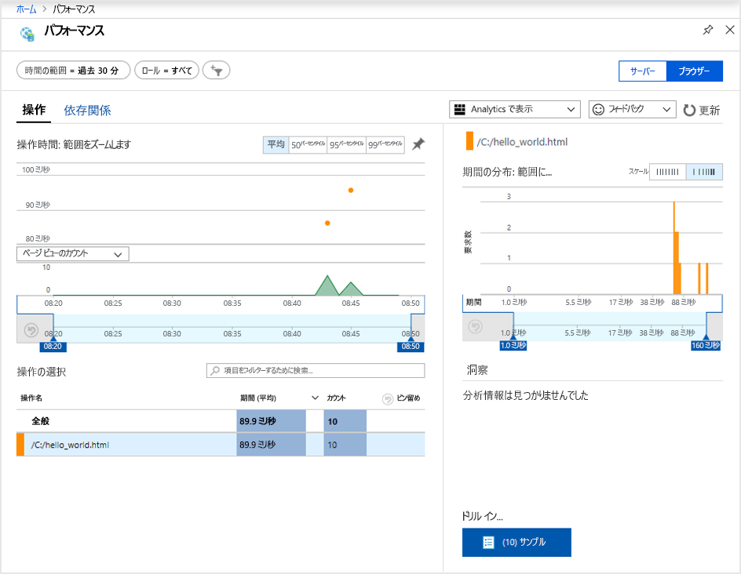
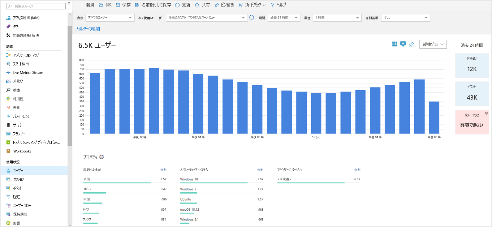
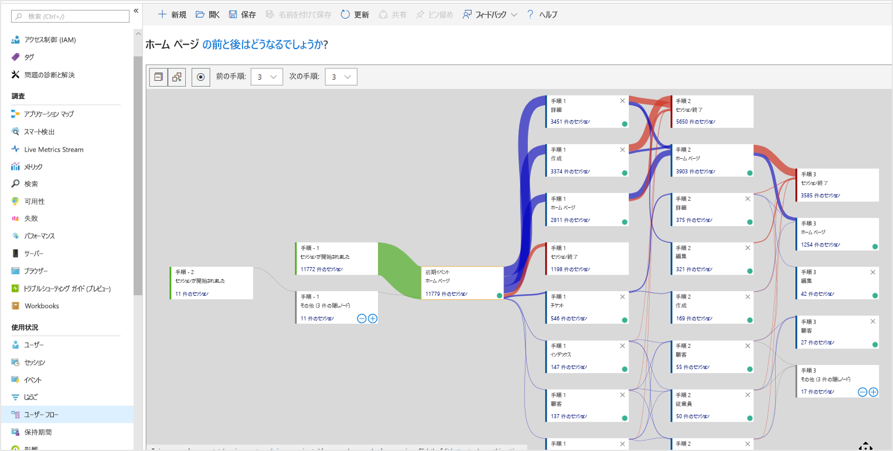

# <a name="start-monitoring-your-website"></a>Web サイトの監視を開始する

Azure Monitor Application Insights を使用すると、Web サイトの可用性、パフォーマンス、および利用状況を簡単に監視できます。 アプリケーションのエラーを、ユーザーからの報告を待つことなく、迅速に特定して診断することもできます。 Application Insights では、サーバー側の監視機能とクライアント/ブラウザー側の監視機能の両方が提供されます。

このクイック スタートでは、[オープン ソースの Application Insights JavaScript SDK](https://github.com/Microsoft/ApplicationInsights-JS) の追加方法を説明します。これによって、Web サイトへの訪問者にとってのクライアント/ブラウザー側のエクスペリエンスを理解することができます。

## <a name="prerequisites"></a>前提条件

このクイック スタートを完了するには、以下が必要です。

- Azure サブスクリプションが必要です。

Azure サブスクリプションをお持ちでない場合は、開始する前に[無料](https://azure.microsoft.com/free/)アカウントを作成してください。

## <a name="sign-in-to-the-azure-portal"></a>Azure portal にサインインします

[Azure Portal](https://portal.azure.com/) にサインインします。

## <a name="enable-application-insights"></a>Application Insights を有効にする

Application Insights は、オンプレミスまたはクラウドで実行されている、インターネットに接続された任意のアプリケーションからテレメトリ データを収集できます。 このデータの表示を開始するには、次の手順を実行します。

1. **[リソースの作成]**  >  **[管理ツール]**  >  **[Application Insights]** の順に選択します。

   > [!NOTE]
   >Application Insights リソースを初めて作成する場合は、「[Application Insights リソースの作成](https://docs.microsoft.com/azure/azure-monitor/app/create-new-resource)」の記事にアクセスして詳細を確認できます。

   構成ボックスが表示されたら、次の表を使用して入力フィールドに入力します。

    | 設定        | 値           | 説明  |
   | ------------- |:-------------|:-----|
   | **Name**      | グローバルに一意の値 | 監視しているアプリを識別する名前 |
   | **リソース グループ**     | myResourceGroup      | App Insights データをホストする新しいリソース グループの名前 |
   | **Location** | East US | 近くにある場所か、アプリがホストされている場所の近くを選択します。 |

2. **Create** をクリックしてください。

## <a name="create-an-html-file"></a>HTML ファイルを作成する

1. ローカル コンピューターで、``hello_world.html`` という名前のファイルを作成します。 この例では、``C:\hello_world.html`` のように、ファイルを C: ドライブのルートに配置します。
2. 以下のスクリプトを ``hello_world.html`` にコピーします。

    ```html
    <!DOCTYPE html>
    <html>
    <head>
    <title>Azure Monitor Application Insights</title>
    </head>
    <body>
    <h1>Azure Monitor Application Insights Hello World!</h1>
    <p>You can use the Application Insights JavaScript SDK to perform client/browser-side monitoring of your website. To learn about more advanced JavaScript SDK configurations visit the <a href="https://github.com/Microsoft/ApplicationInsights-JS/blob/master/API-reference.md" title="API Reference">API reference</a>.</p>
    </body>
    </html>
    ```

## <a name="configure-app-insights-sdk"></a>App Insights SDK を構成する

1. **[概要]**  >  **[Essentials]** を選択し、アプリケーションの**インストルメンテーション キー**をコピーします。

   

2. ``hello_world.html`` の閉じる ``</head>`` タグの前に、次のスクリプトを追加します。

   ```javascript
   <script type="text/javascript">
      var sdkInstance="appInsightsSDK";window[sdkInstance]="appInsights";var aiName=window[sdkInstance],aisdk=window[aiName]||function(e){
         function n(e){t[e]=function(){var n=arguments;t.queue.push(function(){t[e].apply(t,n)})}}var t={config:e};t.initialize=!0;var i=document,a=window;setTimeout(function(){var n=i.createElement("script");n.src=e.url||"https://az416426.vo.msecnd.net/next/ai.2.min.js",i.getElementsByTagName("script")[0].parentNode.appendChild(n)});try{t.cookie=i.cookie}catch(e){}t.queue=[],t.version=2;for(var r=["Event","PageView","Exception","Trace","DependencyData","Metric","PageViewPerformance"];r.length;)n("track"+r.pop());n("startTrackPage"),n("stopTrackPage");var s="Track"+r[0];if(n("start"+s),n("stop"+s),n("setAuthenticatedUserContext"),n("clearAuthenticatedUserContext"),n("flush"),!(!0===e.disableExceptionTracking||e.extensionConfig&&e.extensionConfig.ApplicationInsightsAnalytics&&!0===e.extensionConfig.ApplicationInsightsAnalytics.disableExceptionTracking)){n("_"+(r="onerror"));var o=a[r];a[r]=function(e,n,i,a,s){var c=o&&o(e,n,i,a,s);return!0!==c&&t["_"+r]({message:e,url:n,lineNumber:i,columnNumber:a,error:s}),c},e.autoExceptionInstrumented=!0}return t
      }({
         instrumentationKey:"xxxxxxxx-xxxx-xxxx-xxxx-xxxxxxxx"
      });

      window[aiName]=aisdk,aisdk.queue&&0===aisdk.queue.length&&aisdk.trackPageView({});
   </script>
   ```

3. ``hello_world.html`` を編集し、インストルメンテーション キーを追加します。

4. ローカル ブラウザー セッションで、``hello_world.html`` を開きます。 これによって、単一のページビューが作成されます。 ブラウザーを最新の情報に更新して、複数のテスト ページビューを生成することができます。

## <a name="start-monitoring-in-the-azure-portal"></a>Azure Portal で監視を開始する

1. Azure Portal で、インストルメンテーション キーを取得した Application Insights の**概要**ページを再度開き、現在実行中のアプリケーションに関する詳細情報を表示できます。 概要ページの 4 つの既定のグラフでは、サーバー側のアプリケーション データが対象になっています。 ここではクライアント/ブラウザー側の JavaScript SDK との対話をインストルメント化しているため、この特定のビューは、サーバー側の SDK もインストールされない限り、適用されません。

2. [ **分析]** をクリックします。  これにより、Application Insights で収集されたすべてのデータを分析するための豊富なクエリ言語を備えた **Analytics** が開きます。 クライアント側のブラウザー要求に関連しているデータを表示するには、次のクエリを実行します。

    ```kusto
    // average pageView duration by name
    let timeGrain=1s;
    let dataset=pageViews
    // additional filters can be applied here
    | where timestamp > ago(15m)
    | where client_Type == "Browser" ;
    // calculate average pageView duration for all pageViews
    dataset
    | summarize avg(duration) by bin(timestamp, timeGrain)
    | extend pageView='Overall'
    // render result in a chart
    | render timechart
    ```

   

3. **[概要]** ページに戻ります。 **[調査]** ヘッダーの下の **[ブラウザー]** をクリックし、 **[パフォーマンス]** を選択します。ここに、Web サイトのパフォーマンスに関連するメトリックが表示されます。 Web サイトのエラーと例外を分析するためのビューもあります。 **[サンプル]** をクリックすると、個々のトランザクションの詳細にドリルダウンすることができます。 ここから、[エンド ツー エンドのトランザクションの詳細](../../azure-monitor/app/transaction-diagnostics.md)のエクスペリエンスにアクセスすることができます。

   

4. [ユーザー動作分析ツール](../../azure-monitor/app/usage-overview.md)の調査を始めるには、Application Insights のメイン メニューで、 **[使用状況]** ヘッダーの下の [ **[ユーザー]** ](../../azure-monitor/app/usage-segmentation.md) を選択します。 1 台のマシンからテストを行っているため、1 人のユーザーのデータのみが表示されます。 ライブの Web サイトの場合、ユーザーの分布は次のようになります。

     

5. 複数のページを持つより複雑な Web サイトをインストルメント化した場合、もう 1 つの便利なツールは [**User Flows**](../../azure-monitor/app/usage-flows.md) です。 **User Flows** を使用すると、Web サイトのさまざまな部分を通じて訪問者がたどった経路を追跡することができます。

   

Web サイトを監視するためのより高度な構成については、[JavaScript SDK の API リファレンス](https://github.com/Microsoft/ApplicationInsights-JS/blob/master/API-reference.md)を参照してください。

## <a name="clean-up-resources"></a>リソースのクリーンアップ

引き続きクイックスタートまたはチュートリアルの作業を行う場合は、このクイックスタートで作成したリソースをクリーンアップしないでください。 そうではなく、これ以上作業を行わない場合は、次の手順に従って、このクイック スタートで作成したすべてのリソースを Azure portal で削除してください。

1. Azure Portal の左側のメニューから、 **[リソース グループ]** 、 **[myResourceGroup]** の順にクリックします。
2. リソース グループのページで **[削除]** をクリックし、テキスト ボックスに「**myResourceGroup**」と入力してから **[削除]** をクリックします。

## <a name="next-steps"></a>次の手順

> [!div class="nextstepaction"]
> [パフォーマンスの問題の特定と診断](https://docs.microsoft.com/azure/application-insights/app-insights-analytics)
