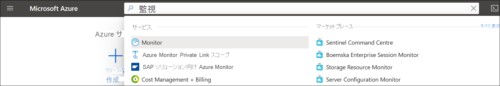

# <a name="quickstart-send-azure-activity-log-to-log-analytics-workspace-using-an-arm-template"></a>クイック スタート:ARM テンプレートを使用して Azure アクティビティ ログを Log Analytics ワークスペースに送信する

アクティビティ ログは、サブスクリプション レベルのイベントの分析情報を提供する Azure のプラットフォーム ログです。 これには、リソースが変更されたときや仮想マシンが起動されたときなどの情報が含まれます。 Azure portal でアクティビティ ログを表示したり、PowerShell と CLI を使用してエントリを取得したりすることができます。 このクイック スタートでは、Azure Resource Manager テンプレート (ARM テンプレート) を使用して Log Analytics ワークスペースと診断設定を作成し、アクティビティ ログを Azure Monitor ログに送信して、[ログ クエリ](../logs/log-query-overview.md)を使用して分析したり、[ログ アラート](../alerts/alerts-log-query.md)や[ブック](../visualize/workbooks-overview.md)などの他の機能を有効にしたりする方法について説明します。

[!INCLUDE [About Azure Resource Manager](../../../includes/resource-manager-quickstart-introduction.md)]

## <a name="prerequisites"></a>前提条件

- Azure サブスクリプションをお持ちでない場合は、開始する前に [無料アカウント](https://azure.microsoft.com/free/?WT.mc_id=A261C142F) を作成してください。
- ローカル コンピューターからコマンドを実行するには、Azure CLI または Azure PowerShell モジュールをインストールします。 詳細については、「[Azure CLI のインストール](/cli/azure/install-azure-cli)」および「[Azure PowerShell をインストールする](/powershell/azure/install-az-ps)」を参照してください。

## <a name="create-a-log-analytics-workspace"></a>Log Analytics ワークスペースの作成

### <a name="review-the-template"></a>テンプレートを確認する

次のテンプレートでは、空の Log Analytics ワークスペースを作成します。 このテンプレートを *CreateWorkspace.json* として保存します。

```json
{
  "$schema": "https://schema.management.azure.com/schemas/2019-04-01/deploymentTemplate.json#",
  "contentVersion": "1.0.0.0",
  "parameters": {
    "workspaceName": {
      "type": "string",
      "metadata": {
        "description": "Name of the workspace."
      }
    },
    "sku": {
      "type": "string",
      "defaultValue": "pergb2018",
      "allowedValues": [
        "pergb2018",
        "Free",
        "Standalone",
        "PerNode",
        "Standard",
        "Premium"
      ],
      "metadata": {
        "description": "Pricing tier: PerGB2018 or legacy tiers (Free, Standalone, PerNode, Standard or Premium) which are not available to all customers."
      }
    },
    "location": {
      "type": "string",
      "allowedValues": [
        "australiacentral",
        "australiaeast",
        "australiasoutheast",
        "brazilsouth",
        "canadacentral",
        "centralindia",
        "centralus",
        "eastasia",
        "eastus",
        "eastus2",
        "francecentral",
        "japaneast",
        "koreacentral",
        "northcentralus",
        "northeurope",
        "southafricanorth",
        "southcentralus",
        "southeastasia",
        "switzerlandnorth",
        "switzerlandwest",
        "uksouth",
        "ukwest",
        "westcentralus",
        "westeurope",
        "westus",
        "westus2"
      ],
      "metadata": {
        "description": "Specifies the location for the workspace."
      }
    },
    "retentionInDays": {
      "type": "int",
      "defaultValue": 120,
      "metadata": {
        "description": "Number of days to retain data."
      }
    },
    "resourcePermissions": {
      "type": "bool",
      "defaultValue": true,
      "metadata": {
        "description": "true to use resource or workspace permissions. false to require workspace permissions."
      }
    }
  },
  "resources": [
    {
      "type": "Microsoft.OperationalInsights/workspaces",
      "apiVersion": "2020-08-01",
      "name": "[parameters('workspaceName')]",
      "location": "[parameters('location')]",
      "properties": {
        "sku": {
          "name": "[parameters('sku')]"
        },
        "retentionInDays": "[parameters('retentionInDays')]",
        "features": {
          "searchVersion": 1,
          "legacy": 0,
          "enableLogAccessUsingOnlyResourcePermissions": "[parameters('resourcePermissions')]"
        }
      }
    }
  ]
}
```

このテンプレートには、次の 1 つのリソースが定義されています。

- [Microsoft.OperationalInsights/workspaces](/azure/templates/microsoft.operationalinsights/workspaces)

### <a name="deploy-the-template"></a>テンプレートのデプロイ

CLI と PowerShell を使用する次の例のような、[ARM テンプレートをデプロイする](../../azure-resource-manager/templates/deploy-portal.md)ための標準的な方法を使ってテンプレートをデプロイします。 **リソース グループ**、**workspaceName**、**location** のサンプルの値を、ご利用の環境に適した値に置き換えます。 ワークスペース名は、すべての Azure サブスクリプションで一意である必要があります。

# <a name="cli"></a>[CLI](#tab/CLI)

```azurecli
az login
az deployment group create \
    --name CreateWorkspace \
    --resource-group my-resource-group \
    --template-file CreateWorkspace.json \
    --parameters workspaceName='my-workspace-01' location='eastus'

```

# <a name="powershell"></a>[PowerShell](#tab/PowerShell)

```powershell
Connect-AzAccount
Select-AzSubscription -SubscriptionName my-subscription
New-AzResourceGroupDeployment -Name AzureMonitorDeployment -ResourceGroupName my-resource-group -TemplateFile CreateWorkspace.json -workspaceName my-workspace-01 -location eastus
```

---

### <a name="validate-the-deployment"></a>デプロイの検証

次のコマンドのいずれかを使用して、ワークスペースが作成されたことを確認します。 **リソース グループ** と **workspaceName** のサンプルの値を、先ほど使用した値に置き換えます。

# <a name="cli"></a>[CLI](#tab/CLI)

```azurecli
az monitor log-analytics workspace show --resource-group my-workspace-01 --workspace-name my-resource-group
```

# <a name="powershell"></a>[PowerShell](#tab/PowerShell)

```powershell
Get-AzOperationalInsightsWorkspace -Name my-workspace-01 -ResourceGroupName my-resource-group
```

---

## <a name="create-diagnostic-setting"></a>診断設定の作成

### <a name="review-the-template"></a>テンプレートを確認する

次のテンプレートでは、Log Analytics ワークスペースにアクティビティ ログを送信する診断設定を作成します。 このテンプレートを *CreateDiagnosticSetting.json* として保存します。

```json
{
  "$schema": "https://schema.management.azure.com/schemas/2019-04-01/deploymentTemplate.json#",
  "contentVersion": "1.0.0.0",
  "parameters": {
    "settingName": {
        "type": "String"
    },
    "workspaceId": {
        "type": "String"
    }
  },
  "resources": [
    {
      "type": "Microsoft.Insights/diagnosticSettings",
      "apiVersion": "2017-05-01-preview",
      "name": "[parameters('settingName')]",
      "dependsOn": [],
      "properties": {
        "workspaceId": "[parameters('workspaceId')]",
        "logs": [
          {
          "category": "Administrative",
          "enabled": true
          },
          {
          "category": "Alert",
          "enabled": true
          },
          {
          "category": "Autoscale",
          "enabled": true
          },
          {
          "category": "Policy",
          "enabled": true
          },
          {
          "category": "Recommendation",
          "enabled": true
          },
          {
          "category": "ResourceHealth",
          "enabled": true
          },
          {
          "category": "Security",
          "enabled": true
          },
          {
          "category": "ServiceHealth",
          "enabled": true
          }
        ]
      }
    }
  ]
}
```

このテンプレートには、次の 1 つのリソースが定義されています。

- [Microsoft.Insights/diagnosticSettings](/azure/templates/microsoft.insights/diagnosticsettings)

### <a name="deploy-the-template"></a>テンプレートのデプロイ

CLI と PowerShell を使用する次の例のような、[ARM テンプレートをデプロイする](../../azure-resource-manager/templates/deploy-portal.md)ための標準的な方法を使ってテンプレートをデプロイします。 **リソース グループ**、**workspaceName**、**location** のサンプルの値を、ご利用の環境に適した値に置き換えます。 ワークスペース名は、すべての Azure サブスクリプションで一意である必要があります。

# <a name="cli"></a>[CLI](#tab/CLI)

```azurecli
az deployment sub create --name CreateDiagnosticSetting --location eastus --template-file CreateDiagnosticSetting.json --parameters settingName='Send Activity log to workspace' workspaceId='/subscriptions/00000000-0000-0000-0000-000000000000/resourcegroups/my-resource-group/providers/microsoft.operationalinsights/workspaces/my-workspace-01'

```

# <a name="powershell"></a>[PowerShell](#tab/PowerShell)

```powershell
New-AzSubscriptionDeployment -Name CreateDiagnosticSetting -location eastus -TemplateFile CreateDiagnosticSetting.json -settingName "Send Activity log to workspace" -workspaceId "/subscriptions/00000000-0000-0000-0000-000000000000/resourcegroups/my-resource-group/providers/microsoft.operationalinsights/workspaces/my-workspace-01"
```
---

### <a name="validate-the-deployment"></a>デプロイの検証

次のコマンドのいずれかを使用して、診断設定が作成されたことを確認します。 サブスクリプションと設定名のサンプルの値を、先ほど使用した値に置き換えます。

> [!NOTE]
> 現在のところ、PowerShell を使用してサブスクリプション レベルの診断設定を取得することはできません。

```azurecli
az monitor diagnostic-settings show --resource '/subscriptions/00000000-0000-0000-0000-000000000000' --name 'Send Activity log to workspace'
```

## <a name="generate-log-data"></a>ログ データの生成

新しいアクティビティ ログ エントリのみが Log Analytics ワークスペースに送信されるため、ご自分のサブスクリプションで、仮想マシンの起動または停止、別のリソースの作成や変更など、ログに記録されるいくつかの操作を行ってください。 診断設定が作成され、データが最初にワークスペースに書き込まれるまで、数分間待つ必要がある場合があります。 この待ち時間の後、アクティビティ ログに書き込まれたすべてのイベントが、数秒以内にワークスペースに送信されます。

## <a name="retrieve-data-with-a-log-query"></a>ログ クエリを使用したデータの取得

Log Analytics を使用してワークスペースからデータを取得するには、Azure portal を使用します。 Azure portal で、**モニター** を検索して選択します。



**Azure Monitor** のメニューで **[ログ]** を選択します。 **[Example queries]\(サンプル クエリ\)** ページを閉じます。 作成したワークスペースがスコープに設定されていない場合は、 **[スコープの選択]** をクリックしてそれを特定します。


クエリ ウィンドウで「`AzureActivity`」と入力し、 **[実行]** をクリックします。 これは、*AzureActivity* テーブル内のすべてのレコードが返される単純なクエリです。アクティビティ ログから送信されたすべてのレコードが含まれます。


レコードの 1 つを展開すると、詳細なプロパティが表示されます。


カテゴリ別に集計されたイベントの数を示す `AzureActivity | summarize count() by CategoryValue` など、より複雑なクエリを実行します。


## <a name="clean-up-resources"></a>リソースをクリーンアップする

後続のクイック スタートおよびチュートリアルを引き続き実行する場合は、これらのリソースをそのまま残しておくことができます。 不要になったら、リソース グループを削除します。これにより、アラート ルールと関連リソースが削除されます。 Azure CLI または Azure PowerShell を使用してリソース グループを削除するには、次を実行します。

# <a name="cli"></a>[CLI](#tab/CLI)

```azurecli
az group delete --name my-resource-group
```

# <a name="powershell"></a>[PowerShell](#tab/PowerShell)

```powershell
Remove-AzResourceGroup -Name my-resource-group
```

---

## <a name="next-steps"></a>次のステップ

このクイック スタートでは、Log Analytics ワークスペースに送信されるようにアクティビティ ログを構成しました。 これで、他のデータをワークスペースに収集するように構成して、Azure Monitor で[ログ クエリ](../logs/log-query-overview.md)を使用してまとめて分析したり、[ログ アラート](../alerts/alerts-log-query.md)や[ブック](../visualize/workbooks-overview.md)などの機能を活用したりできます。 次に、Azure リソースから[リソース ログ](../essentials/resource-logs.md)を収集することをお勧めします。これはアクティビティ ログのデータを補完し、各リソース内で実行された操作の分析情報を提供するものです。

> [!div class="nextstepaction"]
> [Azure Monitor を使用してリソース ログを収集して分析する](../essentials/tutorial-resource-logs.md)