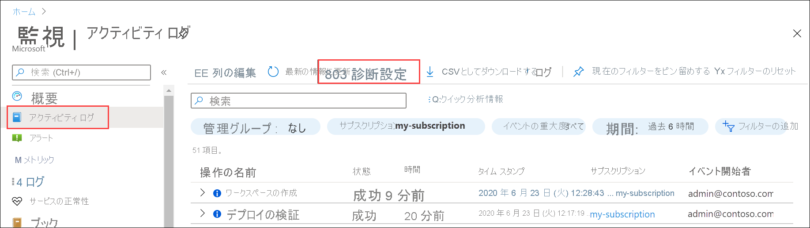
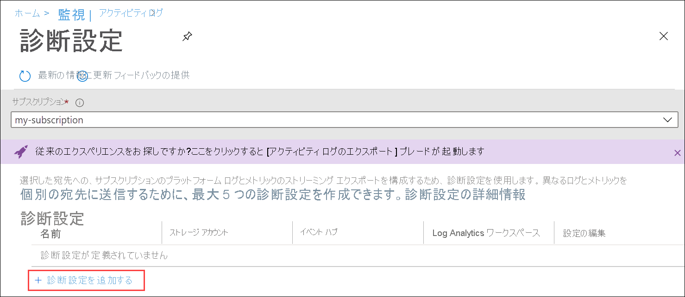
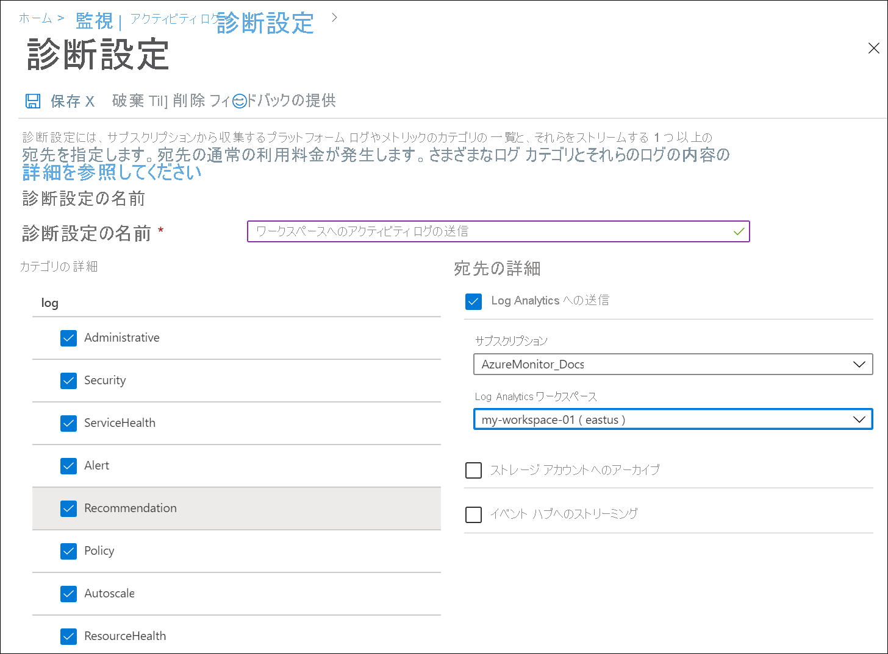
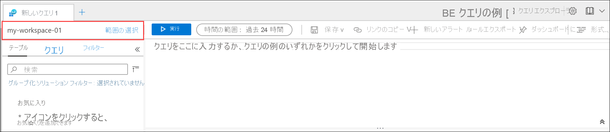

# Azure portal を使用して Azure アクティビティ ログを Log Analytics ワークスペースに送信する
アクティビティ ログは、Azure のプラットフォーム ログであり、サブスクリプション レベルのイベントの分析情報が提供されます。 これには、リソースが変更されたときや仮想マシンが起動されたときなどの情報が含まれます。 Azure portal でアクティビティ ログを表示したり、PowerShell と CLI を使用してエントリを取得したりできます。 このクイック スタートでは、Azure portal を使用して Log Analytics ワークスペースと診断設定を作成し、アクティビティ ログを Azure Monitor ログに送信して、[ログ クエリ](../logs/log-query-overview.md)を使って分析し、[ログ アラート](../alerts/alerts-log-query.md)や[ブック](../visualize/workbooks-overview.md)などの他の機能を有効にする方法について説明します。 

## Azure Portal にサインインする
Azure Portal [https://portal.azure.com](https://portal.azure.com) にサインインします。 

## Log Analytics ワークスペースの作成
Azure portal で、 **[Log Analytics ワークスペース]** を検索して選択します。 

![Azure portal のスクリーンショット。検索ボックスに「log analytics workspaces」と入力され、[Services]\(サービス\) の [Log Analytics workspaces]\(Log Analytics ワークスペース\) が強調表示されている。](../logs/media/quick-create-workspace/azure-portal-01.png)
  
**[追加]** をクリックし、 **[リソース グループ]** 、ワークスペースの **[名前]** 、 **[場所]** に値を指定します。 ワークスペース名は、すべての Azure サブスクリプションで一意である必要があります。

**[確認および作成]** をクリックして設定を見直し、 **[作成]** をクリックしてワークスペースを作成します。 これによって **従量課金制** という既定の価格レベルが選択され、課金対象となる量のデータを収集され始めるまでは何の料金も発生しません。 アクティビティ ログの収集に対する料金は発生しません。

## 診断設定の作成
Azure portal で、**モニター** を検索して選択します。 

![Azure portal のスクリーンショット。検索ボックスに「monitor」と入力され、[Services]\(サービス\) の [Monitor]\(モニター\) が強調表示されている。](media/quick-collect-activity-log/azure-portal-monitor.png)

**[アクティビティ ログ]** を選択します。 現在のサブスクリプションの最近のイベントが表示されるはずです。 **[診断設定]** をクリックすると、サブスクリプションの診断設定が表示されます。

**[診断設定を追加する]** をクリックし、新しい設定を作成します。 

「*Send Activity log to workspace*」のような名前を入力します。 各カテゴリを選択します。 唯一の送信先として **[Log Analytics への送信]** を選択し、作成したワークスペースを指定します。 **[保存]** をクリックして診断設定を作成し、ページを閉じます。

## ログ データの生成
新しいアクティビティ ログ エントリのみが Log Analytics ワークスペースに送信されるため、ご自分のサブスクリプションで、仮想マシンの起動または停止、別のリソースの作成や変更など、ログに記録されるいくつかの操作を行ってください。 診断設定が作成され、データが最初にワークスペースに書き込まれるまで、数分間待つ必要がある場合があります。 この待ち時間の後、アクティビティ ログに書き込まれたすべてのイベントが、数秒以内にワークスペースに送信されます。

## ログ クエリを使用したデータの取得

**Azure Monitor** のメニューで **[ログ]** を選択します。 **[Example queries]\(サンプル クエリ\)** ページを閉じます。 作成したワークスペースがスコープに設定されていない場合は、 **[スコープの選択]** をクリックしてそれを特定します。

クエリ ウィンドウで「`AzureActivity`」と入力し、 **[実行]** をクリックします。 これは、*AzureActivity* テーブル内のすべてのレコードが返される単純なクエリです。アクティビティ ログから送信されたすべてのレコードが含まれます。

レコードの 1 つを展開すると、詳細なプロパティが表示されます。

カテゴリ別に集計されたイベントの数を示す `AzureActivity | summarize count() by CategoryValue` など、より複雑なクエリを実行します。

## 次のステップ
このクイック スタートでは、Log Analytics ワークスペースに送信されるようにアクティビティ ログを構成しました。 これで、他のデータをワークスペースに収集するように構成して、Azure Monitor で[ログ クエリ](../logs/log-query-overview.md)を使用してまとめて分析したり、[ログ アラート](../alerts/alerts-log-query.md)や[ブック](../visualize/workbooks-overview.md)などの機能を活用したりできます。 次に、Azure リソースから[リソース ログ](../essentials/resource-logs.md)を収集することをお勧めします。これはアクティビティ ログのデータを補完し、各リソース内で実行された操作の分析情報を提供するものです。

> [!div class="nextstepaction"]
> [Azure Monitor を使用してリソース ログを収集して分析する](../essentials/tutorial-resource-logs.md)