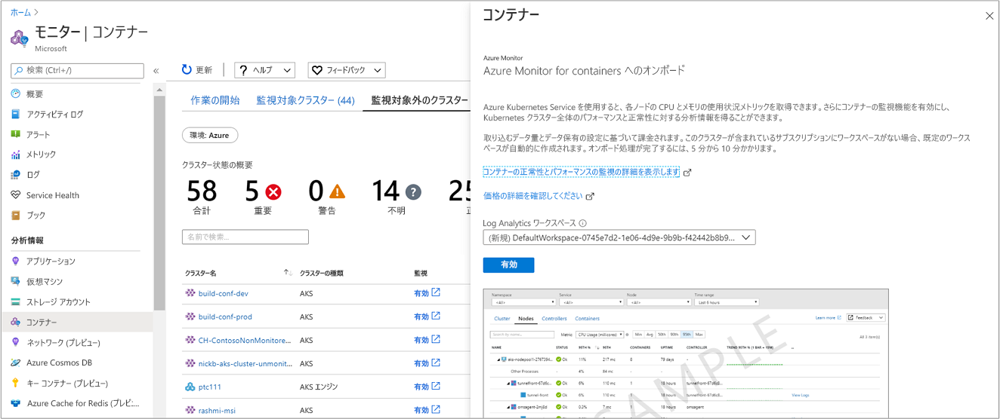

# <a name="how-to-onboard-azure-monitor-for-containers"></a>コンテナーに Azure Monitor をオンボードする方法  
この記事では、Kubernetes 環境にデプロイされ、[Azure Kubernetes Service](https://docs.microsoft.com/azure/aks/) 上でホストされているワークロードのパフォーマンスを監視するために、コンテナーに対して Azure Monitor を設定する方法について説明します。

次のサポートされている方法を使用して、新規または 1 つ以上の既存の AKS のデプロイに対してコンテナー用の Azure Monitor 有効にできます。

* Azure portal または Azure CLI から
* [Terraform と AKS](../../terraform/terraform-create-k8s-cluster-with-tf-and-aks.md) を使用して

## <a name="prerequisites"></a>前提条件 
始める前に、必ず以下のものを用意してください。

- Log Analytics ワークスペース。 新しい AKS クラスターの監視を有効にするときにワークスペースを作成すること、またはオンボード エクスペリエンスを使用して AKS クラスター サブスクリプションの既定のリソース グループに既定のワークスペースを作成することができます。 自分でワークスペースを作成する場合は、[Azure Resource Manager](../../azure-monitor/platform/template-workspace-configuration.md)、[PowerShell](https://docs.microsoft.com/azure/log-analytics/scripts/log-analytics-powershell-sample-create-workspace?toc=%2fpowershell%2fmodule%2ftoc.json)、[Azure portal](../../azure-monitor/learn/quick-create-workspace.md) のいずれかを使用して作成できます。
- コンテナーの監視を有効にするための Log Analytics 共同作成者ロールのメンバーであること。 Log Analytics ワークスペースへのアクセスを制御する方法の詳細については、「[ワークスペースを管理する](../../azure-monitor/platform/manage-access.md)」を参照してください。

[!INCLUDE [log-analytics-agent-note](../../../includes/log-analytics-agent-note.md)]

## <a name="components"></a>コンポーネント 

パフォーマンスを監視する能力は、コンテナーの Azure Monitor 用に特化して開発された、Linux 用のコンテナー化 Log Analytics エージェントに依存します。 この特殊なエージェントは、クラスター内のすべてのノードからパフォーマンスとイベント データを収集します。エージェントは自動的にデプロイされ、デプロイ時に指定した Log Analytics ワークスペースに登録されます。 このエージェントのバージョンは microsoft/oms:ciprod04202018 以降であり、*mmddyyyy* という形式の日付で表されます。 

エージェントの新しいバージョンがリリースされた場合でも、Azure Kubernetes Service (AKS) でホストされているマネージド Kubernetes クラスター上のエージェントが自動的にアップグレードされることはありません。 リリースされたバージョンを確認するには、[エージェントのリリースのお知らせ](https://github.com/microsoft/docker-provider/tree/ci_feature_prod)を参照してください。 

>[!NOTE] 
>AKS クラスターが既にデプロイされている場合は、この記事の後半で説明されているように、Azure CLI または提供されている Azure Resource Manager テンプレートを使用して、監視を有効にします。 `kubectl` を使用してアップグレード、エージェントを削除、再展開、または展開することはできません。 テンプレートはクラスターと同じリソース グループ内に展開する必要があります。

## <a name="sign-in-to-the-azure-portal"></a>Azure ポータルにサインインします。
[Azure Portal](https://portal.azure.com) にサインインします。 

## <a name="enable-monitoring-for-a-new-cluster"></a>新しいクラスターの監視を有効にする
新しい AKS クラスターのデプロイ時に、Azure portal、Azure CLI、または Terraform を使用して、そのクラスターの監視を有効にすることができます。  ポータルから有効にする場合は、クイック スタートの記事「[Azure Kubernetes Service (AKS) クラスターのデプロイ](../../aks/kubernetes-walkthrough-portal.md)」の手順に従ってください。 **[監視]** ページの **[監視を有効にする]** オプションで **[はい]** を選択して、既存の Log Analytics ワークスペースを選ぶか、新しく作成します。 

### <a name="enable-using-azure-cli"></a>Azure CLI を使用して有効にする
Azure CLI で作成した新しい AKS クラスターの監視を有効にするには、クイック スタート記事の「[AKS クラスターの作成](../../aks/kubernetes-walkthrough.md#create-aks-cluster)」セクションの手順に従ってください。  

>[!NOTE]
>Azure CLI を使用する場合は、まず、ローカルに CLI をインストールして使用する必要があります。 Azure CLI バージョン 2.0.43 以降を実行する必要があります。 ご利用のバージョンを識別するには、`az --version` を実行します。 Azure CLI をインストールまたはアップグレードする必要がある場合は、[Azure CLI のインストール](https://docs.microsoft.com/cli/azure/install-azure-cli)に関するページを参照してください。 
>

### <a name="enable-using-terraform"></a>Terraform を使用して有効にする
[Terraform を使用して新しい AKS クラスターをデプロイする場合](../../terraform/terraform-create-k8s-cluster-with-tf-and-aks.md)、既存のものを指定することを選択しない場合には、プロファイルに必要な引数を指定して [Log Analytics ワークスペースを作成します](https://www.terraform.io/docs/providers/azurerm/r/log_analytics_workspace.html)。 

>[!NOTE]
>Terraform を使用することを選択する場合、Terraform Azure RM プロバイダー バージョン 1.17.0 以降が実行されている必要があります。

コンテナーの Azure Monitor をワークスペースに追加する場合は、[azurerm_log_analytics_solution](https://www.terraform.io/docs/providers/azurerm/r/log_analytics_solution.html) を参照し、[**addon_profile**](https://www.terraform.io/docs/providers/azurerm/r/kubernetes_cluster.html#addon_profile) を含め、**oms_agent** を指定してプロファイルを完成させます。 

監視を有効にし、すべての構成タスクが正常に完了すると、次の 2 つの方法のいずれかを使用して、クラスターのパフォーマンスを監視することができます。

* 左側のウィンドウで **[正常性]** を選択し、AKS クラスターで直接監視します。
* 選択したクラスターの AKS クラスター ページで、**[Monitor Container insights]\(コンテナーの分析情報の監視\)** タイルを選択します。 Azure Monitor の左側のウィンドウにある **[正常性]** を選択します。 

  

監視を有効にした後、クラスターの正常性メトリックが表示されるまで、約 15 分かかる場合があります。 

## <a name="enable-monitoring-for-existing-managed-clusters"></a>既存のマネージド クラスターに対する監視を有効にする
既にデプロイされている AKS クラスターの監視を有効にするには、Azure CLI、ポータル、または提供されている Azure Resource Manager テンプレートで PowerShell コマンドレット `New-AzureRmResourceGroupDeployment` を使用します。 

### <a name="enable-monitoring-using-azure-cli"></a>Azure CLI を使用して監視を有効にする
Azure CLI を使用して AKS クラスターの監視を有効にするには、次の手順のようにします。 この例では、ワークスペースを事前に作成したり、既存のワークスペースを指定したりする必要はありません。 このコマンドでは、リージョンにワークスペースがまだ存在しない場合、AKS クラスター サブスクリプションの既定のリソース グループに既定のワークスペースが作成されるので、プロセスが簡単になります。  作成される既定のワークスペースは、*DefaultWorkspace-<GUID>-<Region>* のような形式になります。  

```azurecli
az aks enable-addons -a monitoring -n MyExistingManagedCluster -g MyExistingManagedClusterRG  
```

出力は次のようになります。

```azurecli
provisioningState       : Succeeded
```

既存のワークスペースと統合する方が望ましい場合は、次のコマンドを使用して、そのワークスペースを指定します。

```azurecli
az aks enable-addons -a monitoring -n MyExistingManagedCluster -g MyExistingManagedClusterRG --workspace-resource-id <ExistingWorkspaceResourceID> 
```

出力は次のようになります。

```azurecli
provisioningState       : Succeeded
```

### <a name="enable-monitoring-using-terraform"></a>Terraform を使用して監視を有効にする
1. **oms_agent** アドオン プロファイルを既存の [azurerm_kubernetes_cluster リソース](https://www.terraform.io/docs/providers/azurerm/d/kubernetes_cluster.html#addon_profile) に追加します。

   ```
   addon_profile {
    oms_agent {
      enabled                    = true
      log_analytics_workspace_id = "${azurerm_log_analytics_workspace.test.id}"
     }
   }
   ```

2. [azurerm_log_analytics_solution](https://www.terraform.io/docs/providers/azurerm/r/log_analytics_solution.html) を、Terraform のドキュメントに記載されている手順に従って追加します。

### <a name="enable-monitoring-from-azure-monitor"></a>Azure Monitor からの監視を有効にする
Azure portal で Azure Monitor からの AKS クラスターの監視を有効にするには、次のようにします。

1. Azure portal で、**[モニター]** を選択します。 
2. 一覧から **[コンテナー]** を選択します。
3. **[モニター - コンテナー]** ページで、**[Non-monitored clusters] (監視対象外のクラスター)** を選択します。
4. 監視対象外のクラスターの一覧でコンテナーを検索し、**[有効にする]** をクリックします。   
5. **[コンテナーの Azure Monitor へのオンボード]** ページにクラスターと同じサブスクリプションの既存の Log Analytics ワークスペースが存在する場合は、ドロップダウン リストから選択します。  
    このリストでは、サブスクリプションで AKS コンテナーがデプロイされている既定のワークスペースと場所が事前に選択されています。 

    

    >[!NOTE]
    >クラスターからの監視データを格納するための新しい Log Analytics ワークスペースを作成する場合は、[Log Analytics ワークスペースの作成](../../azure-monitor/learn/quick-create-workspace.md)に関する記事の手順に従います。 必ず、AKS コンテナーがデプロイされるのと同じサブスクリプションでワークスペースを作成してください。 
 
監視を有効にした後、クラスターの正常性メトリックが表示されるまで、約 15 分かかる場合があります。 

### <a name="enable-monitoring-from-aks-cluster-in-the-portal"></a>ポータルで AKS クラスターからの監視を有効にする
Azure Portal で AKS コンテナーの監視を有効にするには、次のようにします。

1. Azure Portal で **[すべてのサービス]** を選択します。 
2. リソースの一覧で、「**Containers**」と入力を開始します。  
    入力内容に基づいて、一覧がフィルター処理されます。 
3. **[Kubernetes サービス]** を選択します。  

    

4. コンテナーの一覧で、コンテナーを選択します。
5. コンテナーの概要ページで、**[コンテナーの監視]** を選択します。  
6. そのクラスターと同じサブスクリプションに既存の Log Analytics ワークスペースがある場合は、**[コンテナーの Azure Monitor へのオンボード]** ページのドロップダウン リストでそれを選択します。  
    このリストでは、サブスクリプションで AKS コンテナーがデプロイされている既定のワークスペースと場所が事前に選択されています。 

    

    >[!NOTE]
    >クラスターからの監視データを格納するための新しい Log Analytics ワークスペースを作成する場合は、「[Log Analytics ワークスペースの作成](../../azure-monitor/learn/quick-create-workspace.md)」の手順に従います。 必ず、AKS コンテナーがデプロイされるのと同じサブスクリプションでワークスペースを作成してください。 
 
監視を有効にした後、クラスターのオペレーショナル データが表示されるまで、約 15 分かかる場合があります。 

### <a name="enable-monitoring-by-using-an-azure-resource-manager-template"></a>Azure Resource Manager テンプレートを使用して監視を有効にする
この方法には、2 つの JSON テンプレートが含まれます。 1 つのテンプレートでは監視を有効にする構成が指定され、もう 1 つのテンプレートには、次を指定するために構成するパラメーター値が含まれています。

* AKS コンテナー リソース ID。 
* クラスターがデプロイされるリソース グループ。
* ワークスペースを作成する Log Analytics ワークスペースとリージョン。 

>[!NOTE]
>テンプレートはクラスターと同じリソース グループ内に展開する必要があります。
>

Log Analytics ワークスペースは、手動で作成する必要があります。 ワークスペースを作成するには、[Azure Resource Manager](../../azure-monitor/platform/template-workspace-configuration.md)、[PowerShell](https://docs.microsoft.com/azure/log-analytics/scripts/log-analytics-powershell-sample-create-workspace?toc=%2fpowershell%2fmodule%2ftoc.json)、[Azure portal](../../azure-monitor/learn/quick-create-workspace.md) のいずれかを使用して設定できます。

テンプレートを使用するリソースのデプロイの概念について馴染みがない場合は、以下を参照してください。
* [Resource Manager テンプレートと Azure PowerShell を使用したリソースのデプロイ](../../azure-resource-manager/resource-group-template-deploy.md)
* [Resource Manager テンプレートと Azure CLI を使用したリソースのデプロイ](../../azure-resource-manager/resource-group-template-deploy-cli.md)

Azure CLI を使用する場合は、まず、ローカルに CLI をインストールして使用する必要があります。 Azure CLI バージョン 2.0.27 以降を実行する必要があります。 ご利用のバージョンを識別するには、`az --version` を実行します。 Azure CLI をインストールまたはアップグレードする必要がある場合は、[Azure CLI のインストール](https://docs.microsoft.com/cli/azure/install-azure-cli)に関するページを参照してください。 

#### <a name="create-and-execute-a-template"></a>テンプレートを作成して実行する

1. 以下の JSON 構文をコピーして、ファイルに貼り付けます。

    ```json
    {
    "$schema": "https://schema.management.azure.com/schemas/2015-01-01/deploymentTemplate.json#",
    "contentVersion": "1.0.0.0",
    "parameters": {
      "aksResourceId": {
        "type": "string",
        "metadata": {
           "description": "AKS Cluster Resource ID"
           }
    },
    "aksResourceLocation": {
    "type": "string",
     "metadata": {
        "description": "Location of the AKS resource e.g. \"East US\""
       }
    },
    "workspaceResourceId": {
      "type": "string",
      "metadata": {
         "description": "Azure Monitor Log Analytics Resource ID"
       }
    },
    "workspaceRegion": {
    "type": "string",
    "metadata": {
       "description": "Azure Monitor Log Analytics workspace region"
      }
     }
    },
    "resources": [
      {
    "name": "[split(parameters('aksResourceId'),'/')[8]]",
    "type": "Microsoft.ContainerService/managedClusters",
    "location": "[parameters('aksResourceLocation')]",
    "apiVersion": "2018-03-31",
    "properties": {
      "mode": "Incremental",
      "id": "[parameters('aksResourceId')]",
      "addonProfiles": {
        "omsagent": {
          "enabled": true,
          "config": {
            "logAnalyticsWorkspaceResourceID": "[parameters('workspaceResourceId')]"
          }
         }
       }
      }
     },
    {
        "type": "Microsoft.Resources/deployments",
        "name": "[Concat('ContainerInsights', '-',  uniqueString(parameters('workspaceResourceId')))]", 
        "apiVersion": "2017-05-10",
        "subscriptionId": "[split(parameters('workspaceResourceId'),'/')[2]]",
        "resourceGroup": "[split(parameters('workspaceResourceId'),'/')[4]]",
        "properties": {
            "mode": "Incremental",
            "template": {
                "$schema": "https://schema.management.azure.com/schemas/2015-01-01/deploymentTemplate.json#",
                "contentVersion": "1.0.0.0",
                "parameters": {},
                "variables": {},
                "resources": [
                    {
                        "apiVersion": "2015-11-01-preview",
                        "type": "Microsoft.OperationsManagement/solutions",
                        "location": "[parameters('workspaceRegion')]",
                        "name": "[Concat('ContainerInsights', '(', split(parameters('workspaceResourceId'),'/')[8], ')')]",
                        "properties": {
                            "workspaceResourceId": "[parameters('workspaceResourceId')]"
                        },
                        "plan": {
                            "name": "[Concat('ContainerInsights', '(', split(parameters('workspaceResourceId'),'/')[8], ')')]",
                            "product": "[Concat('OMSGallery/', 'ContainerInsights')]",
                            "promotionCode": "",
                            "publisher": "Microsoft"
                        }
                    }
                ]
            },
            "parameters": {}
        }
       }
     ]
    }
    ```

2. このファイルを **existingClusterOnboarding.json** としてローカル フォルダーに保存します。
3. 以下の JSON 構文をファイルに貼り付けます。

    ```json
    {
       "$schema": "https://schema.management.azure.com/schemas/2015-01-01/deploymentParameters.json#",
       "contentVersion": "1.0.0.0",
       "parameters": {
         "aksResourceId": {
           "value": "/subscriptions/<SubscriptiopnId>/resourcegroups/<ResourceGroup>/providers/Microsoft.ContainerService/managedClusters/<ResourceName>"
       },
       "aksResourceLocation": {
         "value": "<aksClusterLocation>"
       },
       "workspaceResourceId": {
         "value": "/subscriptions/<SubscriptionId>/resourceGroups/<ResourceGroup>/providers/Microsoft.OperationalInsights/workspaces/<workspaceName>"
       },
       "workspaceRegion": {
         "value": "<workspaceLocation>"
       }
     }
    }
    ```

4. **aksResourceId** および **aksResourceLocation** の値を、AKS クラスターの **[AKS Overview]\(AKS 概要\)** ページの値を使用して編集します。 **workspaceResourceId** の値は、ワークスペース名を含む Log Analytics ワークスペースの完全なリソース ID です。 また、**workspaceRegion** にワークスペースの場所を指定します。 
5. このファイルを **existingClusterParam.json** としてローカル フォルダーに保存します。
6. これでこのテンプレートをデプロイする準備が整いました。 

    * テンプレートが含まれているフォルダーで、次の PowerShell コマンドを使用します。

        ```powershell
        New-AzureRmResourceGroupDeployment -Name OnboardCluster -ClusterResourceGroupName ClusterResourceGroupName -TemplateFile .\existingClusterOnboarding.json -TemplateParameterFile .\existingClusterParam.json
        ```
        設定の変更が完了するまで数分かかります。 完了すると、次のような結果を含むメッセージが表示されます。

        ```powershell
        provisioningState       : Succeeded
        ```

    * Azure CLI を使用して次のコマンドを実行するには、次の手順を実行します。
    
        ```azurecli
        az login
        az account set --subscription "Subscription Name"
        az group deployment create --resource-group <ResourceGroupName> --template-file ./existingClusterOnboarding.json --parameters @./existingClusterParam.json
        ```

        設定の変更が完了するまで数分かかります。 完了すると、次のような結果を含むメッセージが表示されます。

        ```azurecli
        provisioningState       : Succeeded
        ```
監視を有効にした後、クラスターの正常性メトリックが表示されるまで、約 15 分かかる場合があります。 

## <a name="verify-agent-and-solution-deployment"></a>エージェントとソリューションのデプロイを確認する
バージョン *06072018* 以降のエージェントでは、エージェントとソリューションの両方が正常にデプロイされていることを確認することができます。 これより前のバージョンのエージェントでは、エージェントのデプロイしか確認できません。

### <a name="agent-version-06072018-or-later"></a>エージェント バージョン 06072018 以降
エージェントが正常にデプロイされていることを確認するには、次のコマンドを実行します。 

```
kubectl get ds omsagent --namespace=kube-system
```

出力は次のようになり、適切にデプロイされたことが示されます。

```
User@aksuser:~$ kubectl get ds omsagent --namespace=kube-system 
NAME       DESIRED   CURRENT   READY     UP-TO-DATE   AVAILABLE   NODE SELECTOR                 AGE
omsagent   2         2         2         2            2           beta.kubernetes.io/os=linux   1d
```  

ソリューションのデプロイを確認するには、次のコマンドを実行します。

```
kubectl get deployment omsagent-rs -n=kube-system
```

出力は次のようになり、適切にデプロイされたことが示されます。

```
User@aksuser:~$ kubectl get deployment omsagent-rs -n=kube-system 
NAME       DESIRED   CURRENT   UP-TO-DATE   AVAILABLE    AGE
omsagent   1         1         1            1            3h
```

### <a name="agent-version-earlier-than-06072018"></a>06072018 より前のバージョンのエージェント

*06072018* より前にリリースされたバージョンの Log Analytics エージェントが適切にデプロイされていることを確認するには、次のコマンドを実行します。  

```
kubectl get ds omsagent --namespace=kube-system
```

出力は次のようになり、適切にデプロイされたことが示されます。  

```
User@aksuser:~$ kubectl get ds omsagent --namespace=kube-system 
NAME       DESIRED   CURRENT   READY     UP-TO-DATE   AVAILABLE   NODE SELECTOR                 AGE
omsagent   2         2         2         2            2           beta.kubernetes.io/os=linux   1d
```  

## <a name="view-configuration-with-cli"></a>CLI で構成を表示する
ソリューションが有効かどうか、Log Analytics ワークスペースのリソース ID、クラスターに関するサマリー詳細などの詳細を取得するには、`aks show` コマンドを使用します。  

```azurecli
az aks show -g <resoourceGroupofAKSCluster> -n <nameofAksCluster>
```

数分してコマンドが完了すると、ソリューションに関する情報が JSON 形式で表示されます。  コマンドの結果では監視アドオン プロファイルが表示され、次の出力例のようになります。

```
"addonProfiles": {
    "omsagent": {
      "config": {
        "logAnalyticsWorkspaceResourceID": "/subscriptions/<WorkspaceSubscription>/resourceGroups/<DefaultWorkspaceRG>/providers/Microsoft.OperationalInsights/workspaces/<defaultWorkspaceName>"
      },
      "enabled": true
    }
  }
```
## <a name="next-steps"></a>次の手順

* ソリューションのオンボードを試みた際に問題が発生した場合は、[トラブルシューティング ガイド](container-insights-troubleshoot.md)を確認してください。

* AKS クラスター ノードとポッドの両方について正常性メトリックを取得するための監視が有効になったので、これらの正常性メトリックを Azure portal で利用できます。 コンテナー用 Azure Monitor を使用する方法については、[Azure Kubernetes Service の正常性の表示](container-insights-analyze.md)に関するページをご覧ください。