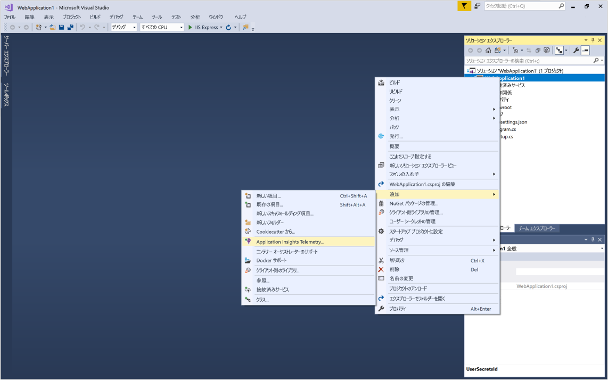
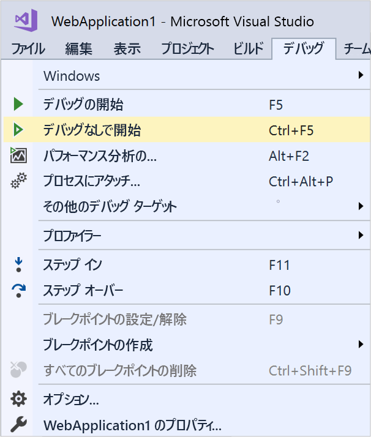
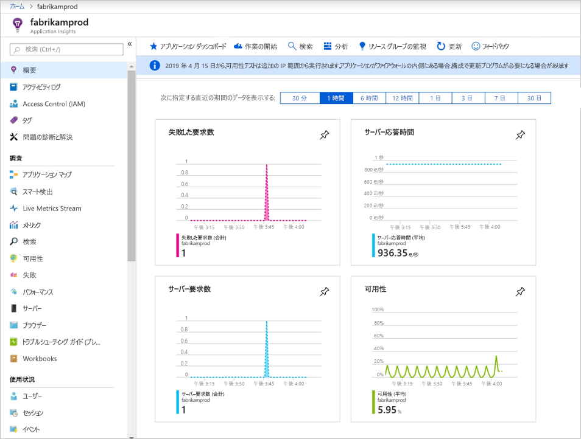
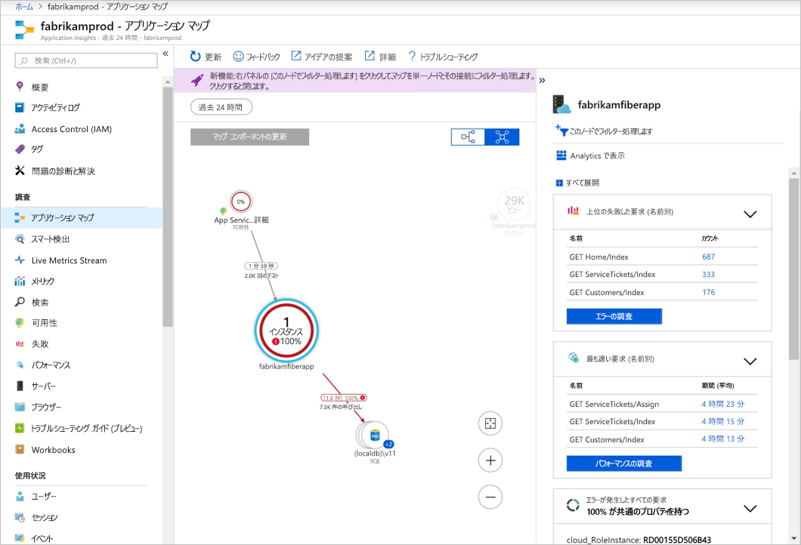
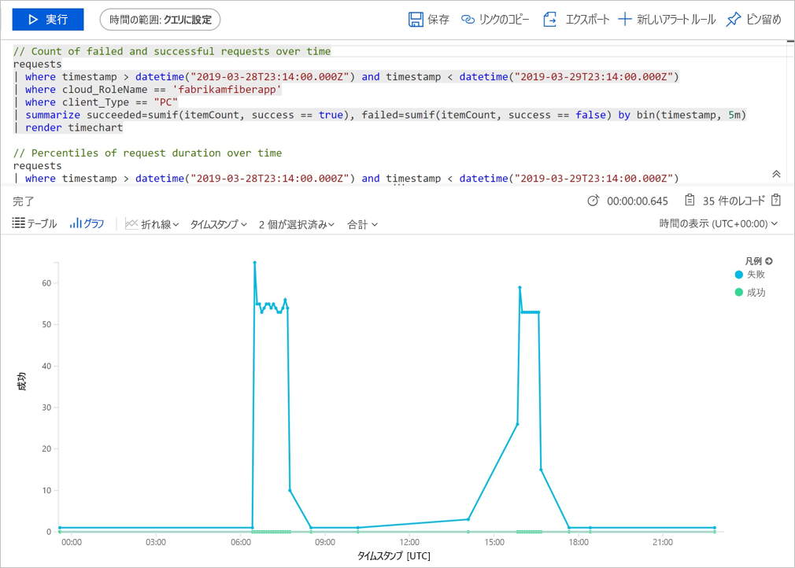
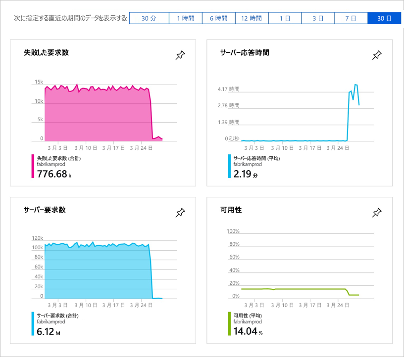

# ASP.NET Core Web アプリケーションの監視を開始する

Azure Application Insights を使うと、Web アプリケーションの可用性、パフォーマンス、利用状況を簡単に監視できます。 アプリケーションのエラーを、ユーザーからの報告を待つことなく、迅速に特定して診断することもできます。 

このクイック スタートでは、既存の ASP.NET Core Web アプリケーションに Application Insights SDK を追加する方法を説明します。 Visual Studio を使用せずに Application Insights を構成する方法については、こちらの[記事](https://docs.microsoft.com/azure/azure-monitor/app/asp-net-core)を参照してください。

## 前提条件

このクイック スタートを完了するには、以下が必要です。

- 次のワークロードを使って、[Visual Studio 2019 をインストール](https://visualstudio.microsoft.com/downloads/?utm_medium=microsoft&utm_source=docs.microsoft.com&utm_campaign=inline+link&utm_content=download+vs2019)します。
  - ASP.NET および Web の開発
  - Azure の開発
- [.NET Core 2.0 SDK のインストール](https://dotnet.microsoft.com/download)
- Azure サブスクリプションと既存の .NET Core Web アプリケーションが必要です。

ASP.NET Core Web アプリケーションがない場合は、ステップ バイ ステップ ガイドを使用して [ASP.NET Core アプリを作成し、Application Insights を追加](../../azure-monitor/app/asp-net-core.md)してください。

Azure サブスクリプションをお持ちでない場合は、開始する前に[無料](https://azure.microsoft.com/free/)アカウントを作成してください。

## Azure portal にサインインする

[Azure portal](https://portal.azure.com/) にサインインします。

## Application Insights を有効にする

Application Insights は、オンプレミスとクラウドのどちらで実行されているかに関係なく、インターネットに接続された任意のアプリケーションからテレメトリ データを収集できます。 このデータの表示を開始するには、次の手順を実行します。

1. **[リソースの作成]**  >  **[開発者ツール]**  >  **[Application Insights]** の順に選択します。

   > [!NOTE]
   >Application Insights リソースを初めて作成する場合は、「[Application Insights リソースの作成](https://docs.microsoft.com/azure/azure-monitor/app/create-new-resource)」のドキュメントにアクセスして詳細を確認できます。

    構成ボックスが表示されたら、次の表を使用して入力フィールドに入力します。

   | 設定        |  Value           | 説明  |
   | ------------- |:-------------|:-----|
   | **名前**      | グローバルに一意の値 | 監視しているアプリを識別する名前 |
   | **リソース グループ**     | myResourceGroup      | App Insights データをホストする新しいリソース グループの名前。 新しいリソース グループを作成するか、既存のリソース グループを使用することができます。 |
   | **場所** | 米国東部 | 近くにある場所か、アプリがホストされている場所の近くを選択します。 |

2. **Create** をクリックしてください。

## App Insights SDK を構成する

1. Visual Studio で ASP.NET Core Web アプリ **プロジェクト**を開き、**ソリューション エクスプローラー**で AppName を右クリックして **[追加]**  >  **[Application Insights Telemetry]** を選択します。

    

2. **[作業の開始]** をクリックします

3. アカウントとサブスクリプションを選択します。Azure portal で作成した**既存のリソース**を選択し、 **[登録]** をクリックします。

4. **[プロジェクト]**  >  **[NuGet パッケージの管理]**  >  **[パッケージ ソース: nuget.org]**  >  **[更新]** の順に選択して、Application Insights SDK パッケージを最新の安定版リリースに更新します。

5. **[デバッグ]**  >  **[Start without Debugging (デバッグなしで開始)]** (Ctrl+F5) を選択して、アプリを起動します。

    

> [!NOTE]
> データがポータルに表示されるようになるまで、3 ～ 5 分かかります。 このアプリがトラフィックの少ないテスト アプリである場合、ほとんどのメトリックはアクティブな要求や操作がある場合にのみキャプチャされることに留意してください。

## Azure Portal で監視を開始する

1. Azure portal で **[ホーム]** を選択して Application Insights の **[概要]** ページを再度開き、[最近のリソース] で以前に作成したリソースを選択して、現在実行中のアプリケーションに関する詳細を表示します。

   

2. **[アプリケーション マップ]** をクリックして、アプリケーション コンポーネント間の依存関係の視覚的レイアウトを取得します。 各コンポーネントには、負荷、パフォーマンス、障害、アラートなどの KPI が表示されます。

   

3. **[アプリ分析]** アイコン ![[アプリケーション マップ] アイコン](./media/dotnetcore-quick-start/006.png) **[Analytics 内のビュー]** をクリックします。 これにより、Application Insights で収集されたすべてのデータを分析するための豊富なクエリ言語を備えた **Application Insights 分析**が開きます。 この場合は、要求の数をグラフとして描画するクエリが生成されます。 自分でクエリを作成して他のデータを分析することができます。

   

4. **[概要]** ページに戻って KPI ダッシュボードを観察します。  このダッシュ ボードでは、着信要求の数、要求の期間、発生したエラーなど、アプリケーションの正常性に関する統計情報が提供されます。 

   

5. 左側の **[メトリック]** をクリックします。 メトリックス エクスプローラーを使用して、ご利用のソースの正常性と使用率を調べます。 **[Add new chart (新しいグラフを追加)]** をクリックして追加のカスタム ビューを作成したり、 **[編集]** を選択して既存のグラフの種類、高さ、カラー パレット、グループ化、およびメトリックを変更したりできます。 たとえば、メトリックのドロップダウンの [ブラウザーのページ読み込み時間] を選択し、集計から [平均] を選択することで、ブラウザーの平均ページ読み込み時間を表示するグラフを作成できます。 Azure メトリックス エクスプローラーの詳細については、「[Azure メトリックス エクスプローラーの概要](../../azure-monitor/platform/metrics-getting-started.md)」を参照してください。

     ![[メトリック] タブ: ブラウザーの平均ページ読み込み時間のグラフ](./media/dotnetcore-quick-start/8metrics.png)

## ビデオ

- 最初から [.NET Core と Visual Studio を使って Application Insights を構成する](https://www.youtube.com/watch?v=NoS9UhcR4gA&t)手順に関するステップ バイ ステップの外部ビデオ。
- 最初から [.NET Core と Visual Studio Code を使って Application Insights を構成する](https://youtu.be/ygGt84GDync)手順に関するステップ バイ ステップの外部ビデオ。

## リソースをクリーンアップする
テストが完了したら、リソース グループとすべての関連リソースを削除できます。 これを行うには、次の手順に従います。

> [!NOTE]
> 既存のリソース グループを使用した場合、以下の手順ではうまくいきません。個々の Application Insights リソースを削除する必要があります。 リソース グループを削除すると、そのグループに属している内在するリソースがすべて削除されるので注意してください。

1. Azure Portal の左側のメニューから、 **[リソース グループ]** 、 **[myResourceGroup]** の順にクリックします。
2. リソース グループのページで **[削除]** をクリックし、テキスト ボックスに「**myResourceGroup**」と入力してから **[削除]** をクリックします。

## 次のステップ

> [!div class="nextstepaction"]
> [実行時の例外の特定と診断](https://docs.microsoft.com/azure/application-insights/app-insights-tutorial-runtime-exceptions)
