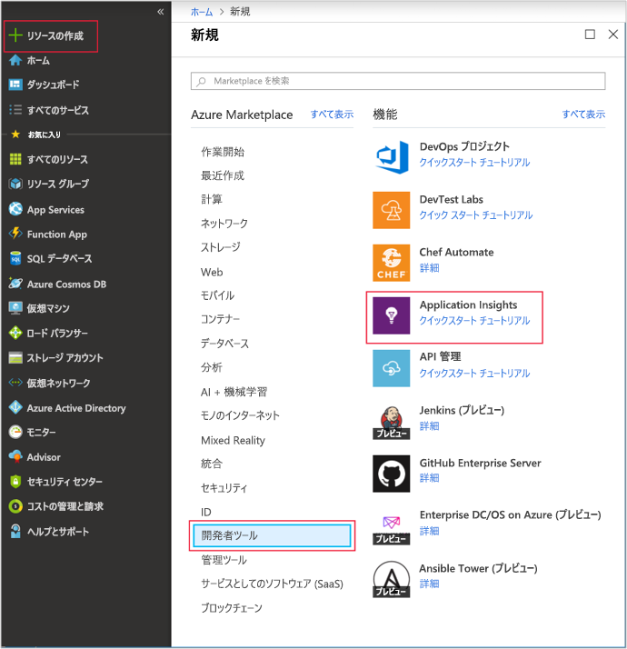
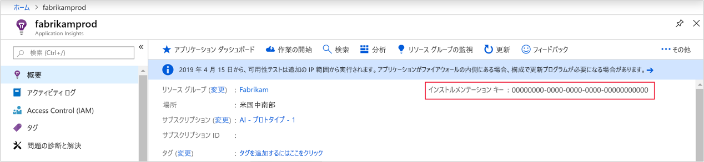
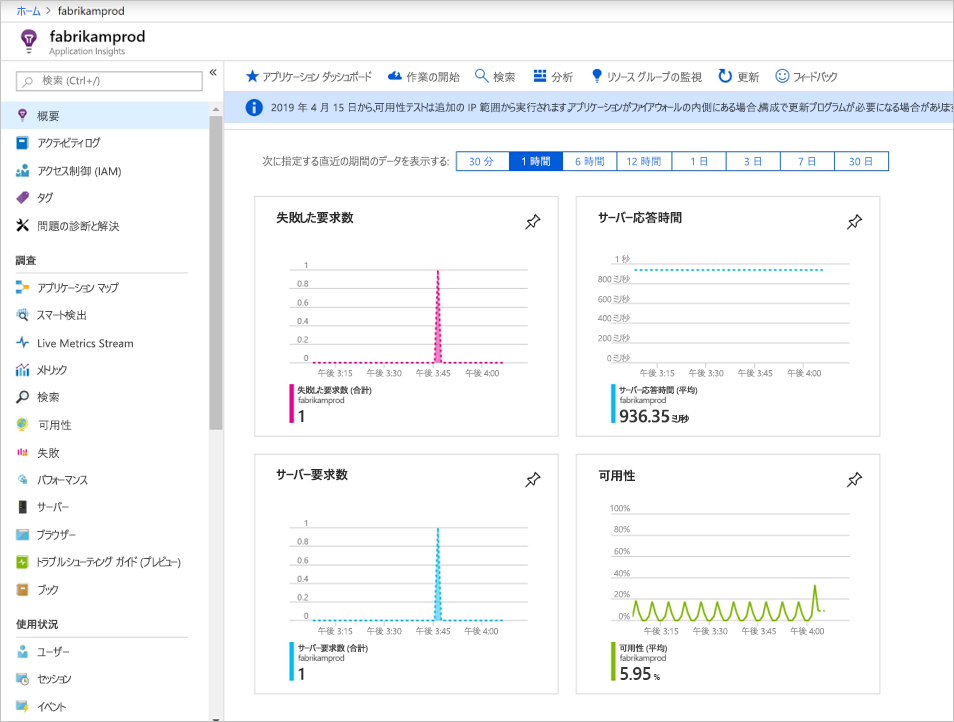
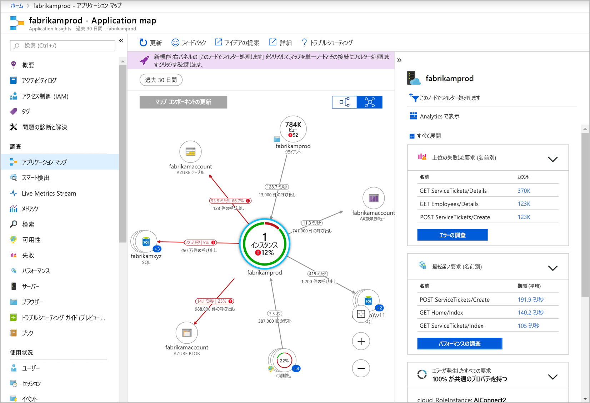
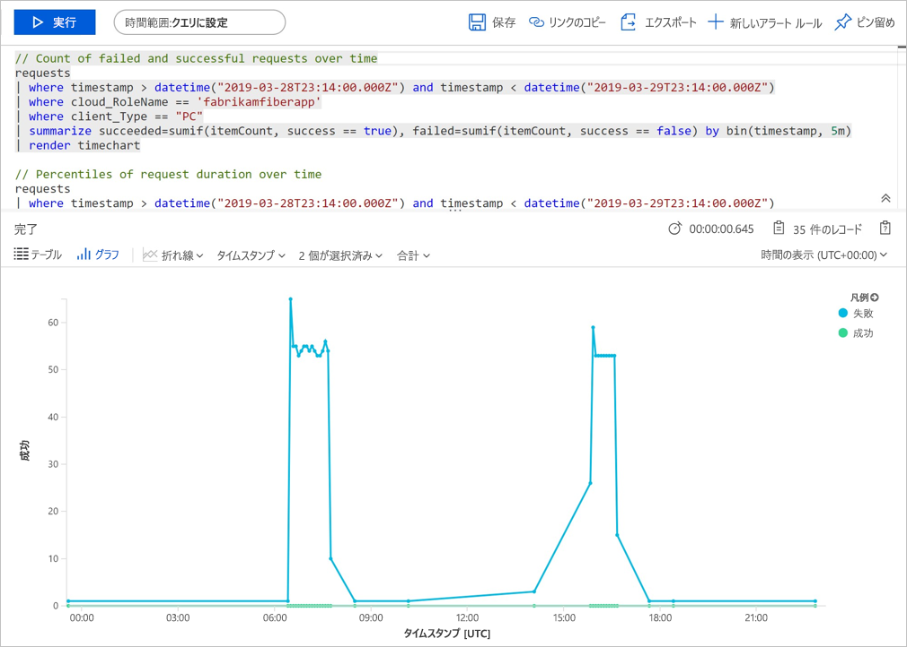
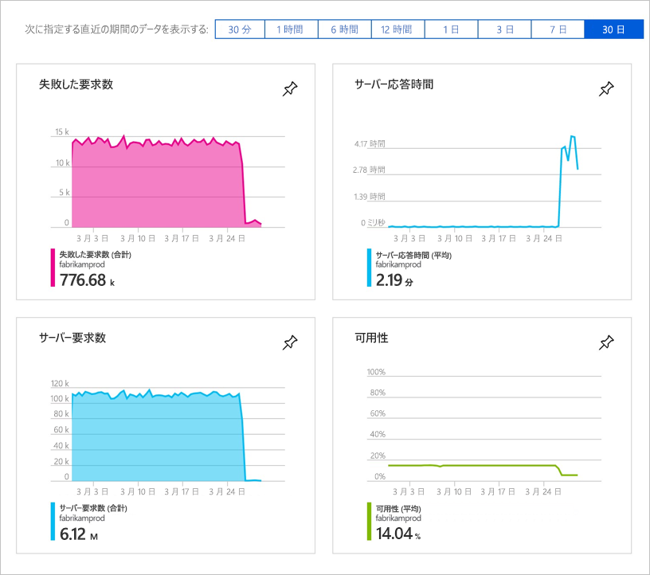
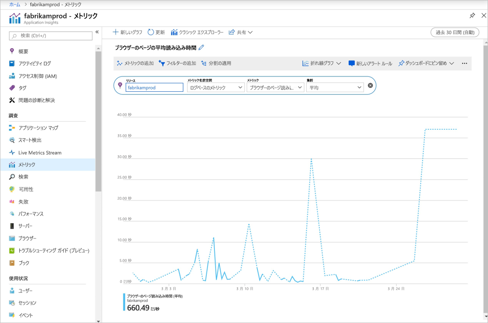

# <a name="quickstart-start-monitoring-your-nodejs-web-application-with-azure-application-insights"></a>クイック スタート:Azure Application Insights で Node.js Web アプリケーションの監視を開始する

このクイックスタートでは、バージョン 0.22 の Application Insights SDK for Node.js を既存の Node.js Web アプリケーションに追加します。

Azure Application Insights を使うと、Web アプリケーションの可用性、パフォーマンス、利用状況を簡単に監視できます。 アプリケーションのエラーを、ユーザーからの報告を待つことなく、迅速に特定して診断することもできます。 バージョン 0.20 以降の SDK リリースでは、MongoDB、MySQL、Redis を含む一般的なサードパーティ製パッケージを監視できます。

## <a name="prerequisites"></a>前提条件

* アクティブなサブスクリプションが含まれる Azure アカウント。 [無料でアカウントを作成できます](https://azure.microsoft.com/free/?ref=microsoft.com&utm_source=microsoft.com&utm_medium=docs&utm_campaign=visualstudio)。
* 正常に機能する Node.js アプリケーション。

## <a name="enable-application-insights"></a>Application Insights を有効にする

Application Insights は、オンプレミスとクラウドのどちらで実行されているかに関係なく、インターネットに接続された任意のアプリケーションからテレメトリ データを収集できます。 このデータの表示を開始するには、次の手順を実行します。

1. [Azure portal](https://portal.azure.com/) にサインインします。

2. **[リソースの作成]**  >  **[開発者ツール]**  >  **[Application Insights]** の順に選択します。

   

   > [!NOTE]
   >Application Insights リソースを初めて作成する場合は、「[Application Insights リソースの作成](https://docs.microsoft.com/azure/azure-monitor/app/create-new-resource)」のドキュメントにアクセスして詳細を確認できます。

   構成ページが表示されたら、次の表を使用して入力フィールドに入力します。 

    | 設定        | Value           | 説明  |
   | ------------- |:-------------|:-----|
   | **名前**      | グローバルに一意の値 | 監視しているアプリを識別する名前。 |
   | **リソース グループ**     | myResourceGroup      | AppInsights データをホストする新しいリソース グループの名前。 新しいリソース グループを作成するか、既存のリソース グループを使用することができます。 |
   | **場所** | 米国東部 | 近くにある場所か、アプリがホストされている場所の近くを選択します。 |

3. **［作成］** を選択します

## <a name="configure-appinsights-sdk"></a>AppInsights SDK を構成する

1. **[概要]** を選択し、アプリケーションの**インストルメンテーション キー**をコピーします。

   

2. Application Insights SDK for Node.js をアプリケーションに追加します。 アプリのルート フォルダーから次のものを実行します。

   ```bash
   npm install applicationinsights --save
   ```

3. アプリの最初の *.js* ファイルを編集し、スクリプトの最上部の下に 2 つの行を追加します。 [Node.js のクイックスタート アプリ](https://docs.microsoft.com/azure/app-service/app-service-web-get-started-nodejs)を使用している場合は、*index.js* ファイルを変更します。 `<instrumentation_key>` をアプリケーションのインストルメンテーション キーに置き換えます。 

   ```JavaScript
   const appInsights = require('applicationinsights');
   appInsights.setup('<instrumentation_key>').start();
   ```

4. アプリを再起動します。

> [!NOTE]
> データがポータルに表示されるようになるまで、3 ～ 5 分かかります。 このアプリがトラフィックの少ないテスト アプリである場合、ほとんどのメトリックはアクティブな要求や操作が発生している場合にのみキャプチャされることに留意してください。

## <a name="start-monitoring-in-the-azure-portal"></a>Azure Portal で監視を開始する

1. Azure Portal で、インストルメンテーション キーを取得した Application Insights の**概要**ページを再度開き、現在実行中のアプリケーションに関する詳細情報を表示できます。

   

2. **[アプリケーション マップ]** を選択し、アプリケーション コンポーネント間の依存関係の視覚的レイアウトを取得します。 各コンポーネントには、負荷、パフォーマンス、障害、アラートなどの KPI が表示されます。

   

3. **[アプリ分析]** アイコン ![[アプリケーション マップ] アイコン](./media/nodejs-quick-start/azure-app-insights-analytics-icon.png) **[Analytics 内のビュー]** を選択します。  この操作により、Application Insights で収集されたすべてのデータを分析するための豊富なクエリ言語を備えた **Application Insights 分析**が開きます。 この場合は、要求の数をグラフとして描画するクエリが生成されます。 自分でクエリを作成して他のデータを分析することができます。

   

4. **[概要]** ページに戻って KPI グラフを観察します。  このダッシュ ボードでは、着信要求の数、要求の期間、発生したエラーなど、アプリケーションの正常性に関する統計情報が提供されます。

   

   **[ページ ビューの読み込み時間]** グラフに**クライアント側のテレメトリ** データを入力できるようにするには、このスクリプトを追跡する各ページに追加します。

   ```HTML
   <!-- 
   To collect user behavior analytics tools about your application, 
   insert the following script into each page you want to track.
   Place this code immediately before the closing </head> tag,
   and before any other scripts. Your first data will appear 
   automatically in just a few seconds.
   -->
   <script type="text/javascript">
     var appInsights=window.appInsights||function(config){
       function i(config){t[config]=function(){var i=arguments;t.queue.push(function(){t[config].apply(t,i)})}}var t={config:config},u=document,e=window,o="script",s="AuthenticatedUserContext",h="start",c="stop",l="Track",a=l+"Event",v=l+"Page",y=u.createElement(o),r,f;y.src=config.url||"https://az416426.vo.msecnd.net/scripts/a/ai.0.js";u.getElementsByTagName(o)[0].parentNode.appendChild(y);try{t.cookie=u.cookie}catch(p){}for(t.queue=[],t.version="1.0",r=["Event","Exception","Metric","PageView","Trace","Dependency"];r.length;)i("track"+r.pop());return i("set"+s),i("clear"+s),i(h+a),i(c+a),i(h+v),i(c+v),i("flush"),config.disableExceptionTracking||(r="onerror",i("_"+r),f=e[r],e[r]=function(config,i,u,e,o){var s=f&&f(config,i,u,e,o);return s!==!0&&t["_"+r](config,i,u,e,o),s}),t
       }({
           instrumentationKey:"<insert instrumentation key>"
       });
       
       window.appInsights=appInsights;
       appInsights.trackPageView();
   </script>
   ```

5. 左側で、 **[メトリック]** を選択します。 メトリックス エクスプローラーを使用して、ご利用のソースの正常性と使用率を調べます。 **[Add new chart (新しいグラフを追加)]** を選択して追加のカスタム ビューを作成したり、 **[編集]** を選択して既存のグラフの種類、高さ、カラー パレット、グループ化、メトリックを変更したりできます。 たとえば、メトリックのドロップダウンの [ブラウザーのページ読み込み時間] を選択し、集計から [平均] を選択することで、ブラウザーの平均ページ読み込み時間を表示するグラフを作成できます。 Azure メトリックス エクスプローラーの詳細については、「[Azure メトリックス エクスプローラーの概要](../../azure-monitor/platform/metrics-getting-started.md)」を参照してください。

   

Node.js の監視に関する詳細については、[AppInsights Node.js の追加ドキュメント](../../azure-monitor/app/nodejs.md)を参照してください。

## <a name="clean-up-resources"></a>リソースをクリーンアップする

テストが完了したら、リソース グループとすべての関連リソースを削除できます。 これを行うには、次の手順に従います。

> [!NOTE]
> 既存のリソース グループを使用した場合、以下の手順ではうまくいきません。個々の Application Insights リソースを削除する必要があります。 リソース グループを削除すると、そのグループに属している内在するリソースがすべて削除されるので注意してください。

1. Azure portal の左側のメニューで、 **[リソース グループ]** 、 **[myResourceGroup]** の順に選択します。
2. リソース グループのページで **[削除]** を選択し、テキスト ボックスに「**myResourceGroup**」と入力してから **[削除]** を選択します。

## <a name="next-steps"></a>次のステップ

> [!div class="nextstepaction"]
> [パフォーマンスの問題の特定と診断](https://docs.microsoft.com/azure/application-insights/app-insights-analytics)
