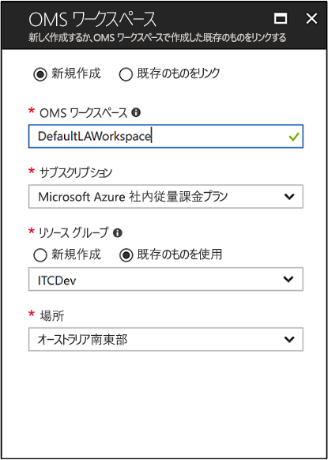
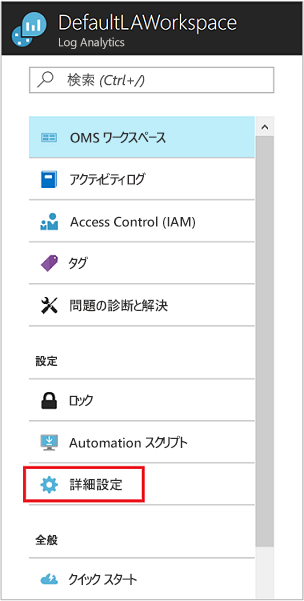
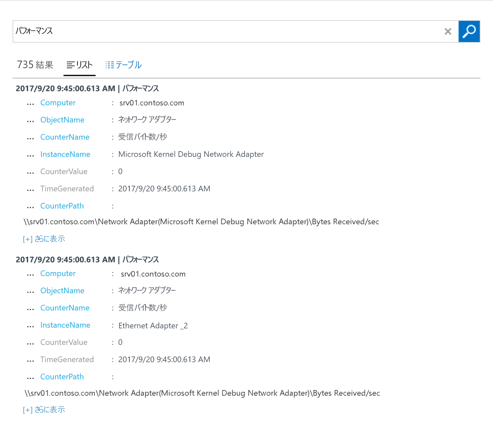
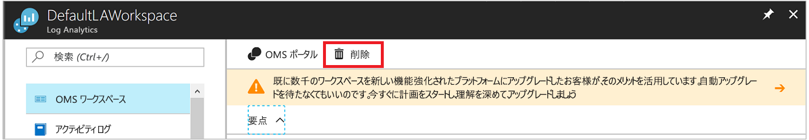

# ハイブリッド環境の Windows コンピューターを対象とした Log Analytics エージェントの構成
[Azure Log Analytics](../../azure-monitor/platform/agent-windows.md) は、詳細な分析と相関のために、物理的または仮想的な Windows コンピューターから直接データを 1 つのリポジトリに収集することができます。 Log Analytics は、データセンターまたは他のクラウド環境からデータを収集できます。 このクイック スタートでは、いくつかの簡単な手順で、Windows コンピューターを構成し、データを収集する方法を示します。  Azure Windows VM の詳細については、「[Azure Virtual Machines に関するデータの収集](../../azure-monitor/learn/quick-collect-azurevm.md)」を参照してください。  

サポートされている構成を確認するには、「[サポートされている Windows オペレーティング システム](../../azure-monitor/platform/log-analytics-agent.md#supported-windows-operating-systems)」と「[ネットワーク ファイアウォールの構成](../../azure-monitor/platform/log-analytics-agent.md#network-firewall-requirements)」を参照してください。
 
Azure サブスクリプションをお持ちでない場合は、開始する前に [無料アカウント](https://azure.microsoft.com/free/?WT.mc_id=A261C142F) を作成してください。

## Azure portal にサインインします
Azure Portal ([https://portal.azure.com](https://portal.azure.com)) にサインインします。

## ワークスペースの作成
1. Azure Portal で **[すべてのサービス]** を選択します。 検索ボックスに「**Log Analytics**」と入力します。 入力すると、入力内容に基づいて一覧がフィルター処理されます。 **[Log Analytics]** を選択します。

    
  
2. **[作成]** を選択してから、次の詳細を入力します。

   * 新しい **Log Analytics ワークスペース**の名前を入力します。 **DefaultLAWorkspace** のようにします。
   * リンク先の **[サブスクリプション]** を選択します。 既定のものが使用したいものと異なる場合、リストから別のものを選択します。
   * **[リソース グループ]** では、1 つ以上の Azure Virtual Machines を含む既存のリソース グループを選択します。  
   * VM のデプロイ先となる**場所**を選択します。 次に示すのは、[Log Analytics が利用可能な地域](https://azure.microsoft.com/regions/services/)の一覧です。  
   * 2018 年 4 月 2 日よりも後に作成したサブスクリプションでワークスペースを作成している場合、そのワークスペースは自動的に **1 GB あたり**の料金プランを使用します。 価格レベルを選択することはできません。 2018 年 4 月 2 日より前に作成したサブスクリプション、または既存の EA 登録に関連付けられたサブスクリプションのワークスペースを作成している場合、使用する価格レベルを選択します。 レベルについては、[Log Analytics の料金の詳細](https://azure.microsoft.com/pricing/details/log-analytics/)に関する記事を参照してください。

           

3. **[Log Analytics ワークスペース]** ウィンドウで必要な情報を入力したら、 **[OK]** を選択します。  

情報が検証され、ワークスペースが作成されている間、メニューの **[通知]** でその進行状況を追跡することができます。

## ワークスペース ID とキーを入手する
Microsoft Monitoring Agent for Windows をインストールする前に、Log Analytics ワークスペースのワークスペース ID とキーが必要です。 この情報は、設定ウィザードでエージェントを適切に構成し、そのエージェントが Log Analytics と通信できるようにするために必要です。  

1. Azure portal の左上隅にある **[すべてのサービス]** を選択します。 検索ボックスに「**Log Analytics**」と入力します。 入力すると、入力内容に基づいて一覧がフィルター処理されます。 **[Log Analytics]** を選択します。
2. Log Analytics ワークスペースの一覧で、前の手順で作成したワークスペースを選択します。 (**DefaultLAWorkspace** という名前を付けた可能性があります。)
3. **[詳細設定]** を選択します。

    
  
4. **[接続されたソース]** 、 **[Windows サーバー]** の順に選択します。
5. **[ワークスペース ID]** と **[主キー]** の右側の値をコピーします。 任意のエディターに貼り付けます。

## Windows 用エージェントをインストールする
次の手順では、Azure および Azure Government で Log Analytics 用のエージェントをインストールして構成します。 Microsoft Monitoring Agent のセットアップ プログラムを使用して、コンピューターにエージェントをインストールします。

1. 前の一連の手順からの続きとして、 **[Windows サーバー]** ページで、ダウンロードするバージョンの **[Windows エージェントのダウンロード]** を選択します。 お使いの Windows オペレーティング システムのプロセッサ アーキテクチャに適したバージョンを選択します。
2. セットアップを実行して、コンピューターにエージェントをインストールします。
2. **[ようこそ]** ページで **[次へ]** をクリックします。
3. **[ライセンス条項]** ページの記述内容を確認し、 **[同意する]** を選択します。
4. **[インストール先フォルダー]** ページで、既定のインストール フォルダーを変更するか、そのまま使用して、 **[次へ]** を選択します。
5. **[エージェントのセットアップ オプション]** ページで、エージェントを Azure Log Analytics に接続し、 **[次へ]** を選択します。
6. **[Azure Log Analytics]** ページで、次の手順を完了します。
   1. **[ワークスペース ID]** と **[ワークスペース キー (主キー)]** に、先ほどコピーした値を貼り付けます。 コンピューターが Azure Government 内の Log Analytics ワークスペースにレポートする必要がある場合は、 **[Azure クラウド]** リストで **[Azure US Government]** を選択します。  
   2. コンピューターがプロキシ サーバーを介して Log Analytics サービスと通信する必要がある場合は、 **[詳細]** を選択し、プロキシ サーバーの URL とポート番号を指定します。 プロキシ サーバーで認証が必要な場合には、プロキシ サーバーとの認証用のユーザー名とパスワードを入力し、 **[次へ]** を選択します。  
7. 構成設定を追加したら、 **[次へ]** を選択します。

    

8. **[インストールの準備完了]** ページで、設定内容を確認し、 **[インストール]** を選択します。
9. **[構成は正常に終了しました]** ページで **[完了]** を選択します。

インストールとセットアップが完了したら、コントロール パネルに [Microsoft Monitoring Agent] が表示されます。 構成を検証して、エージェントが Log Analytics に接続されていることを確認できます。 接続時に、 **[Azure ログ分析]** タブで、エージェントに次のメッセージが表示されます。**Microsoft Monitoring Agent は、Microsoft ログ分析サービスに正常に接続されています。**   

## イベントとパフォーマンス データを収集する
Log Analytics は、指定されたイベントを Windows イベント ログから、また長期分析とレポートのためのパフォーマンス カウンターから収集できます。 特定の条件を検出したときにアクションを実行することもできます。 以下の手順に従って、Windows イベント ログと、手始めとしていくつかの一般的なパフォーマンス カウンターからのイベントの収集を構成します。  

1. Azure portal の左下隅にある **[その他のサービス]** を選択します。 検索ボックスに「**Log Analytics**」と入力します。 入力すると、入力内容に基づいて一覧がフィルター処理されます。 **[Log Analytics]** を選択します。
2. **[詳細設定]** を選択します。

    
 
3. **[データ]** を選択してから、 **[Windows イベント ログ]** を選択します。  
4. イベント ログを追加するには、ログの名前を入力します。 「**System**」と入力し、プラス記号 ( **+** ) を選択します。  
5. テーブルで、 **[エラー]** と **[警告]** の重大度を選択します。
6. ページの最上部で **[保存]** を選択します。
7. **[Windows パフォーマンス カウンター]** を選択して、Windows コンピューターでのパフォーマンス カウンターの収集を有効にします。
8. 新しい Log Analytics ワークスペースの Windows パフォーマンス カウンターを初めて構成する場合は、いくつかの一般的なカウンターをすばやく作成するためのオプションが表示されます。 各オプションが一覧表示され、その横にチェック ボックスがあります。

    。
    
    **[選択したパフォーマンス カウンターを追加する]** を選択します。 カウンターが追加され、10 秒間の収集サンプル間隔でプリセットされます。

9. ページの最上部で **[保存]** を選択します。

## 収集したデータを表示する
これでデータ収集は有効になりました。次は、簡単なログ検索を実行して、ターゲット コンピューターのデータを表示してみましょう。  

1. Azure portal で、選択したワークスペースの **[ログ]** タイルを選択します。  
2. **[Log Search]\(ログ検索\)** ウィンドウのクエリ ボックスに「**Perf**」と入力し、クエリ ボックスの上部にある **[実行]** をクリックします。
 
    

    たとえば、次の画像のクエリでは、735 個のパフォーマンス レコードが返されています。

    

## リソースのクリーンアップ
不要になった場合、コンピューターからエージェントを削除し、Log Analytics ワークスペースを削除できます。  

エージェントを削除するには、次の手順を完了します。

1. [コントロール パネル] を開きます。
2. **[プログラムと機能]** を開きます。
3. **[プログラムと機能]** で、 **[Microsoft Monitoring Agent]** をクリックし、 **[アンインストール]** を選択します。

以前に作成した Log Analytics ワークスペースを削除するには、それを選択し、リソース ページで **[削除]** を選択します。

## 次の手順
これで Windows コンピューターからオペレーション データとパフォーマンス データが収集されているので、収集したデータの調査と分析、およびデータに対するアクションの実行を*無料*で簡単に開始することができます。  

データの表示および分析方法を学習する場合は、次のチュートリアルに進んでください。

> [!div class="nextstepaction"]
> [Log Analytics でのデータの表示と分析](tutorial-viewdata.md)
