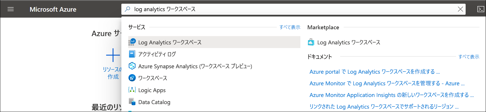

# Azure ポータルで Log Analytics ワークスペースを作成する
Azure portal で、 **[Log Analytics ワークスペース]** メニューを使用して、Log Analytics ワークスペースを作成します。 Log Analytics ワークスペースは、Azure Monitor ログ データ用の一意の環境です。 各ワークスペースには、独自のデータ リポジトリと構成があり、データ ソースとソリューションは、特定のワークスペースにデータを格納するように構成されます。 次のソースからデータを収集しようとする場合、Log Analytics ワークスペースが必要です。

* サブスクリプション内の Azure リソース
* System Center Operations Manager によって監視されているオンプレミスのコンピューター
* Configuration Manager のデバイス コレクション 
* Azure ストレージからの診断またはログ データ

環境内の Azure VM、Windows VM、Linux VM などの他のソースについては、次のトピックを参照してください。

*  [Azure Virtual Machines に関するデータの収集](../learn/quick-collect-azurevm.md) 
*  [ハイブリッド Linux コンピューターからのデータの収集](../learn/quick-collect-linux-computer.md)
*  [ハイブリッド Windows コンピューターからのデータの収集](quick-collect-windows-computer.md)

Azure サブスクリプションをお持ちでない場合は、開始する前に [無料アカウント](https://azure.microsoft.com/free/?WT.mc_id=A261C142F) を作成してください。

## Azure Portal にサインインする
Azure Portal [https://portal.azure.com](https://portal.azure.com) にサインインします。 

## ワークスペースの作成
1. Azure Portal で、 **[すべてのサービス]** をクリックします。 リソースの一覧で、「**Log Analytics**」と入力します。 入力を始めると、入力内容に基づいて、一覧がフィルター処理されます。 **[Log Analytics ワークスペース]** を選択します。

    
  
2. **[追加]** をクリックし、次の項目について選択します。

   * 新しい **Log Analytics ワークスペース**の名前 (*DefaultLAWorkspace* など) を指定します。 この名前は、すべての Azure Monitor サブスクリプションでグローバルに一意である必要があります。
   * 関連付ける**サブスクリプション**をドロップダウン リストから選択します (既定値が適切でない場合)。
   * **[リソース グループ]** で、設定済みの既存のリソース グループを使用することを選択するか、新しいリソース グループを作成します。  
   * 使用可能な **[場所]** を選択します。  詳細については、[Log Analytics を使用できるリージョン](https://azure.microsoft.com/regions/services/)に関するページを参照し、 **[製品を検索する]** フィールドから Azure Monitor を検索してください。  
   * 2018 年 4 月 2 日より後に作成された新しいサブスクリプションでワークスペースを作成した場合は、自動的に "*1 GB あたり*" の価格プランが使用され、価格レベルを選択するためのオプションは利用できなくなります。  4 月 2 日より前に作成された既存のサブスクリプションのワークスペースを作成している場合、または既存の Enterprise Agreement (EA) 登録に関連付けられたサブスクリプションに対してワークスペースを作成している場合は、希望の価格レベルを選択します。  特定のレベルの詳細については、[Log Analytics の価格の詳細](https://azure.microsoft.com/pricing/details/log-analytics/)に関するページを参照してください。

          

3. **[Log Analytics ワークスペース]** ウィンドウで必要な情報を入力したら、 **[OK]** をクリックします。  

情報が検証され、ワークスペースが作成されている間、メニューの **[通知]** でその進行状況を追跡することができます。 

## 次のステップ
使用できるワークスペースが用意されたので、管理テレメトリの収集の構成、ログ検索の実行によるデータの分析、管理ソリューションの追加による追加データと分析的な考察の提供を行うことができます。 

* Microsoft Azure Diagnostics または Azure ストレージを使用して Azure リソースからデータを収集できるようにするには、「[Log Analytics で Azure サービスのログとメトリックを使用できるように収集する](../platform/collect-azure-metrics-logs.md)」を参照してください。  
* Operations Manager 管理グループに報告するエージェントからデータを収集して Log Analytics ワークスペースに格納するには、[データ ソースとして System Center Operations Manager を追加](../platform/om-agents.md)します。 
* 階層内のコレクションのメンバーであるコンピュータをインポートするには、[構成マネージャー](../platform/collect-sccm.md)に接続します。  
* 使用可能な[監視ソリューション](../insights/solutions.md)と、ソリューションをワークスペースに対して追加または削除する方法を確認します。
