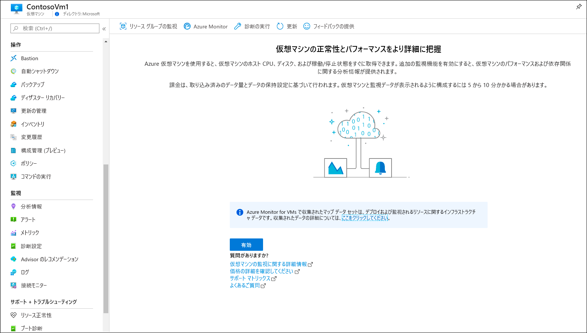
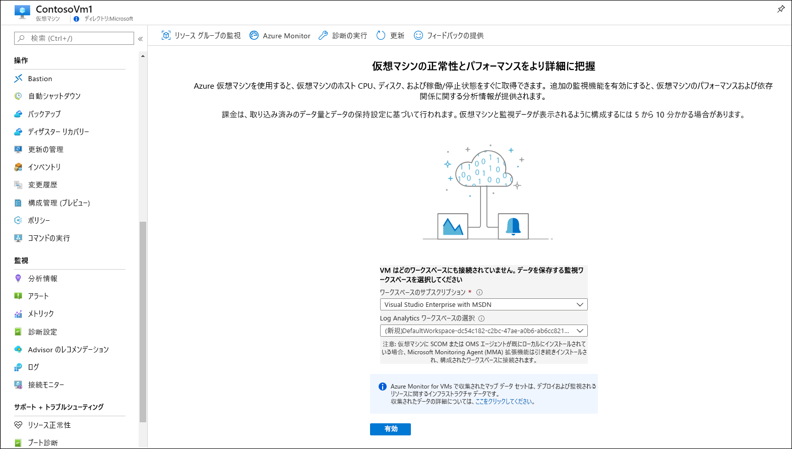
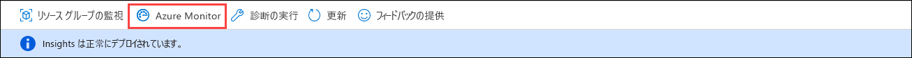
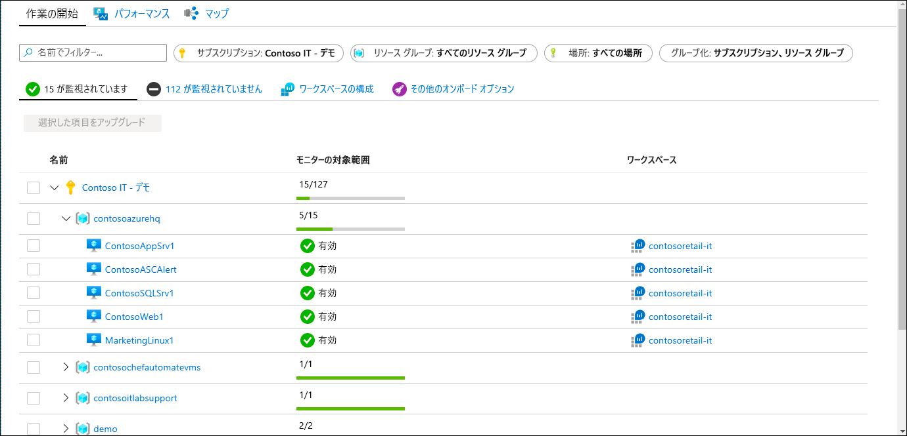
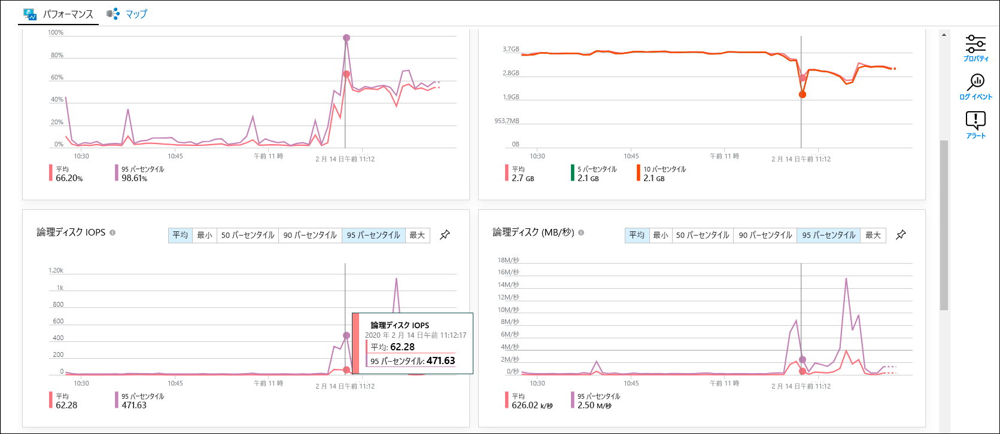
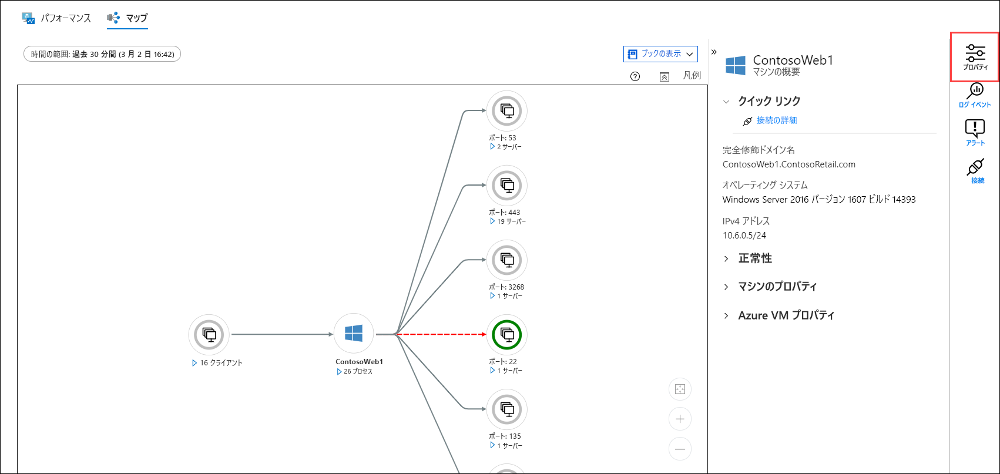
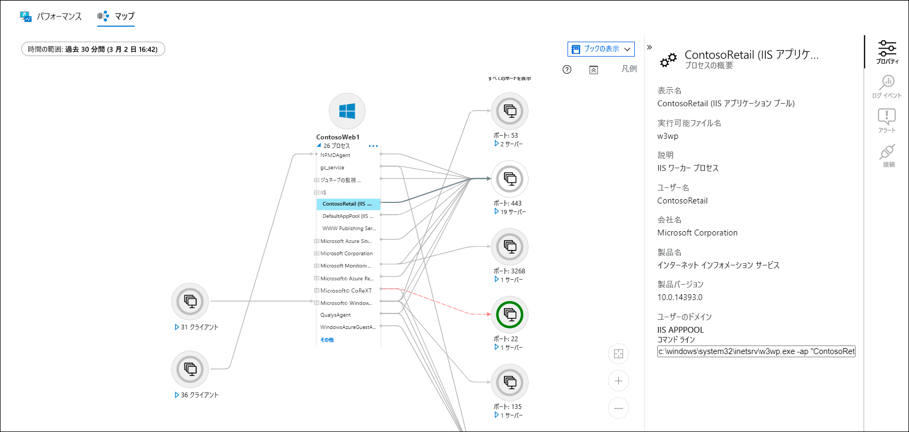
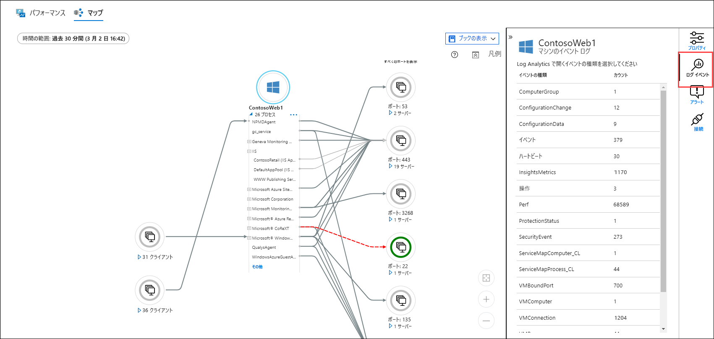
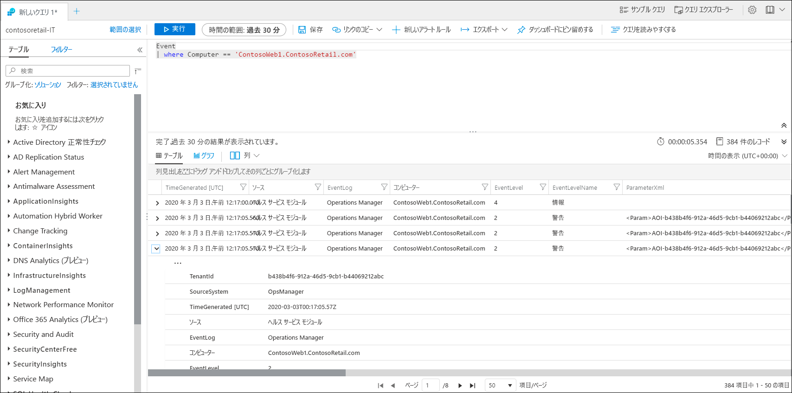

# クイック スタート:Azure Monitor を使用して Azure 仮想マシンを監視する
[Azure Monitor](../overview.md) では、作成された時点から、Azure 仮想マシンからのデータ収集が開始されます。 このクイック スタートでは、Azure VM に対して自動的に収集されるデータと、そのデータを Azure portal で表示する方法について簡単に説明します。 次に、VM に対して [Azure Monitor for VMs](../insights/vminsights-overview.md) を有効にします。これにより、VM 上のエージェントでは、プロセスとその依存関係を含むゲスト オペレーティング システムからデータを収集して分析できるようになります。

このクイック スタートでは、既存の Azure Virtual Machines があることを前提とします。 ない場合は、VM のクイック スタートに従って、[Windows VM](../../virtual-machines/windows/quick-create-portal.md) を作成するか、[Linux VM](../../virtual-machines/linux/quick-create-cli.md) を作成することができます。

Azure リソースから収集される監視データの詳細な説明については、「[Azure Monitor を使用した Azure 仮想マシンの監視](../insights/monitor-vm-azure.md)」を参照してください。

## Azure リソースの監視のクイック スタートを完了する
「[Azure Monitor を使用して Azure リソースを監視する](quick-monitor-azure-resource.md)」を完了すると、サブスクリプション内の VM の概要ページ、アクティビティ ログ、およびメトリックを表示できます。 Azure VM では、他の Azure リソースと同じ監視データが収集されますが、これはホスト VM についてのみです。 このクイック スタートの残りの部分では、ゲスト オペレーティング システムとそのワークロードの監視に焦点を当てます。

## Azure Monitor for VMs の有効化
メトリックとアクティビティ ログはホスト VM について収集されますが、ゲスト オペレーティング システムとそのワークロードから監視データを収集して分析するには、エージェントといくらかの構成が必要です。 Azure Monitor for VMs によってこれらのエージェントがインストールされ、仮想マシンを監視するための強力な機能が追加されます。

1. 仮想マシンのメニューに移動します。
2. **[概要]** ページのタイルで **[分析情報に移動]** をクリックするか、 **[監視]** メニューで **[分析情報]** をクリックします。

    ![[概要] ページ](media/quick-monitor-azure-vm/overview-insights.png)

3. 仮想マシンに対して Azure Monitor for VMs がまだ有効になっていない場合は、 **[有効にする]** をクリックします。 

    

4. 仮想マシンがまだ Log Analytics ワークスペースに接続されていない場合は、既存のワークスペースを選択するか、新しいワークスペースを作成するように求められます。 仮想マシンと同じリージョン内の一意の名前を持つワークスペースである既定値を選択します。

    

5. 拡張機能が有効になっていて、仮想マシンにエージェントがインストールされているため、オンボードには数分かかります。 完了すると、分析情報が正常にデプロイされたことを示すメッセージが表示されます。 **[Azure Monitor]** をクリックして、Azure Monitor for VMs を開きます。

    

6. VM と、サブスクリプション内のオンボードされている他の VM が表示されます。 サブスクリプション内のオンボードされていない仮想マシンを表示するには、 **[監視されない]** タブを選択します。

    

## ワークスペースの構成
新しい Log Analytics ワークスペースを作成する場合は、ログを収集するように構成する必要があります。 接続されているすべての仮想マシンに構成が送信されるため、この構成は一度だけ実行する必要があります。

1. **[ワークスペースの構成]** を選択し、ワークスペースを選択します。

2. **[詳細設定]** を選択します。

    ![Log Analytics の [詳細設定]](media/quick-collect-azurevm/log-analytics-advanced-settings-azure-portal.png)

### Windows VM からのデータ収集

2. **[データ]** を選択してから、 **[Windows イベント ログ]** を選択します。

3. イベント ログを追加するには、ログの名前を入力します。  「**System**」と入力し、プラス記号 ( **+** ) を選択します。

4. テーブルで、重大度の **[エラー]** と **[警告]** のチェック ボックスをオンにします。

5. ページの上部にある **[保存]** を選択して構成を保存します。

### Linux VM からのデータ収集

1. **[Syslog]** を選択します。  

2. イベント ログを追加するには、ログの名前を入力します。  「**Syslog**」と入力し、プラス記号 **+** を選択します。  

3. テーブルで、重大度の **[情報]** 、 **[通知]** 、および **[デバッグ]** の各チェック ボックスをオフにします。 

4. ページの上部にある **[保存]** を選択して構成を保存します。

## 収集されたデータを表示する

7. 仮想マシンをクリックし、 **[パフォーマンス]** タブを選択します。これは、VM のゲスト オペレーティング システムから収集されたパフォーマンス カウンターの選択グループを示しています。 下にスクロールすると、さらにカウンターを表示できます。グラフ上にマウスを移動すると、平均とパーセンタイルを異なるタイミングで表示できます。

    

9. **[マップ]** を選択して、仮想マシンで実行されているプロセスとその依存関係を示すマップ機能を開きます。 プロパティ ウィンドウがまだ開いていない場合は、 **[プロパティ]** を選択して開きます。

    

11. 仮想マシンのプロセスを展開します。 プロセスの 1 つを選択すると、詳細を表示したり、その依存関係を強調表示したりできます。

    

12. 仮想マシンをもう一度選択し、 **[ログイベント]** を選択します。 

    

13. 仮想マシンの [Log Analytics] ワークスペースに格納されているテーブルのリストが表示されます。 このリストは、Windows 仮想マシンと Linux 仮想マシンのどちらを使用しているかによって異なります。 **[イベント]** テーブルをクリックします。 これには、Windows イベント ログのすべてのイベントが含まれます。 Log Analytics が開き、イベント ログエントリを取得するための単純なクエリが表示されます。

    

## 次のステップ
このクイック スタートでは、仮想マシンに対して Azure Monitor for VMs を有効にし、ゲスト オペレーティング システムのイベントを収集するように Log Analytics ワークスペースを構成しました。 データの表示および分析方法を学習する場合は、次のチュートリアルに進んでください。

> [!div class="nextstepaction"]
> [Log Analytics でのデータの表示と分析](../../azure-monitor/learn/tutorial-viewdata.md)
