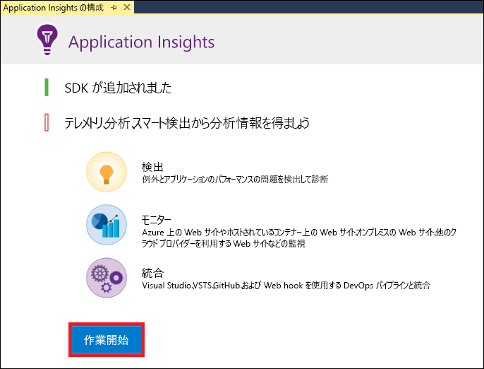
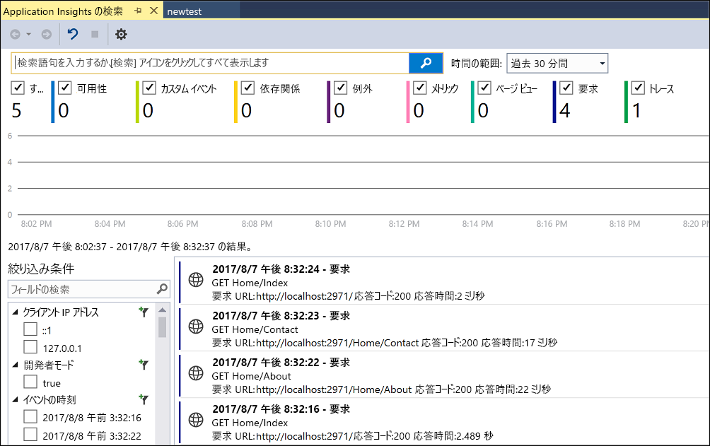
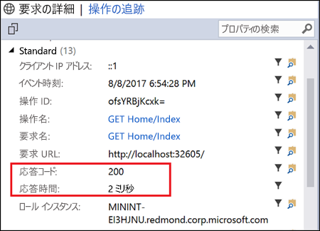
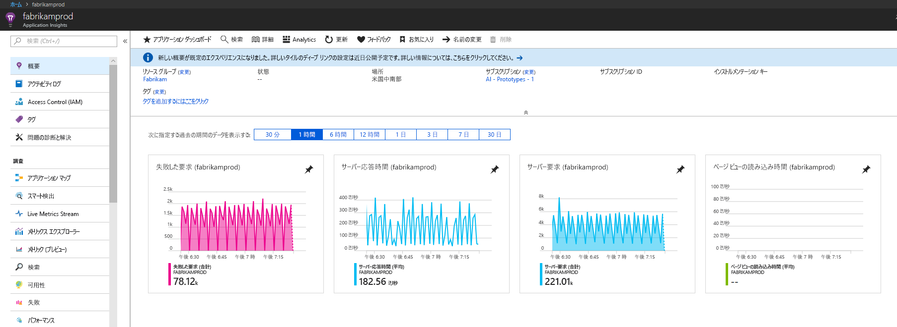
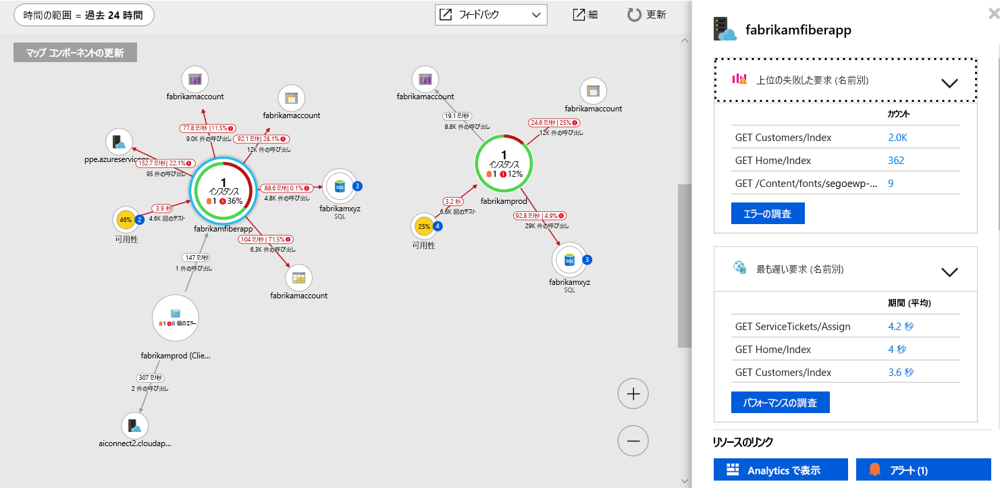
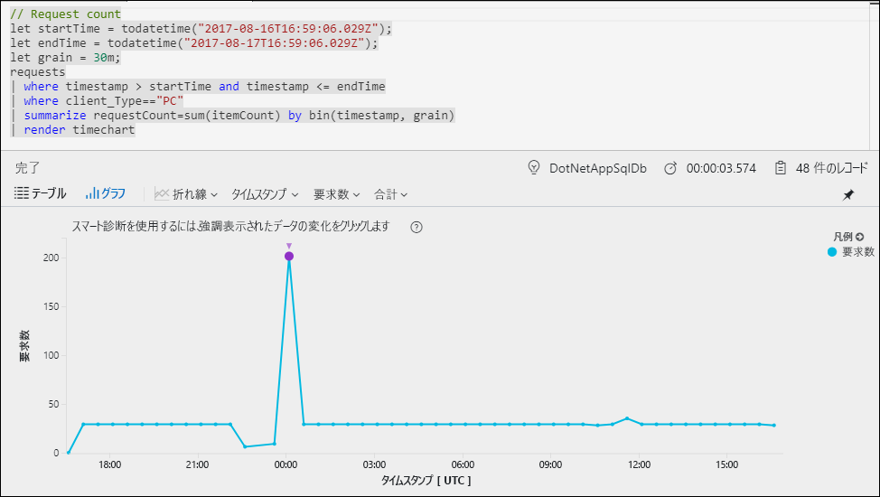
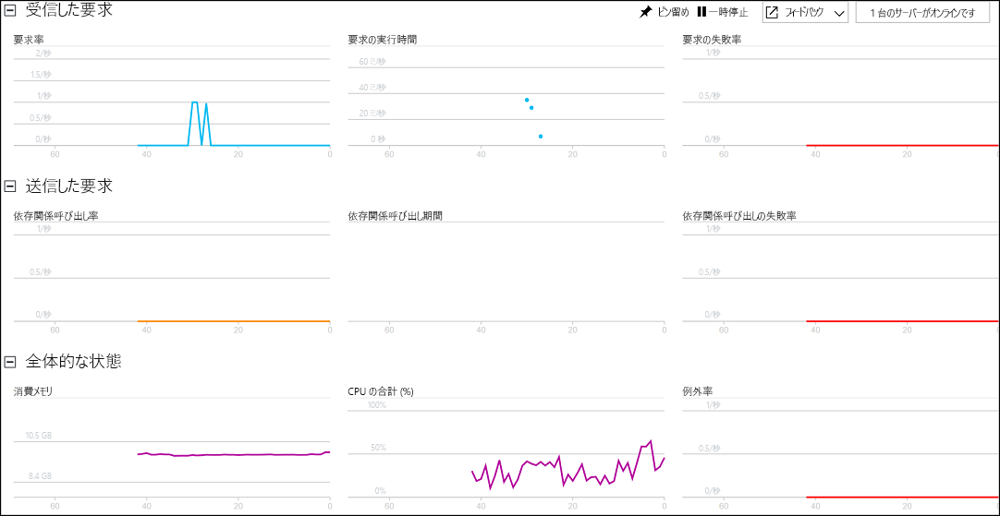

# <a name="start-monitoring-your-aspnet-web-application"></a>ASP.NET Web アプリケーションの監視を開始する

Azure Application Insights を使うと、Web アプリケーションの可用性、パフォーマンス、利用状況を簡単に監視できます。  アプリケーションのエラーを、ユーザーからの報告を待つことなく、迅速に特定して診断することもできます。  Application Insights から収集したアプリのパフォーマンスと有効性に関する情報を使用することで、十分な情報に基づいて、アプリケーションのメンテナンスと改善に関する選択を行えます。

このクイックスタートでは、既存の ASP.NET Web アプリケーションに Application Insights を追加してライブ統計の分析を開始する方法を説明します。これは、アプリケーションの分析に使用できるさまざまな方法の中の 1 つです。 ASP.NET Web アプリケーションがない場合は、[ASP.NET Web アプリを作成するためのクイックスタート](../../app-service/app-service-web-get-started-dotnet-framework.md)に従って作成できます。

## <a name="prerequisites"></a>前提条件
このクイック スタートを完了するには、以下が必要です。

- 次のワークロードを使って、[Visual Studio 2017](https://www.visualstudio.com/downloads/) をインストールします。
    - ASP.NET および Web の開発
    - Azure の開発


Azure サブスクリプションをお持ちでない場合は、開始する前に[無料](https://azure.microsoft.com/free/)アカウントを作成してください。

## <a name="enable-application-insights"></a>Application Insights を有効にする

1. Visual Studio 2017 でプロジェクトを開きます。
2. [プロジェクト] メニューの **[Application Insights の構成]** を選択します。 Visual Studio によって、Application Insights SDK がアプリケーションに追加されます。

    > [!IMPORTANT]
    > Application Insights を追加するプロセスは、ASP.NET テンプレートの種類によって異なります。 **空**のテンプレートや **Azure Mobile App** テンプレートを使用する場合は、**[プロジェクト]** > **[Application Insights Telemetry の追加]** を選択します。 それ以外のすべての ASP.NET テンプレートについては、前述の手順をご覧ください。 

3. **[Get Started]\(開始\)** (以前のバージョンの Visual Studio では **[開始 (無料)]** ボタン) をクリックします。

    

4. サブスクリプションを選択し、**[登録]** をクリックします。

5. **[デバッグ]** メニューの **[デバッグ開始]** をクリックするか、F5 キーを押して、アプリケーションを実行します。

## <a name="confirm-app-configuration"></a>アプリの構成を確認する

Application Insights は、アプリケーションが実行されている場所に関係なく、アプリケーションのテレメトリ データを収集します。 このデータの表示を開始するには、次の手順を実行します。

1. **[表示]** -> **[その他のウィンドウ]** -> **[Application Insights の検索]** をクリックして Application Insights を開きます。  現在のセッションのテレメトリが表示されます。<BR><br>

2. リスト内の最初の要求 (この例では GET Home/Index) をクリックすると、この要求の詳細が表示されます。 要求に関する他の有益な情報と共に状態コードと応答時間の両方が含まれていることに注意してください。<br><br>

## <a name="start-monitoring-in-the-azure-portal"></a>Azure Portal で監視を開始する

Azure Portal で Application Insights を開いて、実行中のアプリケーションに関するさまざまな詳細情報を表示することができます。

1. ソリューション エクスプローラーで、**接続済みサービス Application Insights** フォルダーを右クリックし、**[Application Insights ポータルを開く]** をクリックします。  アプリケーションに関する情報とさまざまなオプションが表示されます。

    

2. **[アプリケーション マップ]** をクリックして、アプリケーション コンポーネント間の依存関係の視覚的レイアウトを取得します。  各コンポーネントには、負荷、パフォーマンス、障害、アラートなどの KPI が表示されます。

    

3. いずれかのアプリケーション コンポーネントで、**[アプリ分析]** アイコン ![[アプリケーション マップ]](media/quick-monitor-portal/app-analytics-icon.png) をクリックします。  これにより、Application Insights で収集されたすべてのデータを分析するための豊富なクエリ言語を備えた **Application Insights 分析**が開きます。  この場合は、要求の数をグラフとして描画するクエリが生成されます。  自分でクエリを作成して他のデータを分析することができます。

    

4. **[概要]** ページに戻り、**[ライブ ストリーム]** をクリックします。  これにより、実行中のアプリケーションに関するライブ統計が表示されます。  ここには、着信要求の数、要求の期間、発生したエラーなどの情報が含まれます。  また、プロセッサやメモリなどの重要なパフォーマンス メトリックを検査することもできます。

    

    Azure でアプリケーションをホストする準備ができたら、すぐに公開することができます。 [ASP.NET Web アプリを作成するためのクイックスタート](../../app-service/app-service-web-get-started-dotnet.md#update-the-app-and-redeploy)に記載されている手順に従います。

5. Visual Studio を使用して Application Insights の監視を追加する場合、クライアント側監視を自動的に追加することができます。 クライアント側監視を手動でアプリケーションに追加するには、次の JavaScript をアプリケーションに追加します。

```html
<!-- 
To collect user behavior analytics about your application, 
insert the following script into each page you want to track.
Place this code immediately before the closing </head> tag,
and before any other scripts. Your first data will appear 
automatically in just a few seconds.
-->
<script type="text/javascript">
var appInsights=window.appInsights||function(a){
  function b(a){c[a]=function(){var b=arguments;c.queue.push(function(){c[a].apply(c,b)})}}var c={config:a},d=document,e=window;setTimeout(function(){var b=d.createElement("script");b.src=a.url||"https://az416426.vo.msecnd.net/scripts/a/ai.0.js",d.getElementsByTagName("script")[0].parentNode.appendChild(b)});try{c.cookie=d.cookie}catch(a){}c.queue=[];for(var f=["Event","Exception","Metric","PageView","Trace","Dependency"];f.length;)b("track"+f.pop());if(b("setAuthenticatedUserContext"),b("clearAuthenticatedUserContext"),b("startTrackEvent"),b("stopTrackEvent"),b("startTrackPage"),b("stopTrackPage"),b("flush"),!a.disableExceptionTracking){f="onerror",b("_"+f);var g=e[f];e[f]=function(a,b,d,e,h){var i=g&&g(a,b,d,e,h);return!0!==i&&c["_"+f](a,b,d,e,h),i}}return c
  }({
      instrumentationKey:"<your instrumentation key>"
  });

window.appInsights=appInsights,appInsights.queue&&0===appInsights.queue.length&&appInsights.trackPageView();
</script>
```

詳細については、GitHub リポジトリにアクセスして、Microsoft の[オープンソース JavaScript SDK](https://github.com/Microsoft/ApplicationInsights-JS) をご覧ください。

## <a name="next-steps"></a>次の手順
このクイックスタートでは、Azure Application Insights で監視できるようにアプリケーションを有効にしました。  チュートリアルを続けて、統計情報を監視してアプリケーションの問題を検出する方法を学習してください。

> [!div class="nextstepaction"]
> [Azure Application Insights チュートリアル](tutorial-runtime-exceptions.md)
