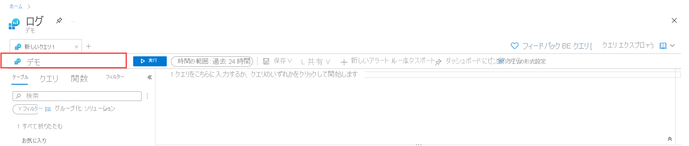

# Log Analytics のチュートリアル
Log Analytics は、Azure Monitor ログによって収集されたデータからログ クエリを編集して実行し、その結果を対話形式で分析する Azure portal のツールです。 Log Analytics クエリを使用すると、特定の条件に一致するレコードの取得、傾向の特定、パターンの分析を行って、データに関するさまざまな分析情報を入手できます。 

このチュートリアルでは、Log Analytics インターフェイスについて紹介し、いくつかの基本的なクエリの使用法を説明し、結果を操作する方法を示します。 学習内容は次のとおりです。

> [!div class="checklist"]
> * ログ データのスキーマの確認
> * 単純なクエリの記述と実行、クエリの時間範囲の変更
> * クエリ結果のフィルター処理、並べ替え、グループ化
> * クエリ結果のビジュアルの表示、変更、共有
> * クエリと結果の読み込み、エクスポート、コピー

> [!IMPORTANT]
> このチュートリアルでは、クエリ自体を操作するのではなく、Log Analytics の機能を使用してクエリを作成して実行します。 Log Analytics の機能を活用して、1 つのクエリを作成し、別のサンプル クエリを使用します。 クエリの構文を学習し、クエリ自体の直接編集を開始する準備ができたら、[Kusto クエリ言語のチュートリアル](/azure/data-explorer/kusto/query/tutorial?pivots=azuremonitor)を完了してください。 そのチュートリアルでは、このチュートリアルで学習するいくつかの機能を利用して、Log Analytics 内で編集して実行できるいくつかのサンプル クエリについて説明しています。

## 前提条件
このチュートリアルでは、サンプル クエリをサポートしているサンプル データが豊富に含まれている [Log Analytics のデモ環境](https://ms.portal.azure.com/#blade/Microsoft_Azure_Monitoring_Logs/DemoLogsBlade)を使用します。 ご自分の Azure サブスクリプションを使用することもできますが、同じテーブルにデータが含まれていない場合があります。

## Log Analytics を開く
[Log Analytics のデモ環境](https://ms.portal.azure.com/#blade/Microsoft_Azure_Monitoring_Logs/DemoLogsBlade)を開くか、ご自分のサブスクリプションの Azure Monitor メニューから **[ログ]** を選択します。 これにより、初期のスコープが Log Analytics ワークスペースに設定されます。これは、クエリがそのワークスペース内のすべてのデータから選択することを意味します。 Azure リソースのメニューから **[ログ]** を選択した場合、スコープはそのリソースのレコードのみに設定されます。 スコープの詳細については、[ログ クエリのスコープ](./scope.md)に関するページを参照してください。

スコープは、画面の左上隅で確認できます。 ご自分の環境を使用している場合は、別のスコープを選択するオプションが表示されますが、このオプションはデモ環境では使用できません。

## テーブル スキーマ
画面の左側には **[テーブル]** タブがあり、現在のスコープで使用できるテーブルを調べることができます。 既定では **ソリューション** 別にグループ化されていますが、グループを変更したり、フィルター処理したりできます。 

**Log Management** ソリューションを展開し、**AzureActivity** テーブルを見つけます。 テーブルを展開してそのスキーマを表示するか、その名前にマウス ポインターを合わせると、それに関する追加情報が表示されます。 

各テーブルとその列を示すテーブル参照にアクセスするには、 **[詳細情報]** をクリックします。 テーブル内にある最近の数件のレコードを簡単に確認するには、 **[データのプレビュー]** をクリックします。 これは、クエリを実際に実行する前に、使用するデータが想定しているものであることを確認するのに役立ちます。

## クエリを記述する
**AzureActivity** テーブルを使用してクエリを記述してみましょう。 その名前をダブルクリックして、クエリ ウィンドウに追加します。 ウィンドウに直接入力することもできます。IntelliSense が現在のスコープ内のテーブル名と KQL コマンドを補完します。

これは、記述できる最も単純なクエリです。 テーブル内にあるすべてのレコードを返します。 これを実行するには、 **[実行]** ボタンをクリックするか、クエリ テキスト内の任意の場所にカーソルを置いて Shift + Enter キーを押します。

ご覧のように、結果が表示されます。 クエリによって返されたレコード数が右下隅に表示されます。 

## フィルター

クエリにフィルターを追加して、返されるレコードの数を減らしてみましょう。 左側のペインにある **[フィルター]** タブを選択します。 これにより、結果をフィルター処理するために使用できる、クエリ結果内のさまざまな列が表示されます。 これらの列内の上位の値が、その値を含むレコードの数と共に表示されます。 **[CategoryValue]** の下にある **[Administrative]** 、 **[Apply & Run]\(適用して実行\)** の順にクリックします。 

**where** ステートメントが、選択した値と共にクエリに追加されます。 結果にはその値を含むレコードだけが含まれているので、ご覧のように、レコード数が減少しています。

## 時間の範囲
Log Analytics ワークスペース内のすべてのテーブルには、**TimeGenerated** という名前の列があります。これは、レコードが作成された時刻です。 すべてのクエリには時間の範囲があり、結果は **TimeGenerated** 値がその範囲内のレコードに制限されます。 時間の範囲は、クエリ内で、または画面の上部にあるセレクターを使用して設定できます。

既定では、このクエリは過去 24 時間のレコードを返します。 **[時間の範囲]** ドロップダウンを選択し、 **[7 日]** に変更します。 **[実行]** をもう一度クリックすると、結果が返されます。 ご覧のように、結果が返されますが、ここにはすべての結果が表示されていないという旨のメッセージが表示されています。 これは、Log Analytics が最大 10,000 件のレコードを返すことができ、このクエリから返されたレコードの数がそれよりも多いためです。 

## 複数のクエリ条件
別のフィルター条件を追加して、結果をさらに減らしてみましょう。 クエリには、必要なレコードのセットを正確に対象とするために、任意の数のフィルターを含めることができます。 **[ActivityStatusValue]** の下にある **[Success]** を選択し、 **[Apply & Run]\(適用して実行\)** をクリックします。 

## 分析結果
Log Analytics は、クエリの記述と実行を支援するだけでなく、結果を操作するための機能も提供します。 まず、レコードを展開すると、すべての列の値が表示されます。

任意の列の名前をクリックすると、その列で結果が並べ替えられます。 フィルター条件を指定するには、その横にあるフィルター アイコンをクリックします。 これは、クエリを再度実行するとこのフィルターがクリアされる点を除いて、クエリ自体にフィルター条件を追加するのと似ています。 対話型分析の一部としてレコードのセットをすばやく分析する場合は、この方法を使用します。

たとえば、レコードを 1 つの呼び出し元に制限するには、**CallerIpAddress** 列にフィルターを設定します。 

結果をフィルター処理する代わりに、特定の列でレコードをグループ化することができます。 作成したフィルターをクリアしたら、 **[列のグループ化]** スライダーをオンにします。 

[![[列のグループ化]](media/log-analytics-tutorial/query-results-group-columns.png)](media/log-analytics-tutorial/query-results-group-columns.png#lightbox)

次に、**CallerIpAddress** 列をグループ行にドラッグします。 これで、結果がその列によって整理され、各グループを折りたたんで分析しやすくすることができます。

## グラフの操作
グラフで表示できる数値データを使用するクエリを見てみましょう。 クエリを作成する代わりに、クエリの例を選択します。

左側のペインで、 **[クエリ]** をクリックします。 このペインには、クエリ ウィンドウに追加できるクエリの例が含まれています。 ご自分のワークスペースを使用している場合は複数のカテゴリにさまざまなクエリが表示されますが、デモ環境を使用している場合は 1 つの **[Log Analytics workspaces]\(Log Analytics ワークスペース\)** カテゴリのみが表示されます。 それを展開して、カテゴリ内のクエリを表示します。

**[Request Count by ResponseCode]\(ResponseCode 別の要求数\)** というクエリをクリックします。 これにより、クエリがクエリ ウィンドウに追加されます。 新しいクエリは他と空白行で区切られることに注意してください。 KQL のクエリは空白行を検出すると終了します。そのため、これらは別個のクエリとして認識されます。 

[![[新しいクエリ]](media/log-analytics-tutorial/example-query.png)](media/log-analytics-tutorial/example-query.png#lightbox)

カーソルが配置されているのが現在のクエリです。 ご覧のように、先頭のクエリが強調表示され、それが現在のクエリであることを示しています。 新しいクエリ内の任意の場所をクリックして選択し、 **[実行]** ボタンをクリックして実行します。

この出力は、前回のクエリのようなテーブルではなく、グラフであることに注意してください。 これは、このクエリの例では最後に [render](/azure/data-explorer/kusto/query/renderoperator?pivots=azuremonitor) コマンドを使用しているためです。 別の種類への変更など、グラフを操作するためのさまざまなオプションがあることに注意してください。

**[結果]** を選択してみてください。クエリの出力がテーブルとして表示されます。 

## 次の手順

Log Analytics の使用方法を学んだので、次はログ クエリの使用に関するチュートリアルを完了してください。
> [!div class="nextstepaction"]
> [Azure Monitor ログ クエリを記述する](get-started-queries.md)