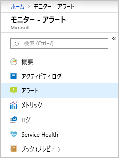
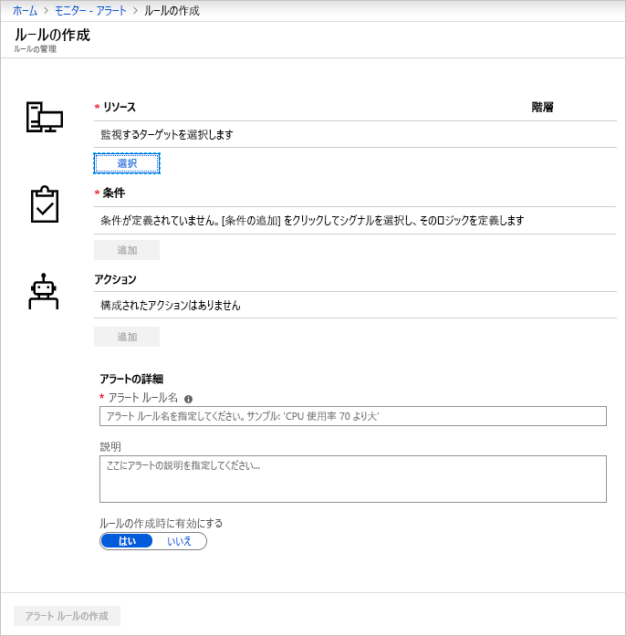
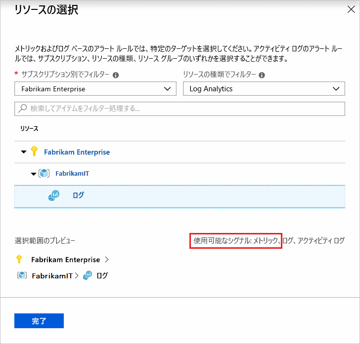
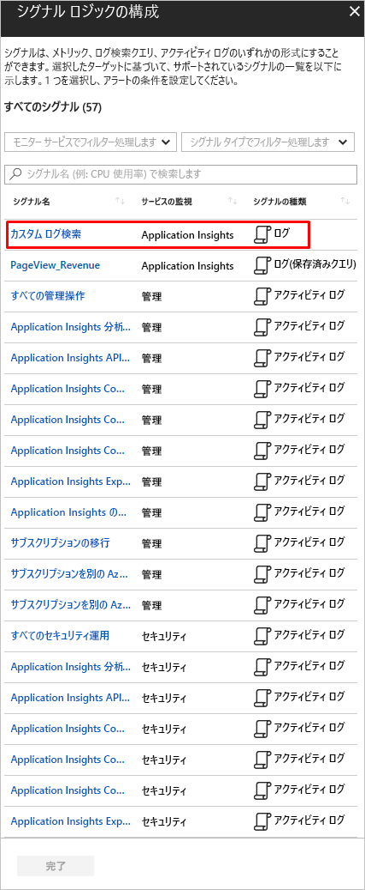
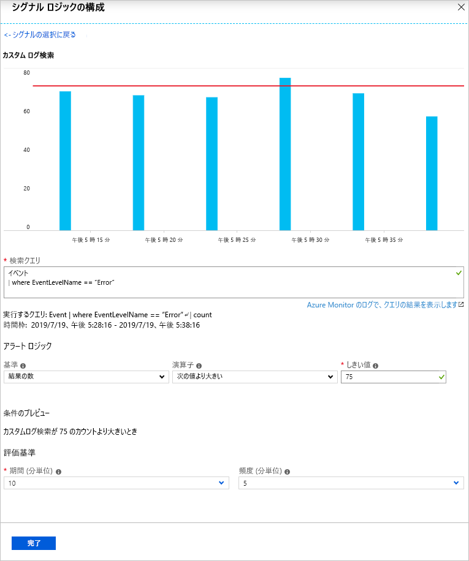
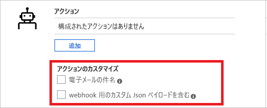
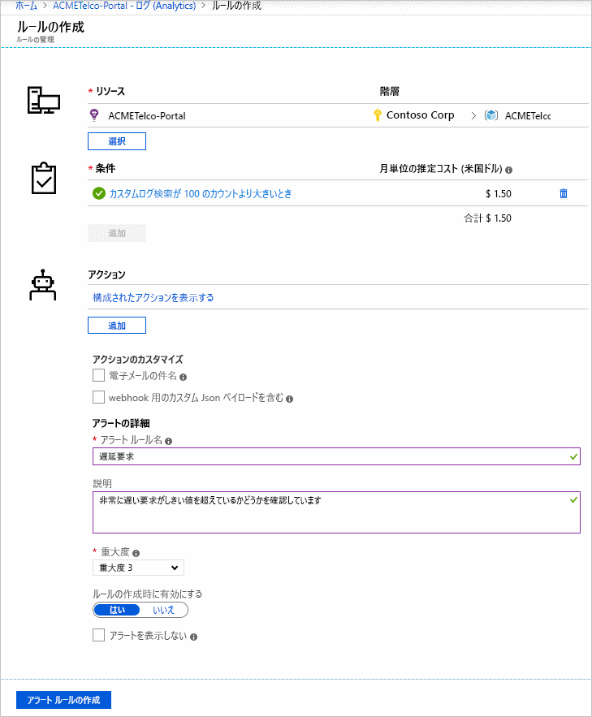
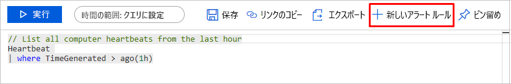

# <a name="create-view-and-manage-log-alerts-using-azure-monitor"></a>Azure Monitor を使用してログ アラートを作成、表示、管理する  

## <a name="overview"></a>概要
この記事では、Microsoft Azure portal 内部のアラート インターフェイスを使用して、ログ アラートを設定する方法について説明します。 アラート ルールの定義は、次の 3 つの部分に分かれています。
- ターゲット:監視される特定の Azure リソース
- 条件:Signal で確認された場合にアクションをトリガーする特定の条件またはロジック
- アクション:電子メール、SMS、Webhook などの通知の受信者に送信される特定の呼び出し。

アラートを説明する**ログ アラート**という用語。このアラートでは、[Log Analytics](../../azure-monitor/learn/tutorial-viewdata.md) または [Application Insights](../../azure-monitor/app/analytics.md) に基づいて、シグナルがカスタム クエリとなります。 「[ログ アラート - 概要](../../azure-monitor/platform/alerts-unified-log.md)」からの機能、用語、および型について説明します。

> [!NOTE]
> Azure Monitor のメトリック プラットフォームでは、[Azure Log Analytics](../../azure-monitor/learn/tutorial-viewdata.md) の一般的なログ データも利用できます。 詳細ビューについては、[ログのメトリック アラート](../../azure-monitor/platform/alerts-metric-logs.md)に関するページをご覧ください

## <a name="managing-log-alerts-from-the-azure-portal"></a>Microsoft Azure portal からのログ アラートの管理

以下の詳細は、Microsoft Azure portal インターフェイスを使用してログ アラートを使用するためのステップ バイ ステップ ガイドです。

### <a name="create-a-log-alert-rule-with-the-azure-portal"></a>Microsoft Azure portal でログ アラート ルールを作成する
1. [ポータル](https://portal.azure.com/)で **[モニター]** を選び、[モニター] セクションで **[アラート]** を選びます。  
    

1. **[新しいアラート ルール]** を選択して、Azure 内で新しいアラートを作成します。
    

1. [アラートの作成] セクションが表示されます。*[アラートの条件を定義します]*、*[アラートの詳細を定義します]*、*[アクション グループを定義します]* の 3 つのセクションで構成されています。

    

1.  **[リソースの選択]** のリンクを使用してターゲットを指定し、リソースを選択することで、アラートの条件を定義します。 _サブスクリプション_、_リソースの種類_を選択し、必要な_リソース_ を選択して、フィルターを適用します。 

    >[!NOTE]

    > ログ アラートを作成する場合、続行する前に、選択したリソースに使用可能な**ログ** シグナルを確認します。
    

 
1. *ログ アラート*: **[リソースの種類]** が *Log Analytics* または *Application Insights* のような分析ソースであり、シグナルの種類が **[ログ]** であることを確認し、適切な**リソース**を選択したら、*[完了]* をクリックします。 次に **[条件の追加]** をクリックして、そのリソースで使用できるシグナル オプションの一覧を表示し、シグナル一覧から、*Log Analytics* または *Application Insights* などの選択したログ監視サービスの **[Custom log search]\(カスタム ログ検索\)** オプションを選択します。

   

   > [!NOTE]

   > アラート リストは上の図に示すように、分析クエリをシグナルの種類 - **[Log (Saved Query)]\(ログ (保存されたクエリ)\)** としてインポートできます。 したがって、ユーザーは Analytics でクエリを完成させ、将来使用するためにクエリをアラートに保存することができます。保存クエリの使用について詳しくは、[ログ分析でのログ検索の使用](../../azure-monitor/log-query/log-query-overview.md)または [Application Insights 分析 での共有クエリ](../../azure-monitor/log-query/log-query-overview.md)に関する記事を参照してください。 

1.  *ログ アラート*: 選択すると、アラート設定のクエリを **[検索クエリ]** フィールドで指定できます。クエリ構文が正しくない場合は、フィールドに赤い文字でエラーが表示されます。 クエリ構文が正しい場合は、直近の 6 時間から最後の週までさまざまな時間枠を微調整するオプションとともに、宣言されたクエリの履歴データが参考としてグラフで表示されます。

 

 > [!NOTE]

    > 履歴データの視覚エフェクトは、時間に関する詳細がクエリ結果にある場合のみ表示されます。 ご利用のクエリが集計されたデータまたは特定の列の値になった場合は、単一のプロットとして同じものが表示されます。

    >  Application Insights を使用するメトリック測定タイプのログ アラートでは、以下に示すように、**[集計]** オプションを使用して、データをグループ化する特定の変数を指定できます。

    ![[集計] オプション](media/alerts-log/aggregate-on.png)

1.  *ログ アラート*: 所定の視覚エフェクトを使用して、表示される [条件]、[集計]、[しきい値] のオプションから**アラート ロジック**を選択できます。 最後に、そのロジック内で **[期間]** オプションを使用して、指定した条件を評価する期間を指定します。 また、**[頻度]** を選択して Alert を実行する頻度を指定します。
**ログ アラート**の場合、アラートは次のものに基づきます。
   - *レコード数*: クエリによって返されるレコード数が、指定した値より大きいまたは小さい場合に、アラートが作成されます。
   - *メトリック測定*: 結果内の各*集計値*が指定したしきい値を超えた場合に、アラートが作成されます。アラートは選択された値で*グループ化*されます。 アラートが作成されるための違反数は、選択した期間のしきい値を超えた回数です。 結果セット全体での違反の任意の組み合わせについて違反総数を指定するか、または、違反が連続したサンプルで発生しなければならない必要な連続する違反を指定できます。 [ログ アラートとその種類](../../azure-monitor/platform/alerts-unified-log.md)の詳細をご覧ください。


1. 2 番目の手順として、**[アラート ルール名]** フィールドでご利用のアラートの名前を定義し、そのアラートと指定したオプションからの **[重大度]** の値の詳細を説明する **[説明]** を定義します。 これらの詳細は、Azure Monitor が送信するすべてのアラート メール、通知、またはプッシュ内で再利用されます。 また、ユーザーは **[ルールの作成時に有効にする]** オプションを適切に切り替えることで、作成に関するアラート ルールをすぐにアクティブにすることも選択できます。

    **ログ アラート**の場合のみ、Alert の詳細でいくつかの他の機能を使用できます。

    - **アラートを表示しない**: アラート ルールの抑制を有効にすると、新しいアラートを作成した後、定義された期間の間、ルールのアクションが無効になります。 ルールは引き続き実行され、条件が満たされればアラート レコードが作成されます。 これにより、同じアクションを繰り返し実行することなく、問題を修正できます。

        

        > [!TIP]
        > アラート抑制の値をアラートの頻度より大きくし、通知がオーバーラップすることなく停止されるようにします

1. 3 番目および最後の手順として、アラートの条件が満たされた場合に、どの**アクション グループ**でそのアラート ルールをトリガーする必要があるかを指定します。 アラートのある既存のアクション グループはすべて選択できます。新しいアクション グループを作成することもできます。 選択したアクション グループによって、アラートがトリガーされた場合に、Azure はメールを送信したり、SMS を送信したり、Webhook を呼び出したり、Azure Runbook を使用して復旧したり、ご利用の ITSM ツールにプッシュしたりします。 [アクション グループ](action-groups.md)の詳細をご覧ください。

    > [!NOTE]
    > Azure アクション グループ経由でログ アラートについてトリガーされる Runbook ペイロードの制限については、「[Azure サブスクリプション サービスの制限](../../azure-subscription-service-limits.md)」をご覧ください

    **ログ アラート**の場合、既定のアクションをオーバーライドするためにいくつかの他の機能を使用できます。

    - **電子メール通知**:前述のアクション グループに 1 つ以上の電子メール アクションが存在する場合、アクション グループ経由で送信された電子メールの*電子メールの件名*をオーバーライドします。 メールの本文は変更できず、このフィールドは電子メール アドレス用では**ありません**。
    - **カスタム JSON ペイロードを含める**: 前述のアクション グループに 1 つ以上の webhook アクションが存在する場合、アクション グループによって使用される Webhook JSON をオーバーライドします。 ユーザーは、関連付けられているアクション グループで構成されているすべての webhook に使用する JSON の形式を指定できます。webhook 形式について詳しくは、「[ログ アラート ルールの webhook アクション](../../azure-monitor/platform/alerts-log-webhook.md)」をご覧ください。 サンプルの JSON データを使用して形式を確認する [View Webhook] (Webhook の表示) オプションが提供されています。

        


1. すべてのフィールドが有効で緑色のチェックマークがついている場合、**[アラート ルールの作成]** をクリックすることができ、アラートが Azure Monitor - アラートで作成されます。 アラート ダッシュボードですべてのアラートを表示できます。

    

    数分後にアラートがアクティブになり、前述のようにトリガーされます。

ユーザーは、[Microsoft Azure portal の [Log Analytics] ページ](../../azure-monitor/log-query/portals.md#log-analytics-page
)で分析クエリを最終処理し、[Set Alert] (アラートの設定) ボタンでアラートを作成するようにプッシュし、上記のチュートリアルの手順 6 以降の指示に従います。

 

### <a name="view--manage-log-alerts-in-azure-portal"></a>Microsoft Azure portal でログ アラートを表示および管理する

1. [ポータル](https://portal.azure.com/)で **[モニター]** を選び、[モニター] セクションで **[アラート]** を選びます。  

1. **アラート ダッシュ ボード**が表示されます - ここには、ログ アラート ルールが発動したときのすべてのインスタンスなど、(ログ アラートを含む) すべての Azure アラートが単一のボードに表示されます。 詳細については、「[Alert Management](https://aka.ms/managealertinstances)」を参照してください。
    > [!NOTE]
    > ログ アラート ルールは、ユーザーが提供するクエリベースのカスタム ロジックから構成され、したがって解決済みの状態は使用しません。 このため、ログ アラート ルールで指定された条件に適合するごとに発動されます。 


1. 上部のバーにある **[ルールの管理]** を選択して、ルールを管理するセクションに移動します。ここでは、作成されたすべてのアラート ルール (無効にされたアラートも含む) が一覧表示されます。
    

## <a name="managing-log-alerts-using-azure-resource-template"></a>Azure リソース テンプレートを使用したログ アラートの管理
現在、ログ アラートは、アラートがどの分析プラットフォームに基づくことになるか、(つまり) Log Analytics と Application Insights のどちらに基づくことになるかに応じて、2 つの異なるリソース テンプレートを使用して作成できます。

このため、以下のセクションでは、それぞれの分析プラットフォームでログ アラートにリソース テンプレートを使用するために詳細について説明します。

### <a name="azure-resource-template-for-log-analytics"></a>Log Analytics の Azure リソース テンプレート
Log Analytics のアラートは、保存された検索条件を定期的に実行するアラート ルールによって作成されます。 クエリの結果が指定されている条件と一致する場合、アラート レコードが作成されて、1 つまたは複数のアクションが実行されます。 

Log Analytics の保存された検索と Log Analytics のアラートのリソース テンプレートは、ドキュメントの Log Analytics のセクションで入手できます。 詳細については、[Log Analytics の保存された検索とアラート](../../azure-monitor/insights/solutions-resources-searches-alerts.md)に関するページを参照してください。図を含むサンプルとスキーマの詳細が記載されています。

### <a name="azure-resource-template-for-application-insights"></a>Application Insights の Azure リソース テンプレート
Application Insights リソースのログ アラートの種類は、`Microsoft.Insights/scheduledQueryRules/` です。 このリソースの種類の詳細については、[Azure Monitor - Scheduled Query Rules API の API リファレンス](https://docs.microsoft.com/rest/api/monitor/scheduledqueryrules/)を参照してください。

以下に、[スケジュール済みクエリ ルールの作成](https://docs.microsoft.com/rest/api/monitor/scheduledqueryrules/createorupdate)のための構造体に基づくリソース テンプレートを示します。変数として、サンプル データ セットを指定しています。

```json
{
    "$schema": "https://schema.management.azure.com/schemas/2015-01-01/deploymentTemplate.json#",
    "contentVersion": "1.0.0.0", 
    "parameters": {      
    },   
    "variables": {
    "alertLocation": "southcentralus",
    "alertName": "samplelogalert",
    "alertTag": "hidden-link:/subscriptions/a123d7efg-123c-1234-5678-a12bc3defgh4/resourceGroups/myRG/providers/microsoft.insights/components/sampleAIapplication",
    "alertDesription": "Sample log search alert",
    "alertStatus": "true",
    "alertSource":{
        "Query":"requests",
        "SourceId": "/subscriptions/a123d7efg-123c-1234-5678-a12bc3defgh4/resourceGroups/myRG/providers/microsoft.insights/components/sampleAIapplication",
        "Type":"ResultCount"
         },
     "alertSchedule":{
         "Frequency": 15,
         "Time": 60
         },
     "alertActions":{
         "SeverityLevel": "4"
         },
      "alertTrigger":{
        "Operator":"GreaterThan",
        "Threshold":"1"
         },
       "actionGrp":{
        "ActionGroup": "/subscriptions/a123d7efg-123c-1234-5678-a12bc3defgh4/resourceGroups/myRG/providers/microsoft.insights/actiongroups/sampleAG",
        "Subject": "Customized Email Header",
        "Webhook": "{ \"alertname\":\"#alertrulename\", \"IncludeSearchResults\":true }"           
         }
  },
  "resources":[ {
    "name":"[variables('alertName')]",
    "type":"Microsoft.Insights/scheduledQueryRules",
    "apiVersion": "2018-04-16",
    "location": "[variables('alertLocation')]",
    "tags":{"[variables('alertTag')]": "Resource"},
    "properties":{
       "description": "[variables('alertDesription')]",
       "enabled": "[variables('alertStatus')]",
       "source": {
           "query": "[variables('alertSource').Query]",
           "dataSourceId": "[variables('alertSource').SourceId]",
           "queryType":"[variables('alertSource').Type]"
       },
      "schedule":{
           "frequencyInMinutes": "[variables('alertSchedule').Frequency]",
           "timeWindowInMinutes": "[variables('alertSchedule').Time]"    
       },
      "action":{
           "odata.type": "Microsoft.WindowsAzure.Management.Monitoring.Alerts.Models.Microsoft.AppInsights.Nexus.DataContracts.Resources.ScheduledQueryRules.AlertingAction",
           "severity":"[variables('alertActions').SeverityLevel]",
           "aznsAction":{
               "actionGroup":"[array(variables('actionGrp').ActionGroup)]",
               "emailSubject":"[variables('actionGrp').Subject]",
               "customWebhookPayload":"[variables('actionGrp').Webhook]"
           },
       "trigger":{
               "thresholdOperator":"[variables('alertTrigger').Operator]",
               "threshold":"[variables('alertTrigger').Threshold]"
           }
       }
     }
   }
 ]
}
```
> [!IMPORTANT]
> [スケジュール済みクエリ ルール](https://docs.microsoft.com/rest/api/monitor/scheduledqueryrules/)の API 呼び出しまたはリソース テンプレートを使用する際には、ターゲット リソースへの非表示のリンクが指定された Tag フィールドが必須です。 

上記のサンプル JSON は、このチュートリアルの目的で (たとえば) sampleScheduledQueryRule.json として保存でき、[Azure Portal で Azure Resource Manager](../../azure-resource-manager/resource-group-template-deploy-portal.md#deploy-resources-from-custom-template) を使用してデプロイすることができます。


## <a name="managing-log-alerts-using-powershell-cli-or-api"></a>PowerShell、CLI、または API を使用したログ アラートの管理
現在、ログ アラートは、アラートがどの分析プラットフォームに基づくことになるか、(つまり) Log Analytics と Application Insights のどちらに基づくことになるかに応じて、2 つの異なる Resource Manager 準拠 API を使用して作成できます。

このため、以下のセクションでは、それぞれの分析プラットフォームで Powershell または Log Alerts の CLI を介した API を使用する詳細について説明します。

### <a name="powershell-cli-or-api-for-log-analytics"></a>Log Analytics 用の PowerShell、CLI、または API
Log Analytics のアラート REST API は RESTful であり、Azure Resource Manager REST API を使用してアクセスできます。 そのためこの API は、PowerShell コマンド ラインからアクセスすることができ、検索結果は JSON 形式で出力されるため、プログラムからさまざまな方法で結果を利用できます。

Powershell から API にアクセスする例を含めて、詳細については、[Log Analytics での REST API によるアラート ルールの作成と管理](../../azure-monitor/platform/api-alerts.md)についてのページを参照してください。

### <a name="powershell-cli-or-api-for-application-insights"></a>Application Insights 用の PowerShell、CLI、または API
[Azure Monitor - Scheduled Query Rules API](https://docs.microsoft.com/rest/api/monitor/scheduledqueryrules/) は REST API であり、Azure Resource Manager REST API との完全な互換性があります。 そのためこれは、Resource Manager コマンドレットだけでなく Azure CLI を使用して、Powershell を介して使用できます。

[リソース テンプレートのセクション](#azure-resource-template-for-application-insights)で前に示したサンプル リソース テンプレート (sampleScheduledQueryRule.json) に対する Azure Resource Manager PowerShell コマンドレットの使い方を以下に示します。
```powershell
New-AzureRmResourceGroupDeployment -ResourceGroupName "myRG" -TemplateFile "D:\Azure\Templates\sampleScheduledQueryRule.json"
```
[リソース テンプレートのセクション](#azure-resource-template-for-application-insights)で前に示したサンプル リソース テンプレート (sampleScheduledQueryRule.json) に対する Azure Resource Manager コマンドの Azure CLI での使い方を以下に示します。

```azurecli
az group deployment create --resource-group myRG --template-file sampleScheduledQueryRule.json
```
操作が成功すると、新しいアラート ルールの作成を示す 201 が返されます。または、既存のアラート ルールが変更された場合は 200 が返されます。


  
## <a name="next-steps"></a>次の手順

* [Azure アラートのログ アラート](../../azure-monitor/platform/alerts-unified-log.md)について学習します。
* [ログ アラートの Webhook アクション](../../azure-monitor/platform/alerts-log-webhook.md)を理解します。
* [Application Insights](../../azure-monitor/app/analytics.md) についてさらに学習します。
* [Log Analytics](../../azure-monitor/log-query/log-query-overview.md) についてさらに学習します。 

