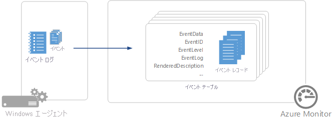

# Azure Monitor での Windows イベント ログのデータ ソース
Windows イベント ログは、多くのアプリケーションが書き込みを行うため、Windows エージェントを使用してデータを収集する際の最も一般的な[データ ソース](agent-data-sources.md) の 1 つです。  システムやアプリケーションなどの標準ログに加えて、アプリケーションによって作成される監視が必要なカスタム ログを指定して、イベントを収集できます。

     

## Windows イベント ログの構成
Windows イベント ログは、[[詳細設定] の [データ] メニュー](agent-data-sources.md#configuring-data-sources)から構成します。

Azure Monitor は、設定で指定されている Windows イベント ログのイベントのみを収集します。  イベント ログを追加するには、追加するログの名前を入力して、**+** をクリックします。  各ログについて、選択した重大度レベルのイベントのみが収集されます。  各ログで収集する重大度レベルにチェックマークを入れます。  イベントをフィルター処理するための追加条件を指定することはできません。

イベント ログの名前を入力していくと、Azure Monitor が一般的なイベント ログ名の候補を表示します。 追加しようとするログが候補リストに表示されない場合、ログの完全な名前を入力して追加することもできます。 ログの完全な名前はイベント ビューアーを使用して確認できます。 イベント ビューアーで、ログの *[プロパティ]* ページを開き、*[フル ネーム]* フィールドの文字列をコピーします。

## データ収集
Azure Monitor は、監視対象のイベントが作成されたときに、選択された重大度に一致する各イベントをそのイベント ログから収集します。  エージェントは、収集元の場所を各イベント ログに記録します。  エージェントは、一定の期間オフラインになった場合、最後に停止した時点からのイベントを収集します。これには、エージェントがオフライン中に作成されたイベントも含まれます。  エージェントがオフラインのときに、未収集のイベントにラップされたイベント ログが上書きされた場合は、これらのイベントが収集されない可能性もあります。

>[!NOTE]
>Azure Monitor は、 *クラシック*または*監査成功*のキーワードおよびキーワード *0xa0000000000000* を含む、イベント ID が 18453 のソース *MSSQLSERVER* から SQL Server によって作成された監査イベントは収集しません。
>

## Windows イベント レコードのプロパティ
Windows イベント レコードの型は **Event** になり、次の表に示すプロパティがあります。

| プロパティ | 説明 |
|:--- |:--- |
| Computer |イベント収集元のコンピューターの名前。 |
| EventCategory |イベントのカテゴリ。 |
| EventData |元の形式のすべてのイベント データ。 |
| EventID |イベントの番号。 |
| EventLevel |数値形式で示すイベントの重大度。 |
| EventLevelName |テキスト形式で示すイベントの重大度。 |
| EventLog |イベント収集元のイベント ログの名前。 |
| ParameterXml |XML 形式でのイベント パラメーターの値。 |
| ManagementGroupName |System Center Operations Manager エージェントの管理グループの名前。  その他のエージェントの場合、この値は AOI-<workspace ID> です。 |
| RenderedDescription |イベントの説明とパラメーターの値 |
| Source |イベントのソース。 |
| SourceSystem |イベント収集元のエージェントの種類。   OpsManager – Windows エージェント、直接接続または Operations Manager による管理   Linux – すべての Linux エージェント    AzureStorage – Azure 診断 |
| TimeGenerated |イベントが Windows で作成された日付と時刻。 |
| UserName |イベントのログを記録したアカウントのユーザー名。 |

## Windows イベントでのログ クエリ
次の表は、Windows イベント レコードを取得するログ クエリのさまざまな例を示しています。

| クエリ | 説明 |
|:---|:---|
| Event |すべての Windows イベント。 |
| Event &#124; where EventLevelName == "error" |重大度が「エラー」のすべての Windows イベント。 |
| Event &#124; summarize count() by Source |ソース別の Windows イベントの数。 |
| Event &#124; where EventLevelName == "error" &#124; summarize count() by Source |ソース別の Windows エラー イベントの数。 |

## 次の手順
* 分析のために他の[データ ソース](agent-data-sources.md)を収集するように Azure Monitor を構成します。
* [ログ クエリ](../../log-analytics/log-analytics-queries.md)について学習し、データ ソースとソリューションから収集されたデータを分析します。  
* お使いの Windows エージェントから [パフォーマンス カウンターの収集](data-sources-performance-counters.md) を構成します。
