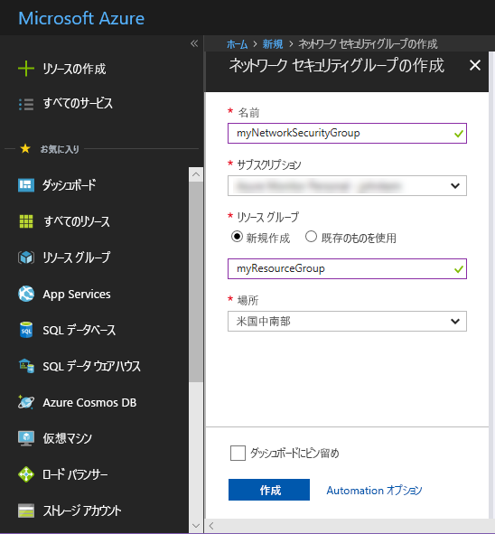
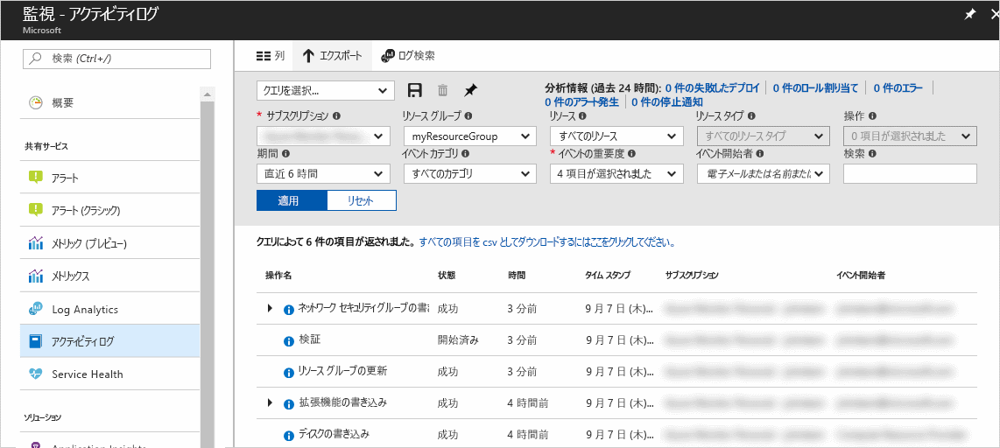
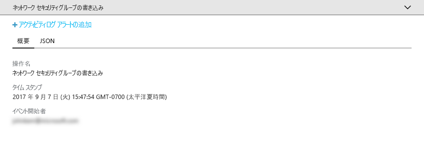
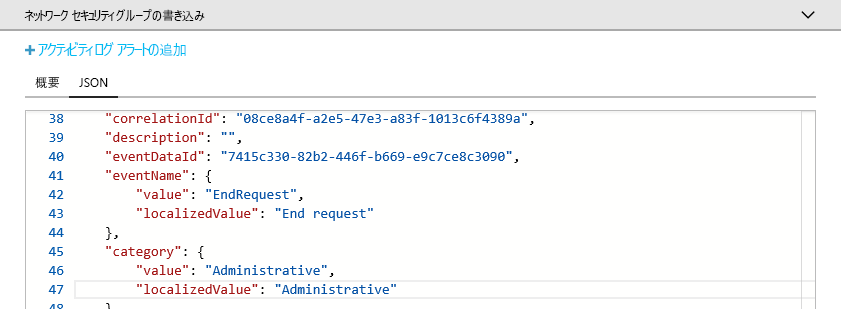
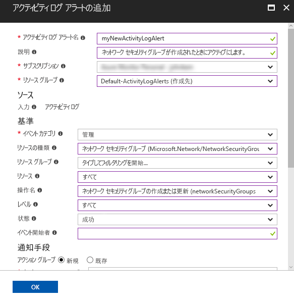
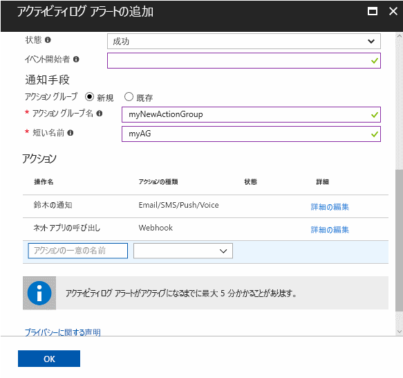

# Azure サブスクリプションの重要なアクションを監査して通知を受信する

**Azure アクティビティ ログ**は、Azure でのサブスクリプション レベルのイベント履歴を提供します。 このログは、"*誰*" が "*どの*" リソースを "*いつ*" 作成、更新、または削除したかについての情報を提供します。 **アクティビティ ログ アラート**を作成して、アラート条件に一致するアクティビティが発生したときに、電子メール、SMS、または Webhook で通知を受信できます。 このクイック スタートでは、単純なネットワーク セキュリティ グループを作成し、イベントの発生をアクティビティ ログを参照して理解した後、ネットワークセキュリティ グループが作成されたときに通知を受信するようにアクティビティ ログ アラートを設定します。

Azure サブスクリプションをお持ちでない場合は、開始する前に[無料](https://azure.microsoft.com/free/)アカウントを作成してください。

## Azure Portal にログインする

[Azure Portal](https://portal.azure.com/) にログインします。

## ネットワーク セキュリティ グループの作成

1. Azure Portal の左上隅にある **[リソースの作成]** ボタンをクリックします。

2. **[ネットワーク]** を選択し、**[ネットワーク セキュリティ グループ]** を選択します。

3. **[名前]** として「myNetworkSG」 を入力し、**myResourceGroup** という名前の新しいリソース グループを作成します。 **[作成]** ボタンをクリックします。

    

## ポータルでアクティビティ ログを参照する

アクティビティ ログに、ネットワーク セキュリティ グループの作成を示すイベントが追加されています。 次の手順で、そのイベントを識別します。

1. 左側のナビゲーション一覧の **[モニター]** ボタンをクリックします。 [アクティビティ ログ] セクションが開きます。 このセクションには、特定のサブスクリプションのリソースに対して実行されたすべてのアクションの履歴が表示されます。アクションは、**[リソース グループ]**、**[時間枠]**、**[カテゴリ]** などのさまざまなプロパティによってフィルター処理できます。

2. **[アクティビティ ログ]** セクションで、**[リソース グループ]** ドロップダウンをクリックし、**[myResourceGroup]** を選択します。 **[時間枠]** ドロップダウンで、**[過去 1 時間]** に変更します。 **[Apply]** をクリックします。

    

3. 表示されているイベント テーブルの **[NetworkSecurityGroups の書き込み]** イベントをクリックします。

## アクティビティ ログでイベントを参照する

表示されたセクションには、実行された操作の基本的な詳細 (名前、タイムスタンプ、操作を実行したユーザーまたはアプリケーションなど) が含まれています。

イベントの詳細をすべて表示するには、**[JSON]** タブをクリックします。 このタブには、操作を実行するための承認方法、イベント カテゴリとレベル、および操作の状態の詳細が含まれています。

## アクティビティ ログ アラートを作成する

1. **[概要]** タブをクリックして、イベントの概要に戻ります。

2. 表示された [概要] セクションで、**[アクティビティ ログ アラートの追加]** をクリックします。

    

3. 表示されたセクションで、アクティビティ ログ アラートに名前を付けます。

4. **[条件]** の **[イベント カテゴリ]** が **[管理者]** に、**[リソースの種類]** が **[ネットワーク セキュリティ グループ]** に、**[操作名]** が **[Create or Update Network Security Group]\(ネットワークセキュリティグループの作成または更新\)** に、**[状態]** が **[成功]** に設定され、その他の条件フィールドは空白であるか **[すべて]** が設定されていることを確認します。 条件は、アクティビティ ログに新しいイベントが出現したときにアラートをアクティブ化するかどうかを判断するためのルールを定義します。

    

5. **[通知手段]** で、**[新規]** アクション グループを選択し、アクション グループの **[名前]** と **[短い名前]** を指定します。 アクション グループは、アラートがアクティブ化された場合 (新しいイベントが条件と一致した場合) に実行されるアクション セットを定義します。

6. **[アクション]** に 1 つ以上のアクションを追加します。アクションの **[名前]**、**[アクションの種類]** (電子メールや SMS、Webhook など)、および特定のアクションの種類の **[詳細]** (Webhook URL、電子メール アドレス、SMS 番号など) を指定します。

    

7. **[OK]** をクリックして、アクティビティ ログ アラートを保存します。

## アクティビティ ログ アラートをテストする

> [!NOTE]
> アクティビティ ログ アラートが完全に有効になるまで、約 5 分かかります。 アクティビティ ログ アラートが完全に有効になる前に発生した新しいイベントでは、通知は生成されません。
>
>

アラートをテストする前に、「**ネットワーク セキュリティ グループを作成する**」セクションの手順を繰り返しますが、今回のネットワーク セキュリティ グループには別の名前を付け、既存のリソース グループを再利用します。 数分以内に、ネットワーク セキュリティ グループが作成されたことを示す通知を受信します。

## リソースのクリーンアップ

リソース グループとネットワーク セキュリティ グループが不要になったら、それらを削除します。 これを行うには、ポータルの上部にある [検索] ボックスに作成したリソース グループの名前を入力した後、リソース グループの名前をクリックします。 表示されたセクションで、**[リソース グループの削除]** ボタンをクリックし、リソース グループの名前を入力し、**[削除]** をクリックします。

## 次の手順

このクイック スタートでは、アクティビティ ログ イベントを生成する操作を実行した後、この操作が再度発生したときに通知を送信するアクティビティ ログ アラートを作成しました。 その後、操作をもう一度実行することで、アラートをテストしました。 Azure では、過去 90 日間のアクティビティ ログ イベントを使用できるようにしています。 90 日を超えてイベントを保持する必要がある場合は、アクティビティ ログ データをその他の監視データと共にアーカイブすることを試してください。

> [!div class="nextstepaction"]
> [監視データをアーカイブする](./../../monitoring-and-diagnostics/monitor-tutorial-archive-monitoring-data.md)
