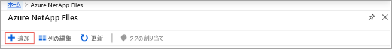
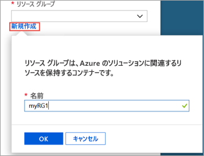
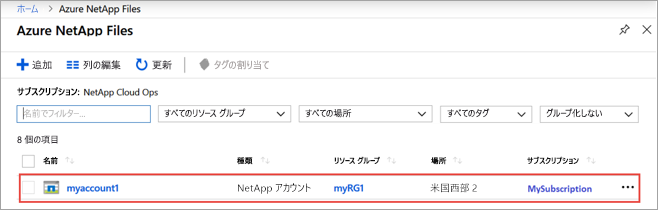
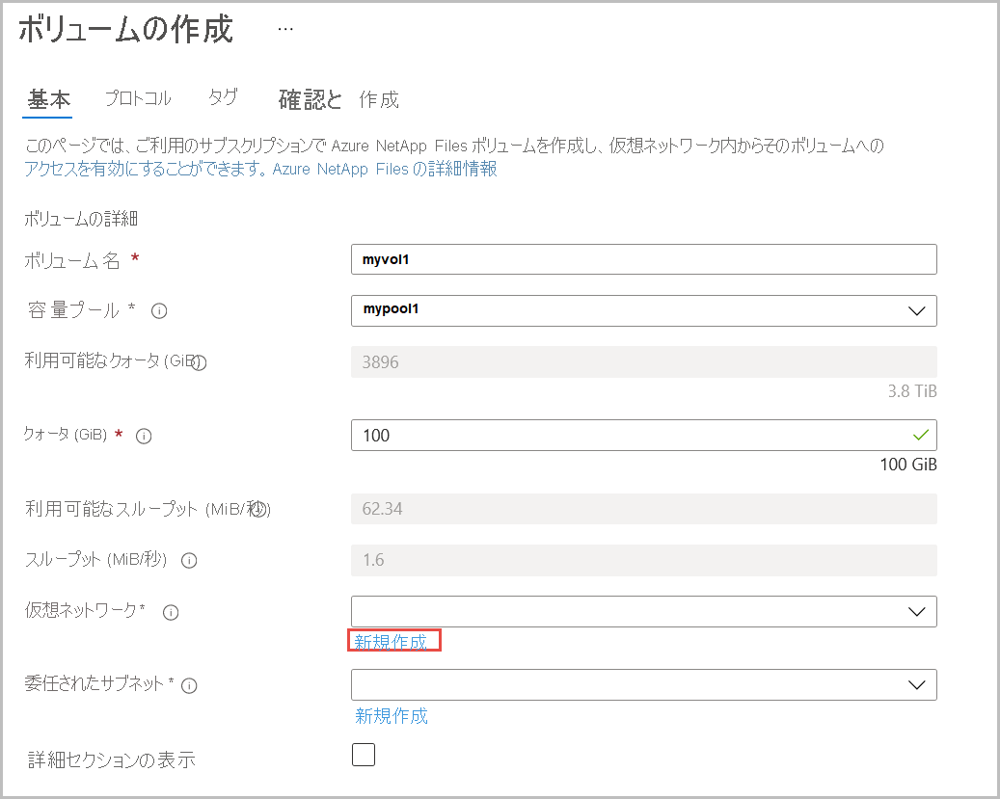
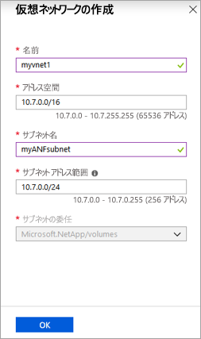
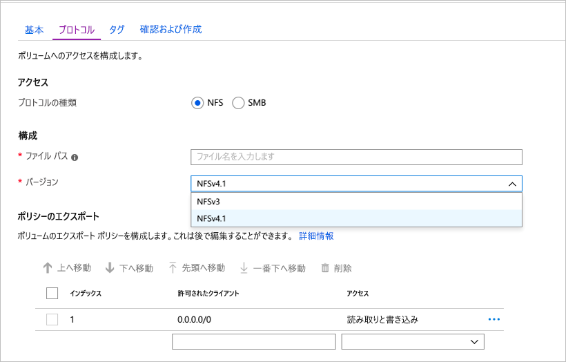
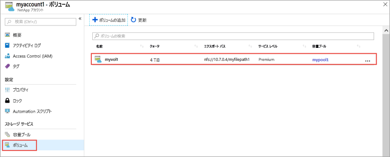
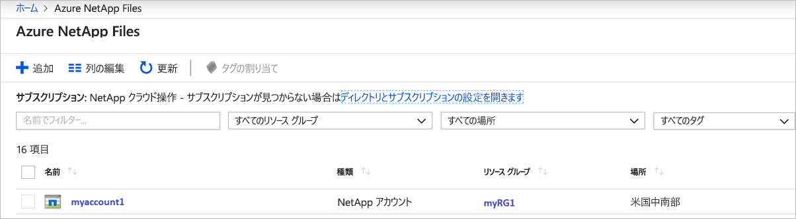
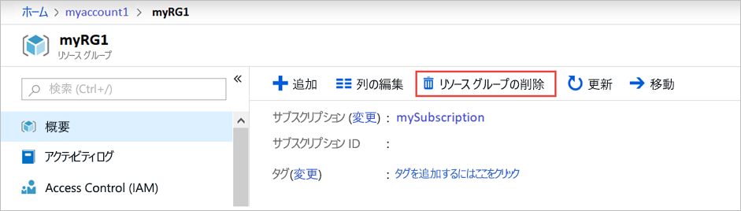
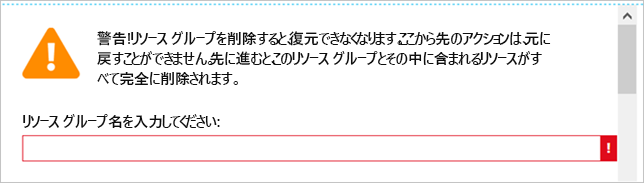

# <a name="quickstart-set-up-azure-netapp-files-and-create-an-nfs-volume"></a>クイック スタート:Azure NetApp Files を設定し、NFS ボリュームを作成する 

この記事では、簡単に Azure NetApp Files を設定し、ボリュームを作成する方法について説明します。 

このクイック スタートでは、次の項目を設定します。

- Azure NetApp Files と NetApp リソース プロバイダーの登録
- NetApp アカウント
- 容量プール
- Azure NetApp Files の NFS ボリューム

Azure サブスクリプションをお持ちでない場合は、開始する前に [無料アカウント](https://azure.microsoft.com/free/?WT.mc_id=A261C142F) を作成してください。

## <a name="before-you-begin"></a>開始する前に 

> [!IMPORTANT] 
> Azure NetApp Files サービスへのアクセスを許可されている必要があります。  サービスへのアクセスを要求するには、[Azure NetApp Files 順番待ちリスト送信ページ](https://forms.office.com/Pages/ResponsePage.aspx?id=v4j5cvGGr0GRqy180BHbR8cq17Xv9yVBtRCSlcD_gdVUNUpUWEpLNERIM1NOVzA5MzczQ0dQR1ZTSS4u)を参照してください。  次の手順に進む前に、Azure NetApp Files チームから正式な確認メールが届くのを待つ必要があります。 

[!INCLUDE [cloud-shell-try-it.md](../../includes/cloud-shell-try-it.md)]

---

## <a name="register-for-azure-netapp-files-and-netapp-resource-provider"></a>Azure NetApp Files と NetApp リソース プロバイダーに登録する

> [!NOTE]
> 登録プロセスは、完了するまでに時間がかかることがあります。
>

# <a name="portal"></a>[ポータル](#tab/azure-portal)

ポータルを使用して登録手順を行う場合は、前述のように Cloud Shell セッションを開き、次の Azure CLI の手順を実行します。

[!INCLUDE [azure-netapp-files-cloudshell-include](../../includes/azure-netapp-files-azure-cloud-shell-window.md)]

# <a name="powershell"></a>[PowerShell](#tab/azure-powershell)

このハウツー記事には、Azure PowerShell モジュール Az バージョン 2.6.0 以降が必要です。 現在のバージョンを調べるには、`Get-Module -ListAvailable Az` を実行します。 インストールまたはアップグレードする必要がある場合は、[Azure PowerShell モジュールのインストール](/powershell/azure/install-Az-ps)に関するページを参照してください。 必要に応じて、PowerShell セッションで Cloud Shell コンソールを使用することもできます。

1. PowerShell コマンド プロンプト (または PowerShell Cloud Shell セッション) で、Azure NetApp Files に対してホワイトリストに登録されているサブスクリプションを指定します。
    ```powershell-interactive
    Select-AzSubscription -Subscription <subscriptionId>
    ```

2. Azure リソース プロバイダーを登録します。
    ```powershell-interactive
    Register-AzResourceProvider -ProviderNamespace Microsoft.NetApp
    ```

# <a name="azure-cli"></a>[Azure CLI](#tab/azure-cli)

[!INCLUDE [azure-netapp-files-cloudshell-include](../../includes/azure-netapp-files-azure-cloud-shell-window.md)]

---

## <a name="create-a-netapp-account"></a>NetApp アカウントを作成する

# <a name="portal"></a>[ポータル](#tab/azure-portal)

1. Azure portal の [検索] ボックスに「**Azure NetApp Files**」と入力し、表示された一覧から **[Azure NetApp Files]** を選択します。

      

2. **[+ 追加]** をクリックして新しい NetApp アカウントを作成します。

     

3. [新しい NetApp アカウント] ウィンドウで、次の情報を指定します。 
   1. アカウント名に「**myaccount1**」と入力します。 
   2. サブスクリプションを選択します。
   3. **[新規作成]** を選択し、新しいリソース グループを作成します。 リソース グループ名に「**myRG1**」と入力します。 **[OK]** をクリックします。 
   4. アカウントの場所を選択します。  

      ![[新しい NetApp アカウント] ウィンドウ](../media/azure-netapp-files/azure-netapp-files-new-account-window.png)  

      

4. **[作成]** をクリックし、新しい NetApp アカウントを作成します。

# <a name="powershell"></a>[PowerShell](#tab/azure-powershell)

1. 他の例でも参照できるように、いくつかの変数を定義します。

    ```powershell-interactive
    $resourceGroup = "myRG1"
    $location = "eastus"
    $anfAccountName = "myaccount1"
    ``` 

    > [!NOTE]
    > サポートされているリージョンの一覧については、「[リージョン別の利用可能な製品](https://azure.microsoft.com/global-infrastructure/services/?products=netapp&regions=all)」を参照してください。
    > コマンド ライン ツールでサポートされているリージョン名を取得するには、`Get-AzLocation | select Location` を使用してください。
    >

1. [New-AzResourceGroup](/powershell/module/az.resources/new-azresourcegroup) コマンドを使用して、新しいリソース グループを作成します。

    ```powershell-interactive
    New-AzResourceGroup -Name $resourceGroup -Location $location
    ```

2. [New-AzNetAppFilesAccount](/powershell/module/az.netappfiles/New-AzNetAppFilesAccount) コマンドを使用して Azure NetApp Files アカウントを作成します。
   
    ```powershell-interactive
    New-AzNetAppFilesAccount -ResourceGroupName $resourceGroup -Location $location -Name $anfAccountName
    ```

# <a name="azure-cli"></a>[Azure CLI](#tab/azure-cli)

1. 他の例でも参照できるように、いくつかの変数を定義します。

    ```azurecli-interactive
    RESOURCE_GROUP="myRG1"
    LOCATION="eastus"
    ANF_ACCOUNT_NAME="myaccount1"
    ``` 

    > [!NOTE]
    > サポートされているリージョンの一覧については、「[リージョン別の利用可能な製品](https://azure.microsoft.com/global-infrastructure/services/?products=netapp&regions=all)」を参照してください。
    > コマンド ライン ツールでサポートされているリージョン名を取得するには、`az account list-locations -query "[].{Region:name}" --out table` を使用してください。
    >

2. [az group create](/cli/azure/group#az-group-create) コマンドを使って新しいリソース グループを作成します。

    ```azurecli-interactive
    az group create \
        --name $RESOURCE_GROUP \
        --location $LOCATION
    ```

3. [az netappfiles account create](/cli/azure/netappfiles/account#az-netappfiles-account-create) コマンドを使用して Azure NetApp Files アカウントを作成します。
   
    ```azurecli-interactive
    az netappfiles account create \
        --resource-group $RESOURCE_GROUP \
        --location $LOCATION \
        --account-name $ANF_ACCOUNT_NAME
    ```
---

## <a name="set-up-a-capacity-pool"></a>容量プールを設定する

# <a name="portal"></a>[ポータル](#tab/azure-portal)

1. Azure NetApp Files 管理ブレードで、自分の NetApp アカウント (**myaccount1**) を選択します。

      

2. 自分の NetApp アカウントの Azure NetApp Files 管理ブレードで、 **[容量プール]** をクリックします。

    ![[容量プール] をクリックする](../media/azure-netapp-files/azure-netapp-files-click-capacity-pools.png)  

3. **[+ プールの追加]** をクリックします。 

    ![[プールの追加] をクリックする](../media/azure-netapp-files/azure-netapp-files-click-add-pools.png)  

4. 容量プールの情報を指定します。 
    1. プール名として「**mypool1**」と入力します。
    2. サービス レベルに **[Premium]** を選択します。 
    3. プール サイズとして **4 (TiB)** を選択します。 

5. **[OK]** をクリックします。

# <a name="powershell"></a>[PowerShell](#tab/azure-powershell)

1. 今後の参照用に新しい変数を定義する

    ```powershell-interactive
    $poolName = "mypool1"
    $poolSizeBytes = 4398046511104 # 4TiB
    $serviceLevel = "Premium" # Valid values are Standard, Premium and Ultra
    ```

1. [New-AzNetAppFilesPool](/powershell/module/az.netappfiles/new-aznetappfilespool) を使用して新しい容量プールを作成する

    ```powershell-interactive
    New-AzNetAppFilesPool -ResourceGroupName $resourceGroup -Location $location -AccountName $anfAccountName -Name $poolName -PoolSize $poolSizeBytes -ServiceLevel $serviceLevel
    ```

# <a name="azure-cli"></a>[Azure CLI](#tab/azure-cli)

1. 今後の参照用に新しい変数を定義する

    ```azurecli-interactive
    POOL_NAME="mypool1"
    POOL_SIZE_TiB=4 # Size in Azure CLI needs to be in TiB unit (minimum 4 TiB)
    SERVICE_LEVEL="Premium" # Valid values are Standard, Premium and Ultra
    ```

2. [az netappfiles pool create](/cli/azure/netappfiles/pool#az-netappfiles-pool-create) を使用して新しい容量プールを作成する 

    ```azurecli-interactive
    az netappfiles pool create \
        --resource-group $RESOURCE_GROUP \
        --location $LOCATION \
        --account-name $ANF_ACCOUNT_NAME \
        --pool-name $POOL_NAME \
        --size $POOL_SIZE_TiB \
        --service-level $SERVICE_LEVEL
    ```

---

## <a name="create-nfs-volume-for-azure-netapp-files"></a>Azure NetApp Files の NFS ボリュームを作成する

# <a name="portal"></a>[ポータル](#tab/azure-portal)

1. 自分の NetApp アカウントの Azure NetApp Files 管理ブレードで、 **[ボリューム]** をクリックします。

    ![[ボリューム] をクリックする](../media/azure-netapp-files/azure-netapp-files-click-volumes.png)  

2. **[+ ボリュームの追加]** をクリックします。

    ![[ボリュームの追加] をクリックする](../media/azure-netapp-files/azure-netapp-files-click-add-volumes.png)  

3. [ボリュームの作成] ウィンドウで、ボリュームの情報を指定します。 
   1. ボリューム名として「**myvol1**」と入力します。 
   2. 容量プールを選択します (**mypool1**)。
   3. クォータの既定値を使用します。 
   4. 仮想ネットワークで **[新規作成]** をクリックし、新しい Azure 仮想ネットワーク (Vnet) を作成します。  次の情報を入力します。
       * Vnet 名として「**myvnet1**」と入力します。
       * 10.7.0.0/16 など、自分の設定用のアドレス空間を指定します。
       * サブネット名として「**myANFsubnet**」と入力します。
       * 10.7.0.0/24 など、サブネット アドレス範囲を指定します。 専用サブネットは他のリソースと共有できません。
       * サブネットの委任に **[Microsoft.NetApp/volumes]** を選択します。
       * **[OK]** をクリックして Vnet を作成します。
   5. サブネットで、新しく作成した Vnet (**myvnet1**) を委任サブネットとして選択します。

        

        

4. **[プロトコル]** をクリックし、次のアクションを実行します。 
    * ボリュームのプロトコルの種類として **[NFS]** を選択します。  
    * ボリュームのエクスポート パスを作成する際に使用するファイル パスとして「**myfilepath1**」と入力します。  
    * ボリュームの NFS バージョン ( **[NFSv3]** または **[NFSv4.1]** ) を選択します。  
      NFS のバージョンについては、「[考慮事項](azure-netapp-files-create-volumes.md#considerations)」および「[ベスト プラクティス](azure-netapp-files-create-volumes.md#best-practice)」を参照してください。 
      
  

5. **[Review + create]\(レビュー + 作成\)** をクリックします。

    ![[確認と作成] ウィンドウ](../media/azure-netapp-files/azure-netapp-files-review-and-create-window.png)  

6. ボリュームの情報を確認し、 **[作成]** をクリックします。  
    作成されたボリュームが [ボリューム] ブレードに表示されます。

      

# <a name="powershell"></a>[PowerShell](#tab/azure-powershell)

1. [New-AzDelegation](/powershell/module/az.network/new-azdelegation) コマンドを使用して、"Microsoft.NetApp/volumes" へのサブネットの委任を作成します。

    ```powershell-interactive
    $anfDelegation = New-AzDelegation -Name ([guid]::NewGuid().Guid) -ServiceName "Microsoft.NetApp/volumes"
    ```

2. [New-AzVirtualNetworkSubnetConfig](/powershell/module/az.network/new-azvirtualnetworksubnetconfig) コマンドを使用して、サブネットの構成を作成します。

    ```powershell-interactive
    $subnet = New-AzVirtualNetworkSubnetConfig -Name "myANFSubnet" -AddressPrefix "10.7.0.0/24" -Delegation $anfDelegation
    ```

3. [New-AzVirtualNetwork](/powershell/module/az.network/new-azvirtualnetwork) コマンドを使用して、仮想ネットワークを作成します。
    
    ```powershell-interactive
    $vnet = New-AzVirtualNetwork -Name "myvnet1" -ResourceGroupName $resourceGroup -Location $location -AddressPrefix "10.7.0.0/16" -Subnet $subnet
    ```

4. [New-AzNetAppFilesVolume](/powershell/module/az.netappfiles/new-aznetappfilesvolume) コマンドを使用して、ボリュームを作成します。
   
    ```powershell-interactive
    $volumeSizeBytes = 1099511627776 # 100GiB
    $subnetId = $vnet.Subnets[0].Id

    New-AzNetAppFilesVolume -ResourceGroupName $resourceGroup `
        -Location $location `
        -AccountName $anfAccountName `
        -PoolName $poolName `
        -Name "myvol1" `
        -UsageThreshold $volumeSizeBytes `
        -SubnetId $subnetId `
        -CreationToken "myfilepath1" `
        -ServiceLevel $serviceLevel `
        -ProtocolType NFSv3
    ```

# <a name="azure-cli"></a>[Azure CLI](#tab/azure-cli)

1. 後で使用するために、いくつかの変数を定義します。
    
    ```azurecli-interactive
    VNET_NAME="myvnet1"
    SUBNET_NAME="myANFSubnet"
    ```

1. [az network vnet create](/cli/azure/network/vnet#az-network-vnet-create) コマンドを使用して、サブネットがない仮想ネットワークを作成します。
    
    ```azurecli-interactive
    az network vnet create \
        --resource-group $RESOURCE_GROUP \
        --name $VNET_NAME \
        --location $LOCATION \
        --address-prefix "10.7.0.0/16"

    ```

2. [az network vnet subnet create](/cli/azure/network/vnet/subnet#az-network-vnet-subnet-create) コマンドを使用して、委任されたサブネットを作成します。

    ```azurecli-interactive
    az network vnet subnet create \
        --resource-group $RESOURCE_GROUP \
        --vnet-name $VNET_NAME \
        --name $SUBNET_NAME \
        --address-prefixes "10.7.0.0/24" \
        --delegations "Microsoft.NetApp/volumes"
    ```

3. [az netappfiles volume create](/cli/azure/netappfiles/volume#az-netappfiles-volume-create) コマンドを使用して、ボリュームを作成します。
   
    ```azurecli-interactive
    VNET_ID=$(az network vnet show --resource-group $RESOURCE_GROUP --name $VNET_NAME --query "id" -o tsv)
    SUBNET_ID=$(az network vnet subnet show --resource-group $RESOURCE_GROUP --vnet-name $VNET_NAME --name $SUBNET_NAME --query "id" -o tsv)
    VOLUME_SIZE_GiB=100 # 100 GiB
    UNIQUE_FILE_PATH="myfilepath2" # Please note that creation token needs to be unique within subscription and region

    az netappfiles volume create \
        --resource-group $RESOURCE_GROUP \
        --location $LOCATION \
        --account-name $ANF_ACCOUNT_NAME \
        --pool-name $POOL_NAME \
        --name "myvol1" \
        --service-level $SERVICE_LEVEL \
        --vnet $VNET_ID \
        --subnet $SUBNET_ID \
        --usage-threshold $VOLUME_SIZE_GiB \
        --file-path $UNIQUE_FILE_PATH \
        --protocol-types "NFSv3"
    ```

---

## <a name="clean-up-resources"></a>リソースをクリーンアップする

# <a name="portal"></a>[ポータル](#tab/azure-portal)

手順が終了していて必要な場合、リソース グループを削除することができます。 リソース グループの削除操作は、元に戻すことができません。  

> [!IMPORTANT]
> リソース グループ内のすべてのリソースが完全に削除され、元に戻すことはできません。 

1. Azure portal の [検索] ボックスに「**Azure NetApp Files**」と入力し、表示された一覧から **[Azure NetApp Files]** を選択します。

2. サブスクリプションの一覧で、削除するリソース グループ (myRG1) をクリックします。 

    


3. [リソース グループ] ページで、 **[リソース グループの削除]** をクリックします。

     

    ウィンドウが開き、リソース グループと共に削除されるリソースに関する警告が表示されます。

4. リソース グループの名前 (myRG1) を入力して、リソース グループとその中のすべてのリソースを完全に削除することを確認してから、 **[削除]** をクリックします。

     

# <a name="powershell"></a>[PowerShell](#tab/azure-powershell)

手順が終了していて必要な場合、リソース グループを削除することができます。 リソース グループの削除操作は、元に戻すことができません。  

> [!IMPORTANT]
> リソース グループ内のすべてのリソースが完全に削除され、元に戻すことはできません。

1. [Remove-AzResourceGroup](/powershell/module/az.resources/remove-azresourcegroup) コマンドを使用して、リソース グループを削除します。
   
    ```powershell-interactive
    Remove-AzResourceGroup -Name $resourceGroup
    ```

# <a name="azure-cli"></a>[Azure CLI](#tab/azure-cli)

手順が終了していて必要な場合、リソース グループを削除することができます。 リソース グループの削除操作は、元に戻すことができません。  

> [!IMPORTANT]
> リソース グループ内のすべてのリソースが完全に削除され、元に戻すことはできません。

1. [az group delete](/cli/azure/group#az-group-delete) コマンドを使用して、リソース グループを削除します。
   
    ```azurecli-interactive
    az group delete \
        --name $RESOURCE_GROUP
    ```
---

## <a name="next-steps"></a>次のステップ  

> [!div class="nextstepaction"]
> [Azure NetApp Files を使用してボリュームを管理する](azure-netapp-files-manage-volumes.md)  
