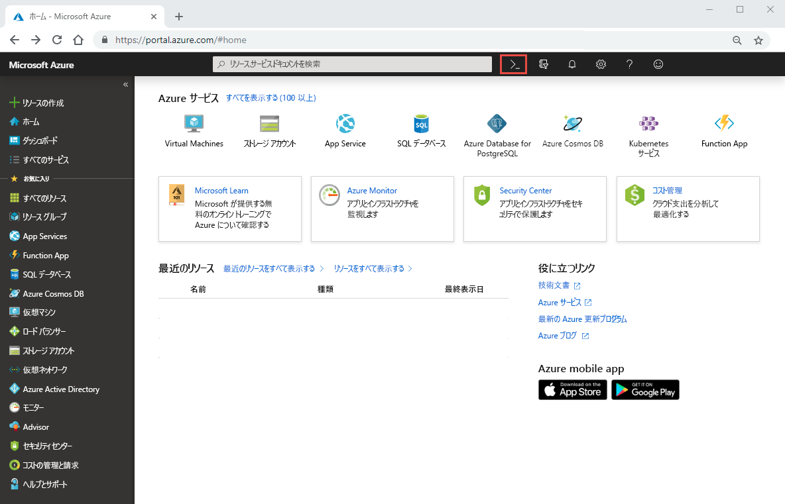

# クイック スタート:Azure NetApp Files を設定し、NFS ボリュームを作成する 

この記事では、簡単に Azure NetApp Files を設定し、ボリュームを作成する方法について説明します。 

このクイック スタートでは、次の項目を設定します。

- Azure NetApp Files と NetApp リソース プロバイダーの登録
- NetApp アカウント
- 容量プール
- Azure NetApp Files の NFS ボリューム

Azure サブスクリプションをお持ちでない場合は、開始する前に [無料アカウント](https://azure.microsoft.com/free/?WT.mc_id=A261C142F) を作成してください。

## 開始する前に 

> [!IMPORTANT] 
> Azure NetApp Files サービスへのアクセスを許可されている必要があります。  サービスへのアクセスを要求するには、[Azure NetApp Files 順番待ちリスト送信ページ](https://forms.office.com/Pages/ResponsePage.aspx?id=v4j5cvGGr0GRqy180BHbR8cq17Xv9yVBtRCSlcD_gdVUNUpUWEpLNERIM1NOVzA5MzczQ0dQR1ZTSS4u)を参照してください。  次の手順に進む前に、Azure NetApp Files チームから正式な確認メールが届くのを待つ必要があります。 

## Azure NetApp Files と NetApp リソース プロバイダーに登録する

1. Azure portal で、右上隅にある Azure Cloud Shell アイコンをクリックします。

    

2. Azure NetApp Files に対してホワイトリスト登録されているサブスクリプションを指定します。
    
        az account set --subscription <subscriptionId>

3. Azure リソース プロバイダーを登録します。 
    
        az provider register --namespace Microsoft.NetApp --wait  

    登録プロセスは、完了するまでに時間がかかることがあります。

## NetApp アカウントを作成する

1. Azure portal の [検索] ボックスに「**Azure NetApp Files**」と入力し、表示された一覧から **[Azure NetApp Files (プレビュー)]** を選択します。

      

2. **[+ 追加]** をクリックして新しい NetApp アカウントを作成します。

     

3. [新しい NetApp アカウント] ウィンドウで、次の情報を指定します。 
   1. アカウント名に「**myaccount1**」と入力します。 
   2. サブスクリプションを選択します。
   3. **[新規作成]** を選択し、新しいリソース グループを作成します。 リソース グループ名に「**myRG1**」と入力します。 Click **OK**. 
   4. アカウントの場所を選択します。  

      ![[新しい NetApp アカウント] ウィンドウ](../media/azure-netapp-files/azure-netapp-files-new-account-window.png)  

      

4. **[作成]** をクリックし、新しい NetApp アカウントを作成します。

## 容量プールを設定する

1. Azure NetApp Files 管理ブレードで、自分の NetApp アカウント (**myaccount1**) を選択します。

      

2. 自分の NetApp アカウントの Azure NetApp Files 管理ブレードで、 **[容量プール]** をクリックします。

    ![[容量プール] をクリックする](../media/azure-netapp-files/azure-netapp-files-click-capacity-pools.png)  

3. **[+ プールの追加]** をクリックします。 

    ![[プールの追加] をクリックする](../media/azure-netapp-files/azure-netapp-files-click-add-pools.png)  

4. 容量プールの情報を指定します。 
    1. プール名として「**mypool1**」と入力します。
    2. サービス レベルに **[Premium]** を選択します。 
    3. プール サイズとして **4 (TiB)** を選択します。 

5. Click **OK**.

## Azure NetApp Files の NFS ボリュームを作成する

1. 自分の NetApp アカウントの Azure NetApp Files 管理ブレードで、 **[ボリューム]** をクリックします。

    ![[ボリューム] をクリックする](../media/azure-netapp-files/azure-netapp-files-click-volumes.png)  

2. **[+ ボリュームの追加]** をクリックします。

    ![[ボリュームの追加] をクリックする](../media/azure-netapp-files/azure-netapp-files-click-add-volumes.png)  

3. [ボリュームの作成] ウィンドウで、ボリュームの情報を指定します。 
   1. ボリューム名として「**myvol1**」と入力します。 
   3. 容量プールを選択します (**mypool1**)。
   4. クォータの既定値を使用します。 
   5. 仮想ネットワークで **[新規作成]** をクリックし、新しい Azure 仮想ネットワーク (Vnet) を作成します。  次の情報を入力します。
       * Vnet 名として「**myvnet1**」と入力します。
       * 10.7.0.0/16 など、自分の設定用のアドレス空間を指定します。
       * サブネット名として「**myANFsubnet**」と入力します。
       * 10.7.0.0/24 など、サブネット アドレス範囲を指定します。 専用サブネットは、他のリソースと共有できないことに注意してください。
       * サブネットの委任に **[Microsoft.NetApp/volumes]** を選択します。
       * **[OK]** をクリックして Vnet を作成します。
   6. サブネットで、新しく作成した Vnet (**myvnet1**) を委任サブネットとして選択します。

        

        

4. **[プロトコル]** をクリックし、ボリュームのプロトコルの種類として **[NFS]** を選択します。   

    ボリュームのエクスポート パスを作成する際に使用するファイル パスとして「**myfilepath1**」と入力します。 

    

5. **[Review + create]\(レビュー + 作成\)** をクリックします。

    ![[確認と作成] ウィンドウ](../media/azure-netapp-files/azure-netapp-files-review-and-create-window.png)  

5. ボリュームの情報を確認し、 **[作成]** をクリックします。  
    作成されたボリュームが [ボリューム] ブレードに表示されます。

      

## リソースのクリーンアップ

手順が終了していて必要な場合、リソース グループを削除することができます。 リソース グループの削除操作は、元に戻すことができません。  

> [!IMPORTANT]
> リソース グループ内のすべてのリソースが完全に削除され、元に戻すことはできません。 

1. Azure portal の [検索] ボックスに「**Azure NetApp Files**」と入力し、表示された一覧から **[Azure NetApp Files]** を選択します。

2. サブスクリプションの一覧で、削除するリソース グループ (myRG1) をクリックします。 

    

3. [リソース グループ] ページで、 **[リソース グループの削除]** をクリックします。

     

    ウィンドウが開き、リソース グループと共に削除されるリソースに関する警告が表示されます。

4. リソース グループの名前 (myRG1) を入力して、リソース グループとその中のすべてのリソースを完全に削除することを確認してから、 **[削除]** をクリックします。

     

## 次の手順  

> [!div class="nextstepaction"]
> [Azure NetApp Files を使用してボリュームを管理する](azure-netapp-files-manage-volumes.md)  
