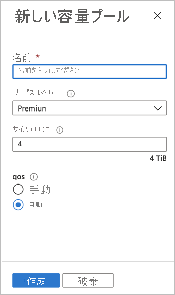

# 容量プールを設定する
容量プールを設定すると、そこにボリュームを作成できるようになります。  

## 開始する前に 
あらかじめ NetApp アカウントを作成しておく必要があります。   

[NetApp アカウントを作成する](azure-netapp-files-create-netapp-account.md)

## 手順 

1. NetApp アカウントの管理ブレードに移動し、ナビゲーション ウィンドウから **[容量プール]** を選択します。

2. **[+ プールの追加]** をクリックして新しい容量プールを作成します。   
    [New Capacity Pool]\(新しい容量プール\) ウィンドウが表示されます。

3. 新しい容量プールに関して、次の情報を入力します。  
  * **名前**  
    容量プールの名前を指定します。  
    容量プールの名前は、NetApp アカウントごとに一意であることが必要です。

  * **サービス レベル**   
    このフィールドには、容量プールのターゲット パフォーマンスが表示されます。  
    現在利用できるのは Premium サービス レベルのみです。 

  *  **サイズ**     
      購入する容量プールのサイズを指定します。        
      容量プールの最小サイズは 4 TiB です。 プールは、4 TiB の倍数のサイズで作成することができます。   
      
      

4. Click **OK**.

## 次の手順 

1. [Azure NetApp Files のボリュームを作成する](azure-netapp-files-create-volumes.md)
2. [ボリュームのエクスポート ポリシーを構成する (省略可能)](azure-netapp-files-configure-export-policy.md)

