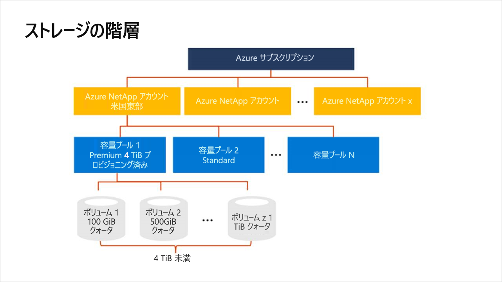

# Azure NetApp Files のストレージ階層を理解する

Azure NetApp Files のボリュームを作成する前に、プロビジョニング容量のプールを購入して設定する必要があります。  容量プールを設定するには、NetApp アカウントが必要です。 ストレージ階層についての理解は、Azure NetApp Files のリソースを設定および管理するうえで役立ちます。

## NetApp アカウント

- NetApp アカウントは、構成容量プールの管理グループとしての役割を果たします。  
- NetApp アカウントは、一般的な Azure Storage アカウントとは異なります。 
- NetApp アカウントは、範囲がリージョン単位となります。   
- 1 つのリージョンで複数の NetApp アカウントを持つことはできますが、個々の NetApp アカウントが関連付けられるリージョンは 1 つだけです。

## 容量プール

- 容量プールは、そのプロビジョニング容量で測定されます。  
- 容量は、購入した固定 SKU 単位でプロビジョニングされます (4 TB 容量など)。
- 容量プールに割り当てることができるサービス レベルは 1 つだけです。  
  現在利用できるのは Premium サービス レベルのみです。
- 各容量プールが従属する NetApp アカウントは 1 つだけです。  
- 1 つの容量プールを複数の NetApp アカウントにまたがって移動することはできません。   
  たとえば、下の「[ストレージ階層の概念図](#conceptual_diagram_of_storage_hierarchy)」で、容量プール 1 を米国東部の NetApp アカウントから米国西部 2 の NetApp アカウントへ移動することはできません。  

## ボリューム

- ボリュームは、論理容量消費で測定され、1 ボリュームあたりのスケーリングの上限は 100 TB となります。
- ボリュームの容量消費は、そのプールのプロビジョニング容量を前提としてカウントされます。
- 各ボリュームが従属するプールは 1 つだけですが、1 つのプールは複数のボリュームを含むことができます。 
- 同じ NetApp アカウント内であれば、プールの境界を越えてボリュームを移動することができます。    
  たとえば、下の「[ストレージ階層の概念図](#conceptual_diagram_of_storage_hierarchy)」で、容量プール 1 のボリュームを容量プール 2 に移動することができます。

## ストレージ階層の概念図 
次の例は、Azure サブスクリプション、NetApp アカウント、容量プール、ボリュームの関係を示したものです。   

## 次の手順

1. [NetApp アカウントを作成する](azure-netapp-files-create-netapp-account.md)
2. [容量プールを設定する](azure-netapp-files-set-up-capacity-pool.md)
3. [Azure NetApp Files のボリュームを作成する](azure-netapp-files-create-volumes.md)
4. [ボリュームのエクスポート ポリシーを構成する (省略可能)](azure-netapp-files-configure-export-policy.md)