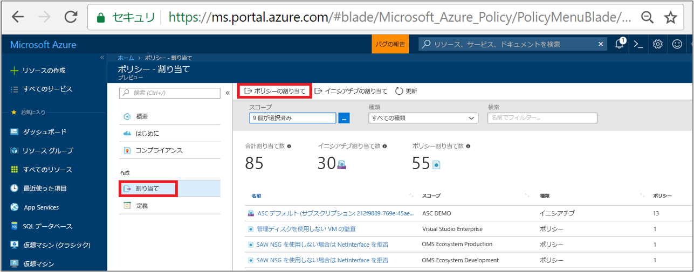
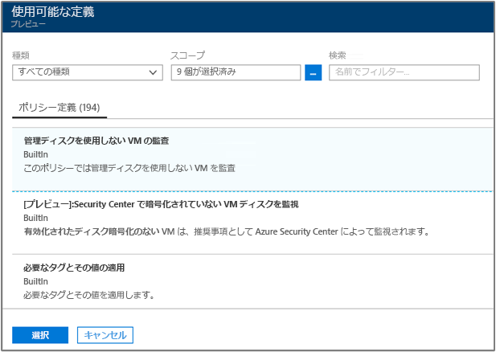
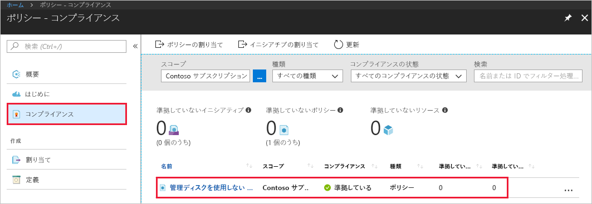
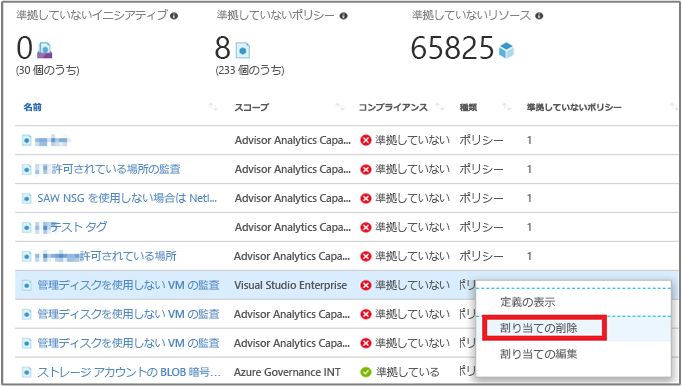

# ポリシーの割り当てを作成し、Azure 環境内の準拠していないリソースを特定する
Azure のコンプライアンスを理解する第一歩は、リソースの状態を特定することです。 このクイックスタートでは、ポリシー割り当てを作成して、管理ディスクを使用していない仮想マシンを特定するプロセスについて順を追って説明します。

このプロセスを終了すると、管理ディスクを使用していない仮想マシンを適切に特定できるようになります。 これらはポリシー割り当てに*準拠していません*。

Azure サブスクリプションをお持ちでない場合は、開始する前に [無料アカウント](https://azure.microsoft.com/free/?WT.mc_id=A261C142F) を作成してください。

## ポリシー割り当てを作成する

このクイックスタートでは、ポリシー割り当てを作成し、"*管理ディスクのない仮想マシンを監査*" ポリシー定義を割り当てます。

1. Azure Portal ページの左側のウィンドウで **[割り当て]** を選択します。
2. **[割り当て]** ウィンドウの上部で **[ポリシーの割り当て]** を選択します。

   

3. **[Assign Policy]\(ポリシーの割り当て\)** ページで、**[ポリシー]** フィールドの横にあるをクリックして、使用できる定義の一覧を開きます。

   

   Azure Policy には、使用できる組み込みのポリシー定義があらかじめ含まれています。 次のような組み込みのポリシー定義が表示されます。

   - タグとその値を強制
   - タグとその値を適用
   - SQL Server バージョン 12.0 が必要

    使用できるすべての組み込みのポリシーの完全な一覧については、「[ポリシー テンプレート](json-samples.md)」をご覧ください。

4. ポリシー定義を検索して、"*管理ディスクを使用しない VM を監査*" 定義を見つけます。 そのポリシーをクリックし、**[選択]** をクリックします。

   

5. ポリシー割り当ての表示**名**を入力します。 ここでは、"*管理ディスクを使用しない VM を監査*" を使用しましょう。 必要に応じて、**説明**を追加することもできます。 この説明には、管理ディスクを使用しないすべての仮想マシンを、このポリシー割り当てによって特定する方法を詳しく入力します。
6. このポリシーを確実に既存のリソースに適用するには、価格レベルを **Standard** に変更します。

   Azure Policy 内には、*Free* と *Standard* という 2 つの価格レベルがあります。 Free レベルでは、今後のリソースにのみポリシーを強制することができます。Standard では、既存のリソースにも強制して、コンプライアンスの状態に対する理解を深めることができます。 価格の詳細については、「[Azure Policy の価格](https://azure.microsoft.com/pricing/details/azure-policy/)」をご覧ください。

7. ポリシーを適用する **[スコープ]** を選択します。  スコープによって、ポリシー割り当てを強制するリソースまたはリソースのグループが決まります。 サブスクリプションからリソース グループまで、適用対象は多岐にわたります。
8. 以前に登録したサブスクリプション (またはリソース グループ) を選びます。 この例では **Azure Analytics Capacity Dev** サブスクリプションを使用していますが、使用できるオプションはさまざまです。 **[選択]**をクリックします。

   

9. ここでは **[除外]** を空白のままにして、**[割り当て]** をクリックします。

以上の手順で、準拠していないリソースを特定し、環境のコンプライアンスの状態を理解できるようになりました。

## 準拠していないリソースを特定する

左側のウィンドウで **[コンプライアンス]** を選択し、作成したポリシー割り当てを検索します。

この新しい割り当てに準拠していない既存のリソースがある場合、**[準拠していないリソース]** の下に表示されます。

既存のリソースに対して条件が評価され、該当した場合、そのリソースはポリシーに準拠していないとしてマークされます。 上記の例のイメージは、準拠していないリソースを示しています。 次の表は、結果のコンプライアンスの状態に対する条件の評価が、さまざまなポリシーのアクションでどのように処理されるかを示しています。 Azure Portal では評価ロジックは表示されませんが、コンプライアンスの状態の結果が表示されます。 コンプライアンスの状態の結果は、"対応" または "準拠していない" のいずれかです。

| **リソースの状態** | **アクション** | **ポリシーの評価** | **コンプライアンスの状態** |
| --- | --- | --- | --- |
| Exists | Deny、Audit、Append\*、DeployIfNotExist\*、AuditIfNotExist\* | True | 非準拠 |
| Exists | Deny、Audit、Append\*、DeployIfNotExist\*、AuditIfNotExist\* | False | 対応 |
| 新規 | Audit、AuditIfNotExist\* | True | 非準拠 |
| 新規 | Audit、AuditIfNotExist\* | False | 対応 |

\* Append、DeployIfNotExist、および AuditIfNotExist の各アクションでは、IF ステートメントが TRUE であることが要求されます。 また、非準拠となるには、既存の条件が FALSE であることが要求されます。 TRUE のとき、IF 条件は関連するリソースの既存の条件の評価をトリガーします。
## リソースのクリーンアップ

このコレクションの他のガイドは、このクイックスタートに基づいています。 引き続きチュートリアルの作業を行う場合は、このクイックスタートで作成したリソースをクリーンアップしないでください。 これ以上作業を行わない場合は、次の手順に従って、このクイック スタートで作成したすべてのリソースを Azure Portal で削除してください。
1. 左側のウィンドウの **[割り当て]** を選択します。
2. 作成した割り当てを検索して、右クリックします。

   

3.  **[割り当ての削除]** を選択します。

## 次の手順

このクイックスタートでは、ポリシー定義をスコープに割り当てました。 ポリシー定義により、スコープ内のすべてのリソースを確実に準拠させることができ、準拠していないリソースを特定できます。

ポリシーの割り当てについてさらに詳しく学び、**今後**作成されるリソースが準拠していることを確認するには、次に進んでください。

> [!div class="nextstepaction"]
> [ポリシーの作成と管理](./create-manage-policy.md)
