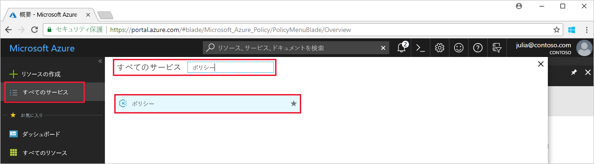
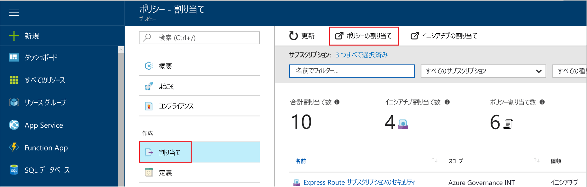
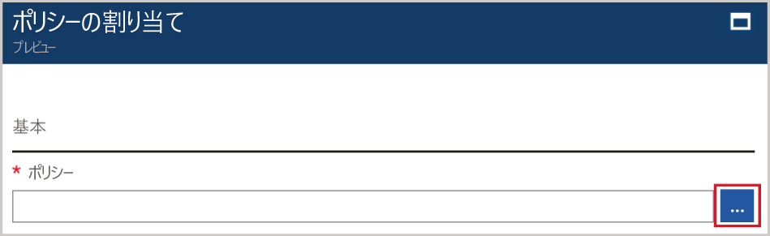

# <a name="create-and-manage-policies-to-enforce-compliance"></a>コンプライアンスを強制するポリシーの作成と管理

Azure でポリシーを作成および管理する方法を理解することは、企業の標準とサービス レベル アグリーメントへの準拠を維持するために重要です。 このチュートリアルでは、Azure Policy を使用して、次のように、組織全体のポリシーの作成、割り当て、および管理に関連する一般的なタスクをいくつか実行します。

> [!div class="checklist"]
> * 今後作成するリソースに条件を強制するポリシーを割り当てる
> * 複数のリソースについてコンプライアンスを追跡するイニシアチブ定義を作成して割り当てる
> * 準拠していないリソースまたは拒否されたリソースを解決する
> * 組織全体で新しいポリシーを実施する

Azure サブスクリプションをお持ちでない場合は、開始する前に [無料アカウント](https://azure.microsoft.com/free/?WT.mc_id=A261C142F) を作成してください。

## <a name="assign-a-policy"></a>ポリシーを割り当てる

Azure Policy でコンプライアンスを強制する最初の手順は、ポリシー定義の割り当てです。 ポリシー定義は、ポリシーを強制する条件と実行するアクションに従って定義されます。 この例では、*[Require SQL Server Version 12.0]\(SQL Server バージョン 12.0 が必要\)* という組み込みのポリシー定義を割り当てて、すべての SQL Server データベースが v12.0 である必要があるという条件に準拠することを強制します。

1. Azure Portal の左側のウィンドウで **[Policy]** を検索して選択し、Azure Policy サービスを開始します。

   

2. Azure Portal ページの左側のウィンドウで **[Assignments]\(割り当て\)** を選択します。 割り当ては、特定のスコープ内で実行するように割り当てられたポリシーです。
3. **[Assignments]\(割り当て\)** ウィンドウの上部にある **[Assign Policy]\(ポリシーの割り当て\)** を選択します。

   

4. **[Assign Policy]\(ポリシーの割り当て\)** ページで、**[ポリシー]** フィールドの横にあるをクリックして、使用できる定義の一覧を開きます。

   

5. **[Require SQL Server Version 12.0]\(SQL Server バージョン 12.0 が必要\)** を選択します。

   

6. ポリシー割り当ての表示用の **[名前]** を入力します。 この例では、"*SQL Server バージョン 12.0 が必要*" を名前として使用してみましょう。 必要に応じて、**説明**を追加することもできます。 この説明には、このポリシー割り当てで、この環境内に作成されるすべての SQL Server をバージョン 12.0 にする方法について詳しく入力します。
7. このポリシーを確実に既存のリソースに適用するには、価格レベルを **Standard** に変更します。

   Azure Policy 内には、*Free* と *Standard* という 2 つの価格レベルがあります。 Free レベルでは、今後のリソースにのみポリシーを強制することができます。Standard では、既存のリソースにも強制して、コンプライアンスの状態に対する理解を深めることができます。 制限付きプレビュー段階なので、価格モデルはまだリリースされていないません。したがって、*[Standard]* を選択しても、請求が発生することはありません。 価格の詳細については、[Azure Policy の価格](https://acom-milestone-ignite.azurewebsites.net/pricing/details/azure-policy/)に関するページをご覧ください。

8. **[スコープ]** を選びます。スコープは、以前に登録したサブスクリプション (またはリソース グループ) です。 スコープによって、ポリシー割り当てを強制するリソースまたはリソースのグループが決まります。 サブスクリプションからリソース グループの範囲が含まれる可能性があります。

   この例では、**Azure Analytics Capacity Dev** サブスクリプションを使用しています。 お客様によってサブスクリプションは異なります。

10. **[割り当て]** を選択します。

## <a name="implement-a-new-custom-policy"></a>新しいカスタム ポリシーを実施する

ポリシー定義を割り当てたので、次は、環境全体で G シリーズで VM を作成できないようにすることでコストを節約する新しいポリシーを作成します。 この例では、組織内のユーザーが G シリーズで VM を作成しようとするたびに、要求は拒否されます。

1. 左側のウィンドウで **[Authoring]\(作成\)** の **[Definition]\(定義\)** を選択します。

   ![[Authoring]\(作成\) の [Definition]\(定義\)](media/create-manage-policy/definition-under-authoring.png)

2. **[+ Policy Definition]\(+ ポリシー定義\)** を選択します。
3. 次のように入力します。

   - ポリシー定義の名前 - *G シリーズよりも小さい VM SKU を必須にする*
   - そのポリシー定義の目的の説明 - このポリシー定義では、コストを削減するために、このスコープ内で作成するすべての VM が、G シリーズよりも小さい SKU を使用することを強制しています。
   - このポリシー定義を有効にするサブスクリプション - この例では、**Advisor Analytics Capacity Dev** サブスクリプションでこのポリシー定義を使用します。 お客様によってサブスクリプション一覧は異なります。
   - 次の内容の JSON コードを作成します。
      - ポリシー パラメーター。
      - ポリシー ルール/条件。この例では、VM SKU サイズが G シリーズと同じサイズです。
      - ポリシーの効果。この例では、**Deny** です。

    JSON の作成例は次のとおりです。

    ```json
{
    "policyRule": {
      "if": {
        "allOf": [
          {
            "field": "type",
            "equals": "Microsoft.Compute/virtualMachines"
          },
          {
            "field": "Microsoft.Compute/virtualMachines/sku.name",
            "like": "Standard_G*"
          }
        ]
      },
      "then": {
        "effect": "deny"
      }
    }
}
    ```

    JSON コードのサンプルを確認するには、「[Azure Policy のテンプレート](json-samples.md)」をご覧ください。

4. **[保存]** を選択します。

## <a name="create-a-policy-definition-with-rest-api"></a>REST API を使用したポリシー定義の作成

ポリシー定義用の REST API を使用して、ポリシーを作成できます。 REST API を使用すると、ポリシー定義の作成と削除、既存の定義に関する情報の取得を実行できます。
ポリシー定義を作成するには、次の例を使用します。

```
PUT https://management.azure.com/subscriptions/{subscription-id}/providers/Microsoft.authorization/policydefinitions/{policyDefinitionName}?api-version={api-version}

```
要求の本文は次の例のようになります。

```
{
  "properties": {
    "parameters": {
      "allowedLocations": {
        "type": "array",
        "metadata": {
          "description": "The list of locations that can be specified when deploying resources",
          "strongType": "location",
          "displayName": "Allowed locations"
        }
      }
    },
    "displayName": "Allowed locations",
    "description": "This policy enables you to restrict the locations your organization can specify when deploying resources.",
    "policyRule": {
      "if": {
        "not": {
          "field": "location",
          "in": "[parameters('allowedLocations')]"
        }
      },
      "then": {
        "effect": "deny"
      }
    }
  }
}
```

## <a name="create-a-policy-definition-with-powershell"></a>PowerShell を使用したポリシー定義の作成

PowerShell の例に進む前に、Azure PowerShell の最新バージョンをインストールしていることを確認してください。 ポリシーのパラメーターは、バージョン 3.6.0 で追加されました。 以前のバージョンがインストールされていると、パラメーターが見つからないことを示すエラーが返されます。

`New-AzureRmPolicyDefinition` コマンドレットを使用してポリシー定義を作成することができます。

ファイルからポリシー定義を作成するには、ファイルへのパスを渡します。 外部ファイルの場合は、次の例を使用します。

```
$definition = New-AzureRmPolicyDefinition `
    -Name denyCoolTiering `
    -DisplayName "Deny cool access tiering for storage" `
    -Policy 'https://raw.githubusercontent.com/Azure/azure-policy-samples/master/samples/Storage/storage-account-access-tier/azurepolicy.rules.json'
```

ローカル ファイルの場合は、次の例を使用します。

```
$definition = New-AzureRmPolicyDefinition `
    -Name denyCoolTiering `
    -Description "Deny cool access tiering for storage" `
    -Policy "c:\policies\coolAccessTier.json"
```

インライン ルールでポリシー定義を作成するには、次の例を使用します。

```
$definition = New-AzureRmPolicyDefinition -Name denyCoolTiering -Description "Deny cool access tiering for storage" -Policy '{
  "if": {
    "allOf": [
      {
        "field": "type",
        "equals": "Microsoft.Storage/storageAccounts"
      },
      {
        "field": "kind",
        "equals": "BlobStorage"
      },
      {
        "not": {
          "field": "Microsoft.Storage/storageAccounts/accessTier",
          "equals": "cool"
        }
      }
    ]
  },
  "then": {
    "effect": "deny"
  }
}'
```

出力は、ポリシー割り当ての際に使用される `$definition` オブジェクトに格納されます。
次の例では、パラメーターを含むポリシー定義を作成しています。

```
$policy = '{
    "if": {
        "allOf": [
            {
                "field": "type",
                "equals": "Microsoft.Storage/storageAccounts"
            },
            {
                "not": {
                    "field": "location",
                    "in": "[parameters(''allowedLocations'')]"
                }
            }
        ]
    },
    "then": {
        "effect": "Deny"
    }
}'

$parameters = '{
    "allowedLocations": {
        "type": "array",
        "metadata": {
          "description": "The list of locations that can be specified when deploying storage accounts.",
          "strongType": "location",
          "displayName": "Allowed locations"
        }
    }
}'

$definition = New-AzureRmPolicyDefinition -Name storageLocations -Description "Policy to specify locations for storage accounts." -Policy $policy -Parameter $parameters
```

## <a name="view-policy-definitions"></a>ポリシー定義の表示

サブスクリプション内のすべてのポリシー定義を表示するには、次のコマンドを使用します。

```
Get-AzureRmPolicyDefinition
```

組み込みのポリシーを含め、すべての使用可能なポリシー定義が返されます。 各ポリシーは、次の形式で返されます。

```
Name               : e56962a6-4747-49cd-b67b-bf8b01975c4c
ResourceId         : /providers/Microsoft.Authorization/policyDefinitions/e56962a6-4747-49cd-b67b-bf8b01975c4c
ResourceName       : e56962a6-4747-49cd-b67b-bf8b01975c4c
ResourceType       : Microsoft.Authorization/policyDefinitions
Properties         : @{displayName=Allowed locations; policyType=BuiltIn; description=This policy enables you to
                     restrict the locations your organization can specify when deploying resources. Use to enforce
                     your geo-compliance requirements.; parameters=; policyRule=}
PolicyDefinitionId : /providers/Microsoft.Authorization/policyDefinitions/e56962a6-4747-49cd-b67b-bf8b01975c4c
```

## <a name="create-a-policy-definition-with-azure-cli"></a>Azure CLI を使用したポリシー定義の作成

Azure CLI でポリシー定義コマンドを使用して、ポリシー定義を作成できます。
インライン ルールでポリシー定義を作成するには、次の例を使用します。

```
az policy definition create --name denyCoolTiering --description "Deny cool access tiering for storage" --rules '{
  "if": {
    "allOf": [
      {
        "field": "type",
        "equals": "Microsoft.Storage/storageAccounts"
      },
      {
        "field": "kind",
        "equals": "BlobStorage"
      },
      {
        "not": {
          "field": "Microsoft.Storage/storageAccounts/accessTier",
          "equals": "cool"
        }
      }
    ]
  },
  "then": {
    "effect": "deny"
  }
}'
```

## <a name="view-policy-definitions"></a>ポリシー定義の表示

サブスクリプション内のすべてのポリシー定義を表示するには、次のコマンドを使用します。

```
az policy definition list
```

組み込みのポリシーを含め、すべての使用可能なポリシー定義が返されます。 各ポリシーは、次の形式で返されます。

```
{                                                            
  "description": "This policy enables you to restrict the locations your organization can specify when deploying resources. Use to enforce your geo-compliance requirements.",                      
  "displayName": "Allowed locations",
  "id": "/providers/Microsoft.Authorization/policyDefinitions/e56962a6-4747-49cd-b67b-bf8b01975c4c",
  "name": "e56962a6-4747-49cd-b67b-bf8b01975c4c",
  "policyRule": {
    "if": {
      "not": {
        "field": "location",
        "in": "[parameters('listOfAllowedLocations')]"
      }
    },
    "then": {
      "effect": "Deny"
    }
  },
  "policyType": "BuiltIn"
}
```

## <a name="create-and-assign-an-initiative-definition"></a>イニシアチブ定義の作成と割り当て

イニシアチブ定義では、複数のポリシー定義をグループ化して、1 つの包括的な目標を実現することができます。 イニシアチブ定義を作成して、定義のスコープ内にあるリソースが、イニシアチブ定義を構成するポリシー定義に準拠している状態を保ちます。  イニシアチブ定義の詳細については、[Azure Policy の概要](./azure-policy-introduction.md)に関するページを参照してください。

### <a name="create-an-initiative-definition"></a>イニシアチブ定義を作成する

1. 左側のウィンドウで **[Authoring]\(作成\)** の **[Definition]\(定義\)** を選択します。

   

2. ページの上部にある **[Initiative Definition]\(イニシアチブ定義\)** を選択します。**[Initiative Definition]\(イニシアチブ定義\)** フォームが表示されます。
3. イニシアチブの名前と説明を入力します。

   この例では、セキュリティ保護に関するポリシー定義にリソースが準拠するように、イニシアチブに「**Get Secure**」(セキュリティ保護) という名前を付け、「**This initiative has been created to handle all policy definitions associated with securing resources**」(このイニシアチブは、リソースのセキュリティ保護に関連するすべてのポリシー定義を処理するために作成されました) という説明を入力します。

   

4. **[Available Definitions]\(使用できる定義\)** の一覧から、そのイニシアチブに追加するポリシー定義を選択します。 作成した **[Get secure]\(セキュリティ保護\)** イニシアチブのために、次の組み込みのポリシー定義を追加します。
   - SQL Server バージョン 12.0 が必要
   - Monitor unprotected web applications in the security center (Security Center で保護されていない Web アプリケーションを監視する)。
   - Monitor permissive network across in Security Center (Security Center 全体で制限の緩やかなネットワークを監視する)。
   - Monitor possible app Whitelisting in Security Center (Security Center でアプリケーションのホワイトリスト登録処理の可能性を監視する)。
   - Monitor unencrypted VM Disks in Security Center (Security Center で暗号化されていない VM ディスクを監視する)。

   

   一覧からポリシー定義を選択すると、上図のように **[Policies and parameters]\(ポリシーとパラメーター\)** に表示されます。

5. **[作成]**を選択します。

### <a name="assign-an-initiative-definition"></a>イニシアチブ定義を割り当てる

1. **[Authoring]\(作成\)** の **[Definitions]\(定義\)** タブに移動します。
2. 作成した **[Get secure]\(セキュリティ保護\)** イニシアチブ定義を検索します。
3. イニシアチブ定義を選択し、**[Assign]\(割り当て\)** を選択します。

   

4. **[Assignment]\(割り当て\)** フォームに次のように入力します。
   - [name]\(名前\): Get secure assignment (セキュリティ保護の割り当て)
   - [description]\(説明\): this initiative assignment is tailored towards enforcing this group of policy definitions in the **Azure Advisor Capacity Dev** subscription (このイニシアチブの割り当ては、Azure Advisor Capacity Dev サブスクリプションでこのポリシー定義グループを強制するために調整されています)
   - [pricing tier]\(価格レベル\): Standard
   - [scope you would like this assignment applied to]\(この割り当てを適用するスコープ\): **Azure Advisor Capacity Dev**

5. **[割り当て]** を選択します。

## <a name="resolve-a-non-compliant-or-denied-resource"></a>準拠していないリソースまたは拒否されたリソースを解決する

上の例に従って、SQL Server バージョン 12.0 を必須にするポリシー定義を割り当てると、別バージョンで作成された SQL サーバーは拒否されます。 このセクションでは、別バージョンで SQL サーバーを作成しようとして拒否された場合に、除外を要求して解決する手順について説明します。

1. 左側のウィンドウの **[割り当て]** を選択します。
2. すべてのポリシー割り当て一覧から、*[Require SQL Server Version 12.0]\(SQL Server バージョン 12.0 が必要\)* 割り当てを開始します。
3. SQL サーバーを作成するリソース グループについて、除外を要求します。 この例では、Microsoft.Sql/servers/databases の *baconandbeer/Cheetos* と *baconandbeer/Chorizo* を除外します。

   

   拒否されたリソースを解決する他の方法として、作成した SQL サーバーが必要であるという強い理由がある場合はポリシーに関連付けられた連絡先に連絡する方法と、ポリシーにアクセス権を持っている場合は直接編集する方法があります。

4. **[保存]** を選択します。

このセクションでは、バージョン 12.0 で SQL サーバーを作成しようとして拒否された場合に、リソースの除外を要求して解決しました。

## <a name="clean-up-resources"></a>リソースのクリーンアップ

引き続きチュートリアルの作業を行う場合は、このガイドで作成したリソースをクリーンアップしないでください。 続行する予定がない場合は、次の手順を使用して、ここで作成した割り当てまたは定義をすべて削除してください。

1. 左側のウィンドウから **[Definitions]\(定義\)** (割り当てを削除する場合は **[Assignments]\(割り当て\)**) を選択します。
2. 作成した新しいイニシアチブまたはポリシー定義 (または割り当て) を検索します。
3. 定義または割り当ての末尾に表示される省略記号 ([...]) を選択し、**[Delete Definition]\(定義の削除\)** (または**[Delete Assignment]\(割り当ての削除\)**) を選択します。

## <a name="next-steps"></a>次のステップ

このチュートリアルでは、以下の操作を完了しました。

> [!div class="checklist"]
> * 今後作成するリソースに条件を強制するポリシーを割り当てる
> * 複数のリソースについてコンプライアンスを追跡するイニシアチブ定義を作成して割り当てる
> * 準拠していないリソースまたは拒否されたリソースを解決する
> * 組織全体で新しいポリシーを実施する

ポリシー定義の構造の詳細については、次の記事を参照してください。

> [!div class="nextstepaction"]
> [Azure Policy の定義の構造](policy-definition.md)
