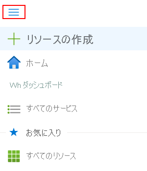
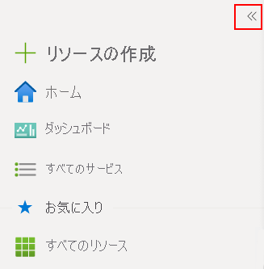
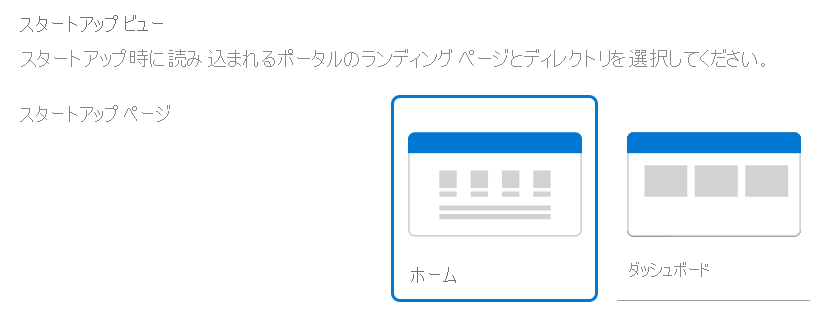
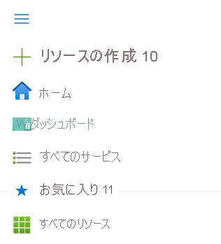

# Azure Portal の概要

この記事では、Azure portal を紹介し、ポータル ページの要素を示し、Azure portal の管理エクスペリエンスの概要について説明します。

## Azure portal とは

Azure portal は、コマンドライン ツールに代えて使用できる、Web ベースの統合コンソールです。 Azure portal では、グラフィカル ユーザー インターフェイスを使用して、Azure サブスクリプションを管理できます。 簡単な Web アプリから複雑なクラウド デプロイまで、すべてを構築、管理、監視することができます。 リソースを整理して表示するカスタム ダッシュボードを作成できます。 最適なエクスペリエンスを提供するアクセシビリティ オプションを構成できます。

Azure portal は、回復性と継続的な可用性を実現するよう設計されています。 すべての Azure データセンターにプレゼンスがあります。 この構成により、Azure portal は、個々のデータセンターの障害に対する回復性を確保し、ユーザーの近くにあることでネットワークの速度低下を回避します。 Azure portal は、継続的に更新され、メンテナンス アクティビティのためのダウンタイムを必要としません。

## Azure portal メニュー

ポータル メニューの既定のモードを選択できます。 ドッキングすることも、ポップアップ パネルとして動作させることもできます。

ポータル メニューはポップアップ モードの場合、必要になるまで表示されません。 メニュー アイコンを選択して、メニューを開いたり閉じたりします。

ポータル メニューに対してドッキング モードを選択した場合は、常に表示されます。 メニューを折りたためば、より広い作業領域を確保できます。

## Azure ホーム

Azure サービスの新規サブスクライバーが[ポータルにサインイン](https://portal.azure.com)すると、最初に**Azure ホーム**が表示されます。 このページには、Azure サブスクリプションを最大限に活用するために役立つリソースがまとめられています。 無料オンライン コース、ドキュメント、コア サービス、最新情報や組織の変革管理に役に立つサイトへのリンクが含まれています。 進行中の作業にすばやく簡単にアクセスできるように、最近アクセスしたリソースの一覧も表示されています。 このページをカスタマイズすることはできませんが、既定のビューとして**Azure ホーム**または**Azure ダッシュ ボード**を表示するかどうかを選択できます。 初めてサインインした場合は、ページの上部にプロンプトが表示され、そこから設定を保存することができます。

Azure portal メニューと Azure の既定のビューの両方とも、 **[ポータルの設定]** で変更できます。 選択内容を変更すると、その変更はすぐに適用されます。

## Azure ダッシュ ボード

ダッシュ ボードは、サブスクリプション内の最も重要なリソースを集中的に表示するビューを提供します。 最初に見るものとして、既定のダッシュ ボードを提供しています。 このダッシュ ボードをカスタマイズして、頻繁に使用するリソースを 1 つのビューに表示することができます。 既定のビューに加えた変更は、自分のエクスペリエンスのみに影響します。 ただし、追加のダッシュ ボードを作成して、自分で使ったり、カスタマイズしたダッシュ ボードを発行して組織内の他のユーザーと共有したりすることもできます。 詳細については、「[Azure Portal でのダッシュボードの作成と共有](../azure-portal/azure-portal-dashboards.md)」を参照してください。

## ポータルの利用

基本的なポータルのレイアウトと操作方法を理解することをお勧めします。 ここでは、ユーザー インターフェイスのコンポーネントと、説明に使う用語の一部を紹介します。 より詳細なポータルのツアーについては、コースのレッスン「[ポータルを操作する](https://docs.microsoft.com/learn/modules/tour-azure-portal/3-navigate-the-portal)」を参照してください。

Azure portal のメニューとページ ヘッダーは、常に存在するグローバル要素です。 恒常的に表示されているこれらの機能は、各サービスまたは機能に関連付けられているユーザー インターフェイスの「シェル」です。ヘッダーからは、グローバル コントロールにアクセスできます。 リソースの構成ページ ("ブレード" とも呼ばれます) にも、機能間を移動する際に便利なリソース メニューが表示される場合があります。

次の図では、Azure portal の基本的な要素にラベルが付けられています。それぞれの詳細は、次の表で説明されています。

|Key|説明
|:---:|---|
|1|ページ ヘッダー。 グローバル要素が含まれ、すべてのポータル ページの上部に表示されます。|
|2| グローバル検索。 この検索バーを使用して、指定したリソース、サービス、またはドキュメントをすばやく検索します。|
|3|グローバル コントロール。 すべてのグローバル要素と同様、これらの機能はすべてのポータルに表示され、以下が含まれます。Cloud Shell、サブスクリプション フィルター、通知、ポータルの設定、ヘルプとサポート、およびフィードバックの送信。|
|4|自分のアカウント。 自分のアカウントに関する情報の表示、ディレクトリの切り替え、サインアウト、別のアカウントでサインインが可能です。|
|5|ポータル メニュー。 ポータル メニューは、サービスの間を移動する際に役立つグローバル要素です。 サイドバーと呼ばれることもあります。ポータル メニュー モードは、 **[ポータルの設定]** で変更できます。|
|6|リソース メニュー。 多くのサービスには、サービスの管理に役立つリソース メニューが含まれています。 この要素は左ウィンドウと呼ばれる場合もあります。|
|7|コマンド バー。 コマンド バー上のコントロールは、現在のフォーカスのコンテキストによって変化します。|
|8|作業ウィンドウ。  現在フォーカスがあるリソースに関する詳細が表示されます。|
|9|階層リンク。 階層リンクを使用して、ワークフローのレベルをさかのぼることができます。|
|10|現在のサブスクリプションで新しいリソースを作成するためのマスター コントロール。 ポータル メニューを展開するか開いて、 **[+ リソースの作成]** を見つけます。 Azure Marketplace で作成したいリソースの種類を検索または参照できます。|
|11|お気に入りの一覧。 一覧をカスタマイズする方法については、「[お気に入りの追加、削除、並べ替え](../azure-portal/azure-portal-add-remove-sort-favorites.md)」を参照してください。|

## サービスの概要

新規サブスクライバーの場合、管理する前にリソースを作成する必要があります。 **[+ リソースの作成]** を選択し、Azure Marketplace で利用可能なサービスを表示します。 ここに表示されるたくさんのプロバイダーの中からアプリケーションとサービスを探します。これらは、すべて Azure で実行する認定を受けています。

サイドバーのお気に入りは、一般的に使用されるサービスへのリンクを含むように事前設定されています。  すべての利用可能なサービスを表示するには、サイド バーから **[すべてのサービス]** を選択します。

> [!TIP]
> リソース、サービス、またはドキュメントを検索する最も簡単な方法は、グローバル ヘッダーの*検索*を使用することです。 前のページに戻るには、階層リンクを使用します。
>
Azure portal でグローバル検索を使用する方法のデモについては、こちらのビデオをご覧ください。

> [!VIDEO https://www.youtube.com/embed/nZ7WwTZcQbo]

[Azure portal でグローバル検索を使用する方法](https://www.youtube.com/watch?v=nZ7WwTZcQbo)

## 次のステップ

* [サポートされているブラウザーとデバイス](../azure-portal/azure-portal-supported-browsers-devices.md)で、Azure portal を実行できる場所について学習します
* [Azure mobile app](https://azure.microsoft.com/features/azure-portal/mobile-app/) で移動中も接続を維持します
* [Azure クイックスタート センター](../azure-portal/azure-portal-quickstart-center.md)を使用してご利用になるクラウド環境をオンボードおよび設定します
