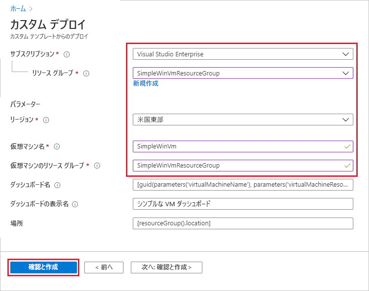
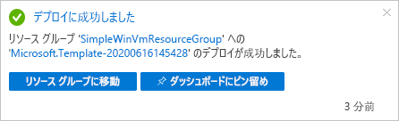
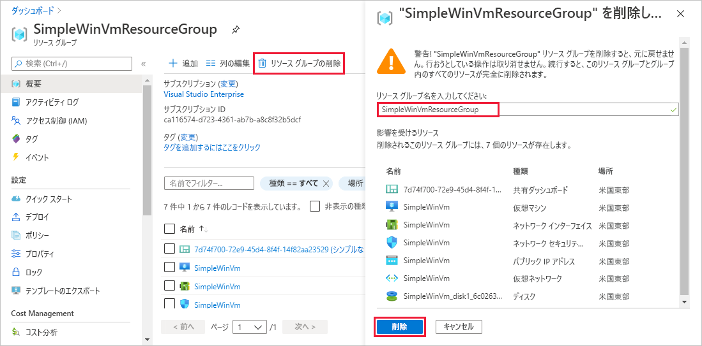

# <a name="quickstart-create-a-dashboard-in-the-azure-portal-by-using-an-arm-template"></a>クイック スタート:ARM テンプレートを使用して Azure portal でダッシュボードを作成する

Azure portal のダッシュボードでは、お使いのクラウド リソースが集中的に整理して表示されます。 このクイックスタートでは、Azure Resource Manager テンプレート (ARM テンプレート) をデプロイしてダッシュボードを作成する過程を中心に取り上げます。 このダッシュボードには、仮想マシン (VM) のパフォーマンスに加え、一部の静的情報とリンクが表示されます。

[!INCLUDE [About Azure Resource Manager](../../includes/resource-manager-quickstart-introduction.md)]

環境が前提条件を満たしていて、ARM テンプレートの使用に慣れている場合は、 **[Azure へのデプロイ]** ボタンを選択します。 Azure portal でテンプレートが開きます。

[](https://portal.azure.com/#create/Microsoft.Template/uri/https%3A%2F%2Fraw.githubusercontent.com%2FAzure%2Fazure-quickstart-templates%2Fmaster%2F101-azure-portal-dashboard%2Fazuredeploy.json)

## <a name="prerequisites"></a>前提条件

- Azure サブスクリプションをお持ちでない場合は、開始する前に [無料アカウント](https://azure.microsoft.com/free/?WT.mc_id=A261C142F) を作成してください。
- 既存の VM。

## <a name="create-a-virtual-machine"></a>仮想マシンの作成

このクイックスタートの次の部分で作成するダッシュボードには既存の VM が必要です。 次の手順に従って VM を作成します。

1. Azure portal で、 **[Cloud Shell]** を選択します。

    ![Azure portal リボンから [Cloud Shell] を選択する](media/quick-create-template/cloud-shell.png)

1. **[Cloud Shell]** ウィンドウで **[PowerShell]** を選択します。

    

1. 次のコマンドをコピーし、コマンド プロンプトに入力してリソース グループを作成します。

    ```powershell
    New-AzResourceGroup -Name SimpleWinVmResourceGroup -Location EastUS
    ```

    

1. 次のコマンドをコピーし、コマンド プロンプトに入力してリソース グループに VM を作成します。

    ```powershell
    New-AzVm `
        -ResourceGroupName "SimpleWinVmResourceGroup" `
        -Name "SimpleWinVm" `
        -Location "East US" 
    ```

1. VM のユーザー名とパスワードを入力します。 これは新しいユーザー名とパスワードです。たとえば Azure にサインインするためのアカウントではありません。 詳細については、[ユーザー名の要件](../virtual-machines/windows/faq.md#what-are-the-username-requirements-when-creating-a-vm)に関するページと[パスワードの要件](../virtual-machines/windows/faq.md#what-are-the-password-requirements-when-creating-a-vm)に関するページを参照してください。

    これで VM のデプロイが開始されます。通常、完了するまでに数分かかります。 デプロイが完了したら、次のセクションに進みます。

## <a name="review-the-template"></a>テンプレートを確認する

このクイックスタートで使用されるテンプレートは [Azure クイックスタート テンプレート](https://azure.microsoft.com/resources/templates/101-azure-portal-dashboard/)からのものです。 この記事のテンプレートは長いため、ここでは表示できません。 テンプレートを確認するには、[azuredeploy.json](https://raw.githubusercontent.com/Azure/azure-quickstart-templates/master/101-azure-portal-dashboard/azuredeploy.json) を参照してください。 Azure portal でダッシュボードを作成するテンプレート [Microsoft.Portal/dashboards](/azure/templates/microsoft.portal/dashboards) では、Azure リソースが 1 つ定義されます。

## <a name="deploy-the-template"></a>テンプレートのデプロイ

1. Azure にサインインし、テンプレートを開くには次のイメージを選択します。

    [](https://portal.azure.com/#create/Microsoft.Template/uri/https%3A%2F%2Fraw.githubusercontent.com%2FAzure%2Fazure-quickstart-templates%2Fmaster%2F101-azure-portal-dashboard%2Fazuredeploy.json)

1. 次の値を選択するか入力し、 **[確認および作成]** を選択します。

    

    特に明記されていない場合は、既定値を使用してダッシュボードを作成してください。

    * **サブスクリプション**: Azure サブスクリプションを選択します。
    * **[リソース グループ]** : **[SimpleWinVmResourceGroup]** を選択します。
    * **[場所]** : **[米国東部]** を選択します。
    * **[仮想マシン名]** : 「**SimpleWinVm**」と入力します。
    * **[Virtual Machine Resource Group]\(仮想マシンのリソース グループ\)** : 「**SimpleWinVmResourceGroup**」と入力します。

1. **[作成]** または **[購入]** を選択します。 ダッシュボードが正常にデプロイされると、次の通知が表示されます。

    

テンプレートをデプロイする目的で Azure portal が使用されました。 Azure portal だけでなく、Azure PowerShell、Azure CLI、REST API を使用することもできます。 他のデプロイ方法については、「[テンプレートのデプロイ](../azure-resource-manager/templates/deploy-powershell.md)」を参照してください。

## <a name="review-deployed-resources"></a>デプロイされているリソースを確認する

[!INCLUDE [azure-portal-review-deployed-resources](../../includes/azure-portal-review-deployed-resources.md)]

## <a name="clean-up-resources"></a>リソースをクリーンアップする

VM と関連付けられているダッシュボードを削除する場合、それらが含まれているリソース グループを削除します。

1. Azure portal で **[SimpleWinVmResourceGroup]** を検索し、検索結果で選択します。

1. **[SimpleWinVmResourceGroup]** ページで **[リソース グループの削除]** を選択し、リソース グループ名を入力して確定し、 **[削除]** を選択します。

    

## <a name="next-steps"></a>次のステップ

Azure portal のダッシュボードに関する詳細については次を参照してください。

> [!div class="nextstepaction"]
> [Azure portal でのダッシュボードの作成と共有](azure-portal-dashboards.md)