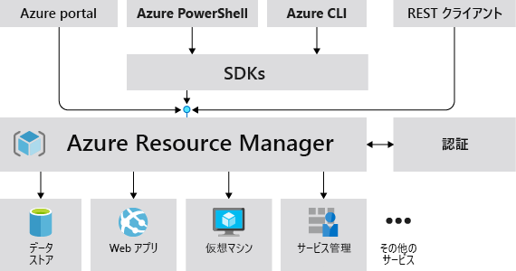
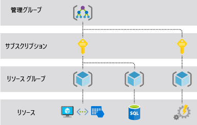

# Azure Resource Manager の概要

Azure Resource Manager は、Azure のデプロイおよび管理サービスです。 Azure サブスクリプション内のリソースを作成、更新、および削除できる管理レイヤーを提供します。 アクセス制御、ロック、タグなどの管理機能を使用して、デプロイ後にリソースを保護および整理します。

Azure Resource Manager テンプレートについては、[テンプレートのデプロイの概要](../templates/overview.md)に関するページを参照してください。

## 一貫性のある管理レイヤー

ユーザーが Azure ツール、API、SDK のいずれかから要求を送信すると、Resource Manager は要求を受信します。 その要求の認証と承認が行われます。 Resource Manager は、要求されたアクションを行う Azure サービスに要求を送信します。 すべての要求は同じ API を介して処理されるため、すべての異なるツールで一貫した結果と機能が得られます。

次の図は、Azure 要求の処理において Azure Resource Manager が果たす役割を示しています。 

ポータルで利用できるすべての機能は、PowerShell、Azure CLI、REST API、およびクライアント SDK からも利用できます。 API を介して最初にリリースされた機能は、最初のリリースから 180 日以内にポータルに表示されます。

## 用語

Azure Resource Manager には、初めて使う方にとって、あまり馴染みのない用語がいくつか存在します。

* **リソース** - Azure を通じて管理できる要素。 リソースの例として、仮想マシン、ストレージ アカウント、Web アプリ、データベース、および仮想ネットワークがあります。
* **リソース グループ** - Azure ソリューションの関連するリソースを保持するコンテナー。 リソース グループには、グループとして管理するリソースが含まれます。 組織にとって最も有用になるように、どのリソースをリソース グループに含めるかを決定します。 「 [リソース グループ](#resource-groups)」を参照してください。
* **リソース プロバイダー** - Azure リソースを提供するサービス。 一般的なリソースプロバイダーの一例として、仮想マシン リソースを提供する Microsoft.Compute があります。 Microsoft.Storage は、もう 1 つの一般的なリソースプロバイダーです。 [リソースプロバイダーと種類](resource-providers-and-types.md)に関するページを参照してください。
* **Resource Manager テンプレート** - リソース グループまたはサブスクリプションにデプロイする 1 つまたは複数のリソースを定義する JavaScript Object Notation (JSON) ファイル。 このテンプレートを使えば、リソースを一貫性のある形で繰り返しデプロイできます。 [テンプレートのデプロイの概要](../templates/overview.md)に関するページを参照してください。
* **宣言型構文** - 一連のプログラミング コマンドを記述しなくても、"作成しようとしているもの" を明確に宣言することのできる構文です。 宣言型構文の例として、Resource Manager テンプレートがあります。 このファイルで、Azure にデプロイするインフラストラクチャのプロパティを定義します。  [テンプレートのデプロイの概要](../templates/overview.md)に関するページを参照してください。

## Resource Manager には、いくつかの利点があります

Resource Manager を使用すると、以下のことができます。

* スクリプトではなく宣言型のテンプレートを使用してインフラストラクチャを管理します。

* ソリューションのリソースを個別に処理するのではなく、すべてのリソースをグループとしてデプロイ、管理、監視します。

* ソリューションを開発のライフサイクル全体で再デプロイします。リソースは、必ず一貫した状態でデプロイされます。

* 正しい順序でデプロイされるように、リソース間の依存関係を定義します。

* ロールベースのアクセス制御 (RBAC) が管理プラットフォームにネイティブ統合されるため、リソース グループのすべてのサービスにアクセス制御を適用できます。

* タグをリソースに適用し、サブスクリプションのすべてのリソースを論理的に整理します。

* 同じタグを共有するリソース グループのコストを表示することで、組織の課金をわかりやすくします。

## スコープを理解する

Azure には、[管理グループ](../../governance/management-groups/overview.md)、サブスクリプション、[リソース グループ](#resource-groups)、およびリソースという 4 つのレベルのスコープが用意されています。 次の図に、これらのレイヤーの例を示します。

これらのスコープ レベルのいずれかに管理設定を適用します。 選択するレベルで、設定の適用範囲が決まります。 上位レベルの設定が下位レベルに継承されます。 たとえば、サブスクリプションに[ポリシー](../../governance/policy/overview.md)を適用すると、そのポリシーはサブスクリプション内のすべてのリソース グループとリソースに適用されます。 リソース グループにポリシーを適用すると、そのポリシーはリソース グループとそのすべてのリソースに適用されます。 ただし、別のリソース グループにそのポリシー割り当てはありません。

テンプレートを管理グループ、サブスクリプション、またはリソース グループにデプロイすることができます。

## リソース グループ

リソース グループを定義する際、次のような考慮すべき要素があります。

* グループ内のすべてのリソースで、同じライフサイクルが共有される必要がある。 そのため、これらのリソースは一緒にデプロイ、更新、削除されます。 データベース サーバーなどの 1 つのリソースが、別のデプロイ サイクル上に存在する必要がある場合は、別のリソース グループに含めなければなりません。

* 各リソースは、1 つのリソース グループにのみ存在できる。

* リソースは、いつでもリソース グループに追加したり、削除できる。

* あるリソース グループから別のリソース グループへリソースを移動できる。 詳細については、「 [新しいリソース グループまたはサブスクリプションへのリソースの移動](move-resource-group-and-subscription.md)」を参照してください。

* リソース グループには、別のリージョンに配置されたリソースを含めることができる。

* リソース グループを使用すると、管理操作のアクセス制御のスコープを設定できる。

* リソースは、他のリソース グループ内のリソースとやり取りできる。 このやり取りは、2 つの関連するリソースで同じライフサイクルが共有されていない場合によく見られます (データベースに接続する Web アプリなど)。

リソース グループを作成するとき、そのリソース グループの場所を指定する必要があります。 "なぜリソース グループに場所が必要なのか。 リソースがリソース グループとは異なる場所に存在してよいとしたら、いったいなぜリソース グループの場所が問題になるのか" と、疑問に思われるかもしれません。 リソース グループには、リソースについてのメタデータが格納されます。 リソース グループの場所を指定するとき、このメタデータが格納される場所を指定することになります。 コンプライアンス上の理由から、データは特定のリージョンに格納されるようにする必要があります。

リソース グループのリージョンが一時的に使用できない場合は、メタデータが使用できないため、リソース グループ内のリソースを更新できません。 他のリージョン内のリソースは通常どおり機能しますが、それらを更新することはできません。 信頼性の高いアプリケーションの設計の詳細については、「[信頼性の高い Azure アプリケーションの設計](/azure/architecture/checklist/resiliency-per-service)」を参照してください。

## Azure Resource Manager の回復性

Azure Resource Manager サービスは、回復性と継続的な可用性を実現するよう設計されています。 REST API での Resource Manager とコントロール プレーン操作 (management.azure.com に送信される要求) は、次のように動作します。

* リージョン間に分散されます。 一部のサービスはリージョン固有です。

* 複数の可用性ゾーンを含む場所では、可用性ゾーン (リージョン) 間で分散されます。

* 単一の論理データ センターに依存しません。

* メンテナンスのために休止することはありません。

この回復性は、Resource Manager 経由で要求を受信するサービスに適用されます。 たとえば、Key Vault はこの回復性からメリットを得られます。

## 次のステップ

* リソース プロバイダーによって提供されるすべての操作については、[Azure REST API シリーズ](/rest/api/azure/)に関するページを参照してください。

* リソースの移動の詳細については、「[新しいリソース グループまたはサブスクリプションへのリソースの移動](move-resource-group-and-subscription.md)」を参照してください。

* リソースにタグを付ける方法については、「[タグを使用した Azure リソースの整理](tag-resources.md)」を参照してください。

* リソースのロックについては、「[意図しない変更を防ぐためのリソースのロック](lock-resources.md)」を参照してください。

* デプロイ用のテンプレートの作成については、[テンプレートのデプロイの概要](../templates/overview.md)に関するページを参照してください。
