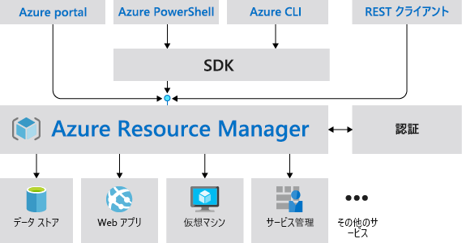
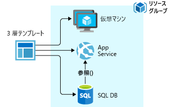
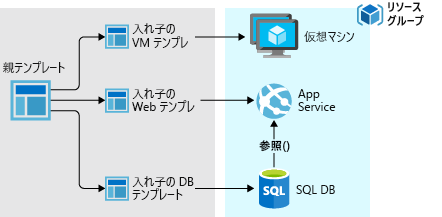

# <a name="azure-resource-manager-overview"></a>Azure Resource Manager の概要
アプリケーションのインフラストラクチャは通常、仮想マシン、ストレージ アカウント、仮想ネットワーク、Web アプリ、データベース、データベース サーバー、サード パーティのサービスなど、複数のコンポーネントで構成されます。 これらのコンポーネントは別々のエンティティではなく、1 つのエンティティの中で互いに関連付けられ相互依存しています。 これらのコンポーネントを、1 つのグループとしてデプロイ、管理、および監視するのが好ましいです。 Azure Resource Manager を使用すると、ソリューション内の複数のリソースを 1 つのグループとして作業できます。 ソリューションのこれらすべてのリソースを、1 回の連携した操作でデプロイ、更新、または削除できます。 デプロイにはテンプレートを使用しますが、このテンプレートは、テスト、ステージング、運用環境などのさまざまな環境に使用できます。 Resource Manager には、デプロイ後のリソースの管理に役立つ、セキュリティ、監査、タグ付けの機能が用意されています。 

## <a name="consistent-management-layer"></a>一貫性のある管理レイヤー
Resource Manager では、Azure PowerShell、Azure CLI、Azure portal、REST API、およびクライアント SDK を通じてタスクを実行する一貫性のある管理レイヤーを提供します。 Azure portal で利用できるすべての機能は、Azure PowerShell、Azure CLI、Azure REST API、およびクライアント SDK からも利用できます。 API を介して最初にリリースされた機能は、最初のリリースから 180 日以内にポータルに表示されます。

自分にとって最適なツールと API を選択してください。これらは同じ機能を備えており、一貫性のある結果を提供します。

次の画像では、すべてのツールが同じ Azure Resource Manager API とやり取りする方法を示します。 この API は、要求の認証と承認を行う Resource Manager サービスに要求を渡します。 次に Resource Manager は、適切なリソース プロバイダーに要求をルーティングします。



## <a name="terminology"></a>用語集
Azure Resource Manager には、初めて使う方にとって、あまり馴染みのない用語がいくつか存在します。

* **リソース** - Azure を通じて管理できる要素。 一般的なリソースとしては、仮想マシン、ストレージ アカウント、Web アプリ、データベース、仮想ネットワークなどがありますが、他にもさまざまなリソースが存在します。
* **リソース グループ** - Azure ソリューションの関連するリソースを保持するコンテナー。 リソース グループには、ソリューションのすべてのリソースか、グループとして管理したいリソースのみを含めることができます。 組織のニーズに合わせてリソースをリソース グループに割り当てる方法を指定してください。 「 [リソース グループ](#resource-groups)」を参照してください。
* **リソース プロバイダー** - Resource Manager を使用してデプロイおよび管理できるリソースを提供するサービスです。 各リソース プロバイダーは、デプロイされたリソースを利用するための操作を提供します。 一般的なリソース プロバイダーとしては、仮想マシン リソースを提供する Microsoft.Compute や、ストレージ アカウント リソースを提供する Microsoft.Storage、Web アプリに関連したリソースを提供する Microsoft.Web などがあります。 「 [リソース プロバイダー](#resource-providers)」を参照してください。
* **Resource Manager テンプレート** - リソース グループへのデプロイ対象となるリソースを定義する JavaScript Object Notation (JSON) ファイルです。 デプロイ対象リソース間の依存関係も、このテンプレートによって定義されます。 このテンプレートを使えば、リソースを一貫性のある形で繰り返しデプロイできます。 「 [テンプレートのデプロイ](#template-deployment)」を参照してください。
* **宣言型構文** - 一連のプログラミング コマンドを記述しなくても、"作成しようとしているもの" を明確に宣言することのできる構文です。 宣言型構文の例として、Resource Manager テンプレートがあります。 このファイルで、Azure にデプロイするインフラストラクチャのプロパティを定義します。 

## <a name="the-benefits-of-using-resource-manager"></a>Resource Manager には、いくつかの利点があります
リソース マネージャーには、いくつかの利点があります。

* ソリューションのリソースを個別に処理するのではなく、すべてのリソースをグループとしてデプロイ、管理、監視できます。
* ソリューションを開発のライフサイクル全体で繰り返しデプロイできます。また、常にリソースが一貫した状態でデプロイされます。
* スクリプトではなく宣言型のテンプレートを使用してインフラストラクチャを管理できます。
* 正しい順序でデプロイされるようにリソース間の依存性を定義できます。
* ロールベースのアクセス制御 (RBAC) が管理プラットフォームにネイティブ統合されるため、リソース グループのすべてのサービスにアクセス制御を適用できます。
* タグをリソースに適用し、サブスクリプションのすべてのリソースを論理的に整理できます。
* 同じタグを共有するリソース グループのコストを表示することで、組織の課金をわかりやすくすることができます。  

リソース マネージャーには、ソリューションをデプロイして管理するための新しい方法が用意されています。 以前のデプロイメント モデルを使用していて、変更の詳細を確認する場合は、「 [リソース マネージャー デプロイと従来のデプロイを理解する](resource-manager-deployment-model.md)」を参照してください。

## <a name="guidance"></a>ガイダンス
次の推奨事項は、ソリューションを操作する際に Resource Manager を最大限に活用するのに役立ちます。

1. インフラストラクチャを定義してデプロイする場合は、命令型コマンドではなく、Resource Manager テンプレートにある宣言型構文を使用します。
2. デプロイと構成の手順すべてをこのテンプレートで定義します。 ソリューションの設定に手動操作は必要ありません。
3. アプリやコンピューターの開始または停止など、リソースの管理には命令型コマンドを実行します。
4. リソース グループ内の同じライフサイクルでリソースを調整します。 リソースのその他すべての整理には、タグを使用します。

企業が Resource Manager を使用してサブスクリプションを効果的に管理する方法については、「[Azure enterprise scaffold - prescriptive subscription governance (Azure エンタープライズ スキャフォールディング - サブスクリプションの規範的な管理)](/azure/architecture/cloud-adoption-guide/subscription-governance?toc=%2fazure%2fazure-resource-manager%2ftoc.json)」を参照してください。

グローバル Azure、Azure ソブリン クラウド、および Azure Stack で使用できる Resource Manager テンプレートの作成に関する推奨事項については、「[クラウドの一貫性のための Azure Resource Manager テンプレートを開発する](templates-cloud-consistency.md)」をご覧ください。

## <a name="resource-groups"></a>リソース グループ
リソース グループを定義する際、次のような考慮すべき要素があります。

1. グループ内のすべてのリソースで、同じライフサイクルが共有される必要がある。 そのため、これらのリソースは一緒にデプロイ、更新、削除されます。 データベース サーバーなどの 1 つのリソースが、別のデプロイ サイクル上に存在する必要がある場合は、別のリソース グループに含めなければなりません。
2. 各リソースは、1 つのリソース グループにのみ存在できる。
3. リソースは、いつでもリソース グループに追加したり、削除できる。
4. あるリソース グループから別のリソース グループへリソースを移動できる。 詳細については、「 [新しいリソース グループまたはサブスクリプションへのリソースの移動](resource-group-move-resources.md)」を参照してください。
5. リソース グループには、別のリージョンに存在するリソースを含めることができる。
6. リソース グループを使用すると、管理操作のアクセス制御のスコープを設定できる。
7. リソースは、他のリソース グループ内のリソースとやり取りできる。 このやり取りは、2 つの関連するリソースで同じライフサイクルが共有されていない場合によく見られます (データベースに接続する Web アプリなど)。

リソース グループを作成するとき、そのリソース グループの場所を指定する必要があります。 "なぜリソース グループに場所が必要なのか。 リソースがリソース グループとは異なる場所に存在してよいとしたら、いったいなぜリソース グループの場所が問題になるのか" と、疑問に思われるかもしれません。 リソース グループには、リソースについてのメタデータが格納されます。 そのため、リソース グループの場所を指定するとき、このメタデータが格納される場所を指定することになります。 コンプライアンス上の理由から、データは特定のリージョンに格納されるようにする必要があります。

## <a name="resource-providers"></a>リソース プロバイダー
Azure サービスを扱うための一連のリソースと操作は、それぞれのリソース プロバイダーから得られます。 たとえば、キーとシークレットを格納するためには、 **Microsoft.KeyVault** リソース プロバイダーを使用します。 このリソース プロバイダーには、キー コンテナーを作成するための **vaults** という名前のリソースの種類が用意されています。 

リソースの種類を表す名前は、**{resource-provider}/{resource-type}** のような形式になります。 たとえば、キー コンテナーの種類は **Microsoft.KeyVault/vaults** です。

リソースのデプロイを始める前に、利用可能なリソース プロバイダーを把握する必要があります。 リソース プロバイダーとリソースの名前がわかれば、Azure にデプロイするリソースの定義に役立ちます。 また、各リソースの種類の有効な場所と API のバージョンを把握しておく必要があります。 詳細については、「[リソース プロバイダーと種類](resource-manager-supported-services.md)」を参照してください。

## <a name="template-deployment"></a>テンプレートのデプロイ
Resource Manager では、Azure ソリューションのインフラストラクチャと構成を定義する JSON 形式のテンプレートを作成できます。 テンプレートを使えば、ソリューションをそのライフサイクル全体で繰り返しデプロイできます。また、常にリソースが一貫した状態でデプロイされます。 ポータルからソリューションを作成すると、ソリューションには自動的にデプロイ テンプレートが含まれます。 最初からテンプレートを作成する必要はありません。はじめにソリューション向けのテンプレートを使用して、それを特定のニーズに合わせてカスタマイズできます。 リソース グループの現在の状態をエクスポートするか、特定のデプロイに使用されたテンプレートを表示することで、既存のリソース グループのテンプレートを取得できます。 [エクスポートしたテンプレート](resource-manager-export-template.md)を表示すると、テンプレートの構文について理解するのに役立ちます。

テンプレートの形式とその構築方法については、「[初めての Azure Resource Manager テンプレートを作成する](resource-manager-create-first-template.md)」を参照してください。 リソースの種類に関して JSON 構文を確認するには、「[Define resources in Azure Resource Manager templates (Azure Resource Manager テンプレートのリソースの定義)](/azure/templates/)」を参照してください。

Resource Manager は他の要求と同様に、テンプレートを処理します (「[一貫性のある管理レイヤー](#consistent-management-layer)」の画像を参照してください)。 Resource Manager はテンプレートを解析し、その構文を適切なリソース プロバイダーの REST API 操作に変換します。 たとえば、Resource Manager が次のリソース定義を含むテンプレートを受け取ったとします。

```json
"resources": [
  {
    "apiVersion": "2016-01-01",
    "type": "Microsoft.Storage/storageAccounts",
    "name": "mystorageaccount",
    "location": "westus",
    "sku": {
      "name": "Standard_LRS"
    },
    "kind": "Storage",
    "properties": {
    }
  }
]
```

Resource Manager は、この定義を次の REST API 操作に変換し、Microsoft.Storage リソース プロバイダーに送信します。

```HTTP
PUT
https://management.azure.com/subscriptions/{subscriptionId}/resourceGroups/{resourceGroupName}/providers/Microsoft.Storage/storageAccounts/mystorageaccount?api-version=2016-01-01
REQUEST BODY
{
  "location": "westus",
  "properties": {
  }
  "sku": {
    "name": "Standard_LRS"
  },   
  "kind": "Storage"
}
```

テンプレートとリソース グループをどのように定義するかは、ソリューションの管理方法に応じてユーザーが自由に決定できます。 たとえば、1 つのリソース グループに 1 つのテンプレートで 3 層のアプリケーションをデプロイできます。



ただし、インフラストラクチャ全体を 1 つのテンプレートで定義する必要はありません。 多くの場合、対象を絞って目的を特化した一連のテンプレートにデプロイの要件を分類することが合理的です。 これらのテンプレートは、さまざまなソリューションで簡単に再利用できます。 特定のソリューションをデプロイするには、必要なすべてのテンプレートをリンクするマスター テンプレートを作成します。 次の画像は、入れ子になった 3 つのテンプレートを含む親テンプレートを利用して 3 層のソリューションをデプロイする方法を示しています。



層ごとに異なるライフサイクルを希望する場合は、3 層を個別のリソース グループにデプロイできます。 リソースは、他のリソース グループ内のリソースにリンクされることもあります。


入れ子になったテンプレートについては、「[Azure Resource Manager でのリンクされたテンプレートの使用](resource-group-linked-templates.md)」を参照してください。

依存関係は Azure Resource Manager によって分析され、確実に正しい順序でリソースが作成されます。 リソースが別のリソースの値に依存する場合 (ディスクのストレージ アカウントを必要とする仮想マシンなど) は、依存関係を設定します。 詳細については、「 [Azure Resource Manager のテンプレートでの依存関係の定義](resource-group-define-dependencies.md) 」に関するページを参照してください。

インフラストラクチャの更新にも、テンプレートを使用することができます。 たとえば、ソリューションにリソースを追加したり、既にデプロイされたリソースに構成ルールを追加したりできます。 テンプレートでリソースの作成を指定した際、そのリソースが既に存在する場合は、Azure Resource Manager では、新しい資産を作成する代わりに更新が実行されます。 Azure Resource Manager では、既存の資産が、新しい資産と同じ状態になるよう更新されます。  

Resource Manager では、セットアップ時に含まれていなかった特定ソフトウェアのインストールなど、追加の操作が必要なシナリオのための拡張機能を使用できます。 DSC、Chef、または Puppet などの構成管理サービスを既にご利用の場合は、拡張機能を使用すれば、引き続きそのサービスで作業ができます。 仮想マシンの拡張機能については、「[仮想マシンの拡張機能とその機能について](../virtual-machines/windows/extensions-features.md?toc=%2fazure%2fvirtual-machines%2fwindows%2ftoc.json)」を参照してください。 

最後に、テンプレートは、アプリのソース コードの一部になります。 テンプレートはソース コード リポジトリにチェックインして、アプリの変更に合わせて更新できます。 テンプレートは Visual Studio から編集できます。

テンプレートを定義した後で、リソースを Azure にデプロイできます。 リソースのデプロイに使用するコマンドについては、以下を参照してください。

* [Resource Manager テンプレートと Azure PowerShell を使用したリソースのデプロイ](resource-group-template-deploy.md)
* [Resource Manager テンプレートと Azure CLI を使用したリソースのデプロイ](resource-group-template-deploy-cli.md)
* [Resource Manager テンプレートと Azure Portal を使用したリソースのデプロイ](resource-group-template-deploy-portal.md)
* [Resource Manager テンプレートと Resource Manager REST API を使用したリソースのデプロイ](resource-group-template-deploy-rest.md)

## <a name="tags"></a>タグ
Resource Manager では、管理や課金の要件に合わせてリソースを分類できる、タグ付け機能を使用できます。 リソース グループとリソースが複雑に絡み合っており、これらの資産をわかりやすく視覚化する必要がある場合は、タグを使用してください。 たとえば、組織内で同じロールを果たしている複数リソース、または同じ部門に属している複数リソースにタグを付けることができます。 タグがないと、組織内のユーザーは複数のリソースを作成できるものの、作成したリソースを後で特定して管理することが困難になる場合があります。 たとえば、特定のプロジェクトに関するすべてのリソースを削除したい場合があります。 これらのリソースに対してプロジェクトに関するタグが設定されていない場合、手動で探す必要があります。 タグ付けは、サブスクリプションの不要なコストを削減するための重要な方法です。 

タグを共有するために、リソースが同じリソース グループ内に格納されている必要はありません。 組織内のユーザーが類似したタグを誤って適用しないよう (「department」の代わりに「dep」など)、組織内のすべてのユーザーが共通のタグを使用できる独自のタグ分類法を作成することができます。

次の例は、仮想マシンに適用されているタグを示しています。

```json
"resources": [    
  {
    "type": "Microsoft.Compute/virtualMachines",
    "apiVersion": "2015-06-15",
    "name": "SimpleWindowsVM",
    "location": "[resourceGroup().location]",
    "tags": {
        "costCenter": "Finance"
    },
    ...
  }
]
```

タグ値が設定されているすべてのリソースを取得するには、次の PowerShell コマンドレットを使用します。

```powershell
Find-AzureRmResource -TagName costCenter -TagValue Finance
```

または、次の Azure CLI 2.0 コマンドを使用します。

```azurecli
az resource list --tag costCenter=Finance
```

Azure Portal からタグ付きのリソースを表示することもできます。

サブスクリプションの[使用状況レポート](../billing/billing-understand-your-bill.md)にはタグ名と値が含まれます。これにより、タグを使ってコストの計算を分けることができます。 タグの詳細については、 [タグを使用した Azure リソースの整理](resource-group-using-tags.md)を参照してください。

## <a name="access-control"></a>アクセス制御
Resource Manager を使用すると、組織に対する特定アクションにアクセスできるユーザーを制御できます。 Azure Resource Manager では、ロールベースのアクセス制御 (RBAC) が管理プラットフォームにネイティブに統合されているため、そのアクセス制御がリソース グループ内のすべてのサービスに適用されます。 

ロールベースのアクセス制御を使用する場合に理解しておくべき 2 つの主要な概念を次に示します。

* ロール定義 - アクセス許可のセットを記述します。多くの割り当てに使用できます。
* ロールの割り当て - 特定のスコープ (サブスクリプション、リソース グループ、またはリソース) の ID (ユーザーまたはグループ) に定義を関連付けます。 この割り当ては、下位のスコープに継承されます。

事前定義されたプラットフォームとリソース固有のロールにユーザーを追加できます。 たとえば、事前定義された閲覧者ロール (ユーザーにリソースの表示は許可し、変更は許可しない) を活用できます。 このようなアクセスを必要とする組織内のユーザーを閲覧者ロールに追加し、そのロールをサブスクリプション、リソース グループ、またはリソースに適用します。

Azure には、次の 4 つのプラットフォーム ロールがあります。

1. 所有者: アクセス権を含めすべてを管理できます。
2. 共同作業者: アクセス権以外のすべてを管理できます
3. 閲覧者: すべてを閲覧できますが、変更することはできません。
4. ユーザー アクセス管理者: Azure リソースへのユーザー アクセスを管理できます。

Azure には、リソースに固有のロールもいくつかあります。 一般的なものは次のとおりです。

1. 仮想マシン共同作業者: 仮想マシンを管理できますが、仮想マシンへのアクセスを許可することはできません。接続先の仮想ネットワークまたはストレージ アカウントを管理することもできません
2. ネットワークの共同作業者: すべてのネットワーク リソースを管理できますが、それらへのアクセスを許可することはできません。
3. ストレージ アカウントの共同作業者: ストレージ アカウントを管理することはできますが、それらへのアクセスを許可することはできません。
4. SQL Server の共同作業者: SQL サーバーおよびデータベースを管理できますが、そのセキュリティ関連ポリシーは管理できません。
5. Web サイト共同作業者: Web サイトを管理できますが、接続されている Web プランは管理できません

すべてのロールと許可されるアクションについては、「[RBAC: 組み込みのロール](../role-based-access-control/built-in-roles.md)」を参照してください。 ロールベースのアクセス制御の詳細については、「 [Azure のロールベースのアクセス制御](../role-based-access-control/role-assignments-portal.md)」を参照してください。 

リソースにアクセスするコードまたはスクリプトを実行したいものの、それにユーザーの資格情報は使いたくない場合もあります。 その場合は、アプリケーションのサービス プリンシパルと呼ばれる ID を作成して、そのサービス プリンシパルに適切なロールを割り当てることができます。 Resource Manager を利用すれば、アプリケーションの資格情報を作成し、プログラムでアプリケーションの認証を行うことができます。 サービス プリンシパルの作成の詳細については、次のいずれかのトピックを参照してください。

* [リソースにアクセスするためのサービス プリンシパルを Azure PowerShell で作成する](resource-group-authenticate-service-principal.md)
* [リソースにアクセスするためのサービス プリンシパルを Azure CLI で作成する](resource-group-authenticate-service-principal-cli.md)
* [リソースにアクセスできる Azure Active Directory アプリケーションとサービス プリンシパルをポータルで作成する](resource-group-create-service-principal-portal.md)

重要なリソースを、ユーザーによって削除または変更されないように、明示的にロックすることもできます。 詳細については、[「Azure Resource Manager によるリソースのロック」](resource-group-lock-resources.md)を参照してください。

## <a name="activity-logs"></a>アクティビティ ログ
Resource Manager では、リソースを作成、変更、削除するすべての操作が記録されます。 アクティビティ ログを使用して、トラブルシューティングを行うときにエラーを探したり、組織のユーザーがどのようにリソースを変更したかを監視したりできます。 操作を開始したユーザーなど、さまざまな値でログをフィルター処理できます。 アクティビティ ログの使用については、[Azure リソースを管理するためのアクティビティ ログの表示](resource-group-audit.md)に関するページを参照してください。

## <a name="customized-policies"></a>カスタマイズされたポリシー
リソース マネージャーでは、リソースを管理するためにカスタマイズされたポリシーを作成できます。 多様なシナリオに対応した各種ポリシーを作成できます。 リソースに対して名前付け規則を適用できるほか、デプロイできるリソースの種類とインスタンスや、特定の種類のリソースをホストできるリージョンを制限できます。 また、部門別に課金を整理するために、リソースへのタグ値の設定を義務付けることができます。 コストを削減し、サブスクリプション内での一貫性を維持できるようにポリシーを作成します。 

JSON でポリシーを定義し、サブスクリプション全体またはリソース グループ内で適用します。 ポリシーは、リソースの種類に適用されるものであるため、ロールベースのアクセス制御とは異なります。

次の例は、すべてのリソースに costCenter タグが含まれるように指定することでタグの整合性を確保するポリシーを示しています。

```json
{
  "if": {
    "not" : {
      "field" : "tags",
      "containsKey" : "costCenter"
    }
  },
  "then" : {
    "effect" : "deny"
  }
}
```

作成できるポリシーの種類はほかにも多数あります。 詳細については、「[Azure Policy とは](../azure-policy/azure-policy-introduction.md)」を参照してください。

## <a name="sdks"></a>SDK
Azure の SDK は、複数の言語とプラットフォームで利用できます。 これらの言語実装はそれぞれ、エコシステムのパッケージ マネージャーと GitHub を介して入手できます。

オープン ソース SDK リポジトリを次に示します。

* [Azure SDK for .NET](https://github.com/Azure/azure-sdk-for-net)
* [Azure Management Libraries for Java](https://github.com/Azure/azure-sdk-for-java)
* [Azure SDK for Node.js](https://github.com/Azure/azure-sdk-for-node)
* [Azure SDK for PHP](https://github.com/Azure/azure-sdk-for-php)
* [Azure SDK for Python](https://github.com/Azure/azure-sdk-for-python)
* [Azure SDK for Ruby](https://github.com/Azure/azure-sdk-for-ruby)

リソースでこれらの言語を使用する方法については、以下を参照してください。

* [.NET 開発者向けの Azure](/dotnet/azure/?view=azure-dotnet)
* [Java 開発者向けの Azure](/java/azure/)
* [Node.js 開発者向けの Azure](/nodejs/azure/)
* [Python 開発者向けの Azure](/python/azure/)

> [!NOTE]
> 必要な機能が SDK に備わっていない場合は、 [Azure REST API](https://docs.microsoft.com/rest/api/resources/) を直接呼び出すこともできます。
> 
> 

## <a name="next-steps"></a>次の手順
* テンプレートの簡単な操作手順については、「 [既存のリソースから Azure Resource Manager テンプレートをエクスポートする](resource-manager-export-template.md)」を参照してください。
* さらに詳しくテンプレートの作成方法を解説したチュートリアルについては、「[初めての Azure Resource Manager テンプレートを作成する](resource-manager-create-first-template.md)」を参照してください。
* テンプレートで使用できる関数については、 [テンプレートの関数](resource-group-template-functions.md)
* Visual Studio と Resource Manager の使用については、「 [Visual Studio での Azure リソース グループの作成とデプロイ](vs-azure-tools-resource-groups-deployment-projects-create-deploy.md)」を参照してください。
* クラシックから ARM へのリソースの移行については、[クラシックから Azure Resource Manager への移行](resource-manager-deployment-model.md#migrate-from-classic-to-resource-manager)に関するセクションをご覧ください。

この概要のデモンストレーション ビデオを次に示します。

>[!VIDEO https://channel9.msdn.com/Blogs/Azure-Documentation-Shorts/Azure-Resource-Manager-Overview/player]


[powershellref]: https://docs.microsoft.com/powershell/resourcemanager/azurerm.resources/v3.2.0/azurerm.resources
