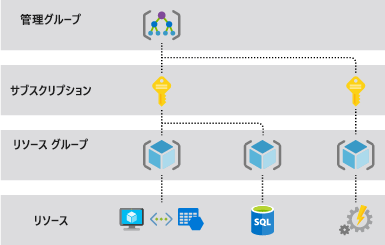

# <a name="azure-resource-manager-overview"></a>Azure Resource Manager の概要

Azure Resource Manager は、Azure のデプロイおよび管理サービスです。 Azure サブスクリプション内のリソースを作成、更新、および削除できる一貫した管理レイヤーを提供します。 そのアクセス制御、監査、およびタグ付け機能を使用して、デプロイ後にリソースをセキュリティで保護し、整理することができます。

ポータル、PowerShell、Azure CLI、REST API シリーズ、またはクライアント SDK を介してアクションを実行すると、Azure Resource Manager API によって要求が処理されます。 すべての要求は同じ API を介して処理されるため、すべての異なるツールで一貫した結果と機能が得られます。 ポータルで利用できるすべての機能は、PowerShell、Azure CLI、REST API、およびクライアント SDK からも利用できます。 API を介して最初にリリースされた機能は、最初のリリースから 180 日以内にポータルに表示されます。

次の図は、どのようにすべてのツールが Azure Resource Manager API とやり取りするかを示しています。 この API は、要求の認証と承認を行う Resource Manager サービスに要求を渡します。 次に Resource Manager は、適切なサービスに要求をルーティングします。


## <a name="terminology"></a>用語集

Azure Resource Manager には、初めて使う方にとって、あまり馴染みのない用語がいくつか存在します。

* **リソース** - Azure を通じて管理できる要素。 リソースの例として、仮想マシン、ストレージ アカウント、Web アプリ、データベース、および仮想ネットワークがあります。
* **リソース グループ** - Azure ソリューションの関連するリソースを保持するコンテナー。 リソース グループには、グループとして管理するリソースが含まれます。 組織にとって最も有用になるように、リソースをリソース グループに割り当てる方法を決定します。 「 [リソース グループ](#resource-groups)」を参照してください。
* **リソース プロバイダー** - Azure リソースを提供するサービス。 一般的なリソース プロバイダーの一例として、仮想マシン リソースを提供する **Microsoft.Compute** があります。 **Microsoft.Storage** は、もう 1 つの一般的なリソース プロバイダーです。 「 [リソース プロバイダー](#resource-providers)」を参照してください。
* **Resource Manager テンプレート** - リソース グループまたはサブスクリプションにデプロイする 1 つまたは複数のリソースを定義する JavaScript Object Notation (JSON) ファイル。 このテンプレートを使えば、リソースを一貫性のある形で繰り返しデプロイできます。 「 [テンプレートのデプロイ](#template-deployment)」を参照してください。
* **宣言型構文** - 一連のプログラミング コマンドを記述しなくても、"作成しようとしているもの" を明確に宣言することのできる構文です。 宣言型構文の例として、Resource Manager テンプレートがあります。 このファイルで、Azure にデプロイするインフラストラクチャのプロパティを定義します。

## <a name="the-benefits-of-using-resource-manager"></a>Resource Manager には、いくつかの利点があります

リソース マネージャーには、いくつかの利点があります。

* ソリューションのリソースを個別に処理するのではなく、すべてのリソースをグループとしてデプロイ、管理、監視できます。
* ソリューションを開発のライフサイクル全体で繰り返しデプロイできます。また、常にリソースが一貫した状態でデプロイされます。
* スクリプトではなく宣言型のテンプレートを使用してインフラストラクチャを管理できます。
* 正しい順序でデプロイされるようにリソース間の依存性を定義できます。
* ロールベースのアクセス制御 (RBAC) が管理プラットフォームにネイティブ統合されるため、リソース グループのすべてのサービスにアクセス制御を適用できます。
* タグをリソースに適用し、サブスクリプションのすべてのリソースを論理的に整理できます。
* 同じタグを共有するリソース グループのコストを表示することで、組織の課金をわかりやすくすることができます。

## <a name="understand-scope"></a>スコープを理解する

Azure には、[管理グループ](../governance/management-groups/index.md)、サブスクリプション、[リソース グループ](#resource-groups)、およびリソースという 4 つのレベルのスコープが用意されています。 次の図に、これらのレイヤーの例を示します。



これらのスコープ レベルのいずれかに管理設定を適用します。 選択するレベルで、設定の適用範囲が決まります。 上位レベルの設定が下位レベルに継承されます。 たとえば、サブスクリプションに[ポリシー](../governance/policy/overview.md)を適用すると、そのポリシーはサブスクリプション内のすべてのリソース グループとリソースに適用されます。 リソース グループにポリシーを適用すると、そのポリシーはリソース グループとそのすべてのリソースに適用されます。 ただし、別のリソース グループにそのポリシー割り当てはありません。

テンプレートを管理グループ、サブスクリプション、またはリソース グループにデプロイすることができます。

## <a name="guidance"></a>ガイダンス

次の推奨事項は、ソリューションを操作する際に Resource Manager を最大限に活用するのに役立ちます。

* インフラストラクチャを定義してデプロイする場合は、命令型コマンドではなく、Resource Manager テンプレートにある宣言型構文を使用します。
* デプロイと構成の手順すべてをこのテンプレートで定義します。 ソリューションの設定に手動操作は必要ありません。
* アプリやコンピューターの開始または停止など、リソースの管理には命令型コマンドを実行します。
* リソース グループ内の同じライフサイクルでリソースを調整します。 リソースのその他すべての整理には、タグを使用します。

企業が Resource Manager を使用してサブスクリプションを効果的に管理する方法については、「[Azure enterprise scaffold - prescriptive subscription governance (Azure エンタープライズ スキャフォールディング - サブスクリプションの規範的な管理)](/azure/architecture/cloud-adoption-guide/subscription-governance?toc=%2fazure%2fazure-resource-manager%2ftoc.json)」を参照してください。

Resource Manager テンプレートの作成に関する推奨事項については、「[Azure Resource Manager テンプレートのベスト プラクティス](template-best-practices.md)」を参照してください。

## <a name="resource-groups"></a>リソース グループ
リソース グループを定義する際、次のような考慮すべき要素があります。

* グループ内のすべてのリソースで、同じライフサイクルが共有される必要がある。 そのため、これらのリソースは一緒にデプロイ、更新、削除されます。 データベース サーバーなどの 1 つのリソースが、別のデプロイ サイクル上に存在する必要がある場合は、別のリソース グループに含めなければなりません。
* 各リソースは、1 つのリソース グループにのみ存在できる。
* リソースは、いつでもリソース グループに追加したり、削除できる。
* あるリソース グループから別のリソース グループへリソースを移動できる。 詳細については、「 [新しいリソース グループまたはサブスクリプションへのリソースの移動](resource-group-move-resources.md)」を参照してください。
* リソース グループには、別のリージョンに配置されたリソースを含めることができる。
* リソース グループを使用すると、管理操作のアクセス制御のスコープを設定できる。
* リソースは、他のリソース グループ内のリソースとやり取りできる。 このやり取りは、2 つの関連するリソースで同じライフサイクルが共有されていない場合によく見られます (データベースに接続する Web アプリなど)。

リソース グループを作成するとき、そのリソース グループの場所を指定する必要があります。 "なぜリソース グループに場所が必要なのか。 リソースがリソース グループとは異なる場所に存在してよいとしたら、いったいなぜリソース グループの場所が問題になるのか" と、疑問に思われるかもしれません。 リソース グループには、リソースについてのメタデータが格納されます。 そのため、リソース グループの場所を指定するとき、このメタデータが格納される場所を指定することになります。 コンプライアンス上の理由から、データは特定のリージョンに格納されるようにする必要があります。

リソース グループのリージョンが一時的に使用できない場合は、メタデータが使用できないため、リソース グループ内のリソースを更新できません。 他のリージョン内のリソースは通常どおり機能しますが、それらを更新することはできません。 信頼性の高いアプリケーションの設計の詳細については、「[信頼性の高い Azure アプリケーションの設計](/azure/architecture/reliability/)」を参照してください。

## <a name="resource-providers"></a>リソース プロバイダー

各リソース プロバイダーは、これらのリソースを操作するための一連のリソースと操作を提供します。 たとえば、キーとシークレットを格納するためには、 **Microsoft.KeyVault** リソース プロバイダーを使用します。 このリソース プロバイダーには、キー コンテナーを作成するための **vaults** という名前のリソースの種類が用意されています。

リソースの種類を表す名前は、 **{resource-provider}/{resource-type}** のような形式になります。 キー コンテナーのリソースの種類は **Microsoft.KeyVault/vaults** です。

リソースのデプロイを始める前に、利用可能なリソース プロバイダーを把握する必要があります。 リソース プロバイダーとリソースの名前がわかれば、Azure にデプロイするリソースの定義に役立ちます。 また、各リソースの種類の有効な場所と API のバージョンを把握しておく必要があります。 詳細については、「[リソース プロバイダーと種類](resource-manager-supported-services.md)」を参照してください。

リソース プロバイダーによって提供されるすべての操作については、[Azure REST API シリーズ](/rest/api/azure/)に関するページを参照してください。

## <a name="template-deployment"></a>テンプレートのデプロイ

Resource Manager では、Azure ソリューションのインフラストラクチャと構成を定義する JSON 形式のテンプレートを作成できます。 テンプレートを使えば、ソリューションをそのライフサイクル全体で繰り返しデプロイできます。また、常にリソースが一貫した状態でデプロイされます。

テンプレートの形式とその構築方法については、「[Azure Resource Manager テンプレートの構造と構文の詳細](resource-group-authoring-templates.md)」を参照してください。 リソースの種類に関して JSON 構文を確認するには、「[Define resources in Azure Resource Manager templates (Azure Resource Manager テンプレートのリソースの定義)](/azure/templates/)」を参照してください。

Resource Manager は、他の要求と同様にテンプレートを処理します。 Resource Manager はテンプレートを解析し、その構文を適切なリソース プロバイダーの REST API 操作に変換します。 たとえば、Resource Manager が次のリソース定義を含むテンプレートを受け取ったとします。

```json
"resources": [
  {
    "apiVersion": "2016-01-01",
    "type": "Microsoft.Storage/storageAccounts",
    "name": "mystorageaccount",
    "location": "westus",
    "sku": {
      "name": "Standard_LRS"
    },
    "kind": "Storage",
    "properties": {
    }
  }
]
```

Resource Manager は、この定義を次の REST API 操作に変換し、Microsoft.Storage リソース プロバイダーに送信します。

```HTTP
PUT
https://management.azure.com/subscriptions/{subscriptionId}/resourceGroups/{resourceGroupName}/providers/Microsoft.Storage/storageAccounts/mystorageaccount?api-version=2016-01-01
REQUEST BODY
{
  "location": "westus",
  "properties": {
  }
  "sku": {
    "name": "Standard_LRS"
  },
  "kind": "Storage"
}
```

テンプレートとリソース グループをどのように定義するかは、ソリューションの管理方法に応じてユーザーが自由に決定できます。 たとえば、1 つのリソース グループに 1 つのテンプレートで 3 層のアプリケーションをデプロイできます。


ただし、インフラストラクチャ全体を 1 つのテンプレートで定義する必要はありません。 多くの場合、対象を絞って目的を特化した一連のテンプレートにデプロイの要件を分類することが合理的です。 これらのテンプレートは、さまざまなソリューションで簡単に再利用できます。 特定のソリューションをデプロイするには、必要なすべてのテンプレートをリンクするマスター テンプレートを作成します。 次の画像は、入れ子になった 3 つのテンプレートを含む親テンプレートを利用して 3 層のソリューションをデプロイする方法を示しています。


層ごとに異なるライフサイクルを希望する場合は、3 層を個別のリソース グループにデプロイできます。 リソースは、他のリソース グループ内のリソースにリンクされることもあります。


入れ子になったテンプレートについては、「[Azure Resource Manager でのリンクされたテンプレートの使用](resource-group-linked-templates.md)」を参照してください。

依存関係は Azure Resource Manager によって分析され、確実に正しい順序でリソースが作成されます。 リソースが別のリソースの値に依存する場合 (ディスクのストレージ アカウントを必要とする仮想マシンなど) は、依存関係を設定します。 詳細については、「 [Azure Resource Manager のテンプレートでの依存関係の定義](resource-group-define-dependencies.md) 」に関するページを参照してください。

インフラストラクチャの更新にも、テンプレートを使用することができます。 たとえば、ソリューションにリソースを追加したり、既にデプロイされたリソースに構成ルールを追加したりできます。 既に存在するリソースがテンプレートに定義されている場合、Resource Manager は、新しいリソースを作成する代わりに、既存のリソースを更新します。

Resource Manager では、セットアップ時に含まれていなかった特定ソフトウェアのインストールなど、追加の操作が必要なシナリオのための拡張機能を使用できます。 DSC、Chef、または Puppet などの構成管理サービスを既にご利用の場合は、拡張機能を使用すれば、引き続きそのサービスで作業ができます。 仮想マシンの拡張機能については、「[仮想マシンの拡張機能とその機能について](../virtual-machines/windows/extensions-features.md?toc=%2fazure%2fvirtual-machines%2fwindows%2ftoc.json)」を参照してください。

ポータルからソリューションを作成すると、ソリューションには自動的にデプロイ テンプレートが含まれます。 最初からテンプレートを作成する必要はありません。はじめにソリューション向けのテンプレートを使用して、それを特定のニーズに合わせてカスタマイズできます。 サンプルについては、「[クイック スタート:Azure portal を使用した Azure Resource Manager テンプレートの作成とデプロイ](./resource-manager-quickstart-create-templates-use-the-portal.md)」を参照してください。 リソース グループの現在の状態をエクスポートするか、特定のデプロイに使用されたテンプレートを表示することでも、既存のリソース グループのテンプレートを取得できます。 [エクスポートしたテンプレート](./manage-resource-groups-portal.md#export-resource-groups-to-templates)を表示すると、テンプレートの構文について理解するのに役立ちます。

最後に、テンプレートは、アプリのソース コードの一部になります。 テンプレートはソース コード リポジトリにチェックインして、アプリの変更に合わせて更新できます。 テンプレートは Visual Studio から編集できます。

テンプレートを定義した後で、リソースを Azure にデプロイできます。 リソースをデプロイするには、以下を参照してください。

* [Resource Manager テンプレートと Azure PowerShell を使用したリソースのデプロイ](resource-group-template-deploy.md)
* [Resource Manager テンプレートと Azure CLI を使用したリソースのデプロイ](resource-group-template-deploy-cli.md)
* [Resource Manager テンプレートと Azure Portal を使用したリソースのデプロイ](resource-group-template-deploy-portal.md)
* [Resource Manager テンプレートと Resource Manager REST API を使用したリソースのデプロイ](resource-group-template-deploy-rest.md)

## <a name="safe-deployment-practices"></a>安全なデプロイ プラクティス

Azure に複雑なサービスをデプロイするときには、サービスを複数のリージョンにデプロイし、次のステップに進む前に正常性チェックする必要がある場合があります。 サービスの段階的なロールアウトをうまく調整するには、[Azure Deployment Manager](deployment-manager-overview.md) を使用します。 サービスのロールアウトを段階的に行えば、すべてのリージョンにサービスがデプロイされる前に潜在的な問題を見つけることができます。 これらの用心が必要でない場合は、前のセクションのデプロイ操作が、より適した選択肢となります。

現在、Deployment Manager はパブリック プレビュー段階にあります。

## <a name="resiliency-of-azure-resource-manager"></a>Azure Resource Manager の回復性

Azure Resource Manager サービスは、回復性と継続的な可用性を実現するよう設計されています。 REST API での Resource Manager とコントロール プレーン操作 (management.azure.com に送信される要求) は、次のように動作します。

* リージョン間に分散されます。 一部のサービスはリージョン固有です。

* 複数の可用性ゾーンを含む場所では、可用性ゾーン (リージョン) 間で分散されます。

* 単一の論理データ センターに依存しません。

* メンテナンスのために休止することはありません。

この回復性は、Resource Manager 経由で要求を受信するサービスに適用されます。 たとえば、Key Vault はこの回復性からメリットを得られます。

[!INCLUDE [arm-tutorials-quickstarts](../../includes/resource-manager-tutorials-quickstarts.md)]

## <a name="next-steps"></a>次の手順

この記事では、Azure Resource Manager を使用して、Azure のリソースをデプロイ、管理、およびアクセス制御する方法について説明しました。 次の記事に進み、初めての Azure Resource Manager テンプレートを作成する方法について学習してください。

> [!div class="nextstepaction"]
> [クイック スタート:Azure portal を使用した Azure Resource Manager テンプレートの作成とデプロイ](./resource-manager-quickstart-create-templates-use-the-portal.md)
