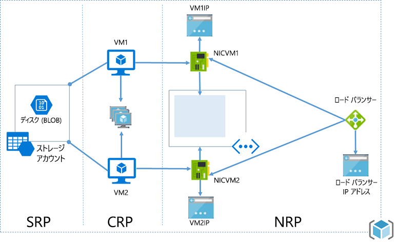
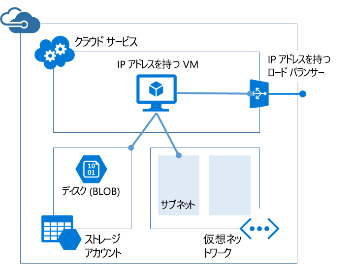

# <a name="azure-resource-manager-vs-classic-deployment-understand-deployment-models-and-the-state-of-your-resources"></a>Azure Resource Manager とクラシック デプロイ: デプロイ モデルとリソースの状態について
このトピックでは、Azure Resource Manager デプロイメント モデルとクラシック デプロイメント モデル、リソースの状態、各リソースのデプロイにそのモデルが使われた理由について説明します。 Resource Manager デプロイメント モデルとクラシック デプロイメント モデルは、Azure ソリューションのデプロイと管理における&2; 種類の異なる方法です。 異なる&2; 種類の API セットを使用することで、デプロイしたリソースには重要な相違点が存在する可能性があります。 これらの&2; つのモデルには、完全に互換性があるわけではありません。 このトピックでは、その相違点について説明します。

リソースのデプロイと管理を簡単にするために、すべての新しいリソースに Resource Manager を利用することが推奨されています。 可能であれば、Resource Manager を使用して既存のリソースを再度デプロイすることをお勧めします。

これまでに Resource Manager を使用したことがない場合は、まず「[Azure Resource Manager の概要](resource-group-overview.md)」で定義されている用語をご確認ください。

## <a name="history-of-the-deployment-models"></a>デプロイメント モデルの歴史
Azure では当初、クラシック デプロイメント モデルのみ用意されていました。 このモデルでは、各リソースが独立して存在していたため、関連リソースをまとめてグループ化する方法がありませんでした。 それどころか、ソリューションまたはアプリケーションを構成するリソースを手動で追跡し、うまくバランスを取りながら管理する必要がありました。 ソリューションをデプロイするには、クラシック ポータル経由で各リソースを個別に作成するか、すべてのリソースを正しい順序でデプロイするスクリプトを作成する必要がありました。 ソリューションを削除するには、各リソースを個別に削除するほかありませんでした。 関連リソースのアクセス制御ポリシーの適用と更新は、簡単ではありませんでした。 そのうえ、タグをリソースに適用し、リソースの監視と請求の管理に役立つ単語を使ってこれらのリソースにラベル付けすることもできませんでした。

2014 年、Azure に Resource Manager が導入され、リソース グループの概念が追加されました。 リソース グループとは、共通のライフサイクルが共有されるリソースのコンテナーです。 Resource Manager のデプロイ モデルにはいくつかの利点があります。

* ソリューションのすべてのサービスを、個別に処理するのではなく、グループとしてデプロイ、管理、監視できます。
* ソリューションをそのライフサイクル全体で繰り返しデプロイできます。また、常にリソースが一貫した状態でデプロイされます。
* リソース グループに属するすべてのリソースにアクセス制御を適用できます。これらのポリシーは、リソース グループに新しいリソースが追加されたときに自動的に適用されます。
* タグをリソースに適用し、サブスクリプションのすべてのリソースを論理的に整理できます。
* JavaScript Object Notation (JSON) を使用してソリューションのインフラストラクチャを定義できます。 JSON ファイルは Resource Manager テンプレートと呼ばれます。
* 正しい順序でデプロイされるようにリソース間の依存性を定義できます。

Resource Manager が追加されたとき、すべてのリソースが遡及的に既定のリソース グループに追加されました。 今、従来のデプロイでリソースを作成すると、デプロイ時にリソース グループを指定していなくても、リソースはそのサービスの既定のリソース グループ内に自動的に作成されます。 ただし、リソース グループ内に存在するだけでは、リソースが Resource Manager モデルに変換されたことになりません。 次のセクションでは、各サービスにおける&2; つのデプロイメント モデルの扱われ方を見ていきます。 

## <a name="understand-support-for-the-models"></a>モデルのサポートについて
リソースで使用するデプロイメント モデルを決定する際には、注意が必要なシナリオが&3; つあります。

1. サービスが Resource Manager をサポートしており、単一の種類にのみ対応している。
2. サービスが Resource Manager をサポートしているが、2 つの種類に対応している (一方は Resource Manager、もう一方はクラシック)。 このシナリオは、仮想マシン、ストレージ アカウント、仮想ネットワークにのみ該当します。
3. サービスが Resource Manager をサポートしていない。

サービスが Resource Manager をサポートしているかどうかを確認するには、[Resource Manager でサポートされるプロバイダー](resource-manager-supported-services.md)に関するページを参照してください。

使用したいサービスが Resource Manager をサポートしていない場合、クラシック デプロイメントの使用を継続する必要があります。

サービスが Resource Manager をサポートしており、なおかつ仮想マシン、ストレージ アカウント、仮想ネットワークのいずれでも **ない** 場合は、問題なく Resource Manager を使用できます。

仮想マシン、ストレージ アカウント、仮想ネットワークについては、クラシック デプロイメントでリソースが作成された場合、クラシックの操作でそのリソースを操作し続ける必要があります。 仮想マシン、ストレージ アカウント、または仮想ネットワークが Resource Manager デプロイメントで作成された場合は、Resource Manager の操作を使用し続ける必要があります。 このような区別があるため、Resource Manager デプロイメントで作成されたリソースとクラシック デプロイメントで作成されたリソースがサブスクリプション内に混在していると、混乱を招くおそれがあります。 リソースが同じ操作に対応しないため、そのような混在が予想外の結果を生むことがあります。

場合によっては、Resource Manager コマンドを使用することで、クラシック デプロイメントで作成したリソースに関する情報を取得したり、クラシック リソースを別のリソース グループに移動するなどの管理タスクを実行したりできます。 しかしこれらのケースから、その種類が Resource Manager の操作に対応しているという印象を持たないようにしてください。 たとえば、クラシック デプロイメントで作成された仮想マシンを含むリソース グループがあるとします。 例として、次の Resource Manager PowerShell コマンドを実行したとします。

```powershell
Get-AzureRmResource -ResourceGroupName ExampleGroup -ResourceType Microsoft.ClassicCompute/virtualMachines
```

仮想マシンが返されます。

```powershell
Name              : ExampleClassicVM
ResourceId        : /subscriptions/{guid}/resourceGroups/ExampleGroup/providers/Microsoft.ClassicCompute/virtualMachines/ExampleClassicVM
ResourceName      : ExampleClassicVM
ResourceType      : Microsoft.ClassicCompute/virtualMachines
ResourceGroupName : ExampleGroup
Location          : westus
SubscriptionId    : {guid}
```

ただし、Resource Manager コマンドレット **Get-AzureRmVM** を実行した場合は、Resource Manager でデプロイされた仮想マシンのみが返されます。 次のコマンドでは、クラシック デプロイメントで作成された仮想マシンは返されません。

```powershell
Get-AzureRmVM -ResourceGroupName ExampleGroup
```

Resource Manager で作成したリソースだけがタグに対応しています。 従来のリソースにタグを適用することはできません。

## <a name="resource-manager-characteristics"></a>Resource Manager の特性
2 つのモデルをよく理解できるように、Resource Manager の種類の特性を確認してみましょう。

* [Azure ポータル](https://portal.azure.com/)を使用した作成。
  
     
  
     Compute、Storage、Networking のリソースについては、Resource Manager と従来のデプロイのどちらかを使用できます。 **[リソース マネージャー]**を選択します。
  
     
* Resource Manager バージョンの Azure PowerShell コマンドレットを使用した作成。 これらのコマンドは、次に示すように *Verb-AzureRmNoun* の形式となります。

  ```powershell
  New-AzureRmResourceGroupDeployment
  ```

* REST 操作のための [Azure Resource Manager REST API](https://docs.microsoft.com/rest/api/resources/) を使用した作成。
* **arm** モードで実行される Azure CLI コマンドを使用した作成。
  
  ```azurecli
  azure config mode arm
  azure group deployment create
  ```

* リソース タイプの名前には **(classic)** は含まれません。 下の画像ではタイプとして "**Storage account**" と表示されています。
  
    

## <a name="classic-deployment-characteristics"></a>従来のデプロイの特性
従来のデプロイ モデルはサービス管理モデルとしても知られています。

従来のデプロイで作成されたリソースには次の特性があります。

* [クラシック ポータル](https://manage.windowsazure.com)
  
     
  
     または、Azure ポータルを使い、 **クラシック** デプロイメントを指定します (Compute、Storage、Networking の場合)。
  
     
* サービス管理バージョンの Azure PowerShell コマンドレットを使用した作成。 これらのコマンド名は *Verb-AzureNoun* の形式となります。

  ```powershell
  New-AzureVM
  ```

* REST 操作のための [サービス管理 REST API](https://msdn.microsoft.com/library/azure/ee460799.aspx) を使用した作成。
* **asm** モードで実行される Azure CLI コマンドを使用した作成。

  ```azurecli
  azure config mode asm
  azure vm create
  ```
   
* リソース タイプの名前に **(classic)** が含まれます。 下の画像ではタイプとして "**Storage account (classic)**" と表示されています。
  
    

Azure Portal を利用して、クラシック デプロイメントで作成されたリソースを管理できます。

## <a name="changes-for-compute-network-and-storage"></a>Compute、Network、Storage の変更
次の図は、Resource Manager でデプロイされた Compute、Network、Storage のリソースを示しています。



次に挙げるリソース間の関係を確認してください。

* すべてのリソースがリソース グループ内に存在します。
* 仮想マシンは、ディスクを BLOB ストレージ (必須) に保存するために、Storage リソース プロバイダーで定義されている特定のストレージ アカウントに依存します。
* 仮想マシンは、Network リソース プロバイダー (必須) で定義されている特定の NIC と、Compute リソース プロバイダー (オプション) で定義されている可用性セットを参照します。
* NIC は、仮想マシンに割り当てられた IP アドレス (必須)、仮想マシンの仮想ネットワークのサブネット (必須)、ネットワーク セキュリティ グループ (オプション) を参照します。
* 仮想ネットワーク内のサブネットは、ネットワーク セキュリティ グループ (オプション) を参照します。
* Load Balancer のインスタンスは、仮想マシンの NIC (オプション) を含む IP アドレスのバックエンド プールと、Load Balancer パブリックまたはプライベート IP アドレス (オプション) を参照します。

次にコンポーネントと、クラシック デプロイメントにおけるコンポーネントの関係を示します。



仮想マシンをホストする従来のソリューションは次のとおりです。

* 仮想マシンをホストするためのコンテナーとして機能する必須のクラウド サービス (コンピューティング)  仮想マシンにはネットワーク インターフェイス カード (NIC) が自動的に提供され、IP アドレスは Azure によって割り当てられます。 さらに、クラウド サービスには、外部のロード バランサーのインスタンス、パブリック IP アドレス、および Windows ベースのバーチャル マシンのリモート デスクトップとリモート PowerShell トラフィックと Linux ベースのバーチャル マシン用の Secure Shell (SSH) トラフィックを許可する既定のエンドポイントが含まれています。
* オペレーティング システム、一時、および追加のデータ ディスク (ストレージ) を含む、仮想マシンの VHD を格納するのに必要なストレージ アカウント。
* サブネット化された構造を作成できる、また仮想マシンが配置されているサブネットを指定することができる、追加のコンテナーとして機能する、省略可能な仮想ネットワーク (ネットワーク)。

次の表では、Compute、Network、Storage のリソース プロバイダーの相互作用の変化について説明します。

| 項目 | クラシック | Resource Manager |
| --- | --- | --- |
| Virtual Machines 用クラウド サービス |クラウド サービスは、プラットフォームに基づく可用性と負荷分散を必要とする仮想マシンを保持するためのコンテナーです。 |新しいモデルを使用して仮想マシンを作成するためのオブジェクトとしてのクラウド サービスは不要となりました。 |
| Virtual Networks |仮想ネットワークは仮想マシンでは省略可能です。 使用すると、仮想ネットワークは Resource Manager でデプロイできなくなります。 |仮想マシンには、Resource Manager でデプロイされた仮想ネットワークが必要です。 |
| ストレージ アカウント |仮想マシンには、オペレーティング システム、一時データ ディスク、追加データ ディスクの VHD を格納するためのストレージ アカウントが必要です。 |仮想マシンには、BLOB ストレージにディスクを保存するためのストレージ アカウントが必要です。 |
| 可用性セット |プラットフォームに対する可用性は、Virtual Machines に同じ "AvailabilitySetName" を構成することによって示されます。 障害ドメインの最大数は 2 です。 |可用性セットは、Microsoft.Compute プロバイダーによって公開されるリソースです。 可用性セットには、高可用性を必要とする Virtual Machines を含める必要があります。 障害ドメインの最大数は 3 です。 |
| [アフィニティ グループ] をクリックし、 |Virtual Network を作成するにはアフィニティ グループが必要です。 ただし、Regional Virtual Network の導入により、それは不要となりました。 |単純化するために、Azure リソース マネージャーによって公開される API には、アフィニティ グループの概念が存在しません。 |
| 負荷分散 |デプロイされている Virtual Machines には、クラウド サービスの作成によって暗黙的な Load Balancer が提供されます。 |Load Balancer は、Microsoft.Network プロバイダーによって公開されるリソースです。 負荷分散を必要とする Virtual Machines のプライマリ ネットワーク インターフェイスは、Load Balancer を参照している必要があります。 Load Balancer には、内部 Load Balancer と外部 Load Balancer とがあります。 Load Balancer のインスタンスは仮想マシンの NIC を含め(オプション)、Load Balancer パブリックまたはプライベート IP アドレス (オプション) を参照している IP アドレスのバックエンドプールを参照します。 [詳細については、こちらを参照してください。](../virtual-network/resource-groups-networking.md) |
| 仮想 IP アドレス |クラウド サービスに VM を追加すると、Cloud Services に既定の VIP (仮想 IP アドレス) が付与されます。 仮想 IP アドレスは、暗黙的なロード バランサーに関連付けられるアドレスです。 |パブリック IP アドレスは、Microsoft.Network プロバイダーによって公開されるリソースです。 パブリック IP アドレスには、静的 (予約済み) アドレスと動的アドレスとがあります。 Load Balancer には、動的パブリック IP を割り当てることができます。 パブリック IP のセキュリティは、セキュリティ グループを使用して保護できます。 |
| 予約済み IP アドレス |IP アドレスを Azure で予約し、クラウド サービスに関連付けることで、その IP アドレスを固定アドレスとすることができます。 |パブリック IP アドレスは "静的" モードで作成でき、"予約済み IP アドレス" と同じ機能を持ちます。 現在、Load Balancer に割り当てることができるのは静的パブリック IP だけです。 |
| VM ごとのパブリック IP アドレス (PIP) |パブリック IP アドレスを直接 VM に関連付けることもできます。 |パブリック IP アドレスは、Microsoft.Network プロバイダーによって公開されるリソースです。 パブリック IP アドレスには、静的 (予約済み) アドレスと動的アドレスとがあります。 ただし、VM ごとのパブリック IP を取得するためにネットワーク インターフェイスに割り当てることができるのは現在、動的パブリック IP だけです。 |
| エンドポイント |特定のポートの接続を確立するためには、仮想マシンに入力エンドポイントを構成する必要があります。 入力エンドポイントを設定することによって仮想マシンに接続する一般的なモードの&1; つ。 |VM への接続用に特定のポートのエンドポイントを有効にする機能は、Load Balancer に受信 NAT ルールを構成することで実現できます。 |
| DNS 名 |クラウド サービスには、グローバルに一意となる暗黙的な DNS 名が与えられます  (例: `mycoffeeshop.cloudapp.net`)。 |DNS 名は、パブリック IP アドレス リソースに指定できる省略可能なパラメーターです。 FQDN は、`<domainlabel>.<region>.cloudapp.azure.com` という形式です。 |
| ネットワーク インターフェイス |プライマリとセカンダリのネットワーク インターフェイスおよびそのプロパティは、仮想マシンのネットワーク構成として定義されます。 |ネットワーク インターフェイスは、Microsoft.Network プロバイダーによって公開されるリソースです。 ネットワーク インターフェイスのライフサイクルは、仮想マシンに関連付けられません。 ネットワーク インターフェイスは、仮想マシンに割り当てられた IP アドレス (必須)、仮想マシンの仮想ネットワークのサブネット (必須)、ネットワークのセキュリティ グループ (オプション) を参照します。 |

さまざまなデプロイメント モデルから仮想ネットワークを接続する方法の詳細については、「[異なるデプロイ モデルの仮想ネットワークをポータルで接続する](../vpn-gateway/vpn-gateway-connect-different-deployment-models-portal.md)」を参照してください。

## <a name="migrate-from-classic-to-resource-manager"></a>クラシックから Resource Manager への移行
クラシック デプロイメントから Resource Manager デプロイメントにリソースを移行する準備ができたら、次のページを参照してください。

1. [プラットフォームでサポートされているクラシックから Azure Resource Manager への移行に関する技術的な詳細](../virtual-machines/virtual-machines-windows-migration-classic-resource-manager-deep-dive.md)
2. [プラットフォームでサポートされているクラシックから Azure Resource Manager への IaaS リソースの移行](../virtual-machines/virtual-machines-windows-migration-classic-resource-manager.md)
3. [Azure PowerShell を使用してクラシックから Azure Resource Manager へ IaaS リソースを移行する](../virtual-machines/virtual-machines-windows-ps-migration-classic-resource-manager.md)
4. [Azure CLI を使用してクラシックから Azure Resource Manager へ IaaS リソースを移行する](../virtual-machines/virtual-machines-linux-cli-migration-classic-resource-manager.md)

## <a name="frequently-asked-questions"></a>よく寄せられる質問
**クラシック デプロイで作成された仮想ネットワークにデプロイする仮想マシンを、Azure Resource Manager で作成することはできますか。**

これはサポートされていません。 Azure Resource Manager を使用して、クラシック デプロイメントで作成された仮想ネットワークに仮想マシンをデプロイすることはできません。

**Azure Service Management API を使用して作成されたユーザー イメージから、Azure Resource Manager を使用して仮想マシンを作成することはできますか。**

これはサポートされていません。 ただし、Service Management API で作成されたストレージ アカウントから VHD ファイルをコピーし、Azure Resource Manager で作成された新しいアカウントに追加することはできます。

**サブスクリプションのクォータにはどのような影響が生じますか。**

Azure Resource Manager を使用して作成された仮想マシン、仮想ネットワーク、ストレージ アカウントのクォータは、他のクォータとは区別されます。 各サブスクリプションには新しい API を使用してリソースを作成するためのクォータが付与されます。 追加クォータの詳細については、 [こちら](../azure-subscription-service-limits.md)を参照してください。

**仮想マシン、仮想ネットワーク、ストレージ アカウントをプロビジョニングするための独自の自動スクリプトは、Resource Manager API で引き続き使用できますか。**

これまでに作成したオートメーションやスクリプトはすべて、Azure Service Management モードで作成された既存の仮想マシンや仮想ネットワークに使用できます。 ただし、Resource Manager モードで同じリソースを作成するためには、新しいスキーマを使用できるようにスクリプトを更新する必要があります。

**Azure リソース マネージャーのテンプレートの例はどこで入手できますか。**

[Azure Resource Manager のクイックスタート テンプレート](https://azure.microsoft.com/documentation/templates/)に関するページで、広範囲にわたるスターター テンプレートが提供されています。

## <a name="next-steps"></a>次のステップ
* 仮想マシン、ストレージ アカウント、仮想ネットワークを定義するテンプレートの作成に関するチュートリアルについては、「[Resource Manager テンプレートのチュートリアル](resource-manager-template-walkthrough.md)」を参照してください。
* テンプレートをデプロイするためのコマンドについては、「 [Azure リソース マネージャーのテンプレートを使用したアプリケーションのデプロイ](resource-group-template-deploy.md)」を参照してください。


