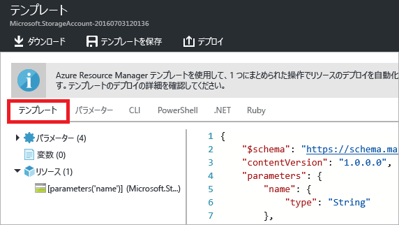
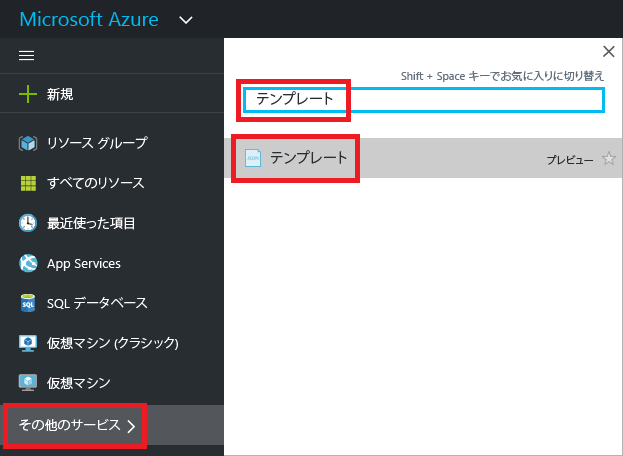
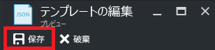

# <a name="export-an-azure-resource-manager-template-from-existing-resources"></a>既存のリソースから Azure Resource Manager テンプレートをエクスポートする
この記事では、サブスクリプション内の既存のリソースから Resource Manager テンプレートをエクスポートする方法について説明します。 生成されたそのテンプレートを使用して、テンプレートの構文について理解を深めることができます。

テンプレートをエクスポートするには、次の 2 とおりの方法があります。

* **デプロイに使用した実際のテンプレート**をエクスポートできます。 エクスポートしたテンプレートには、元のテンプレートで定義されたのと同じパラメーターと変数がすべて含まれます。 この方法は、ポータル経由でリソースをデプロイ済みで、そのリソースの作成に使ったテンプレートを確認したい場合に便利です。 このテンプレートはすぐに使用できます。 
* **リソース グループの現在の状態を表す生成済みのテンプレート**をエクスポートできます。 エクスポートしたテンプレートは、デプロイに使用したテンプレートに基づいていません。 代わりに、リソース グループの "スナップショット" または "バックアップ" であるテンプレートが作成されます。 エクスポートしたテンプレートにはハードコーディングされた多くの値が含まれ、おそらく、通常定義するのと同程度のパラメーターは含まれません。 このオプションは、同じリソース グループにリソースを再デプロイする場合に使います。 別のリソース グループにこのテンプレートを使うには、大幅な変更が必要になる場合があります。

この記事では、ポータルを使って両方の方法を紹介します。

## <a name="deploy-resources"></a>リソースのデプロイ
まず、テンプレートとしてエクスポートするために使用できるリソースを Azure にデプロイします。 テンプレートにエクスポートしたいリソース グループが既にサブスクリプション内にある場合、このセクションはスキップしてかまいません。 この記事の残りの部分では、このセクションに示されている Web アプリと SQL データベース ソリューションをデプロイ済みであることを前提としています。 別のソリューションを使用する場合は、操作が若干異なる可能性がありますが、テンプレートをエクスポートする手順は同じです。 

1. [Azure Portal](https://portal.azure.com) で、**[リソースの作成]** を選択します。
   
      
2. **[web app + SQL]\(Web アプリと SQL\)** を検索して、使用可能なオプションから選択します。
   
      

3. **[作成]** を選択します。

      

4. Web アプリと SQL データベースに必要な値を入力します。 **[作成]** を選択します。

      

デプロイには少し時間がかかる場合があります。 デプロイが完了すると、サブスクリプションにこのソリューションが含まれた状態になります。

## <a name="view-template-from-deployment-history"></a>デプロイ履歴からのテンプレートの表示
1. 新しいリソース グループのリソース グループに移動します。 ポータルに直前のデプロイの結果が表示されていることがわかります。 そのリンクを選択します。
   
      
2. グループのデプロイの履歴が表示されます。 このケースでは、ポータルに表示されるデプロイはおそらく 1 つだけです。 このデプロイを選択します。
   
     
3. ポータルにデプロイの概要が表示されます。 概要には、デプロイの状態とその操作、およびパラメーターに指定した値が含まれています。 デプロイに使用されたテンプレートを表示するには、 **[テンプレートの表示]** を選択します。
   
     
4. Resource Manager によって、次の 7 つのファイルが取得されます。
   
   1. **Template** - ソリューションのインフラストラクチャを定義するテンプレート。 ポータルでストレージ アカウントを作成したときに、Resource Manager はテンプレートを使用してそれをデプロイし、今後参照できるようにテンプレートを保存しました。
   2. **Parameters** - デプロイ中に値を渡すために使用できるパラメーター ファイル。 初回デプロイ時に指定した値が含まれています。 これらの値はどれも、テンプレートを再デプロイするときに変更できます。
   3. **CLI** - テンプレートをデプロイするために使用できる Azure CLI スクリプト ファイル。
   4. **PowerShell** - テンプレートをデプロイするために使用できる Azure PowerShell スクリプト ファイル。
   5. **.NET** - テンプレートをデプロイするために使用できる .NET クラス。
   6. **Ruby** - テンプレートをデプロイするために使用できる Ruby クラス。
      
      テンプレートは、ポータルに既定で表示されます。
      
       
      
これは、Web アプリと SQL データベースの作成に使用した実際のテンプレートです。 デプロイ時にさまざまな値を指定できるパラメーターが含まれていることに注目してください。 テンプレートの構造の詳細については、「 [Azure Resource Manager のテンプレートの作成](resource-group-authoring-templates.md)」を参照してください。

## <a name="export-the-template-from-resource-group"></a>リソース グループからのテンプレートのエクスポート
リソースを手動で変更したり、何度もデプロイを行ってリソースを追加したりした場合、デプロイ履歴からテンプレートを取得しても、リソース グループの現在の状態が反映されていません。 このセクションでは、リソース グループの現在の状態を反映したテンプレートをエクスポートする方法について説明します。 リソース グループのスナップショットとして意図されており、同じリソース グループへの再デプロイに使うことができます。 エクスポートされたテンプレートを他のソリューションに使うには、大幅な変更を行う必要があります。

> [!NOTE]
> 200 を超えるリソースが含まれるリソース グループのテンプレートをエクスポートすることはできません。
> 
> 

1. リソース グループのテンプレートを表示するには、 **[Automation スクリプト]** を選択します。
   
      
   
     Resource Manager は、リソース グループ内のリソースを評価し、それらのリソースのテンプレートを生成します。 テンプレート関数のエクスポートは、すべてのリソースの種類でサポートされているわけではありません。 エクスポートに問題があることを示すエラーが表示される場合があります。 これらの問題に対処する方法については、「 [エクスポートの問題の修正](#fix-export-issues) 」セクションで説明します。
2. ここでも、ソリューションの再デプロイに使用できる 6 個のファイルが表示されます。 ただし、今回のテンプレートは若干異なります。 生成されたテンプレートに含まれているパラメーターの数が、前のセクションのテンプレートより少ないことに注目してください。 さらにこのテンプレートでは、パラメーター値を受け入れるのではなく、多数の値 (場所や SKU の値など) がハードコーディングされています。 場合によっては、このテンプレートを再利用する前に、パラメーターをうまく活用できるようテンプレートを編集する必要があります。 
   
3. このテンプレートの操作を続ける場合、2 とおりのオプションがあります。 テンプレートをダウンロードし、JSON エディターを使用してローカルで作業することができます。 また、ライブラリにテンプレートを保存し、Portal を使用して作業をすることもできます。
   
     [VS Code](https://code.visualstudio.com/)、[Visual Studio](vs-azure-tools-resource-groups-deployment-projects-create-deploy.md) などの JSON エディターの操作に慣れている場合は、テンプレートをローカルにダウンロードし、エディターを使用できます。 ローカルで作業する場合、**[ダウンロード]** を選択します。
   
      
   
     JSON エディターを設定していない場合は、Portal を使用してテンプレートを編集できます。 この記事の後半部分では、Portal のライブラリにテンプレートを保存してあることを前提としています。 ただし、JSON エディターを使用してローカルで作業する場合でも、Portal を使用して作業する場合でも、テンプレートに対して行う構文の変更は同じです。 Portal を使用して作業する場合、**[ライブラリに追加]** を選択します。
   
      
   
     ライブラリにテンプレートを追加するときに、テンプレートの名前と説明を入力します。 次に、**[保存]** を選択します。
   
     
4. ライブラリに保存したテンプレートを表示するには、**[その他のサービス]** を選択し、「**テンプレート**」と入力して結果をフィルター処理します。次に、**[テンプレート]** を選択します。
   
      
5. 保存した名前の付いたテンプレートを選択します。
   
      

## <a name="customize-the-template"></a>テンプレートのカスタマイズ
エクスポートしたテンプレートは、すべてのデプロイで同じ Web アプリと SQL データベースを作成する場合、問題なく使用できます。 ただし、Resource Manager に備わっている各種オプションを使用すれば、より柔軟にテンプレートをデプロイすることができます。 この記事では、データベース管理者の名前とパスワード用のパラメーターを追加する方法について説明します。 この方法を使用すれば、テンプレートの他の値についても柔軟性が向上します。

1. テンプレートをカスタマイズするには、**[編集]** を選択します。
   
     
2. テンプレートを選択します。
   
     
3. 指定する値をデプロイ時に渡すには、テンプレートの **parameters** セクションに次の 2 つのパラメーターを追加します。

   ```json
   "administratorLogin": {
       "type": "String"
   },
   "administratorLoginPassword": {
       "type": "SecureString"
   },
   ```

4. 新しいパラメーターを使用するには、**resources** セクションの SQL サーバー定義を置き換えます。 **administratorLogin** と **administratorLoginPassword** でパラメーター値が使用されるようになったことに注目してください。

   ```json
   {
       "comments": "Generalized from resource: '/subscriptions/{subscription-id}/resourceGroups/exportsite/providers/Microsoft.Sql/servers/tfserverexport'.",
       "type": "Microsoft.Sql/servers",
       "kind": "v12.0",
       "name": "[parameters('servers_tfserverexport_name')]",
       "apiVersion": "2014-04-01-preview",
       "location": "South Central US",
       "scale": null,
       "properties": {
           "administratorLogin": "[parameters('administratorLogin')]",
           "administratorLoginPassword": "[parameters('administratorLoginPassword')]",
           "version": "12.0"
       },
       "dependsOn": []
   },
   ```

6. テンプレートの編集が完了したら、**[OK]** を選択します。
7. **[保存]** を選択し、テンプレートに対する変更を保存します。
   
     
8. 更新したテンプレートを再デプロイするには、**[デプロイ]** を選択します。
   
     
9. パラメーター値を指定し、リソースのデプロイ先となるリソース グループを選択します。


## <a name="fix-export-issues"></a>エクスポートの問題の修正
テンプレート関数のエクスポートは、すべてのリソースの種類でサポートされているわけではありません。 エクスポートの問題は、リソース グループからエクスポートする場合にのみ発生します。デプロイ履歴からのエクスポートでは発生しません。 最後のデプロイがリソース グループの現在の状態を正確に表しているようであれば、リソース グループからではなく、デプロイ履歴からテンプレートをエクスポートすることをお勧めします。 単一のテンプレートで定義されていない変更をリソース グループに加えた場合にのみ、リソース グループからエクスポートしてください。

エクスポートの問題を回避するには、欠けているリソースを対象のテンプレートに手動で追加します。 エラー メッセージには、エクスポートできないリソースの種類が含まれています。 そのリソースの種類は、[テンプレート リファレンス](/azure/templates/)で探してください。 たとえば、仮想ネットワーク ゲートウェイを手動で追加するには、[Microsoft.Network/virtualNetworkGateways テンプレート リファレンス](/azure/templates/microsoft.network/virtualnetworkgateways)を参照してください。 テンプレート リファレンスには、テンプレートにリソースを追加するための JSON が記載されています。

リソースに対応する JSON 形式を取得したら、次にリソースの値を取得する必要があります。 リソースの値は、リソースの種類に対応する REST API の GET 操作を使用して確認できます。 たとえば、仮想ネットワーク ゲートウェイの値を取得するには、「[Virtual Network Gateways - Get](/rest/api/network-gateway/virtualnetworkgateways/get)」(仮想ネットワーク ゲートウェイ - Get) を参照します。

## <a name="next-steps"></a>次の手順

* [PowerShell](resource-group-template-deploy.md)、[Azure CLI](resource-group-template-deploy-cli.md)、または [REST API](resource-group-template-deploy-rest.md) を使用してテンプレートをデプロイできます。
* PowerShell でテンプレートをエクスポートする方法については、「[PowerShell を使用した Azure Resource Manager テンプレートのエクスポート](resource-manager-export-template-powershell.md)」をご覧ください。
* Azure CLI でテンプレートをエクスポートする方法については、「[Azure CLI を使用した Azure Resource Manager テンプレートのエクスポート](resource-manager-export-template-cli.md)」をご覧ください。

