# <a name="export-an-azure-resource-manager-template-from-existing-resources"></a>既存のリソースから Azure Resource Manager テンプレートをエクスポートする
Resource Manager を使用すると、サブスクリプション内の既存のリソースから Resource Manager テンプレートをエクスポートできます。 この生成されたテンプレートを使用すると、テンプレートの構文を学習したり、必要に応じてソリューションの再デプロイを自動化したりすることができます。

テンプレートのエクスポートには&2; つの異なる方法があることに注意する必要があります。

* デプロイに使用した実際のテンプレートをエクスポートできます。 エクスポートしたテンプレートには、元のテンプレートで定義されたのと同じパラメーターと変数がすべて含まれます。 この方法は、ポータルからリソースをデプロイした場合に役立ちます。 それらのリソースを作成するためのテンプレートの構築方法をご確認ください。
* リソース グループの現在の状態を表すテンプレートをエクスポートできます。 エクスポートしたテンプレートは、デプロイに使用したテンプレートに基づいていません。 代わりに、リソース グループのスナップショットであるテンプレートが作成されます。 エクスポートしたテンプレートにはハードコーディングされた多くの値が含まれ、おそらく、通常定義するのと同程度のパラメーターは含まれません。 この方法は、ポータルまたはスクリプトでリソース グループを修正してあり、 そのリソース グループをテンプレートとしてキャプチャする必要が生じた場合に役に立ちます。

このトピックでは、両方の方法を示します。

このチュートリアルではまず、Azure ポータルにサインインし、ストレージ アカウントを作成して、そのストレージ アカウントのテンプレートをエクスポートします。 次に、仮想ネットワークを追加してリソース グループに変更を加えます。 最後に、その最新の状態を表す新しいテンプレートをエクスポートします。 この記事では、単純なインフラストラクチャを扱っていますが、より複雑なソリューションのテンプレートのエクスポートにも、同様の手順を使用できます。

## <a name="create-a-storage-account"></a>ストレージ アカウントの作成
1. [Azure Portal](https://portal.azure.com) で、**[新規]** > **[ストレージ]** > **[ストレージ アカウント]** を選択します。
   
      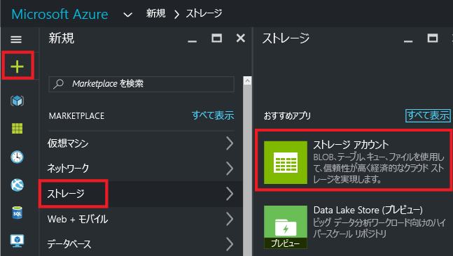
2. ストレージ アカウントを作成し、名前を **storage**、自分のイニシャル、日付の組み合わせにします。 ストレージ アカウント名は Azure 内で一意である必要があります。 指定した名前が既に使用されている場合、名前が使用中であることを示すエラー メッセージが表示されます。 別のものを試してみてください。 リソース グループについては、**[新規作成]** を選択し、**ExportGroup** という名前を付けます。 他のプロパティには既定値をそのまま使用します。 **[作成]**を選択します。
   
      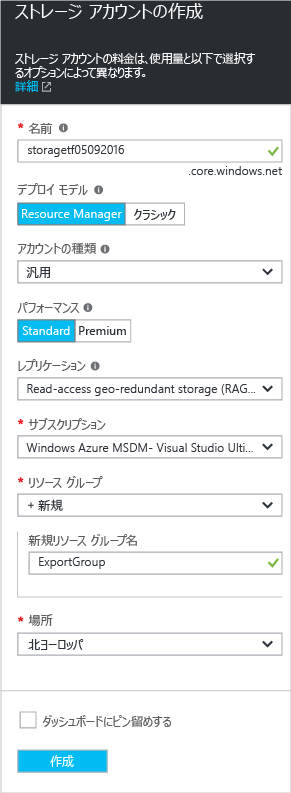

デプロイには少し時間がかかる場合があります。 デプロイが完了すると、サブスクリプションにストレージ アカウントが含まれた状態になります。

## <a name="view-a-template-from-deployment-history"></a>デプロイ履歴からテンプレートを表示する
1. 新しいリソース グループのリソース グループ ブレードに移動します。 ブレードに直前のデプロイの結果が表示されていることがわかります。 そのリンクを選択します。
   
      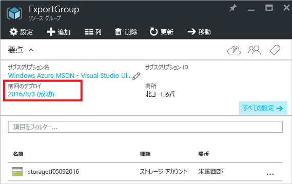
2. グループのデプロイの履歴が表示されます。 このケースでは、ブレードに表示されるデプロイはおそらく&1; つだけです。 このデプロイを選択します。
   
     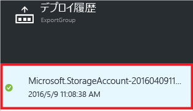
3. ブレードにデプロイの概要が表示されます。 概要には、デプロイの状態とその操作、およびパラメーターに指定した値が含まれています。 デプロイに使用されたテンプレートを表示するには、 **[テンプレートの表示]**を選択します。
   
     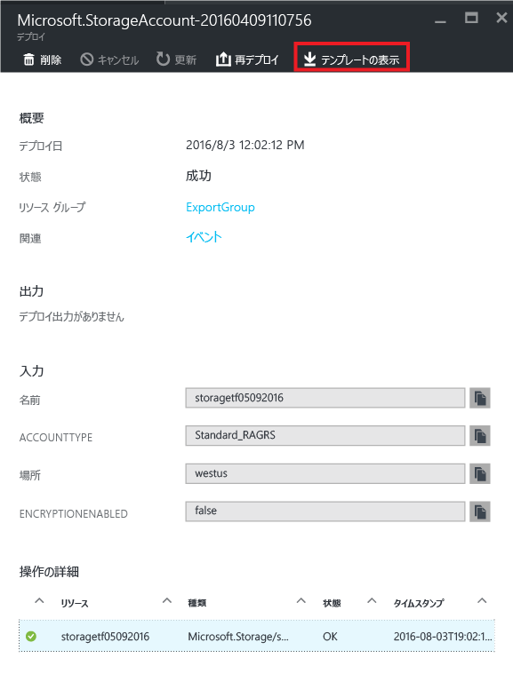
4. Resource Manager によって、次の&6; つのファイルが取得されます。
   
   1. **Template** - ソリューションのインフラストラクチャを定義するテンプレート。 ポータルでストレージ アカウントを作成したときに、Resource Manager はテンプレートを使用してそれをデプロイし、今後参照できるようにテンプレートを保存しました。
   2. **Parameters** - デプロイ中に値を渡すために使用できるパラメーター ファイル。 最初のデプロイ中に指定した値が含まれていますが、テンプレートを再デプロイするときに任意の値を変更することができます。
   3. **CLI** - テンプレートをデプロイするために使用できる Azure CLI (コマンド ライン インターフェイス) スクリプト ファイル。
   3. **CLI 2.0** - テンプレートをデプロイするために使用することができる Azure CLI (コマンド ライン インターフェイス) スクリプト ファイル。
   4. **PowerShell** - テンプレートをデプロイするために使用できる Azure PowerShell スクリプト ファイル。
   5. **.NET** - テンプレートをデプロイするために使用できる .NET クラス。
   6. **Ruby** - テンプレートをデプロイするために使用できる Ruby クラス。
      
      ファイルは、ブレードのリンクを通じて使用できます。 テンプレートは、このブレードに既定で表示されます。
      
       ![[テンプレートの表示]](./media/resource-manager-export-template/view-template.png)
      
      特にテンプレートに気を付けてください。 テンプレートは次のようになっているはずです。
      
      ```json
      {
        "$schema": "https://schema.management.azure.com/schemas/2015-01-01/deploymentTemplate.json#",
        "contentVersion": "1.0.0.0",
        "parameters": {
          "name": {
            "type": "String"
          },
          "accountType": {
            "type": "String"
          },
          "location": {
            "type": "String"
          },
          "encryptionEnabled": {
            "defaultValue": false,
            "type": "Bool"
          }
        },
        "resources": [
          {
            "type": "Microsoft.Storage/storageAccounts",
            "sku": {
              "name": "[parameters('accountType')]"
            },
            "kind": "Storage",
            "name": "[parameters('name')]",
            "apiVersion": "2016-01-01",
            "location": "[parameters('location')]",
            "properties": {
              "encryption": {
                "services": {
                  "blob": {
                    "enabled": "[parameters('encryptionEnabled')]"
                  }
                },
                "keySource": "Microsoft.Storage"
              }
            }
          }
        ]
      }
      ```

これは、ストレージ アカウントの作成に使用した実際のテンプレートです。 さまざまな種類のストレージ アカウントをデプロイできるパラメーターが含まれていることに注目してください。 テンプレートの構造の詳細については、「 [Azure Resource Manager のテンプレートの作成](resource-group-authoring-templates.md)」を参照してください。 テンプレートで使用できる関数の完全な一覧については、「 [Azure Resource Manager のテンプレートの関数](resource-group-template-functions.md)」を参照してください。

## <a name="add-a-virtual-network"></a>仮想ネットワークの追加
前のセクションでダウンロードしたテンプレートは、元のデプロイのインフラストラクチャを表しています。 デプロイ後に行われた変更には対応できません。
この問題をわかりやすく示すために、ポータルで仮想ネットワークを追加して、リソース グループを変更してみましょう。

1. リソース グループのブレードで、 **[追加]**を選択します。
   
      
2. 利用可能なリソースから、 **[Virtual Network]** を選択します。
   
      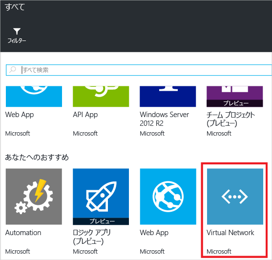
3. 仮想ネットワークの名前を **VNET**にし、その他のプロパティには既定値を使用します。 **[作成]**を選択します。
   
      
4. 仮想ネットワークがリソース グループに正常にデプロイされた後で、デプロイの履歴を見直してください。 今度は&2; つのデプロイが表示されます。 2 つ目のデプロイが表示されない場合は、リソース グループのブレードを閉じてもう一度開く必要があります。 最新のデプロイを選択します。
   
      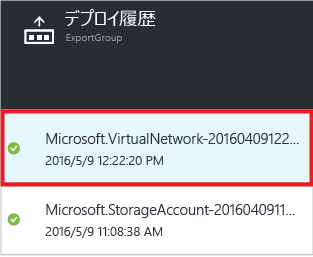
5. そのデプロイのテンプレートを表示します。 仮想ネットワークだけが定義されていることに注意してください。 先にデプロイしたストレージ アカウントは含まれていません。 現時点では、リソース グループ内のすべてのリソースを表すテンプレートはありません。

## <a name="export-the-template-from-resource-group"></a>リソース グループからのテンプレートのエクスポート
リソース グループの最新の状態を取得するには、リソース グループのスナップショットを示すテンプレートをエクスポートします。  

> [!NOTE]
> 200 を超えるリソースが含まれるリソース グループのテンプレートをエクスポートすることはできません。
> 
> 

1. リソース グループのテンプレートを表示するには、 **[Automation スクリプト]**を選択します。
   
      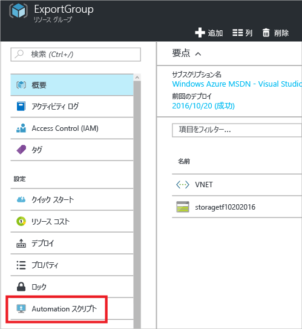
   
     テンプレート関数のエクスポートは、すべてのリソースの種類でサポートされているわけではありません。 この記事で紹介するストレージ アカウントと仮想ネットワークのみがリソース グループに含まれる場合、エラーは表示されません。 しかし、他のリソースの種類を作成した場合、エクスポートに関する問題が存在することを示すエラーが表示される可能性があります。 これらの問題に対処する方法については、「 [エクスポートの問題の修正](#fix-export-issues) 」セクションで説明します。
2. ソリューションを再デプロイするために使用できる&6; 個のファイルが再び表示されますが、今度のテンプレートは少し異なります。 このテンプレートには、パラメーターが&2; つだけあります (ストレージ アカウント名用が&1; つと、仮想ネットワーク名用が&1; つ)。

  ```json
  "parameters": {
    "virtualNetworks_VNET_name": {
      "defaultValue": "VNET",
      "type": "String"
    },
    "storageAccounts_storagetf05092016_name": {
      "defaultValue": "storagetf05092016",
      "type": "String"
    }
  },
  ```
   
     Resource Manager は、デプロイ時に使用されたテンプレートを取得しませんでした。 代わりに、リソースの現在の構成に基づいて、新しいテンプレートを生成しました。 たとえばこのテンプレートでは、ストレージ アカウントの場所とレプリケーションの値が、次のように設定されます。

  ```json 
  "location": "northeurope",
  "tags": {},
  "properties": {
    "accountType": "Standard_RAGRS"
  },
  ```
3. このテンプレートの操作を続ける場合、2 とおりのオプションがあります。 テンプレートをダウンロードし、JSON エディターを使用してローカルで作業することができます。 また、ライブラリにテンプレートを保存し、Portal を使用して作業をすることもできます。
   
     [VS Code](resource-manager-vs-code.md)、[Visual Studio](vs-azure-tools-resource-groups-deployment-projects-create-deploy.md) などの JSON エディターの操作に慣れている場合は、テンプレートをローカルにダウンロードし、エディターを使用できます。 JSON エディターを設定していない場合は、Portal を使用してテンプレートを編集できます。 このトピックの後半部分では、Portal のライブラリにテンプレートを保存してあることを前提としています。 ただし、JSON エディターを使用してローカルで作業する場合でも、Portal を使用して作業する場合でも、テンプレートに対して行う構文の変更は同じです。
   
     ローカルで作業する場合、**[ダウンロード]** を選択します。
   
      
   
     Portal を使用して作業する場合、**[ライブラリに追加]** を選択します。
   
      
   
     ライブラリにテンプレートを追加する際に、テンプレートの名前と説明を入力します。 次に、**[保存]** を選択します。
   
     
4. ライブラリに保存したテンプレートを表示するには、**[その他のサービス]** を選択し、「**テンプレート**」と入力して結果をフィルター処理します。次に、**[テンプレート]** を選択します。
   
      
5. 保存した名前の付いたテンプレートを選択します。
   
      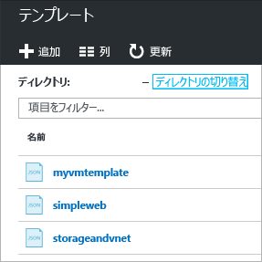

## <a name="customize-the-template"></a>テンプレートのカスタマイズ
エクスポートしたテンプレートは、すべてのデプロイで同じストレージ アカウントと仮想ネットワークを作成する場合、問題なく使用できます。 ただし、Resource Manager に備わっている各種オプションを使用すれば、より柔軟にテンプレートをデプロイすることができます。 たとえば、デプロイ中に、作成するストレージ アカウントの種類を指定したり、仮想ネットワークのアドレス プレフィックスとサブネット プレフィックスの値を指定したりすることができます。

このセクションでは、エクスポートしたテンプレートにパラメーターを追加して、これらのリソースを他の環境にデプロイするときにテンプレートを再利用できるようにします。 また、テンプレートをデプロイするときにエラーが発生する可能性を低くするために、テンプレートにいくつかの機能を追加します。 ストレージ アカウントの名前が一意になるように考える必要がなくなります。 代わりに、テンプレートが一意の名前を作成します。 ユーザーは、ストレージ アカウントの種類として指定できる値を制限して、有効なオプションだけになるようにします。

1. テンプレートをカスタマイズするには、**[編集]** を選択します。
   
     
2. テンプレートを選択します。
   
     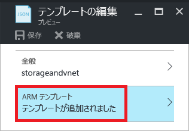
3. 指定する値をデプロイ時に渡すことができるようにするには、**parameters** セクションを新しいパラメーター定義に置き換えます。 **storageAccount_accountType** に対して許可されている値 (**allowedValues**) に注意してください。 間違って無効な値を指定した場合、そのエラーはデプロイの開始前に認識されます。 また、ストレージ アカウント名のプレフィックスだけを指定していることと、プレフィックスが 11 文字までに制限されていることにも注意してください。 プレフィックスを 11 文字までに制限することで、完全な名前がストレージ アカウントの最大文字数を超えないようにすることができます。 プレフィックスを使用すると、ストレージ アカウントに名前付け規則を適用することができます。 一意の名前を作成する方法については、次の手順で説明します。

  ```json
  "parameters": {
    "storageAccount_prefix": {
      "type": "string",
      "maxLength": 11
    },
    "storageAccount_accountType": {
      "defaultValue": "Standard_RAGRS",
      "type": "string",
      "allowedValues": [
        "Standard_LRS",
        "Standard_ZRS",
        "Standard_GRS",
        "Standard_RAGRS",
        "Premium_LRS"
      ]
    },
    "virtualNetwork_name": {
      "type": "string"
    },
    "addressPrefix": {
      "defaultValue": "10.0.0.0/16",
      "type": "string"
    },
    "subnetName": {
      "defaultValue": "subnet-1",
      "type": "string"
    },
    "subnetAddressPrefix": {
      "defaultValue": "10.0.0.0/24",
      "type": "string"
    }
  },
  ```

4. テンプレートの **variables** セクションは、現時点では空です。 **variables** セクションでは、テンプレートの残りの部分で構文を簡略化するための値を作成できます。 このセクションを新しい変数の定義に置き換えます。 **storageAccount_name** 変数は、パラメーターのプレフィックスを一意の文字列に連結します。この文字列は、リソース グループの ID に基づいて生成されます。 パラメーターの値を指定するときに一意の名前を考える必要がなくなります。

  ```json
  "variables": {
    "storageAccount_name": "[concat(parameters('storageAccount_prefix'), uniqueString(resourceGroup().id))]"
  },
  ```

5. リソース定義でパラメーターと変数を使用するには、**resources** セクションを新しいリソース定義に置き換えます。 リソース プロパティにどの値を割り当てるかの指定以外に、リソース定義の変更はほとんどないことに注意してください。 プロパティは、エクスポートしたテンプレートのプロパティと同じです。 ハードコーディングされた値の代わりに、単にプロパティをパラメーターの値に割り当てています。 リソースの場所は、 **resourceGroup().location** 式を通じて、リソース グループと同じ場所を使用するように設定されます。 ストレージ アカウント名用に作成した変数は、 **variables** 式を通じて参照されます。

  ```json
  "resources": [
    {
      "type": "Microsoft.Network/virtualNetworks",
      "name": "[parameters('virtualNetwork_name')]",
      "apiVersion": "2015-06-15",
      "location": "[resourceGroup().location]",
      "properties": {
        "addressSpace": {
          "addressPrefixes": [
            "[parameters('addressPrefix')]"
          ]
        },
        "subnets": [
          {
            "name": "[parameters('subnetName')]",
            "properties": {
              "addressPrefix": "[parameters('subnetAddressPrefix')]"
            }
          }
        ]
      },
      "dependsOn": []
    },
    {
      "type": "Microsoft.Storage/storageAccounts",
      "name": "[variables('storageAccount_name')]",
      "apiVersion": "2015-06-15",
      "location": "[resourceGroup().location]",
      "tags": {},
      "properties": {
        "accountType": "[parameters('storageAccount_accountType')]"
      },
      "dependsOn": []
    }
  ]
  ```

6. テンプレートの編集が完了したら、**[OK]** を選択します。
7. **[保存]** を選択し、テンプレートに対する変更を保存します。
   
     
8. 更新したテンプレートをデプロイするには、**[デプロイ]** を選択します。
   
     
9. パラメーターの値を指定し、リソースをデプロイする新しいリソース グループを選択します。

## <a name="update-the-downloaded-parameters-file"></a>ダウンロードしたパラメーター ファイルを更新する
(Portal のライブラリではなく) ダウンロードしたファイルを使用して作業する場合、ダウンロードしたパラメーター ファイルを更新する必要があります。 ダウンロードしたファイルは、テンプレートのパラメーターと一致しなくなっています。 パラメーター ファイルは使用しなくてもかまいませんが、使用すると環境の再デプロイ作業を簡略化できます。 多くのパラメーターにはテンプレートで定義されている既定値を使用するため、パラメーター ファイルで必要なのは&2; つの値だけです。

parameters.json ファイルの内容を次のように置き換えます。

```json
{
  "$schema": "https://schema.management.azure.com/schemas/2015-01-01/deploymentParameters.json#",
  "contentVersion": "1.0.0.0",
  "parameters": {
    "storageAccount_prefix": {
      "value": "storage"
    },
    "virtualNetwork_name": {
      "value": "VNET"
    }
  }
}
```

更新後のパラメーター ファイルは、既定値を持たないパラメーターの値だけを指定しています。 他のパラメーターは、既定値とは異なる値にするときに、その値を指定できます。

## <a name="fix-export-issues"></a>エクスポートの問題の修正
テンプレート関数のエクスポートは、すべてのリソースの種類でサポートされているわけではありません。 リソースの種類によっては、機密データの公開を防止するために、Resource Manager によってエクスポートされないものもあります。 たとえば、サイトの構成内に接続文字列がある場合、エクスポートしたテンプレートにそれが表示されるのは望ましくありません。 この問題を回避するには、欠けているリソースを対象のテンプレートに手動で追加します。

> [!NOTE]
> エクスポートの問題は、リソース グループからエクスポートする場合にのみ発生します。デプロイ履歴からのエクスポートでは発生しません。 最後のデプロイがリソース グループの現在の状態を正確に表しているようであれば、リソース グループからではなく、デプロイ履歴からテンプレートをエクスポートすることをお勧めします。 単一のテンプレートで定義されていない変更をリソース グループに加えた場合にのみ、リソース グループからエクスポートしてください。
> 
> 

たとえば、Web アプリ、SQL Database、サイト構成内の接続文字列が含まれたリソース グループのテンプレートをエクスポートすると、次のようなメッセージが表示されます。


メッセージを選択すると、エクスポートされなかったリソースの種類が正確に表示されます。 

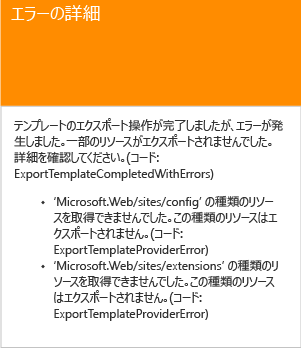

このトピックでは、一般的な修正について説明します。

### <a name="connection-string"></a>接続文字列
Web サイト リソースで、接続文字列の定義をデータベースに追加します。

```json
{
  "type": "Microsoft.Web/sites",
  ...
  "resources": [
    {
      "apiVersion": "2015-08-01",
      "type": "config",
      "name": "connectionstrings",
      "dependsOn": [
          "[concat('Microsoft.Web/Sites/', parameters('<site-name>'))]"
      ],
      "properties": {
          "DefaultConnection": {
            "value": "[concat('Data Source=tcp:', reference(concat('Microsoft.Sql/servers/', parameters('<database-server-name>'))).fullyQualifiedDomainName, ',1433;Initial Catalog=', parameters('<database-name>'), ';User Id=', parameters('<admin-login>'), '@', parameters('<database-server-name>'), ';Password=', parameters('<admin-password>'), ';')]",
              "type": "SQLServer"
          }
      }
    }
  ]
}
```    

### <a name="web-site-extension"></a>Web サイト拡張機能
Web サイト リソースで、インストールするコードの定義を追加します。

```json
{
  "type": "Microsoft.Web/sites",
  ...
  "resources": [
    {
      "name": "MSDeploy",
      "type": "extensions",
      "location": "[resourceGroup().location]",
      "apiVersion": "2015-08-01",
      "dependsOn": [
        "[concat('Microsoft.Web/sites/', parameters('<site-name>'))]"
      ],
      "properties": {
        "packageUri": "[concat(parameters('<artifacts-location>'), '/', parameters('<package-folder>'), '/', parameters('<package-file-name>'), parameters('<sas-token>'))]",
        "dbType": "None",
        "connectionString": "",
        "setParameters": {
          "IIS Web Application Name": "[parameters('<site-name>')]"
        }
      }
    }
  ]
}
```

### <a name="virtual-machine-extension"></a>仮想マシン拡張機能
仮想マシン拡張機能の例については、「 [Azure Windows VM 拡張機能の構成サンプル](../virtual-machines/virtual-machines-windows-extensions-configuration-samples.md?toc=%2fazure%2fvirtual-machines%2fwindows%2ftoc.json)」を参照してください。

### <a name="virtual-network-gateway"></a>仮想ネットワーク ゲートウェイ
仮想ネットワーク ゲートウェイのリソースの種類を追加します。

```json
{
  "type": "Microsoft.Network/virtualNetworkGateways",
  "name": "[parameters('<gateway-name>')]",
  "apiVersion": "2015-06-15",
  "location": "[resourceGroup().location]",
  "properties": {
    "gatewayType": "[parameters('<gateway-type>')]",
    "ipConfigurations": [
      {
        "name": "default",
        "properties": {
          "privateIPAllocationMethod": "Dynamic",
          "subnet": {
            "id": "[resourceId('Microsoft.Network/virtualNetworks/subnets', parameters('<vnet-name>'), parameters('<new-subnet-name>'))]"
          },
          "publicIpAddress": {
            "id": "[resourceId('Microsoft.Network/publicIPAddresses', parameters('<new-public-ip-address-Name>'))]"
          }
        }
      }
    ],
    "enableBgp": false,
    "vpnType": "[parameters('<vpn-type>')]"
  },
  "dependsOn": [
    "Microsoft.Network/virtualNetworks/codegroup4/subnets/GatewaySubnet",
    "[concat('Microsoft.Network/publicIPAddresses/', parameters('<new-public-ip-address-Name>'))]"
  ]
},
```

### <a name="local-network-gateway"></a>ローカル ネットワーク ゲートウェイ
ローカル ネットワーク ゲートウェイのリソースの種類を追加します。

```json
{
    "type": "Microsoft.Network/localNetworkGateways",
    "name": "[parameters('<local-network-gateway-name>')]",
    "apiVersion": "2015-06-15",
    "location": "[resourceGroup().location]",
    "properties": {
      "localNetworkAddressSpace": {
        "addressPrefixes": "[parameters('<address-prefixes>')]"
      }
    }
}
```

### <a name="connection"></a>接続
接続のリソースの種類を追加します。

```json
{
    "apiVersion": "2015-06-15",
    "name": "[parameters('<connection-name>')]",
    "type": "Microsoft.Network/connections",
    "location": "[resourceGroup().location]",
    "properties": {
        "virtualNetworkGateway1": {
        "id": "[resourceId('Microsoft.Network/virtualNetworkGateways', parameters('<gateway-name>'))]"
      },
      "localNetworkGateway2": {
        "id": "[resourceId('Microsoft.Network/localNetworkGateways', parameters('<local-gateway-name>'))]"
      },
      "connectionType": "IPsec",
      "routingWeight": 10,
      "sharedKey": "[parameters('<shared-key>')]"
    }
},
```


## <a name="next-steps"></a>次のステップ
ご利用ありがとうございます。 ポータルで作成したリソースからテンプレートをエクスポートする方法について説明しました。

* [PowerShell](resource-group-template-deploy.md)、[Azure CLI](resource-group-template-deploy-cli.md)、または [REST API](resource-group-template-deploy-rest.md) を使用してテンプレートをデプロイできます。
* PowerShell を使用してテンプレートをエクスポートする方法を確認するには、「 [Azure Resource Manager での Azure PowerShell の使用](powershell-azure-resource-manager.md)」を参照してください。
* Azure CLI を使用してテンプレートをエクスポートする方法を確認するには、「 [Azure Resource Manager での、Mac、Linux、および Windows 用 Azure CLI の使用](xplat-cli-azure-resource-manager.md)」を参照してください。


