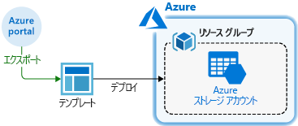
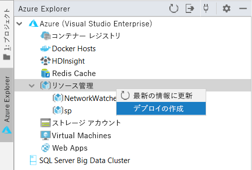
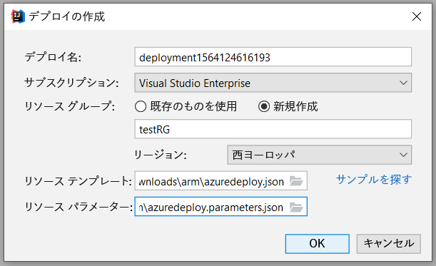
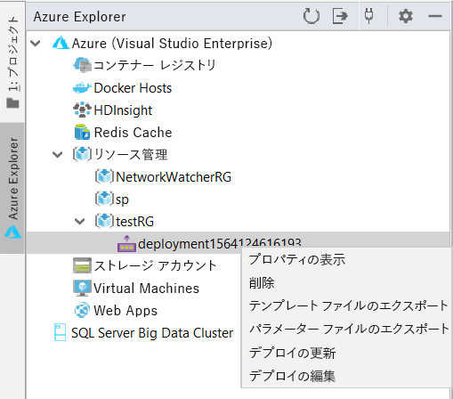
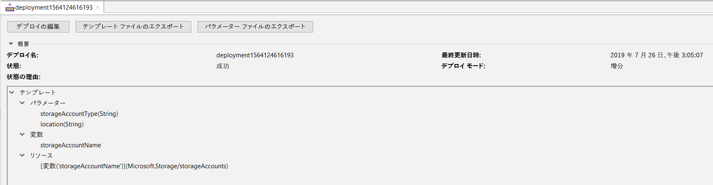
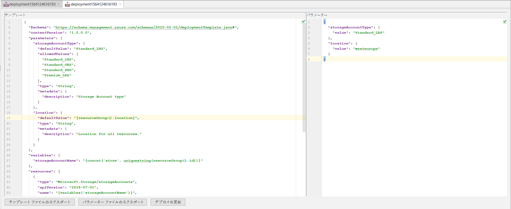
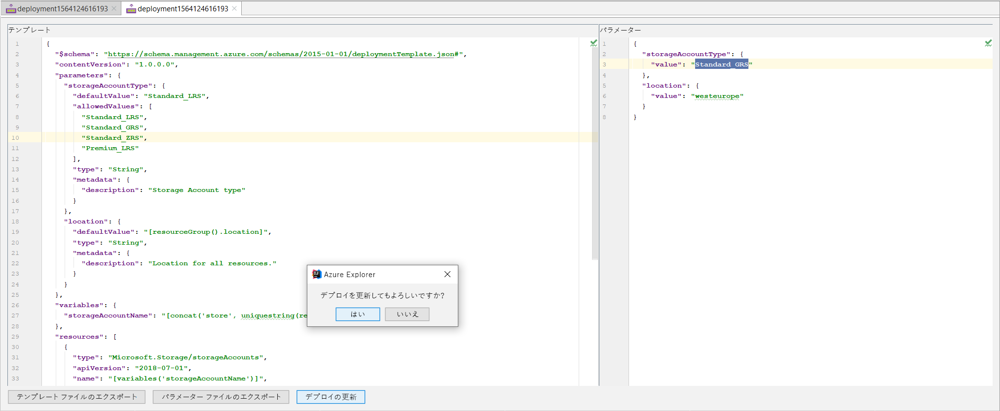
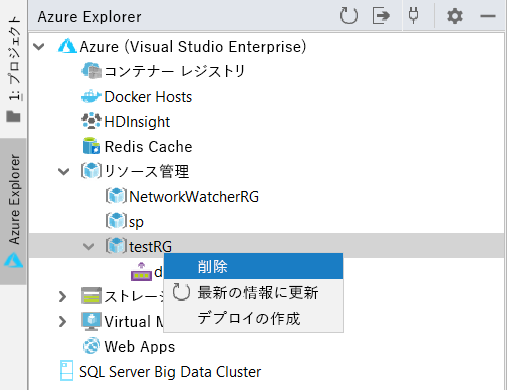

# クイック スタート:IntelliJ IDEA を使用した Azure Resource Manager テンプレートの作成とデプロイ

IntelliJ IDEA を使用して Resource Manager テンプレートを Azure にデプロイする方法と、IDE から直接テンプレートを編集および更新するプロセスについて説明します。 Resource Manager テンプレートとは、ソリューションに対してデプロイが必要なリソースを定義した JSON ファイルのことをいいます。 Azure ソリューションのデプロイと管理に関する概念について理解を深めるには、「[Azure Resource Manager の概要](resource-group-overview.md)」を参照してください。

チュートリアルを完了した後、Azure Storage アカウントをデプロイします。 同じプロセスを使用して他の Azure リソースをデプロイすることができます。

Azure サブスクリプションをお持ちでない場合は、開始する前に[無料アカウントを作成](https://azure.microsoft.com/free/)してください。

## 前提条件

この記事を完了するには、以下が必要です。

* [IntelliJ IDEA](https://www.jetbrains.com/idea/download/) Ultimate Edition または Community Edition がインストールされていること
* [Azure Toolkit for IntelliJ](https://plugins.jetbrains.com/plugin/8053) がインストールされていること。詳細については、[IntelliJ のプラグイン管理ガイド](https://www.jetbrains.com/help/idea/managing-plugins.html)を参照してください
* Azure Toolkit for IntelliJ 用の自分の Azure アカウントに[サインイン](https://docs.microsoft.com/java/azure/intellij/azure-toolkit-for-intellij-sign-in-instructions)していること

## クイックスタート テンプレートをデプロイする

ゼロからテンプレートを作成するのではなく、[Azure クイック スタート テンプレート](https://azure.microsoft.com/resources/templates/)からテンプレートを開きます。 Azure クイック スタート テンプレートは、Resource Manager テンプレートのリポジトリです。 このクイック スタートで使用されるテンプレートは、[Create a standard storage account](https://github.com/Azure/azure-quickstart-templates/tree/master/101-storage-account-create/) と呼ばれます。 これにより、Azure Storage アカウント リソースが定義されます。

1. [`azuredeploy.json`](https://raw.githubusercontent.com/Azure/azure-quickstart-templates/master/101-storage-account-create/azuredeploy.json) と [`azuredeploy.parameters.json`](https://raw.githubusercontent.com/Azure/azure-quickstart-templates/master/101-storage-account-create/azuredeploy.parameters.json) を右クリックして、お使いのローカル コンピューターに保存します。

1. Azure Toolkit が適切にインストールされ、サインインしている場合は、IntelliJ IDEA のサイドバーに Azure Explorer が表示されます。 **[リソース管理]** を右クリックし、 **[デプロイの作成]** を選択します。

    

1. **[デプロイ名]** 、 **[サブスクリプション]** 、 **[リソース グループ]** 、 **[リージョン]** を構成します。 ここでは、テンプレートを新しいリソース グループ `testRG` にデプロイします。 次に、 **[リソース テンプレート]** のパスに `azuredeploy.json` を選択し、 **[リソース パラメーター]** にダウンロードした `azuredeploy.parameters.json` を選択します。

    

1. [OK] をクリックすると、デプロイが開始されます。 デプロイが完了するまで、下部にある IntelliJ IDEA の**ステータ スバー**から進行状況を確認できます。

    

## 既存のデプロイの参照

1. デプロイが完了すると、新しいリソース グループ `testRG` と新しいデプロイが作成されたことを確認できます。 デプロイを右クリックすると、使用可能なアクションの一覧が表示されます。 **[プロパティの表示]** を選択します。

    

1. タブ ビューが開き、デプロイの状態やテンプレートの構造などの有用なプロパティが表示されます。

    

## 既存のデプロイを編集および更新する

1. 右クリック メニューまたは前の [プロパティの表示] ビューから **[Edit Deployment]\(デプロイの編集\)** を選択します。 別のタブ ビューが開き、Azure でデプロイするためのテンプレートとパラメーター ファイルが表示されます。 これらのファイルをローカルに保存するには、 **[Export Template File]\(テンプレート ファイルのエクスポート\)** または **[Export Parameter Files]\(パラメーター ファイルのエクスポート\)** をクリックします。

    

1. このページで 2 つのファイルを編集し、変更を Azure にデプロイすることができます。 ここでは、パラメーター ファイルの **storageAccountType** の値を `Standard_LRS` から `Standard_GRS` に変更します。 次に、下部にある **[更新プログラムの展開]** をクリックし、更新プログラムを確認します。

    

1. 更新プログラムのデプロイが完了したら、作成されたストレージ アカウントが `Standard_GRS` に変更されたことをポータルで確認できます。

## リソースのクリーンアップ

1. Azure リソースが不要になったら、リソース グループを削除して、デプロイしたリソースをクリーンアップします。 これは、Azure portal または Azure CLI から行うことができます。 IntelliJ IDEA から Azure Explorer で、作成した**リソース グループ**を右クリックし、削除を選択します。

    

> [!NOTE]
> デプロイを削除しても、デプロイによって作成されたリソースは削除されないことに注意してください。 対応するリソース グループまたは特定のリソースが不要になった場合は、削除してください。

## 次の手順

このクイックスタートの主な目的は、IntelliJ IDEA を使用して、Azure クイックスタート テンプレートから既存のテンプレートをデプロイすることです。 また、Azure で既存のデプロイを表示および更新する方法についても学習しました。 Azure クイック スタート テンプレートのテンプレートでは、必要なものすべてを得ることができないことがあります。 テンプレートの開発についてさらに学習するには、以下の新しい初心者向けチュートリアル シリーズを参照してください。

> [!div class="nextstepaction"]
> [初心者向けチュートリアル](./template-tutorial-create-first-template.md)

> [!div class="nextstepaction"]
> [Azure デベロッパー センターで Java にアクセスする](https://docs.microsoft.com/azure/java)
