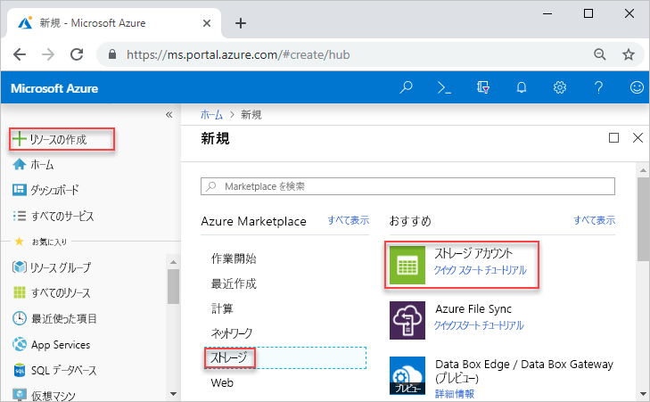
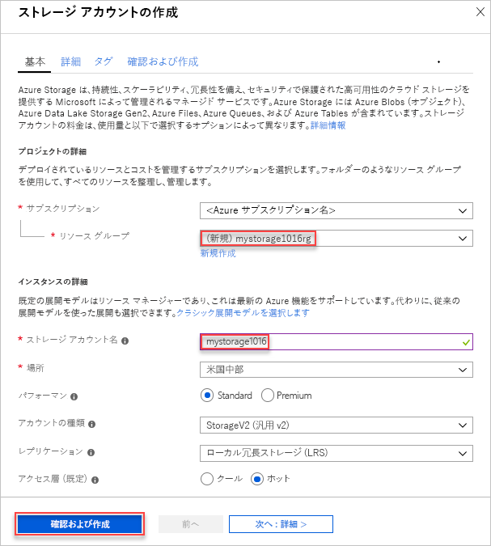
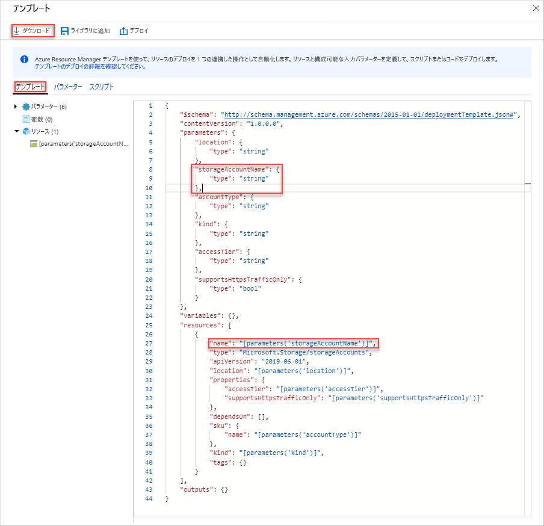
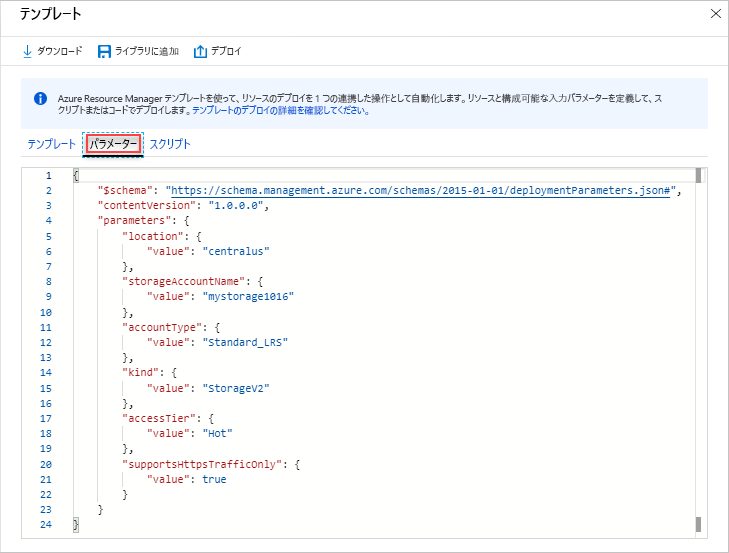
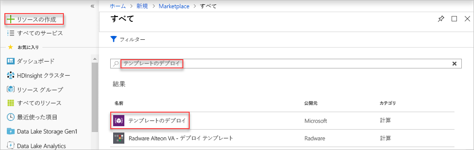
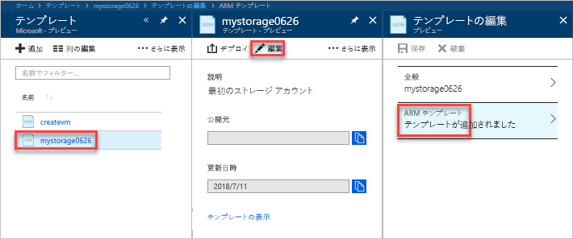
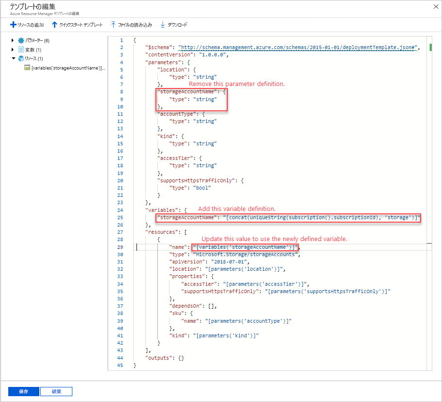
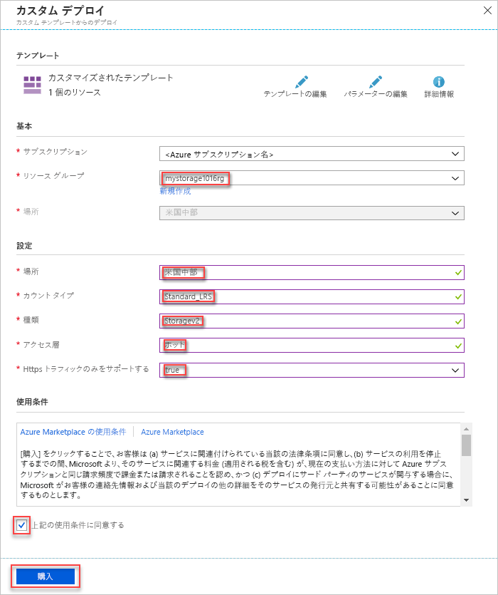

# <a name="quickstart-create-and-deploy-azure-resource-manager-templates-by-using-the-azure-portal"></a>クイック スタート: Azure portal を使用した Azure Resource Manager テンプレートの作成とデプロイ

Azure portal を使用してテンプレートを生成して最初の Azure Resource Manager テンプレートを作成する方法と、ポータルでテンプレートを編集してデプロイする方法を説明します。

Resource Manager テンプレートとは、ソリューションに対してデプロイが必要なリソースを定義した JSON ファイルのことをいいます。 テンプレートを作成する場合、必ずしもゼロから始める必要はありません。 このチュートリアルでは、Azure portal を使用してテンプレートを生成する方法を説明します。 そのテンプレートをカスタマイズしてデプロイすることができます。

このチュートリアルの手順では、Azure ストレージ アカウントを作成します。 同じプロセスを使用して、他の Azure リソースを作成できます。

Azure サブスクリプションをお持ちでない場合は、開始する前に[無料アカウントを作成](https://azure.microsoft.com/free/)してください。

## <a name="generate-a-template-using-the-portal"></a>ポータルを使用したテンプレートの生成

このセクションでは、Azure portal を使用してストレージ アカウントを作成します。 ストレージ アカウントをデプロイする前に、構成に基づいてポータルによって生成されたテンプレートの詳細を確認することもできます。 テンプレートを保存し、今後再利用できます。

1. [Azure Portal](https://portal.azure.com) にサインインします。
2. **[リソースの作成]** > **[Storage]** > **[ストレージ アカウント - Blob、File、Table、Queue]** を選択します。

    
3. 次の情報を入力します。 次の手順で **[作成]** ではなく、必ず **[Automation オプション]** を選択してください。これにより、デプロイする前にテンプレートを確認できます。

    - **名前**: ストレージ アカウントに一意の名前を付けます。 スクリーンショットでは、名前は *mystorage0626* です。
    - **リソース グループ**: 任意の名前で新しい Azure リソース グループを作成します。 スクリーンショットでは、リソース グループ名は *mystorage0626rg* です。

    残りのプロパティは既定値のままでかまいません。

    

    > [!NOTE]
    > エクスポートされたテンプレートの中には、デプロイする前に編集を必要とするものがあります。

4. 画面の下部にある **[Automation オプション]** を選択します。 ポータルでは、**[テンプレート]** タブにテンプレートが表示されます。

    

    メイン ウィンドウにテンプレートが表示されます。 これは、4 つの最上位要素が含まれた JSON ファイルです。 詳細については、「[Azure Resource Manager テンプレートの構造と構文の詳細](./resource-group-authoring-templates.md)」をご覧ください。

    **Parameter** 要素では、5 つのパラメーターが定義されています。 デプロイ時に指定した値を確認するには、**[パラメーター]** タブを選択します。

    

    これらの値は前のセクションで構成したものです。 テンプレートとパラメーター ファイルの両方を使用して、Azure ストレージ アカウントを作成できます。

5. タブの上には、次の 3 つのメニュー項目があります。

    - **[ダウンロード]**: テンプレートとパラメーター ファイルをローカル コンピューターにダウンロードします。
    - **[ライブラリに追加]**: 今後再利用するために、テンプレートをライブラリに追加します。
    - **[デプロイ]**: Azure ストレージ アカウントを Azure にデプロイします。

    このチュートリアルでは、**[ライブラリに追加]** を使用します。

6. **[ライブラリに追加]** を選択します。
7. **名前**と**説明**を入力し、**[保存]** を選択します。

> [!NOTE]
> テンプレート ライブラリ機能はプレビュー段階にあります。 ほとんどのユーザーは、ローカル コンピューターまたはパブリック ストレージ (GitHub など) にテンプレートを保存します。  

## <a name="edit-and-deploy-the-template"></a>テンプレートの編集とデプロイ

このセクションでは、テンプレート ライブラリから保存済みのテンプレートを開き、ポータル内でテンプレートを編集して、変更後のテンプレートをデプロイします。 より複雑なテンプレートを編集する場合は、豊富な編集機能を備えた Visual Studio Code を使用することを検討してください。

1. Azure portal で、左側のメニューの **[すべてのサービス]** を選択し、フィルター ボックスに「**テンプレート**」と入力して、**[テンプレート (プレビュー)]** を選択します。

    
2. 最後のセクションで保存したテンプレートを選択します。 スクリーンショットで使用されている名前は *mystorage0626* です。
3. **[編集]** を選択し、**[Template added]\(追加されたテンプレート\)** を選択します。

    

4. **variables** 要素を追加し、次のスクリーンショットに示すように変数を 1 つ追加します。

    ```json
    "variables": {
        "storageAccountName": "[concat(uniquestring(resourceGroup().id), 'standardsa')]"
    },
    ```
    

    ここでは、*concat()* と *uniqueString()* の 2 つの関数が使用されています。 uniqueString() は、リソースの一意の名前を作成する際に役立ちます。

5. 前のスクリーンショットで強調表示されている **name** パラメーターを削除します。
6. このパラメーターの代わりに、新しく定義した変数を使用するように、**Microsoft.Storage/storageAccounts** リソースの name 要素を更新します。

    ```json
    "name": "[variables('storageAccountName')]",
    ```

    最終的なテンプレートは次のようになります。

    ```json
    {
        "$schema": "https://schema.management.azure.com/schemas/2015-01-01/deploymentTemplate.json#",
        "contentVersion": "1.0.0.0",
        "parameters": {
            "location": {
                "type": "string"
            },
            "accountType": {
                "type": "string"
            },
            "kind": {
                "type": "string"
            },
            "httpsTrafficOnlyEnabled": {
                "type": "bool"
            }
        },
        "variables": {
            "storageAccountName": "[concat(uniquestring(resourceGroup().id), 'standardsa')]"
        },
        "resources": [
            {
                "apiVersion": "2018-02-01",
                "name": "[variables('storageAccountName')]",
                "location": "[parameters('location')]",
                "type": "Microsoft.Storage/storageAccounts",
                "sku": {
                    "name": "[parameters('accountType')]"
                },
                "kind": "[parameters('kind')]",
                "properties": {
                    "supportsHttpsTrafficOnly": "[parameters('httpsTrafficOnlyEnabled')]",
                    "encryption": {
                        "services": {
                            "blob": {
                                "enabled": true
                            },
                            "file": {
                                "enabled": true
                            }
                        },
                        "keySource": "Microsoft.Storage"
                    }
                },
                "dependsOn": []
            }
        ]
    }
    ```
7. **[OK]** を選択し、**[保存]** を選択して変更を保存します。
8. **[デプロイ]** を選択します。
9. 次の値を入力します。

    - **サブスクリプション**: Azure サブスクリプションを選択します。
    - **リソース グループ**: リソース グループに一意の名前を付けます。
    - **場所**: リソース グループの場所を選択します。
    - **[場所]**: ストレージ アカウントの場所を選択します。  リソース グループと同じ場所を使用できます。
    - **アカウントの種類**: このクイック スタートでは、「**Standard_LRS**」と入力します。
    - **種類**: このクイック スタートでは、「**Storage**」と入力します。
    - **[Https Traffic Only Enabled]\(HTTPS トラフィックのみ有効\)**:   このクイック スタートでは、**[false]** を選択します。
    - **[上記の使用条件に同意する]**: (オン)

    サンプルのデプロイのスクリーンショットを次に示します。

    

10. **[購入]** を選択します。
11. 画面の上部にあるベルのアイコン (通知) を選択して、デプロイの状態を確認します。

## <a name="clean-up-resources"></a>リソースのクリーンアップ

Azure リソースが不要になったら、リソース グループを削除して、デプロイしたリソースをクリーンアップします。

1. Azure portal で、左側のメニューの **[リソース グループ]** を選択します。
2. **[Filter by name]\(名前でフィルター処理\)** フィールドに、リソース グループ名を入力します。
3. リソース グループ名を選択します。  リソース グループにストレージ アカウントが表示されます。
4. 上部のメニューの **[リソース グループの削除]** を選択します。

## <a name="next-steps"></a>次の手順

このチュートリアルでは、Azure portal を使用してテンプレートを生成する方法と、ポータルを使用してテンプレートをデプロイする方法を説明しました。 このクイック スタートで使用したテンプレートは、Azure リソースが 1 つだけ含まれた単純なテンプレートです。 テンプレートが複雑な場合は、Visual Studio Code または Visual Studio を使用してテンプレートを開発する方が簡単です。

> [!div class="nextstepaction"]
> [Visual Studio Code を使用してテンプレートを作成する](./resource-manager-quickstart-create-templates-use-visual-studio-code.md)
