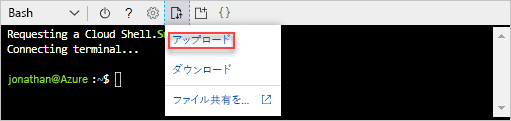

# <a name="quickstart-create-azure-resource-manager-templates-by-using-visual-studio-code"></a>クイック スタート: Visual Studio Code を使って Azure Resource Manager テンプレートを作成する

Visual Studio Code と Azure Resource Manager ツール拡張機能を使用して Azure Resource Manager テンプレートを作成する方法について説明します。 Visual Studio Code では、拡張機能を使わずに Resource Manager テンプレートを作成することもできますが、拡張機能を利用すれば、オートコンプリート機能によってテンプレートの開発を省力化することができます。 Azure ソリューションのデプロイと管理に関する概念について理解を深めるには、「[Azure Resource Manager の概要](resource-group-overview.md)」を参照してください。

Azure サブスクリプションをお持ちでない場合は、開始する前に[無料アカウントを作成](https://azure.microsoft.com/free/)してください。

## <a name="prerequisites"></a>前提条件

この記事を完了するには、以下が必要です。

- [Visual Studio Code](https://code.visualstudio.com/)。
- Resource Manager ツール拡張機能。 インストールするには、次の手順を使用します。

    1. Visual Studio Code を開きます。
    2. **Ctrl + Shift + X** キーを押して、拡張機能ウィンドウを開きます
    3. **[Azure Resource Manager ツール]** を探して、**[インストール]** を選択します。
    4. **[再読み込み]** を選択して、拡張機能のインストールを完了します。

## <a name="open-a-quickstart-template"></a>クイック スタート テンプレートを開く

ゼロからテンプレートを作成するのではなく、[Azure クイック スタート テンプレート](https://azure.microsoft.com/resources/templates/)からテンプレートを開きます。 Azure クイック スタート テンプレートは、Resource Manager テンプレートのリポジトリです。

このクイック スタートで使用されるテンプレートは、[Create a standard storage account](https://azure.microsoft.com/resources/templates/101-storage-account-create/) と呼ばれます。 テンプレートにより、Azure ストレージ アカウント リソースが定義されます。

1. Visual Studio Code から、**[ファイル]**>**[ファイルを開く]** を選択します。
2. **[ファイル名]** に以下の URL を貼り付けます。

    ```url
    https://raw.githubusercontent.com/Azure/azure-quickstart-templates/master/101-storage-account-create/azuredeploy.json
    ```
3. **[開く]** を選択して、ファイルを開きます。
4. **[ファイル]**>**[名前を付けて保存]** を選択し、ファイルを **azuredeploy.json** としてご自身のローカル コンピューターに保存します。

## <a name="edit-the-template"></a>テンプレートの編集

Visual Studio Code を使用してテンプレートを編集する方法を確認するために、outputs セクションに要素をもう 1 つ追加します。

1. Visual Studio Code で、エクスポートしたテンプレートに出力をもう 1 つ追加します。

    ```json
    "storageUri": {
      "type": "string",
      "value": "[reference(variables('storageAccountName')).primaryEndpoints.blob]"
    }
    ```

    完了すると、outputs セクションは次のようになります。

    ```json
    "outputs": {
      "storageAccountName": {
        "type": "string",
        "value": "[variables('storageAccountName')]"
      },
      "storageUri": {
        "type": "string",
        "value": "[reference(variables('storageAccountName')).primaryEndpoints.blob]"
      }
    }
    ```

    Visual Studio Code 内でコードをコピーして貼り付けたら、**value** 要素を再入力して、Resource Manager ツール拡張機能の IntelliSense 機能を体験してみます。

    

2. **[ファイル]**>**[保存]** を選択して、ファイルを保存します。

## <a name="deploy-the-template"></a>テンプレートのデプロイ

テンプレートをデプロイする方法は多数あります。  このクイック スタートでは、Azure portal から Cloud Shell を使用します。 Cloud Shell では、Azure CLI と Azure PowerShell の両方がサポートされます。 この説明では CLI を使用します。

1. [Azure ポータル](https://portal.azure.com)
2. 次の図のように、右上隅の **[Cloud Shell]** を選択します。

    

3. 下矢印を選択し、**[Bash]** を選択して、PowerShell から CLI に切り替えます。

    
4. **[再起動]** を選択し、シェルを再起動します。
5. **[ファイルのアップロード/ダウンロード]** を選択し、**[アップロード]** を選択します。

    
4. クイック スタートで前に保存したファイルを選択します。 既定の名前は **azuredeploy.json** です。
5. Cloud Shell から **Is** コマンドを実行し、ファイルが適切にアップロードされていることを確認します。 **cat** コマンドを使用して、テンプレートの内容を確認することもできます。

    
6. Cloud Shell で次のコマンドを実行します。

    ```cli
    az group create --name <ResourceGroupName> --location <AzureLocation>

    az group deployment create --name <DeploymentName> --resource-group <ResourceGroupName> --template-file <TemplateFileName>
    ```
    サンプルのデプロイのスクリーンショットを次に示します。

    

    スクリーンショットでは、次の値が使用されています。

    - **&lt;ResourceGroupName>**: myresourcegroup0709。 パラメーターが 2 つ表示されます。  同じ値を使用してください。
    - **&lt;AzureLocation>**: eastus2
    - **&lt;DeployName>**: mydeployment0709
    - **&lt;TemplateFile>**: azuredeploy.json

    スクリーンショットの出力では、ストレージ アカウント名は *3tqebj3slyfyestandardsa* です。 

7. 次の PowerShell コマンドを実行して、新しく作成したストレージ アカウントの一覧を表示します。

    ```cli
    az storage account show --resource-group <ResourceGroupName> --name <StorageAccountName>
    ```

## <a name="clean-up-resources"></a>リソースのクリーンアップ

Azure リソースが不要になったら、リソース グループを削除して、デプロイしたリソースをクリーンアップします。

1. Azure portal で、左側のメニューから **[リソース グループ]** を選択します。
2. **[名前でフィルター]** フィールドに、リソース グループ名を入力します。
3. リソース グループ名を選択します。  リソース グループ内の合計 6 つのリソースが表示されます。
4. トップ メニューから **[リソース グループの削除]** を選択します。

## <a name="next-steps"></a>次の手順

このチュートリアルでは、Visual Studio Code を使用してテンプレートを作成する方法と、Azure portal の Cloud Shell を使用してテンプレートをデプロイする方法を説明しました。 次のチュートリアルでは、テンプレートの作成方法とテンプレート参照の使用方法の詳細について学びます。

> [!div class="nextstepaction"]
> [暗号化されたストレージ アカウントを作成する](./resource-manager-tutorial-create-encrypted-storage-accounts.md)
