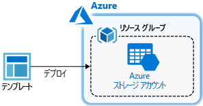
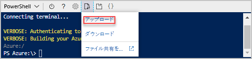

# <a name="quickstart-create-azure-resource-manager-templates-by-using-visual-studio-code"></a>クイック スタート:Visual Studio Code を使って Azure Resource Manager テンプレートを作成する

Visual Studio Code と Azure Resource Manager ツール拡張機能を使用して Azure Resource Manager テンプレートを作成および編集する方法について説明します。 Visual Studio Code では、拡張機能を使わずに Resource Manager テンプレートを作成することもできますが、拡張機能を利用すれば、オートコンプリート機能によってテンプレートの開発を省力化することができます。 Azure ソリューションのデプロイと管理に関する概念について理解を深めるには、「[Azure Resource Manager の概要](resource-group-overview.md)」を参照してください。

このクイックスタートでは、ストレージ アカウントをデプロイします。



Azure サブスクリプションをお持ちでない場合は、開始する前に[無料アカウントを作成](https://azure.microsoft.com/free/)してください。

## <a name="prerequisites"></a>前提条件

この記事を完了するには、以下が必要です。

- [Visual Studio Code](https://code.visualstudio.com/)。
- Resource Manager ツール拡張機能。 インストールするには、次の手順を使用します。

    1. Visual Studio Code を開きます。
    2. **Ctrl + Shift + X** キーを押して、拡張機能ウィンドウを開きます
    3. **[Azure Resource Manager ツール]** を探して、 **[インストール]** を選択します。
    4. **[再読み込み]** を選択して、拡張機能のインストールを完了します。

## <a name="open-a-quickstart-template"></a>クイック スタート テンプレートを開く

ゼロからテンプレートを作成するのではなく、[Azure クイック スタート テンプレート](https://azure.microsoft.com/resources/templates/)からテンプレートを開きます。 Azure クイック スタート テンプレートは、Resource Manager テンプレートのリポジトリです。

このクイック スタートで使用されるテンプレートは、[Create a standard storage account](https://azure.microsoft.com/resources/templates/101-storage-account-create/) と呼ばれます。 テンプレートにより、Azure ストレージ アカウント リソースが定義されます。

1. Visual Studio Code から、 **[ファイル]** > **[ファイルを開く]** を選択します。
2. **[ファイル名]** に以下の URL を貼り付けます。

    ```url
    https://raw.githubusercontent.com/Azure/azure-quickstart-templates/master/101-storage-account-create/azuredeploy.json
    ```

3. **[開く]** を選択して、ファイルを開きます。
4. **[ファイル]** > **[名前を付けて保存]** を選択し、ファイルを **azuredeploy.json** としてご自身のローカル コンピューターに保存します。

## <a name="edit-the-template"></a>テンプレートの編集

Visual Studio Code を使用してテンプレートを編集する方法を体験するために、`outputs` セクションに要素をもう 1 つ追加して、ストレージ URI を表示します。

1. エクスポートしたテンプレートに出力をもう 1 つ追加します。

    ```json
    "storageUri": {
      "type": "string",
      "value": "[reference(variables('storageAccountName')).primaryEndpoints.blob]"
    }
    ```

    完了すると、outputs セクションは次のようになります。

    ```json
    "outputs": {
      "storageAccountName": {
        "type": "string",
        "value": "[variables('storageAccountName')]"
      },
      "storageUri": {
        "type": "string",
        "value": "[reference(variables('storageAccountName')).primaryEndpoints.blob]"
      }
    }
    ```

    Visual Studio Code 内でコードをコピーして貼り付けたら、**value** 要素を再入力して、Resource Manager ツール拡張機能の IntelliSense 機能を体験してみます。

    

2. **[ファイル]** > **[保存]** を選択して、ファイルを保存します。

## <a name="deploy-the-template"></a>テンプレートのデプロイ

テンプレートをデプロイする方法は多数あります。 このクイック スタートでは Azure Cloud シェルを使用します。 Cloud Shell では、Azure CLI と Azure PowerShell の両方がサポートされます。 タブ セレクターを使用して CLI と PowerShell のいずれかを選択します。

[!INCLUDE [updated-for-az](../../includes/updated-for-az.md)]

1. [Azure Cloud Shell](https://shell.azure.com) にサインインします。

2. 左上の **[PowerShell]** または **[Bash]** (CLI) を選択して、希望の環境を選択します。  切り替えた場合は、シェルを再起動する必要があります。

    # <a name="clitabcli"></a>[CLI](#tab/CLI)

    

    # <a name="powershelltabpowershell"></a>[PowerShell](#tab/PowerShell)

    

    ---

3. **[ファイルのアップロード/ダウンロード]** を選択し、 **[アップロード]** を選択します。

    # <a name="clitabcli"></a>[CLI](#tab/CLI)

    

    # <a name="powershelltabpowershell"></a>[PowerShell](#tab/PowerShell)

    

    ---

    前のセクションで保存したファイルを選択します。 既定の名前は **azuredeploy.json** です。 テンプレート ファイルはシェルからアクセスできる必要があります。

    オプションで **ls** コマンドと **cat** コマンドを使用して、ファイルが正常にアップロードされたことを確認できます。

    # <a name="clitabcli"></a>[CLI](#tab/CLI)

    

    # <a name="powershelltabpowershell"></a>[PowerShell](#tab/PowerShell)

    

    ---
4. Cloud Shell で次のコマンドを実行します。 PowerShell コードまたは CLI コードを表示するタブを選択します。

    # <a name="clitabcli"></a>[CLI](#tab/CLI)
    ```azurecli
    echo "Enter the Resource Group name:" &&
    read resourceGroupName &&
    echo "Enter the location (i.e. centralus):" &&
    read location &&
    az group create --name $resourceGroupName --location "$location" &&
    az group deployment create --resource-group $resourceGroupName --template-file "$HOME/azuredeploy.json"
    ```

    # <a name="powershelltabpowershell"></a>[PowerShell](#tab/PowerShell)

    ```azurepowershell
    $resourceGroupName = Read-Host -Prompt "Enter the Resource Group name"
    $location = Read-Host -Prompt "Enter the location (i.e. centralus)"

    New-AzResourceGroup -Name $resourceGroupName -Location "$location"
    New-AzResourceGroupDeployment -ResourceGroupName $resourceGroupName -TemplateFile "$HOME/azuredeploy.json"
    ```

    ---

    **azuredeploy.json** 以外の名前でファイルを保存する場合は、テンプレートのファイル名を更新します。

    次のスクリーンショットは、サンプルのデプロイを示しています。

    # <a name="clitabcli"></a>[CLI](#tab/CLI)

    

    # <a name="powershelltabpowershell"></a>[PowerShell](#tab/PowerShell)

    

    ---

    outputs セクションにあるストレージ アカウント名とストレージ URL は、スクリーンショット上で強調表示されています。 ストレージ アカウント名は、次の手順で必要です。

5. 次の CLI または PowerShell コマンドを実行して、新しく作成されたストレージ アカウントの一覧を表示します。

    # <a name="clitabcli"></a>[CLI](#tab/CLI)
    ```azurecli
    echo "Enter the Resource Group name:" &&
    read resourceGroupName &&
    echo "Enter the Storage Account name:" &&
    read storageAccountName &&
    az storage account show --resource-group $resourceGroupName --name $storageAccountName
    ```

    # <a name="powershelltabpowershell"></a>[PowerShell](#tab/PowerShell)

    ```azurepowershell
    $resourceGroupName = Read-Host -Prompt "Enter the Resource Group name"
    $storageAccountName = Read-Host -Prompt "Enter the Storage Account name"
    Get-AzStorageAccount -ResourceGroupName $resourceGroupName -Name $storageAccountName
    ```

    ---

Azure ストレージ アカウントの使用の詳細については、「[クイック スタート:Azure portal を使用して BLOB をアップロード、ダウンロード、および一覧表示する](../storage/blobs/storage-quickstart-blobs-portal.md)」を参照してください。

## <a name="clean-up-resources"></a>リソースのクリーンアップ

Azure リソースが不要になったら、リソース グループを削除して、デプロイしたリソースをクリーンアップします。

1. Azure portal で、左側のメニューから **[リソース グループ]** を選択します。
2. **[名前でフィルター]** フィールドに、リソース グループ名を入力します。
3. リソース グループ名を選択します。  リソース グループ内の合計 6 つのリソースが表示されます。
4. トップ メニューから **[リソース グループの削除]** を選択します。

## <a name="next-steps"></a>次の手順

このクイックスタートの主な目的は、Visual Studio Code を使用して、Azure クイック スタート テンプレートの既存のテンプレートを編集することです。 Azure Cloud Shell から CLI または PowerShell を使用してテンプレートをデプロイする方法も学習しました。 Azure クイック スタート テンプレートのテンプレートでは、必要なものすべてを得ることができないことがあります。 テンプレートの開発についてさらに学習するには、以下の新しい初心者向けチュートリアル シリーズを参照してください。

> [!div class="nextstepaction"]
> [初心者向けチュートリアル](./template-tutorial-create-first-template.md)
