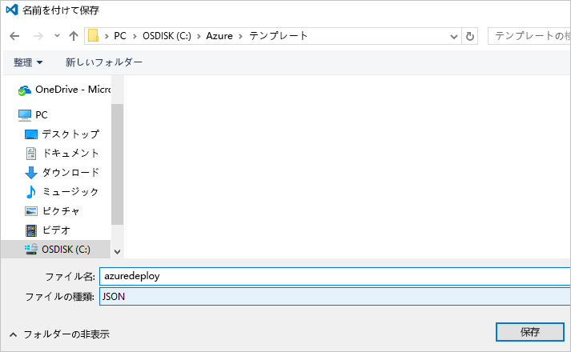

# <a name="use-visual-studio-code-extension-to-create-azure-resource-manager-template"></a>Visual Studio Code 拡張機能を使って Azure Resource Manager テンプレートを作成する
この記事では、Azure Resource Manager ツールの拡張機能を Visual Studio Code にインストールして使用する利点を紹介します。 VS Code では、拡張機能を使わずに Resource Manager テンプレートを作成することもできますが、拡張機能を利用すれば、オートコンプリート機能によってテンプレートの開発を省力化することができます。 テンプレートで使用できる関数やパラメーター、変数の入力候補が表示されます。

この記事の作業には、[Visual Studio Code](https://code.visualstudio.com/) が必要です。

Azure ソリューションのデプロイと管理に関する概念について理解を深めるには、「[Azure Resource Manager の概要](resource-group-overview.md)」を参照してください。

## <a name="create-the-template"></a>テンプレートを作成する

この記事は、「[初めての Azure Resource Manager テンプレートを作成およびデプロイする](resource-manager-create-first-template.md)」で作成したテンプレートをベースにしています。 そのテンプレートが既にある場合、このセクションはスキップしてかまいません。

1. テンプレートを作成する必要がある場合は、VS Code を起動してください。 **[ファイル]** > **[新しいファイル]** を選択します。 

   ![[新しいファイル]](./media/resource-manager-vscode-extension/new-file.png)

2. 以下の JSON 構文をコピーして、ファイルに貼り付けます。

   ```json
   {
     "$schema": "http://schema.management.azure.com/schemas/2015-01-01/deploymentTemplate.json#",
     "contentVersion": "1.0.0.0",
     "parameters": {
       "storageSKU": {
         "type": "string",
         "allowedValues": [
           "Standard_LRS",
           "Standard_ZRS",
           "Standard_GRS",
           "Standard_RAGRS",
           "Premium_LRS"
         ],
         "defaultValue": "Standard_LRS",
         "metadata": {
           "description": "The type of replication to use for the storage account."
         }
       },   
       "storageNamePrefix": {
         "type": "string",
         "maxLength": 11,
         "defaultValue": "storage",
         "metadata": {
           "description": "The value to use for starting the storage account name. Use only lowercase letters and numbers."
         }
       }
     },
     "variables": {
       "storageName": "[concat(toLower(parameters('storageNamePrefix')), uniqueString(resourceGroup().id))]"
     },
     "resources": [
       {
         "name": "[variables('storageName')]",
         "type": "Microsoft.Storage/storageAccounts",
         "apiVersion": "2016-01-01",
         "sku": {
           "name": "[parameters('storageSKU')]"
         },
         "kind": "Storage",
         "location": "[resourceGroup().location]",
         "tags": {},
         "properties": {
           "encryption":{
             "services":{
               "blob":{
                 "enabled":true
               }
             },
             "keySource":"Microsoft.Storage"
           }
         }
       }
     ],
     "outputs": {  }
   }
   ```

3. このファイルを **azuredeploy.json** という名前でローカル フォルダーに保存します。

   

## <a name="install-the-extension"></a>拡張機能のインストール

1. VS Code で **[拡張機能]** を選択します。

   

2. **[Azure Resource Manager ツール]** を探して **[インストール]** を選択します。

   

3. 拡張機能のインストールを完了するには、**[再読み込み]** を選択します。

## <a name="edit-the-template"></a>テンプレートの編集

1. azuredeploy.json ファイルを開きます。

2. これは、利用可能な[テンプレートの関数](resource-group-template-functions.md)をすべて取得する拡張機能です。 また、テンプレートに定義されているパラメーターと変数の読み取りも実行されます。 この機能を確認するために、output セクションに 2 つの値を追加します。 このテンプレートの outputs セクションを次の内容に置き換えてください。

   ```json
   "outputs": { 
       "groupLocation": {
         "type": "string",
         "value": ""
       },
       "storageUri": {
         "type": "string",
         "value": ""
       }
   }
   ```

3. **groupLocation** の value の引用符内にカーソルを起きます。 左角かっこ (`[`) を入力します。 その後すぐ、使用できるテンプレート関数の候補が拡張機能によって表示されることがわかります。

   

4. **resourceGroup** の最初の数文字を入力します。 `resourceGroup()` 関数が表示されたら、Tab キーまたは Enter キーを押します。

   

5. 拡張機能によって関数の構文が提示されます。 [resourceGroup](resource-group-template-functions-resource.md#resourcegroup) 関数にはパラメーターがありません。 右かっこに続けてピリオドを追加します。 `resourceGroup()` 関数から返されるオブジェクトに関して利用できるプロパティが表示されます。 [`location`] を選択します。

   

6. **location** に続けて右角かっこを追加します。

   ```json
   "outputs": { 
       "groupLocation": {
         "type": "string",
         "value": "[resourceGroup().location]"
       },
       "storageUri": {
         "type": "string",
         "value": ""
       }
   }
   ```

7. **storageUri** の引用符内にカーソルを起きます。 もう一度左角かっこを入力します。 **reference** の最初の数文字を入力します。 対応する関数が選択されたら、Tab キーまたは Enter キーを押します。

   

8. [reference](resource-group-template-functions-resource.md#reference) は、パラメーターとしてリソース ID またはリソース名を受け取ります。 ストレージ アカウントの名前は既に変数に格納されています。 「**var**」と入力し、Ctrl + Space キーを押します。 入力候補として variables 関数が表示されます。

   

   Tab キーまたは Enter キーを押します。

9. [variables](resource-group-template-functions-deployment.md#variables) 関数には、変数の名前を指定する必要があります。 丸かっこの内側に、単一引用符を追加します。 テンプレートに定義されている変数の名前が拡張機能によって提示されます。

    

10. **storageName** 変数を選択します。 右角かっこを追加します。 この outputs セクションの例を次に示します。

   ```json
   "outputs": { 
       "groupLocation": {
         "type": "string",
         "value": "[resourceGroup().location]"
       },
       "storageUri": {
         "type": "string",
         "value": "[reference(concat('Microsoft.Storage/storageAccounts/',variables('storageName'))).primaryEndpoints.blob]"
       }
   }
   ```

完成したテンプレートは次のとおりです。

```json
{
  "$schema": "http://schema.management.azure.com/schemas/2015-01-01/deploymentTemplate.json#",
  "contentVersion": "1.0.0.0",
  "parameters": {
    "storageSKU": {
      "type": "string",
      "allowedValues": [
        "Standard_LRS",
        "Standard_ZRS",
        "Standard_GRS",
        "Standard_RAGRS",
        "Premium_LRS"
      ],
      "defaultValue": "Standard_LRS",
      "metadata": {
        "description": "The type of replication to use for the storage account."
      }
    },   
    "storageNamePrefix": {
      "type": "string",
      "maxLength": 11,
      "defaultValue": "storage",
      "metadata": {
        "description": "The value to use for starting the storage account name. Use only lowercase letters and numbers."
      }
    }
  },
  "variables": {
    "storageName": "[concat(toLower(parameters('storageNamePrefix')), uniqueString(resourceGroup().id))]"
  },
  "resources": [
    {
      "name": "[variables('storageName')]",
      "type": "Microsoft.Storage/storageAccounts",
      "apiVersion": "2016-01-01",
      "sku": {
        "name": "[parameters('storageSKU')]"
      },
      "kind": "Storage",
      "location": "[resourceGroup().location]",
      "tags": {},
      "properties": {
        "encryption":{
          "services":{
            "blob":{
              "enabled":true
            }
          },
          "keySource":"Microsoft.Storage"
        }
      }
    }
  ],
  "outputs": { 
    "groupLocation": {
      "type": "string",
      "value": "[resourceGroup().location]"
    },
    "storageUri": {
      "type": "string",
      "value": "[reference(concat('Microsoft.Storage/storageAccounts/',variables('storageName'))).primaryEndpoints.blob]"
    }
  }
}
```

## <a name="deploy-template"></a>テンプレートのデプロイ

これでこのテンプレートをデプロイする準備が整いました。 PowerShell または Azure CLI を使用して、リソース グループを作成します。 次に、そのリソース グループにストレージ アカウントをデプロイします。

* PowerShell の場合、テンプレートを含むフォルダーから次のコマンドを使用します。

   ```powershell
   Login-AzureRmAccount
   
   New-AzureRmResourceGroup -Name examplegroup -Location "South Central US"
   New-AzureRmResourceGroupDeployment -ResourceGroupName examplegroup -TemplateFile azuredeploy.json
   ```

* Azure CLI のローカル インストールの場合は、テンプレートを含むフォルダーから次のコマンドを使用します。

   ```azurecli
   az login

   az group create --name examplegroup --location "South Central US"
   az group deployment create --resource-group examplegroup --template-file azuredeploy.json
   ```

デプロイが完了すると、出力された値が返されます。

## <a name="clean-up-resources"></a>リソースのクリーンアップ

デプロイしたリソースが不要になったら、リソース グループを削除して、そのリソースをクリーンアップします。

PowerShell では、次を使用します。

```powershell
Remove-AzureRmResourceGroup -Name examplegroup
```

Azure CLI では、次を使用します。

```azurecli
az group delete --name examplegroup
```

## <a name="next-steps"></a>次のステップ
* テンプレートの構造の詳細については、「 [Azure Resource Manager のテンプレートの作成](resource-group-authoring-templates.md)」を参照してください。
* ストレージ アカウントのプロパティについては、[ストレージ アカウント テンプレート リファレンス](/azure/templates/microsoft.storage/storageaccounts)のページを参照してください。
* さまざまな種類のソリューションのテンプレートについては、「 [Azure クイック スタート テンプレート](https://azure.microsoft.com/documentation/templates/)」をご覧ください。
