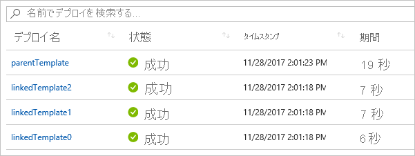

# <a name="using-linked-and-nested-templates-when-deploying-azure-resources"></a>Azure リソース デプロイ時のリンクされたテンプレートおよび入れ子になったテンプレートの使用

複雑なソリューションをデプロイするには、テンプレートを複数の関連するテンプレートに分割し、メイン テンプレートを使用してそれらをまとめてデプロイできます。 関連するテンプレートは、独立したファイルでも、メイン テンプレート内に埋め込まれるテンプレート構文でもかまいません。 この記事では、メイン テンプレートからリンクされる独立したテンプレート ファイルに対して、**リンクされたテンプレート**という用語を使用します。 メイン テンプレートに埋め込まれたテンプレート構文に対して、**入れ子になったテンプレート**という用語を使用します。

中小規模のソリューションの場合、テンプレートを 1 つにするとわかりやすく、保守も簡単になります。 すべてのリソースと値を 1 つのファイルで参照できます。 高度なシナリオの場合、リンクされたテンプレートを使用することで、対象となるコンポーネントにソリューションを分割することができます。 これらのテンプレートは、他のシナリオで簡単に再利用できます。

チュートリアルについては、「[チュートリアル: リンクされた Azure Resource Manager テンプレートの作成](template-tutorial-create-linked-templates.md)」を参照してください。

> [!NOTE]
> リンクされたテンプレートまたは入れ子になったテンプレートには、[増分](deployment-modes.md)デプロイ モードのみを使用できます。
>

## <a name="nested-template"></a>入れ子になったテンプレート

テンプレートを入れ子にするには、メイン テンプレートに[デプロイ リソース](/azure/templates/microsoft.resources/deployments)を追加します。 **template** プロパティに、テンプレートの構文を指定します。

```json
{
  "$schema": "https://schema.management.azure.com/schemas/2019-04-01/deploymentTemplate.json#",
  "contentVersion": "1.0.0.0",
  "parameters": {},
  "variables": {},
  "resources": [
    {
      "name": "nestedTemplate1",
      "apiVersion": "2017-05-10",
      "type": "Microsoft.Resources/deployments",
      "properties": {
        "mode": "Incremental",
        "template": {
          <nested-template-syntax>
        }
      }
    }
  ],
  "outputs": {
  }
}
```

次の例では、入れ子になったテンプレートを使用して、ストレージ アカウントがデプロイされます。

```json
{
  "$schema": "https://schema.management.azure.com/schemas/2019-04-01/deploymentTemplate.json#",
  "contentVersion": "1.0.0.0",
  "parameters": {
    "storageAccountName": {
      "type": "string"
    }
  },
  "resources": [
    {
      "name": "nestedTemplate1",
      "apiVersion": "2017-05-10",
      "type": "Microsoft.Resources/deployments",
      "properties": {
        "mode": "Incremental",
        "template": {
          "$schema": "https://schema.management.azure.com/schemas/2015-01-01/deploymentTemplate.json#",
          "contentVersion": "1.0.0.0",
          "resources": [
            {
              "type": "Microsoft.Storage/storageAccounts",
              "apiVersion": "2019-04-01",
              "name": "[parameters('storageAccountName')]",
              "location": "West US",
              "sku": {
                "name": "Standard_LRS"
              },
              "kind": "StorageV2"
            }
          ]
        }
      }
    }
  ],
  "outputs": {
  }
}
```

### <a name="scope-for-expressions-in-nested-templates"></a>入れ子になったテンプレート内の式のスコープ

入れ子になったテンプレートを使用する場合、テンプレート式の評価のスコープを親テンプレートにするか入れ子にするかを指定できます。 スコープによって、[resourceGroup](template-functions-resource.md#resourcegroup) や [subscription](template-functions-resource.md#subscription) などのパラメーター、変数、および関数がどのように解決されるかが決まります。

スコープは、`expressionEvaluationOptions` プロパティを使用して設定します。 既定では、`expressionEvaluationOptions` プロパティは `outer` に設定されます。これは、親テンプレート スコープを使用することを意味します。 式のスコープをネストされたテンプレートにするには、値を `inner` に設定します。

```json
{
  "type": "Microsoft.Resources/deployments",
  "apiVersion": "2017-05-10",
  "name": "nestedTemplate1",
  "properties": {
  "expressionEvaluationOptions": {
    "scope": "inner"
  },
  ...
```

次のテンプレートは、テンプレート式がスコープに従ってどのように解決されるかを示しています。 これには、親テンプレートと入れ子になったテンプレートの両方に定義されている `exampleVar` という名前の変数が含まれています。 それは、変数の値を返します。

```json
{
  "$schema": "https://schema.management.azure.com/schemas/2019-04-01/deploymentTemplate.json#",
  "contentVersion": "1.0.0.0",
  "parameters": {
  },
  "variables": {
    "exampleVar": "from parent template"
  },
  "resources": [
    {
      "type": "Microsoft.Resources/deployments",
      "apiVersion": "2017-05-10",
      "name": "nestedTemplate1",
      "properties": {
        "expressionEvaluationOptions": {
          "scope": "inner"
        },
        "mode": "Incremental",
        "template": {
          "$schema": "https://schema.management.azure.com/schemas/2015-01-01/deploymentTemplate.json#",
          "contentVersion": "1.0.0.0",
          "variables": {
            "exampleVar": "from nested template"
          },
          "resources": [
          ],
          "outputs": {
            "testVar": {
              "type": "string",
              "value": "[variables('exampleVar')]"
            }
          }
        }
      }
    }
  ],
  "outputs": {
    "messageFromLinkedTemplate": {
      "type": "string",
      "value": "[reference('nestedTemplate1').outputs.testVar.value]"
    }
  }
}
```

変数の値は、スコープに基づいて変化します。 次の表に、両方のスコープの結果を示します。

| Scope | Output |
| ----- | ------ |
| 内部 (inner) | 入れ子になったテンプレートから |
| outer (既定値) | 親テンプレートから |

次の例では、SQL サーバーをデプロイし、パスワードに使用するキー コンテナー シークレットを取得します。 キー コンテナー ID は動的に作成され、パラメーターとして入れ子になったテンプレートに渡されるため、スコープは `inner` に設定されます。

```json
{
  "$schema": "https://schema.management.azure.com/schemas/2015-01-01/deploymentTemplate.json#",
  "contentVersion": "1.0.0.0",
  "parameters": {
    "location": {
      "type": "string",
      "defaultValue": "[resourceGroup().location]",
      "metadata": {
        "description": "The location where the resources will be deployed."
      }
    },
    "vaultName": {
      "type": "string",
      "metadata": {
        "description": "The name of the keyvault that contains the secret."
      }
    },
    "secretName": {
      "type": "string",
      "metadata": {
        "description": "The name of the secret."
      }
    },
    "vaultResourceGroupName": {
      "type": "string",
      "metadata": {
        "description": "The name of the resource group that contains the keyvault."
      }
    },
    "vaultSubscription": {
      "type": "string",
      "defaultValue": "[subscription().subscriptionId]",
      "metadata": {
        "description": "The name of the subscription that contains the keyvault."
      }
    }
  },
  "resources": [
    {
      "type": "Microsoft.Resources/deployments",
      "apiVersion": "2018-05-01",
      "name": "dynamicSecret",
      "properties": {
        "mode": "Incremental",
        "expressionEvaluationOptions": {
          "scope": "inner"
        },
        "template": {
          "$schema": "https://schema.management.azure.com/schemas/2015-01-01/deploymentTemplate.json#",
          "contentVersion": "1.0.0.0",
          "parameters": {
            "adminLogin": {
              "type": "string"
            },
            "adminPassword": {
              "type": "securestring"
            },
            "location": {
              "type": "string"
            }
          },
          "variables": {
            "sqlServerName": "[concat('sql-', uniqueString(resourceGroup().id, 'sql'))]"
          },
          "resources": [
            {
              "type": "Microsoft.Sql/servers",
              "apiVersion": "2018-06-01-preview",
              "name": "[variables('sqlServerName')]",
              "location": "[parameters('location')]",
              "properties": {
                "administratorLogin": "[parameters('adminLogin')]",
                "administratorLoginPassword": "[parameters('adminPassword')]"
              }
            }
          ],
          "outputs": {
            "sqlFQDN": {
              "type": "string",
              "value": "[reference(variables('sqlServerName')).fullyQualifiedDomainName]"
            }
          }
        },
        "parameters": {
          "location": {
            "value": "[parameters('location')]"
          },
          "adminLogin": {
            "value": "ghuser"
          },
          "adminPassword": {
            "reference": {
              "keyVault": {
                "id": "[resourceId(parameters('vaultSubscription'), parameters('vaultResourceGroupName'), 'Microsoft.KeyVault/vaults', parameters('vaultName'))]"
              },
              "secretName": "[parameters('secretName')]"
            }
          }
        }
      }
    }
  ],
  "outputs": {
  }
}
```

> [!NOTE]
>
> スコープを `outer` に設定した場合は、入れ子になったテンプレートの outputs セクションで、入れ子になったテンプレートでデプロイしているリソースに対する `reference` 関数を使用することはできません。 入れ子になったテンプレートでデプロイされたリソースの値を返すには、inner スコープを使用するか、入れ子になったテンプレートをリンクされたテンプレートに変換します。

## <a name="linked-template"></a>リンク済みテンプレート

テンプレートをリンクするには、メイン テンプレートに[デプロイ リソース](/azure/templates/microsoft.resources/deployments)を追加します。 **templateLink** プロパティに、含めるテンプレートの URI を指定します。 次の例では、新しいストレージ アカウントをデプロイするテンプレートにリンクしています。

```json
{
  "$schema": "https://schema.management.azure.com/schemas/2019-04-01/deploymentTemplate.json#",
  "contentVersion": "1.0.0.0",
  "parameters": {},
  "variables": {},
  "resources": [
    {
      "type": "Microsoft.Resources/deployments",
      "apiVersion": "2017-05-10",
      "name": "linkedTemplate",
      "properties": {
        "mode": "Incremental",
        "templateLink": {
          "uri":"https://mystorageaccount.blob.core.windows.net/AzureTemplates/newStorageAccount.json",
          "contentVersion":"1.0.0.0"
        }
      }
    }
  ],
  "outputs": {
  }
}
```

ローカル ファイルや、ローカル ネットワークだけで使用可能なファイルは指定できません。 **http** または **https** のいずれかを含む URI 値のみを指定できます。 Resource Manager は、テンプレートにアクセスできる必要があります。 1 つと選択肢として、ストレージ アカウントにリンク済みテンプレートを配置し、その項目の URI を使用できます。

テンプレートまたはパラメーターには、`contentVersion` プロパティを指定する必要はありません。 コンテンツのバージョン値を指定しない場合、テンプレートの現在のバージョンがデプロイされます。 コンテンツのバージョン値を指定する場合、リンクされているテンプレートのバージョンと一致している必要があります。それ以外の場合、デプロイはエラーで失敗します。

### <a name="parameters-for-linked-template"></a>リンクされたテンプレートのパラメーター

リンクされたテンプレートのパラメーターには、外部ファイルまたはインラインを指定できます。 外部パラメーター ファイルを指定する場合は、**parametersLink** プロパティを使用します。

```json
"resources": [
  {
  "type": "Microsoft.Resources/deployments",
  "apiVersion": "2018-05-01",
  "name": "linkedTemplate",
  "properties": {
    "mode": "Incremental",
    "templateLink": {
    "uri":"https://mystorageaccount.blob.core.windows.net/AzureTemplates/newStorageAccount.json",
    "contentVersion":"1.0.0.0"
    },
    "parametersLink": {
    "uri":"https://mystorageaccount.blob.core.windows.net/AzureTemplates/newStorageAccount.parameters.json",
    "contentVersion":"1.0.0.0"
    }
  }
  }
]
```

パラメーター値をインラインで渡すには、**parameters** プロパティを使用します。

```json
"resources": [
  {
   "type": "Microsoft.Resources/deployments",
   "apiVersion": "2018-05-01",
   "name": "linkedTemplate",
   "properties": {
     "mode": "Incremental",
     "templateLink": {
      "uri":"https://mystorageaccount.blob.core.windows.net/AzureTemplates/newStorageAccount.json",
      "contentVersion":"1.0.0.0"
     },
     "parameters": {
      "StorageAccountName":{"value": "[parameters('StorageAccountName')]"}
    }
   }
  }
]
```

インライン パラメーターとパラメーター ファイルへのリンクの両方を使用することはできません。 `parametersLink` と `parameters` の両方が指定された場合、デプロイは失敗します。

## <a name="using-copy"></a>copy の使用

入れ子になったテンプレートを使用してリソースの複数のインスタンスを作成するには、**Microsoft.Resources/deployments** リソースのレベルで copy 要素を追加します。 または、スコープが inner の場合は、入れ子になったテンプレート内にコピーを追加できます。

次のテンプレート例では、copy を入れ子になったテンプレートと共に使用する方法を示します。

```json
"resources": [
  {
  "type": "Microsoft.Resources/deployments",
  "apiVersion": "2018-05-01",
  "name": "[concat('nestedTemplate', copyIndex())]",
  // yes, copy works here
  "copy":{
    "name": "storagecopy",
    "count": 2
  },
  "properties": {
    "mode": "Incremental",
    "expressionEvaluationOptions": {
    "scope": "inner"
    },
    "template": {
    "$schema": "https://schema.management.azure.com/schemas/2015-01-01/deploymentTemplate.json#",
    "contentVersion": "1.0.0.0",
    "resources": [
      {
      "type": "Microsoft.Storage/storageAccounts",
      "apiVersion": "2019-04-01",
      "name": "[concat(variables('storageName'), copyIndex())]",
      "location": "West US",
      "sku": {
        "name": "Standard_LRS"
      },
      "kind": "StorageV2"
      // Copy works here when scope is inner
      // But, when scope is default or outer, you get an error
      //"copy":{
      //  "name": "storagecopy",
      //  "count": 2
      //}
      }
    ]
    }
  }
  }
]
```

## <a name="using-variables-to-link-templates"></a>変数を使用したテンプレートのリンク

前の例では、URL の値をハード コーディングしてテンプレートをリンクする方法について説明しました。 この方法は簡単なテンプレートには適していますが、モジュール構造の大規模な一連のテンプレートを使用する場合にはあまり適していません。 その場合は、メイン テンプレートのベース URL を格納する静的変数を作成し、リンクされたテンプレートの URL をそのベース URL から動的に作成することができます。 この方法の利点としては、テンプレートを簡単に移動したり、フォークしたりできることが挙げられます。 メイン テンプレート内の静的変数を変更するだけで、正しい URI が、メイン テンプレートから、分解されたテンプレート全体に渡されます。

次の例では、ベース URL を使用して、リンクされたテンプレート (**sharedTemplateUrl** と **vmTemplate**) の 2 つの URL を作成する方法を示しています。

```json
"variables": {
  "templateBaseUrl": "https://raw.githubusercontent.com/Azure/azure-quickstart-templates/master/postgresql-on-ubuntu/",
  "sharedTemplateUrl": "[concat(variables('templateBaseUrl'), 'shared-resources.json')]",
  "vmTemplateUrl": "[concat(variables('templateBaseUrl'), 'database-2disk-resources.json')]"
}
```

[deployment()](template-functions-deployment.md#deployment) を使用して、現在のテンプレートのベース URL を取得したり、同じ場所にある他のテンプレートの URL を取得したりすることもできます。 この方法は、テンプレートの場所が変更された場合や、テンプレート ファイルのハード コーディング URL を回避する必要がある場合に便利です。 templateLink プロパティは、URL を含むリモート テンプレートにリンクした場合にのみ返されます。 ローカル テンプレートを使用している場合、そのプロパティは使用できません。

```json
"variables": {
  "sharedTemplateUrl": "[uri(deployment().properties.templateLink.uri, 'shared-resources.json')]"
}
```

## <a name="get-values-from-linked-template"></a>リンク済みテンプレートから値を取得する

リンクされたテンプレートから出力値を取得するには、`"[reference('deploymentName').outputs.propertyName.value]"` のような構文でプロパティ値を取得します。

リンクされたテンプレートから出力プロパティを取得する場合、プロパティ名にダッシュを含めることはできません。

次の例では、リンクされたテンプレートを参照して、出力値を取得する方法を示します。 リンクされたテンプレートは、単純なメッセージを返します。

```json
{
  "$schema": "https://schema.management.azure.com/schemas/2015-01-01/deploymentTemplate.json#",
  "contentVersion": "1.0.0.0",
  "parameters": {},
  "variables": {},
  "resources": [],
  "outputs": {
    "greetingMessage": {
      "value": "Hello World",
      "type" : "string"
    }
  }
}
```

メイン テンプレートは、リンクされたテンプレートを展開し、返される値を取得します。 展開リソースを名前で参照し、リンクされたテンプレートによって返されるプロパティの名前を使用していることに注意してください。

```json
{
  "$schema": "https://schema.management.azure.com/schemas/2015-01-01/deploymentTemplate.json#",
  "contentVersion": "1.0.0.0",
  "parameters": {},
  "variables": {},
  "resources": [
    {
      "type": "Microsoft.Resources/deployments",
      "apiVersion": "2018-05-01",
      "name": "linkedTemplate",
      "properties": {
        "mode": "Incremental",
        "templateLink": {
          "uri": "[uri(deployment().properties.templateLink.uri, 'helloworld.json')]",
          "contentVersion": "1.0.0.0"
        }
      }
    }
  ],
  "outputs": {
    "messageFromLinkedTemplate": {
      "type": "string",
      "value": "[reference('linkedTemplate').outputs.greetingMessage.value]"
    }
  }
}
```

他の種類のリソース同様、リンクされたテンプレートとその他のリソース間の依存関係を設定できます。 他のリソースにリンク済みテンプレートからの出力値が必要な場合は、そのリソースの前にリンク済みテンプレートが確実にデプロイされるようにしてください。 または、リンク済みテンプレートが他のリソースに依存する場合は、そのリンク済みテンプレートの前に他のリソースが確実にデプロイされるようにしてください。

次の例では、パブリック IP アドレスをデプロイし、リソース ID を返すテンプレートを示します。

```json
{
  "$schema": "https://schema.management.azure.com/schemas/2015-01-01/deploymentTemplate.json#",
  "contentVersion": "1.0.0.0",
  "parameters": {
    "publicIPAddresses_name": {
      "type": "string"
    }
  },
  "variables": {},
  "resources": [
    {
      "type": "Microsoft.Network/publicIPAddresses",
      "apiVersion": "2018-11-01",
      "name": "[parameters('publicIPAddresses_name')]",
      "location": "eastus",
      "properties": {
        "publicIPAddressVersion": "IPv4",
        "publicIPAllocationMethod": "Dynamic",
        "idleTimeoutInMinutes": 4
      },
      "dependsOn": []
    }
  ],
  "outputs": {
    "resourceID": {
      "type": "string",
      "value": "[resourceId('Microsoft.Network/publicIPAddresses', parameters('publicIPAddresses_name'))]"
    }
  }
}
```

ロード バランサーの展開時に、前のテンプレートからのパブリック IP アドレスを使用するには、テンプレートにリンクし、展開リソースに依存関係を追加します。 ロード バランサーのパブリック IP アドレスは、リンクされているテンプレートからの出力値に設定されます。

```json
{
  "$schema": "https://schema.management.azure.com/schemas/2015-01-01/deploymentTemplate.json#",
  "contentVersion": "1.0.0.0",
  "parameters": {
    "loadBalancers_name": {
      "defaultValue": "mylb",
      "type": "string"
    },
    "publicIPAddresses_name": {
      "defaultValue": "myip",
      "type": "string"
    }
  },
  "variables": {},
  "resources": [
    {
      "type": "Microsoft.Network/loadBalancers",
      "apiVersion": "2018-11-01",
      "name": "[parameters('loadBalancers_name')]",
      "location": "eastus",
      "properties": {
        "frontendIPConfigurations": [
          {
            "name": "LoadBalancerFrontEnd",
            "properties": {
              "privateIPAllocationMethod": "Dynamic",
              "publicIPAddress": {
                "id": "[reference('linkedTemplate').outputs.resourceID.value]"
              }
            }
          }
        ],
        "backendAddressPools": [],
        "loadBalancingRules": [],
        "probes": [],
        "inboundNatRules": [],
        "outboundNatRules": [],
        "inboundNatPools": []
      },
      "dependsOn": [
        "linkedTemplate"
      ]
    },
    {
      "type": "Microsoft.Resources/deployments",
      "apiVersion": "2018-05-01",
      "name": "linkedTemplate",
      "properties": {
        "mode": "Incremental",
        "templateLink": {
          "uri": "[uri(deployment().properties.templateLink.uri, 'publicip.json')]",
          "contentVersion": "1.0.0.0"
        },
        "parameters":{
          "publicIPAddresses_name":{"value": "[parameters('publicIPAddresses_name')]"}
        }
      }
    }
  ]
}
```

## <a name="deployment-history"></a>デプロイ履歴

Resource Manager では、各テンプレートはデプロイ履歴内で個別のデプロイとして処理されます。 3 つのリンクされたテンプレートまたは入れ子になったテンプレートがあるメイン テンプレートは、デプロイ履歴に次のように表示されます。



履歴内のこれらの個別のエントリを使用して、展開後に出力値を取得できます。 次のテンプレートは、パブリック IP アドレスを作成し、IP アドレスを出力します。

```json
{
  "$schema": "https://schema.management.azure.com/schemas/2015-01-01/deploymentTemplate.json#",
  "contentVersion": "1.0.0.0",
  "parameters": {
    "publicIPAddresses_name": {
      "type": "string"
    }
  },
  "variables": {},
  "resources": [
    {
      "type": "Microsoft.Network/publicIPAddresses",
      "apiVersion": "2018-11-01",
      "name": "[parameters('publicIPAddresses_name')]",
      "location": "southcentralus",
      "properties": {
        "publicIPAddressVersion": "IPv4",
        "publicIPAllocationMethod": "Static",
        "idleTimeoutInMinutes": 4,
        "dnsSettings": {
          "domainNameLabel": "[concat(parameters('publicIPAddresses_name'), uniqueString(resourceGroup().id))]"
        }
      },
      "dependsOn": []
    }
  ],
  "outputs": {
    "returnedIPAddress": {
      "type": "string",
      "value": "[reference(parameters('publicIPAddresses_name')).ipAddress]"
    }
  }
}
```

次のテンプレートは、前のテンプレートにリンクします。 3 つのパブリック IP アドレスが作成されます。

```json
{
  "$schema": "https://schema.management.azure.com/schemas/2015-01-01/deploymentTemplate.json#",
  "contentVersion": "1.0.0.0",
  "parameters": {
  },
  "variables": {},
  "resources": [
    {
      "type": "Microsoft.Resources/deployments",
      "apiVersion": "2018-05-01",
      "name": "[concat('linkedTemplate', copyIndex())]",
      "copy": {
        "count": 3,
        "name": "ip-loop"
      },
      "properties": {
        "mode": "Incremental",
        "templateLink": {
        "uri": "[uri(deployment().properties.templateLink.uri, 'static-public-ip.json')]",
        "contentVersion": "1.0.0.0"
        },
        "parameters":{
          "publicIPAddresses_name":{"value": "[concat('myip-', copyIndex())]"}
        }
      }
    }
  ]
}
```

展開後、次の PowerShell スクリプトを使用して、出力値を取得できます。

```azurepowershell-interactive
$loopCount = 3
for ($i = 0; $i -lt $loopCount; $i++)
{
  $name = 'linkedTemplate' + $i;
  $deployment = Get-AzResourceGroupDeployment -ResourceGroupName examplegroup -Name $name
  Write-Output "deployment $($deployment.DeploymentName) returned $($deployment.Outputs.returnedIPAddress.value)"
}
```

Bash シェルの Azure CLI スクリプトでは次のようになります。

```azurecli-interactive
#!/bin/bash

for i in 0 1 2;
do
  name="linkedTemplate$i";
  deployment=$(az group deployment show -g examplegroup -n $name);
  ip=$(echo $deployment | jq .properties.outputs.returnedIPAddress.value);
  echo "deployment $name returned $ip";
done
```

## <a name="securing-an-external-template"></a>外部テンプレートのセキュリティ保護

リンクされたテンプレートは外部から利用可能でなければなりませんが、一般公開する必要はありません。 ストレージ アカウント所有者のみがアクセス可能なプライベート ストレージ アカウントに、テンプレートを追加できます。 次に、デプロイ時にアクセスできるように、Shared Access Signature (SAS) トークンを作成します。 リンクされたテンプレートの URI に SAS トークンを追加します。 トークンがセキュリティで保護された文字列として渡された場合でも、SAS トークンを含むリンクされたテンプレートの URI が、デプロイ操作中にログに記録されます。 公開を制限するには、トークンの有効期限を設定します。

パラメーター ファイルは SAS トークンを使ったアクセスに制限することができます。

現時点では、 [Azure Storage ファイアウォール](../../storage/common/storage-network-security.md)の内側にあるストレージ アカウントのテンプレートにリンクすることはできません。

次の例は、テンプレートにリンクするときに、SAS トークンを渡す方法を示します。

```json
{
  "$schema": "https://schema.management.azure.com/schemas/2015-01-01/deploymentTemplate.json#",
  "contentVersion": "1.0.0.0",
  "parameters": {
  "containerSasToken": { "type": "string" }
  },
  "resources": [
  {
    "type": "Microsoft.Resources/deployments",
    "apiVersion": "2018-05-01",
    "name": "linkedTemplate",
    "properties": {
    "mode": "Incremental",
    "templateLink": {
      "uri": "[concat(uri(deployment().properties.templateLink.uri, 'helloworld.json'), parameters('containerSasToken'))]",
      "contentVersion": "1.0.0.0"
    }
    }
  }
  ],
  "outputs": {
  }
}
```

PowerShell では、コンテナーのトークンを取得し、次のコマンドを使ってテンプレートを展開します。 **containerSasToken** パラメーターはテンプレートで定義されていることに注意してください。 **New-AzResourceGroupDeployment** コマンド内のパラメーターではありません。

```azurepowershell-interactive
Set-AzCurrentStorageAccount -ResourceGroupName ManageGroup -Name storagecontosotemplates
$token = New-AzStorageContainerSASToken -Name templates -Permission r -ExpiryTime (Get-Date).AddMinutes(30.0)
$url = (Get-AzStorageBlob -Container templates -Blob parent.json).ICloudBlob.uri.AbsoluteUri
New-AzResourceGroupDeployment -ResourceGroupName ExampleGroup -TemplateUri ($url + $token) -containerSasToken $token
```

Bash シェルの Azure CLI では、コンテナーのトークンを取得し、次のコードを使用してテンプレートをデプロイします。

```azurecli-interactive
#!/bin/bash

expiretime=$(date -u -d '30 minutes' +%Y-%m-%dT%H:%MZ)
connection=$(az storage account show-connection-string \
  --resource-group ManageGroup \
  --name storagecontosotemplates \
  --query connectionString)
token=$(az storage container generate-sas \
  --name templates \
  --expiry $expiretime \
  --permissions r \
  --output tsv \
  --connection-string $connection)
url=$(az storage blob url \
  --container-name templates \
  --name parent.json \
  --output tsv \
  --connection-string $connection)
parameter='{"containerSasToken":{"value":"?'$token'"}}'
az group deployment create --resource-group ExampleGroup --template-uri $url?$token --parameters $parameter
```

## <a name="example-templates"></a>サンプル テンプレート

次の例は、リンク済みテンプレートの一般的な使い方を示します。

|Main template  |リンク済みテンプレート |説明  |
|---------|---------| ---------|
|[Hello World](https://github.com/Azure/azure-docs-json-samples/blob/master/azure-resource-manager/linkedtemplates/helloworldparent.json) |[リンク済みテンプレート](https://github.com/Azure/azure-docs-json-samples/blob/master/azure-resource-manager/linkedtemplates/helloworld.json) | リンク済みテンプレートから文字列を返します。 |
|[パブリック IP アドレスを使用する Azure Load Balancer](https://github.com/Azure/azure-docs-json-samples/blob/master/azure-resource-manager/linkedtemplates/public-ip-parentloadbalancer.json) |[リンク済みテンプレート](https://github.com/Azure/azure-docs-json-samples/blob/master/azure-resource-manager/linkedtemplates/public-ip.json) |リンク済みテンプレートからパブリック IP アドレスを返し、ロード バランサーでその値を設定します。 |
|[複数の IP アドレス](https://github.com/Azure/azure-docs-json-samples/blob/master/azure-resource-manager/linkedtemplates/static-public-ip-parent.json) | [リンク済みテンプレート](https://github.com/Azure/azure-docs-json-samples/blob/master/azure-resource-manager/linkedtemplates/static-public-ip.json) |リンク済みテンプレートにいくつかのパブリック IP アドレスを作成します。  |

## <a name="next-steps"></a>次のステップ

* チュートリアルの実行については、「[チュートリアル: リンクされた Azure Resource Manager テンプレートの作成](template-tutorial-create-linked-templates.md)」を参照してください。
* リソースのデプロイの順序の定義については、「[Azure Resource Manager テンプレートでの依存関係の定義](define-resource-dependency.md)」を参照してください。
* リソースを 1 つ定義し、そのリソースの複数のインスタンスを作成する方法については、「 [Azure Resource Manager でリソースの複数のインスタンスを作成する](copy-resources.md)」を参照してください。
* ストレージ アカウントにテンプレートを設定し SAS トークンを生成する手順については、「[Resource Manager テンプレートと Azure PowerShell を使用したリソースのデプロイ](deploy-powershell.md)」または「[Resource Manager テンプレートと Azure CLI を使用したリソースのデプロイ](deploy-cli.md)」を参照してください。
