# <a name="quickstart-create-azure-resource-manager-templates-with-visual-studio-code"></a>クイック スタート:Visual Studio Code を使って Azure Resource Manager テンプレートを作成する

Visual Studio Code 用の Azure Resource Manager ツールでは、言語サポート、リソース スニペット、およびリソース オートコンプリートが提供されます。 これらのツールは、Azure Resource Manager テンプレートを作成および検証するのに役立ちます。 このクイックスタートでは、拡張機能を使用して Azure Resource Manager テンプレートを一から作成します。 操作では、ARM テンプレート スニペット、検証、入力候補、パラメーター ファイルのサポートなどの拡張機能を使用します。

このクイックスタートを完了するには、[Azure Resource Manager ツールの拡張機能](https://marketplace.visualstudio.com/items?itemName=msazurermtools.azurerm-vscode-tools)がインストールされている [Visual Studio Code](https://code.visualstudio.com/) が必要です。 また、[Azure CLI](https://docs.microsoft.com/cli/azure/?view=azure-cli-latest) か [Azure PowerShell モジュール](https://docs.microsoft.com/powershell/azure/new-azureps-module-az?view=azps-3.7.0)のどちらかがインストールされて認証されている必要があります。

Azure サブスクリプションをお持ちでない場合は、開始する前に[無料アカウントを作成](https://azure.microsoft.com/free/)してください。

## <a name="create-an-arm-template"></a>ARM テンプレートを使用する

"*azuredeploy. json*" という名前の新しいファイルを Visual Studio Code で作成して開きます。 コード エディターに「`arm`」と入力します。これにより、ARM テンプレートをスキャフォールディングするための Azure Resource Manager スニペットが開始されます。

`arm!` を選択して、Azure リソース グループのデプロイの対象となるテンプレートを作成します。

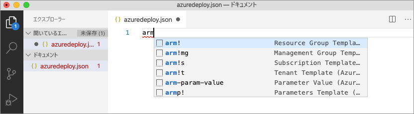

このスニペットは、ARM テンプレートの基本的な構成要素を作成します。

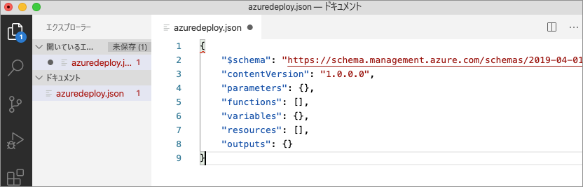

Visual Studio Code 言語モードが *JSON* から *Azure Resource Manager テンプレート*に変更されていることに注目してください。 この拡張機能には、ARM テンプレート固有の検証、入力候補、その他の言語サービスを提供する ARM テンプレート固有の言語サーバーが含まれています。


## <a name="add-an-azure-resource"></a>Azure リソースを追加する

この拡張機能には、多くの Azure リソースのスニペットが含まれています。 これらのスニペットを使用して、テンプレートのデプロイにリソースを簡単に追加できます。

テンプレートの **resources** ブロックにカーソルを置き、「`storage`」と入力し、"*arm-storage*" スニペットを選択します。

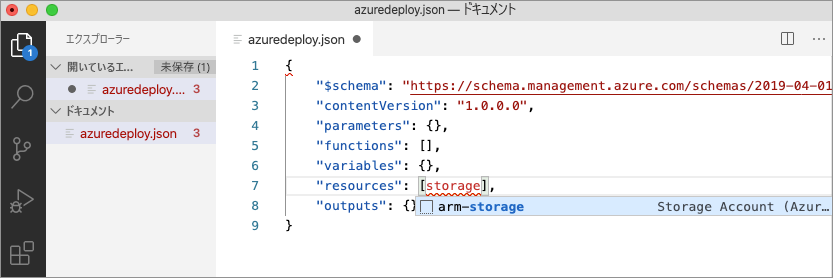

このアクションにより、ストレージ リソースがテンプレートに追加されます。

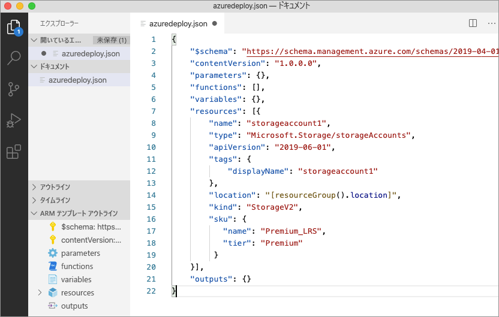

**Tab** キーを使用して、ストレージ アカウントの構成可能なプロパティを切り替えることができます。

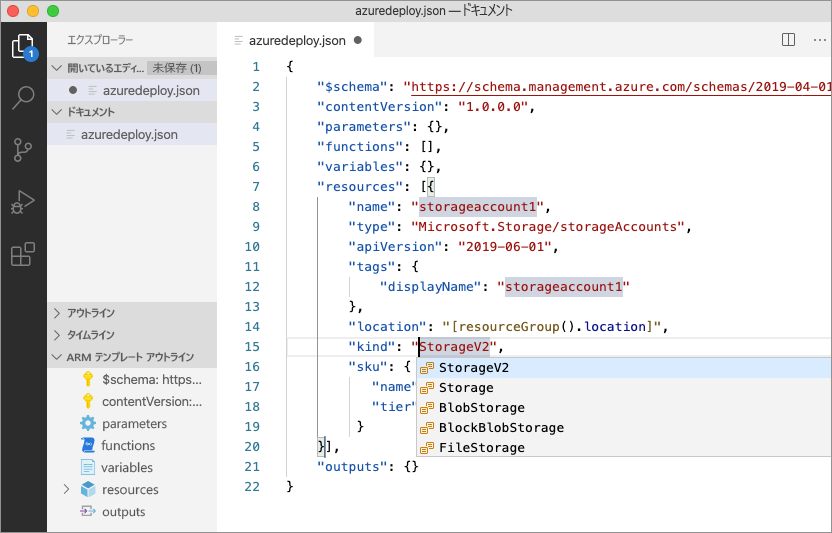

## <a name="completion-and-validation"></a>入力候補と検証

拡張機能の最も強力な機能の 1 つが、Azure スキーマとの統合です。 Azure スキーマは、検証とリソース対応の入力候補機能を備えた拡張機能を提供します。 ストレージ アカウントを変更して、検証と入力候補が動作することを確認してみましょう。 

最初に、ストレージ アカウントの種類を、`megaStorage` などの無効な値に更新します。 このアクションでは、`megaStorage` が有効な値ではないことを示す警告が生成されます。

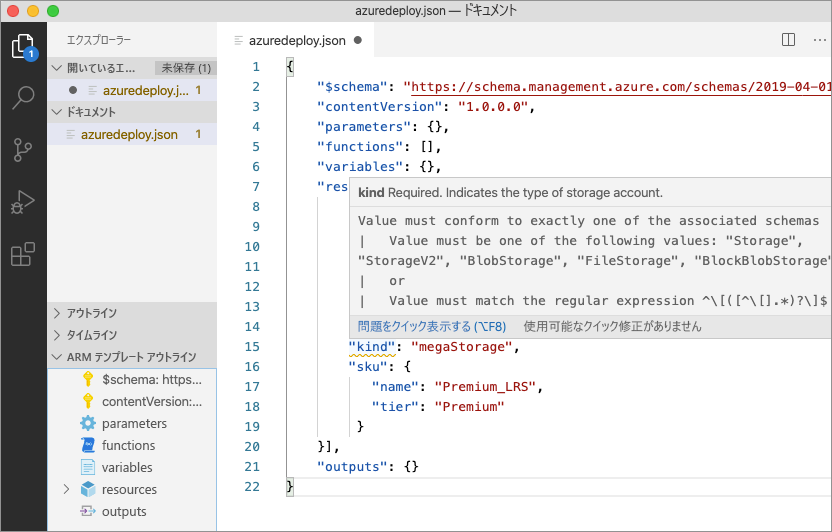

入力候補機能を使用するには、`megaStorage` を削除し、二重引用符内にカーソルを置き、`ctrl` + `space` を押します。 このアクションでは、有効な値の入力候補一覧が表示されます。

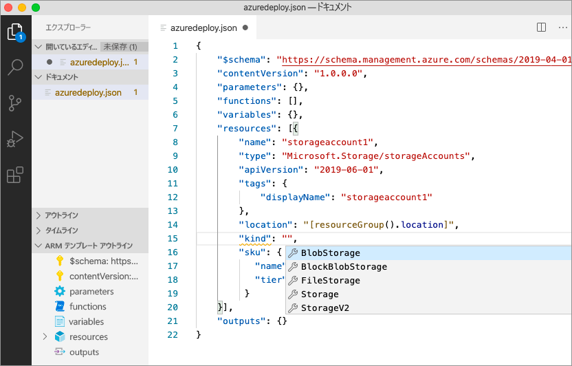

## <a name="add-template-parameters"></a>テンプレート パラメーターを追加する

ここでは、ストレージ アカウント名を指定するためのパラメーターを作成して使用します。

parameters ブロックにカーソルを置き、キャリッジ リターンを追加して「`par`」と入力し、`arm-param-value` スニペットを選択します。 このアクションにより、ジェネリック パラメーターがテンプレートに追加されます。

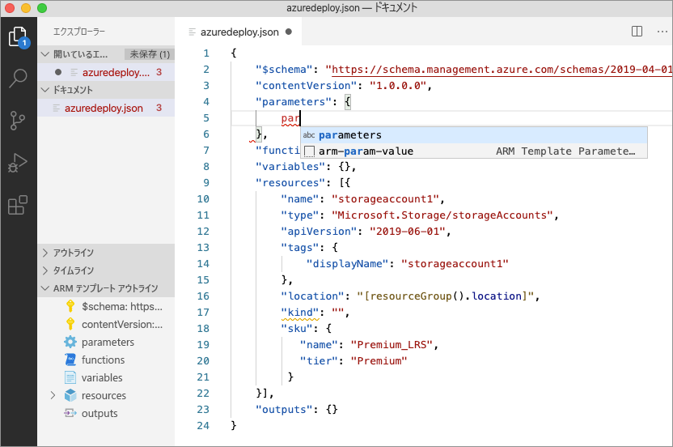

パラメーターの名前を `storageAccountName` に、説明を `Storage Account Name` に更新します。

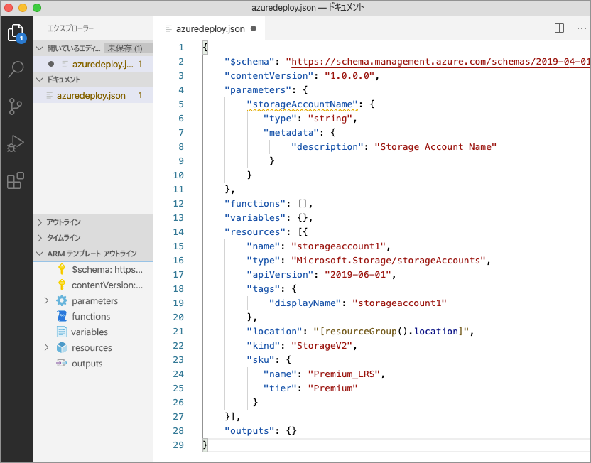

Azure ストレージ アカウント名の長さは 3 文字以上、24 文字以内です。 `minLength` と `maxLength` の両方をパラメーターに追加し、適切な値を指定します。

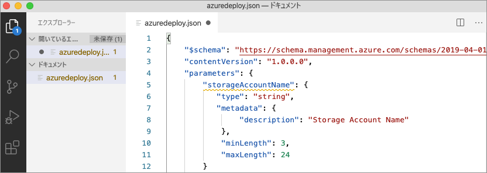

次に、ストレージ リソースで、パラメーターを使用するように name プロパティを更新します。 これを行うには、現在の名前を削除します。 二重引用符と左角かっこ `[` を入力します。これにより、ARM テンプレート関数の一覧が生成されます。 一覧から "*parameters*" を選択します。 

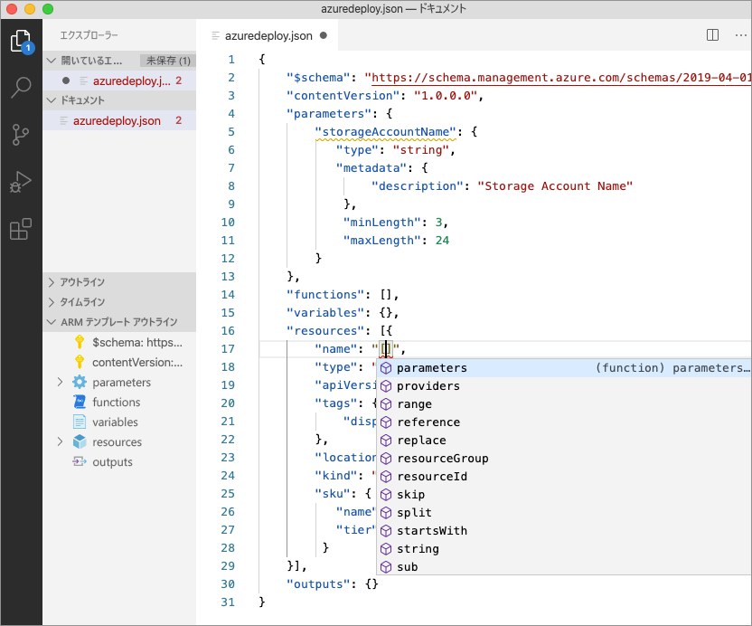

丸かっこ内に一重引用符 `'` 入力すると、テンプレートに定義されているすべてのパラメーターの一覧が生成されます。この例では "*storageAccountName*" です。 パラメーターを選択します。

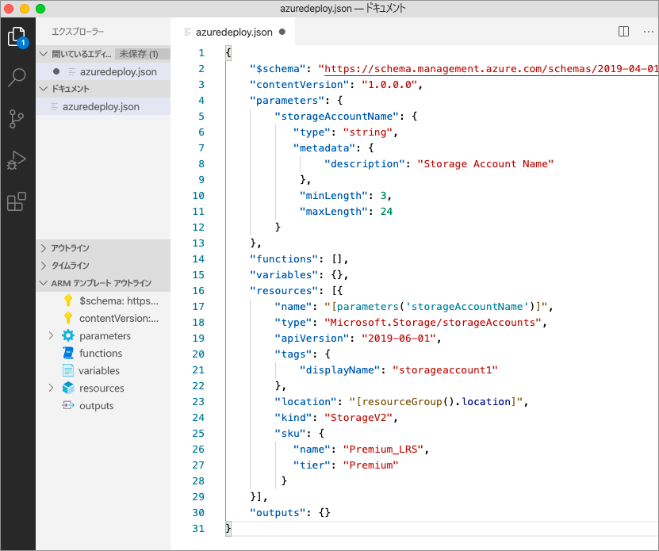

## <a name="create-a-parameter-file"></a>パラメーター ファイルを作成する

ARM テンプレート パラメーター ファイルを使用すると、環境固有のパラメーター値を格納し、デプロイ時にその値をグループとして渡すことができます。 たとえば、テスト環境に固有の値を持つパラメーター ファイルの他に、運用環境用のパラメーター ファイルも持つことができます。

この拡張機能を使用すると、既存のテンプレートからパラメーター ファイルを簡単に作成できます。 これを行うには、コード エディターでテンプレートを右クリックし、`Select/Create Parameter File` を選択します。

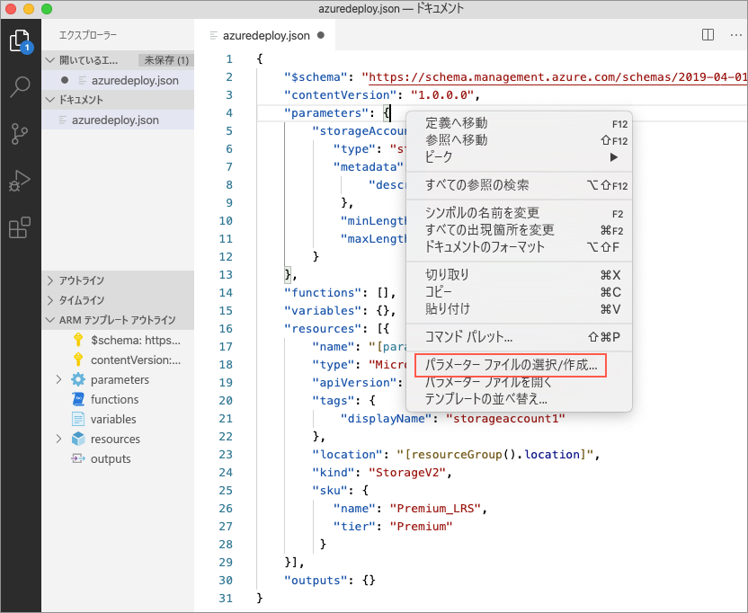

`New` > `All Parameters` を選択し、パラメーター ファイルの名前と場所を選択します。

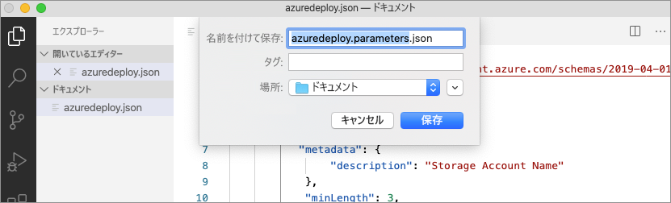

このアクションにより、新しいパラメーター ファイルが作成され、作成元のテンプレートにマップされます。 テンプレートを選択しているときに、Visual Studio Code ステータス バーで現在のテンプレートまたはパラメーターのファイル マッピングを表示および変更できます。


パラメーター ファイルがテンプレートにマップされたので、拡張機能がテンプレートとパラメーター ファイルの両方を同時に検証します。 この検証を実際に確認するには、パラメーター ファイルの `storageAccountName` パラメーターに 2 文字の値を追加し、ファイルを保存します。

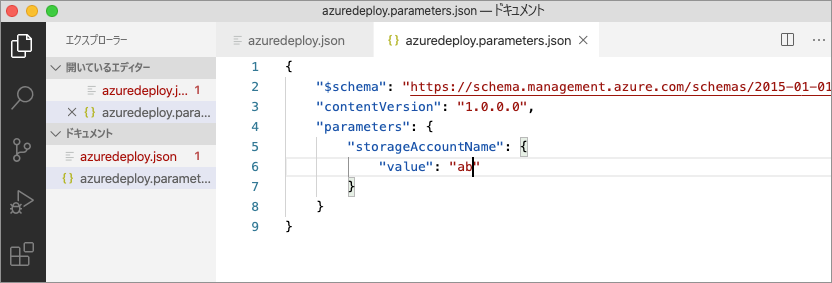

ARM テンプレートに戻ると、値がパラメーターの条件を満たしていないことを示すエラーが発生していることがわかります。

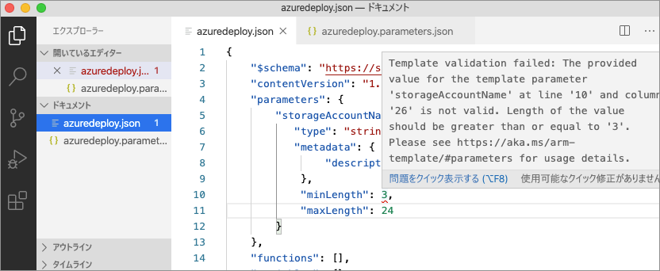

値を適切なものに更新し、ファイルを保存して、テンプレートに戻ります。 パラメーターのエラーが解決されたことを確認してください。

## <a name="deploy-the-template"></a>テンプレートのデプロイ

`ctrl` + ```` ` ```` キーの組み合わせを使用して Visual Studio Code の統合ターミナルを開き、Azure CLI または Azure PowerShell のどちらかのモジュールを使用してテンプレートをデプロイします。

# <a name="cli"></a>[CLI](#tab/CLI)

```azurecli
az group create --name arm-vscode --location eastus

az deployment group create --resource-group arm-vscode --template-file azuredeploy.json --parameters azuredeploy.parameters.json
```

# <a name="powershell"></a>[PowerShell](#tab/PowerShell)

```azurepowershell
New-AzResourceGroup -Name arm-vscode -Location eastus

New-AzResourceGroupDeployment -ResourceGroupName arm-vscode -TemplateFile ./azuredeploy.json -TemplateParameterFile ./azuredeploy.parameters.json
```
---

## <a name="clean-up-resources"></a>リソースをクリーンアップする

Azure リソースが不要になったら、Azure CLI か Azure PowerShell のどちらかのモジュールを使用してクイックスタート リソース グループを削除します。

# <a name="cli"></a>[CLI](#tab/CLI)

```azurecli
az group delete --name arm-vscode
```

# <a name="powershell"></a>[PowerShell](#tab/PowerShell)

```azurepowershell
Remove-AzResourceGroup -Name arm-vscode
```
---

## <a name="next-steps"></a>次のステップ

> [!div class="nextstepaction"]
> [初心者向けチュートリアル](./template-tutorial-create-first-template.md)
