# <a name="creating-and-deploying-azure-resource-groups-through-visual-studio"></a>Visual Studio での Azure リソース グループの作成とデプロイ

Visual Studio では、インフラストラクチャとコードを Azure にデプロイするプロジェクトを作成することができます。 たとえば、Web ホスト、Web サイト、および Web サイトのコードをデプロイできます。 Visual Studio では、一般的なシナリオのデプロイに適したさまざまなスターター テンプレートを多数用意しています。 この記事では、Web アプリをデプロイします。  

この記事では、[Azure の開発および ASP.NETのワークロードがインストールされている Visual Studio 2019 以降](/visualstudio/install/install-visual-studio?view=vs-2019)を使用する方法について説明します。 Visual Studio 2017 を使用しても、操作内容はほとんど同じです。

## <a name="create-azure-resource-group-project"></a>Azure リソース グループ プロジェクトを作成する

このセクションでは、**Web アプリ** テンプレートを使用して Azure リソース グループ プロジェクトを作成します。

1. Visual Studio で、 **[ファイル]** 、 **[新規作成]** 、 **[プロジェクト]** の順に選択します。 **[Azure リソース グループ]** プロジェクト テンプレートを選択し、 **[次へ]** を選択します。

    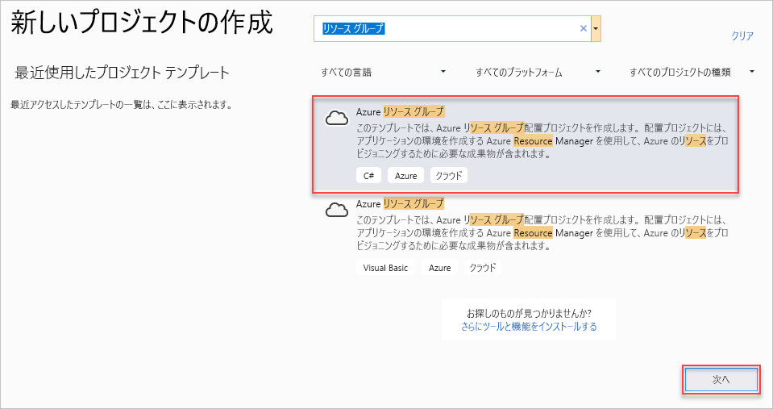

1. プロジェクトに名前を付けます。 他の既定の設定はおそらく問題ありませんが、お使いの環境でそれらが機能するように確認してください。 完了したら、 **[作成]** を選択します。

    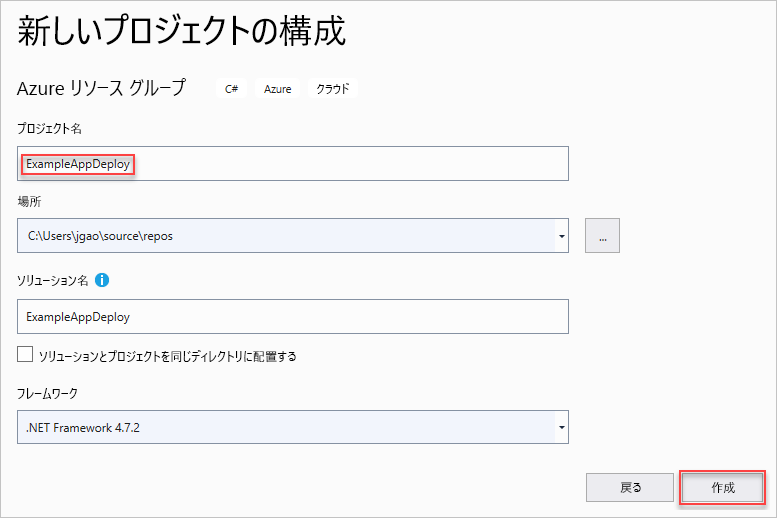

1. Azure リソース マネージャーにデプロイするテンプレートを選択します。 デプロイするプロジェクトの種類に応じて、さまざまなオプションがあります。 この記事では、 **[Web アプリ]** テンプレートを選択し、 **[OK]** を選択します。

    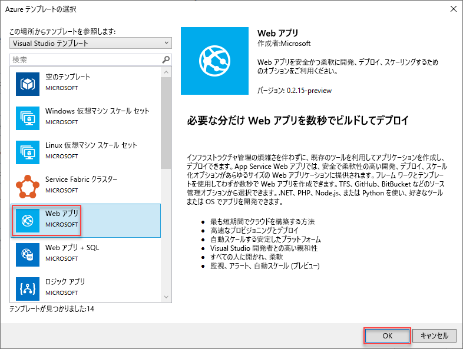

    選択したテンプレートは出発点にすぎません。リソースを追加したり削除したりしてシナリオの要件を満たすことができます。

1. Visual Studio で、Web アプリ用のリソース グループ デプロイ プロジェクトが作成されます。 そのプロジェクトのファイルを確認するには、デプロイ プロジェクト内のノードを表示します。

    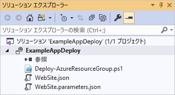

    [Web アプリ] テンプレートを選択したため、次のファイルが表示されます。

   | ファイル名 | 説明 |
   | --- | --- |
   | Deploy-AzureResourceGroup.ps1 |Azure Resource Manager にデプロイするために PowerShell コマンドを実行する PowerShell スクリプト。 Visual Studio では、この PowerShell スクリプトを使用してテンプレートをデプロイします。 |
   | WebSite.json |Azure にデプロイするインフラストラクチャと、デプロイ中に指定できるパラメーターを定義した Resource Manager テンプレートです。 Resource Manager によってリソースが正しい順序でデプロイされるように、リソース間の依存性も定義されます。 |
   | WebSite.parameters.json |テンプレートで必要な値を含むパラメーター ファイルです。 パラメーターの値を渡すことによって各デプロイをカスタマイズします。 |

    すべてのリソース グループ デプロイ プロジェクトに、上記の基本的なファイルが含まれます。 他のプロジェクトには、他の機能をサポートするために追加のファイルが含まれることがあります。

## <a name="customize-resource-manager-template"></a>Resource Manager テンプレートをカスタマイズする

デプロイ プロジェクトをカスタマイズするには、デプロイするリソースが記述されている Resource Manager テンプレートを変更します。 リソース マネージャーのテンプレートの要素の詳細については、「 [Azure リソース マネージャーのテンプレートの作成](resource-group-authoring-templates.md)」を参照してください。

1. テンプレートで作業するには、**WebSite.json** を開きます。

1. Visual Studio エディターでは、Resource Manager テンプレートの編集に役立つツールを提供しています。 **[JSON アウトライン]** ウィンドウを使用すると、テンプレートで定義されている要素を簡単に確認できます。

   ![[JSON アウトライン] の表示](./media/vs-azure-tools-resource-groups-deployment-projects-create-deploy/show-json-outline.png)

1. アウトラインで要素を選択して、テンプレートのその部分に移動します。

   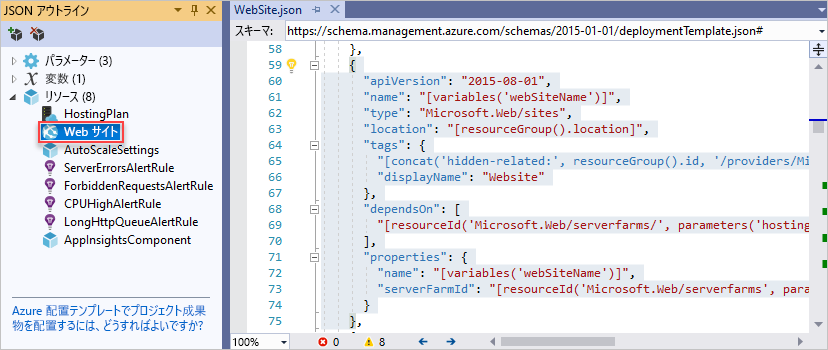

1. リソースを追加するには、[JSON アウトライン] ウィンドウの上部にある **[リソースの追加]** ボタンを選択するか、または **[リソース]** を右クリックして **[新しいリソースの追加]** を選択します。

   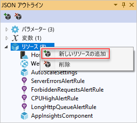

1. **[ストレージ アカウント]** を選択し、名前を付けます。 数字と小文字のみで構成された 11 文字未満の名前を指定します。

   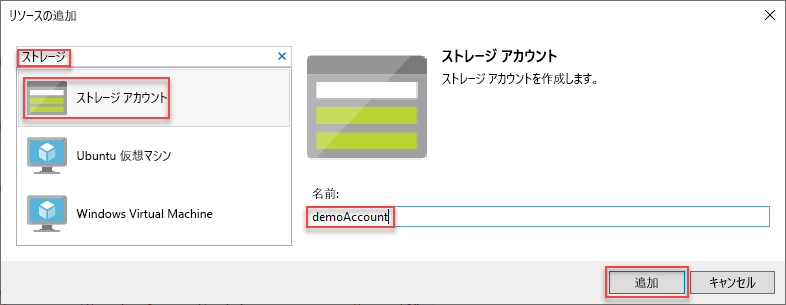

1. リソースだけでなく、ストレージ アカウントの種類を示すパラメーターとストレージ アカウントの名前を示す変数も追加されています。

   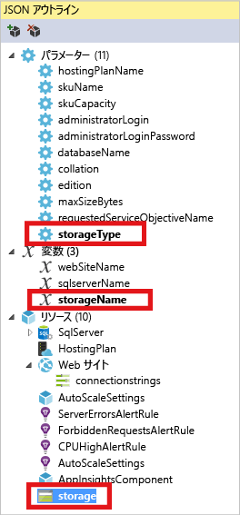

1. ストレージ アカウントの種類を表すパラメーターは、使用できる種類と既定の種類があらかじめ定義されています。 これらの値は、そのまま使用することも、シナリオに合わせて編集することもできます。 このテンプレートを使用して **Premium_LRS** ストレージ アカウントをデプロイするのをどのユーザーにも許可しない場合は、許可する種類からそれを削除します。

   ```json
   "demoaccountType": {
     "type": "string",
     "defaultValue": "Standard_LRS",
     "allowedValues": [
       "Standard_LRS",
       "Standard_ZRS",
       "Standard_GRS",
       "Standard_RAGRS"
     ]
   }
   ```

1. Visual Studio では、テンプレートの編集時に使用できるプロパティがわかるように、Intellisense を提供しています。 たとえば、App Service プランのプロパティを編集するには、**HostingPlan** リソースに移動し、**properties** の値を追加します。 Intellisense では、使用できる値を示し、その値に関する説明を提供します。

   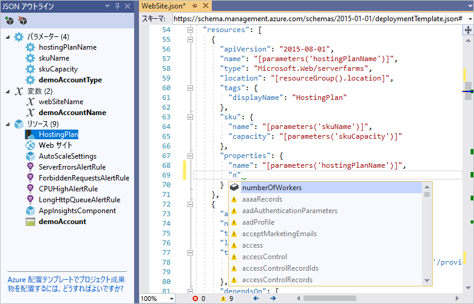

   **numberOfWorkers** を 1 に設定し、ファイルを保存することができます。

   ```json
   "properties": {
     "name": "[parameters('hostingPlanName')]",
     "numberOfWorkers": 1
   }
   ```

1. **WebSite.parameters.json** ファイルを開きます。 パラメーター ファイルを使用して、デプロイされるリソースをカスタマイズする値をデプロイ中に渡します。 ホスティング プランに名前を指定し、そのファイルを保存します。

   ```json
   {
     "$schema": "https://schema.management.azure.com/schemas/2015-01-01/deploymentParameters.json#",
     "contentVersion": "1.0.0.0",
     "parameters": {
       "hostingPlanName": {
         "value": "demoHostPlan"
       }
     }
   }
   ```

## <a name="deploy-project-to-azure"></a>Azure にプロジェクトをデプロイする

これで、プロジェクトをリソース グループにデプロイする準備が整いました。

既定では、このプロジェクトの PowerShell スクリプト (Deploy-AzureResourceGroup.ps1) は、AzureRM モジュールを使用します。 AzureRM モジュールがインストールされたままで、引き続きそれを使用する場合は、この既定のスクリプトを使用できます。 このスクリプトを使用すると、Visual Studio のインターフェイスを使用してソリューションをデプロイできます。

ただし、新しい [Az モジュール](/powershell/azure/new-azureps-module-az)に移行した場合は、プロジェクトに新しいスクリプトを追加する必要があります。 Az モジュールを使用するスクリプトを追加するには、[Deploy-AzTemplate.ps1](https://github.com/Azure/azure-quickstart-templates/blob/master/Deploy-AzTemplate.ps1) スクリプトをコピーしてプロジェクトに追加します。 このスクリプトをデプロイに使用するには、Visual Studio のデプロイ インターフェイスを使用するのではなく、PowerShell コンソールから実行する必要があります。

この記事では、両方の方法を紹介します。 この記事では、既定のスクリプトを AzureRM モジュール スクリプトと呼び、新しいスクリプトを Az モジュール スクリプトと呼びます。

### <a name="az-module-script"></a>Az モジュール スクリプト

Az モジュール スクリプトの場合は、PowerShell コンソールを開き、以下を実行します。

```powershell
.\Deploy-AzTemplate.ps1 -ArtifactStagingDirectory . -Location centralus -TemplateFile WebSite.json -TemplateParametersFile WebSite.parameters.json
```

### <a name="azurerm-module-script"></a>AzureRM モジュール スクリプト

AzureRM モジュール スクリプトの場合は、Visual Studio を使用します。

1. デプロイ プロジェクト ノードのショートカット メニューで **[デプロイ]**  >  **[New (新規)]** の順に選択します。

    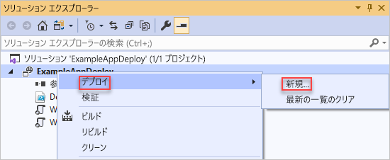

1. **[リソース グループに配置する]** ダイアログ ボックスが表示されます。 **[リソース グループ]** ボックスの一覧で、既存のリソース グループを選択するか、新しいリソース グループを作成します。 **[デプロイ]** を選択します。

    ![[リソース グループに配置する] ダイアログ ボックス](./media/vs-azure-tools-resource-groups-deployment-projects-create-deploy/show-deployment.png)

1. **出力** ウィンドウに、デプロイの進行状況が表示されます。 デプロイが完了すると、最後に、デプロイが成功したことを示す次のようなメッセージが表示されます。

   ```output
   18:00:58 - Successfully deployed template 'website.json' to resource group 'ExampleAppDeploy'.
   ```

## <a name="view-deployed-resources"></a>デプロイされているリソースを表示する

結果を確認しましょう。

1. ブラウザーで、 [Azure Portal](https://portal.azure.com/) を開き、アカウントにサインインします。 リソース グループの内容を確認するには、 **[リソース グループ]** を選択し、デプロイしたリソース グループを選択します。

1. デプロイ済みのすべてのリソースが表示されます。 ストレージ アカウントの名前が、そのリソースを追加したときに指定したものとまったく同じにはならないことに注意してください。 ストレージ アカウントは一意である必要があります。 テンプレートによって、指定した名前に自動的に文字列が追加され、一意の名前が作成されます。

    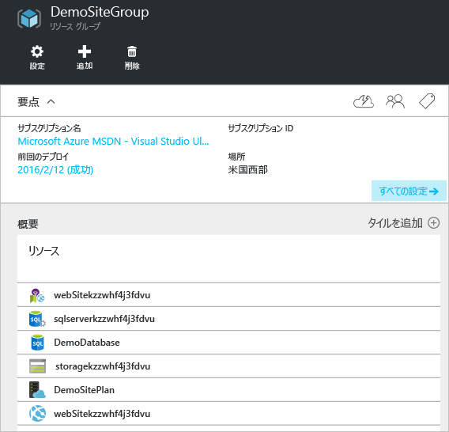

## <a name="add-code-to-project"></a>プロジェクトにコードを追加する

この時点で、アプリ用のインフラストラクチャはデプロイ済みですが、実際のコードはプロジェクトでデプロイされていません。

1. Visual Studio ソリューションにプロジェクトを追加します。 ソリューションを右クリックして、 **[追加]**  >  **[新しいプロジェクト]** の順に選択します。

    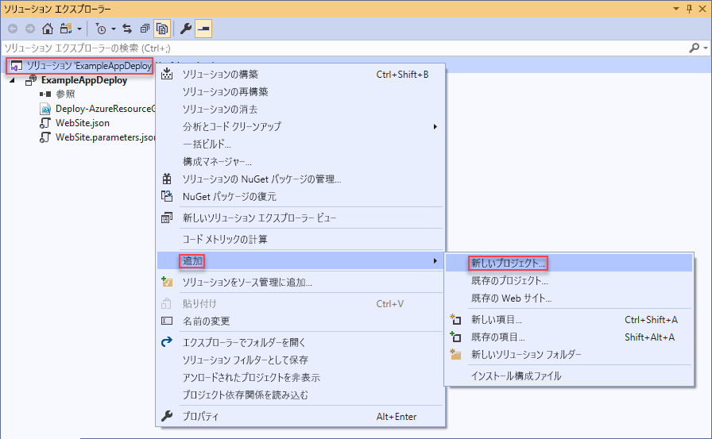

1. **ASP.NET Core Web アプリケーション**を追加します。

    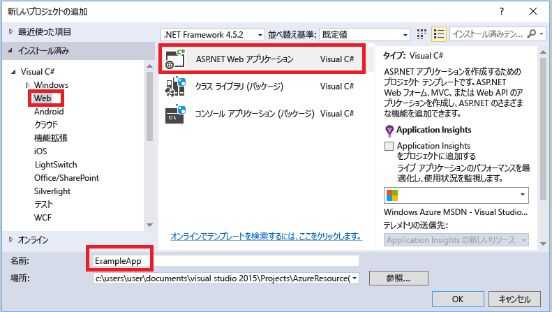

1. Web アプリに名前を付け、 **[作成]** を選択します。

    

1. **[Web アプリケーション]** を選択し、 **[作成]** を選択します。

    ![[Web アプリケーション] を選択する](./media/vs-azure-tools-resource-groups-deployment-projects-create-deploy/select-project-type.png)

1. Visual Studio によって Web アプリが作成されると、ソリューションに両方のプロジェクトが表示されます。

    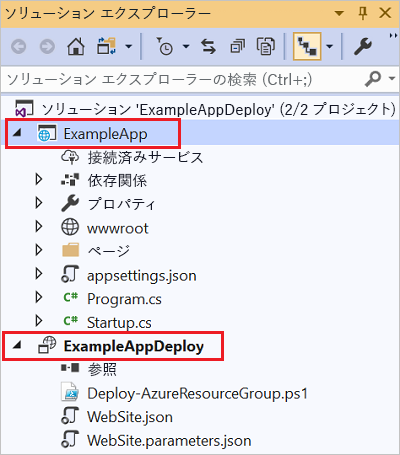

1. 次に、リソース グループ プロジェクトで新しいプロジェクトが認識されていることを確認する必要があります。 リソース グループ プロジェクト (ExampleAppDeploy) に戻ります。 **[参照]** を右クリックし、 **[参照の追加]** を選択します。

    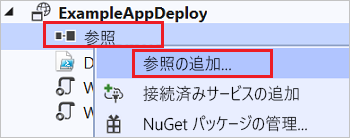

1. 作成した Web アプリ プロジェクトを選択します。

   

   参照を追加することで、リソース グループ プロジェクトに Web アプリ プロジェクトをリンクし、いくつかのプロパティを自動的に設定します。 これらのプロパティはその参照の **[プロパティ]** ウィンドウに表示されます。 **[Include File Path]\(ファイル パスを含める\)** にはパッケージを作成するパスが含まれます。 フォルダー (ExampleApp) とファイル (package.zip) をメモします。 これらの値は、アプリケーションをデプロイする際にパラメーターとして指定するため、知っておく必要があります。

   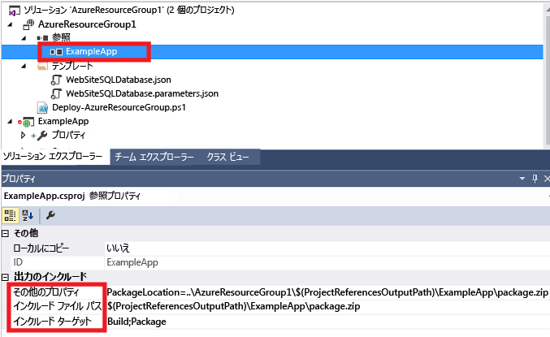

1. テンプレート (WebSite.json) に戻り、テンプレートにリソースを追加します。

    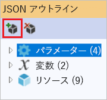

1. 今回は **[Web App の Web 配置]** を選択します。 

    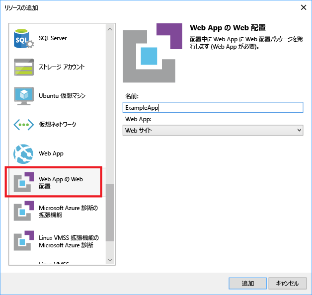

   テンプレートを保存します。

1. テンプレートには、新しいパラメーターがいくつか存在します。 それらは前の手順で追加されました。 **_artifactsLocation** または **_artifactsLocationSasToken** の値は自動的に生成されるため、指定する必要はありません。 ただし、デプロイ パッケージが含まれているパスにフォルダーおよびファイル名を設定する必要があります。 これらのパラメーターの名前の末尾は、**PackageFolder** および **PackageFileName** となります。 名前の最初の部分は、追加した Web 配置リソースの名前です。 この記事では、**ExampleAppPackageFolder** および **ExampleAppPackageFileName** という名前が付いています。 

   **Website.parameters.json** を開き、それらのパラメーターを、参照プロパティで確認した値に設定します。 **ExampleAppPackageFolder** をフォルダーの名前に設定します。 **ExampleAppPackageFileName** を ZIP ファイルの名前に設定します。

   ```json
   {
     "$schema": "https://schema.management.azure.com/schemas/2015-01-01/deploymentParameters.json#",
     "contentVersion": "1.0.0.0",
     "parameters": {
       "hostingPlanName": {
         "value": "demoHostPlan"
       },
       "ExampleAppPackageFolder": {
         "value": "ExampleApp"
       },
       "ExampleAppPackageFileName": {
         "value": "package.zip"
       }
     }
   }
   ```

## <a name="deploy-code-with-infrastructure"></a>インフラストラクチャでコードをデプロイする

プロジェクトにコードを追加したため、今回のデプロイは少し異なっています。 デプロイ中に、Resource Manager からアクセスできる場所にプロジェクトの成果物をステージします。 成果物は、ストレージ アカウントにステージされます。

### <a name="az-module-script"></a>Az モジュール スクリプト

Az モジュール スクリプトを使用している場合は、テンプレートに 1 つの小さな変更を加える必要があります。 このスクリプトにより、成果物の場所にスラッシュが追加されますが、対象のテンプレートではスラッシュが想定されていません。 WebSite.json を開き、MSDeploy 拡張機能のプロパティを見つけます。 **packageUri** という名前のプロパティがあります。 成果物の場所とパッケージ フォルダーの間のスラッシュを削除します。

次のようになります。

```json
"packageUri": "[concat(parameters('_artifactsLocation'), parameters('ExampleAppPackageFolder'), '/', parameters('ExampleAppPackageFileName'), parameters('_artifactsLocationSasToken'))]",
```

前の例では **parameters('_artifactsLocation')** と **parameters('ExampleAppPackageFolder')** の間に `'/',` がないことに注意してください。

プロジェクトをリビルドします。 プロジェクトをビルドすると、デプロイする必要があるファイルがステージング フォルダーに追加されます。

ここで、PowerShell コンソールを開き、以下を実行します。

```powershell
.\Deploy-AzTemplate.ps1 -ArtifactStagingDirectory .\bin\Debug\staging\ExampleAppDeploy -Location centralus -TemplateFile WebSite.json -TemplateParametersFile WebSite.parameters.json -UploadArtifacts -StorageAccountName <storage-account-name>
```

### <a name="azurerm-module-script"></a>AzureRM モジュール スクリプト

AzureRM モジュール スクリプトの場合は、Visual Studio を使用します。

1. 再デプロイするには、 **[デプロイ]** を選択し、以前にデプロイしたリソース グループを選択します。

    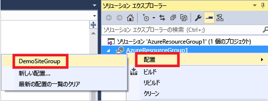

1. **[成果物のストレージ アカウント]** で、このリソース グループと共にデプロイしたストレージ アカウントを選択します。

   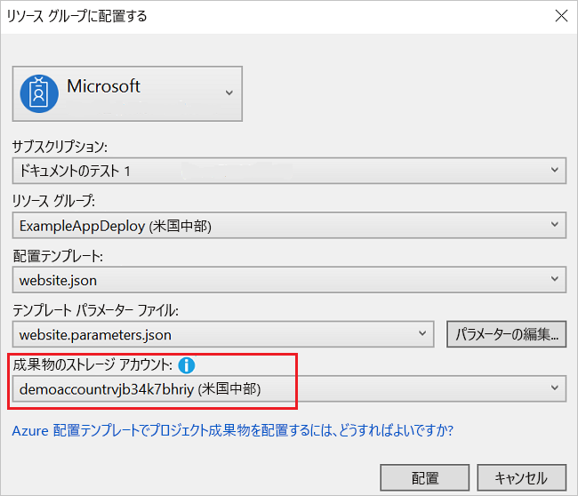

## <a name="view-web-app"></a>Web アプリを表示する

1. デプロイが完了したら、ポータルで Web アプリを選択します。 URL を選択して新しいサイトを参照します。

   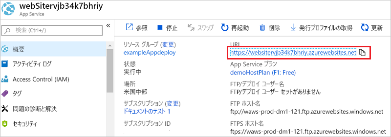

1. 既定の ASP.NET アプリが正しくデプロイされていることがわかります。

   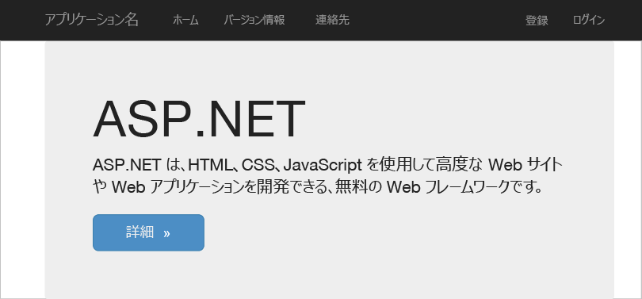

## <a name="add-operations-dashboard"></a>操作ダッシュボードを追加する

リソースは、Visual Studio インターフェイスを通じて利用できるものに限定されません。 テンプレートにカスタム リソースを追加することで、デプロイをカスタマイズできます。 リソースの追加を表示するには、デプロイしたリソースを管理する運用ダッシュボードを追加します。

1. WebSite.json ファイルを開き、resources セクションのストレージ アカウント リソースの後、右角かっこ `]` の前に次の JSON を追加します。

   ```json
    ,{
      "properties": {
        "lenses": {
          "0": {
            "order": 0,
            "parts": {
              "0": {
                "position": {
                  "x": 0,
                  "y": 0,
                  "colSpan": 4,
                  "rowSpan": 6
                },
                "metadata": {
                  "inputs": [
                    {
                      "name": "resourceGroup",
                      "isOptional": true
                    },
                    {
                      "name": "id",
                      "value": "[resourceGroup().id]",
                      "isOptional": true
                    }
                  ],
                  "type": "Extension/HubsExtension/PartType/ResourceGroupMapPinnedPart"
                }
              },
              "1": {
                "position": {
                  "x": 4,
                  "y": 0,
                  "rowSpan": 3,
                  "colSpan": 4
                },
                "metadata": {
                  "inputs": [],
                  "type": "Extension[azure]/HubsExtension/PartType/MarkdownPart",
                  "settings": {
                    "content": {
                      "settings": {
                        "content": "__Customizations__\n\nUse this dashboard to create and share the operational views of services critical to the application performing. To customize simply pin components to the dashboard and then publish when you're done. Others will see your changes when you publish and share the dashboard.\n\nYou can customize this text too. It supports plain text, __Markdown__, and even limited HTML like images  and <a href='https://azure.microsoft.com' target='_blank'>links</a> that open in a new tab.\n",
                        "title": "Operations",
                        "subtitle": "[resourceGroup().name]"
                      }
                    }
                  }
                }
              }
            }
          }
        },
        "metadata": {
          "model": {
            "timeRange": {
              "value": {
                "relative": {
                  "duration": 24,
                  "timeUnit": 1
                }
              },
              "type": "MsPortalFx.Composition.Configuration.ValueTypes.TimeRange"
            }
          }
        }
      },
      "apiVersion": "2015-08-01-preview",
      "name": "[concat('ARM-',resourceGroup().name)]",
      "type": "Microsoft.Portal/dashboards",
      "location": "[resourceGroup().location]",
      "tags": {
        "hidden-title": "[concat('OPS-',resourceGroup().name)]"
      }
    }
   ```

1. プロジェクトを再デプロイします。

1. デプロイが完了したら、ポータルでダッシュボードを表示します。 **[ダッシュボード]** を選択し、デプロイしたものを選択します。

   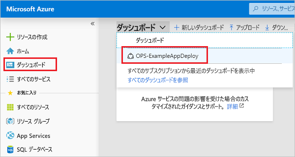

1. カスタマイズされたダッシュボードが表示されます。

   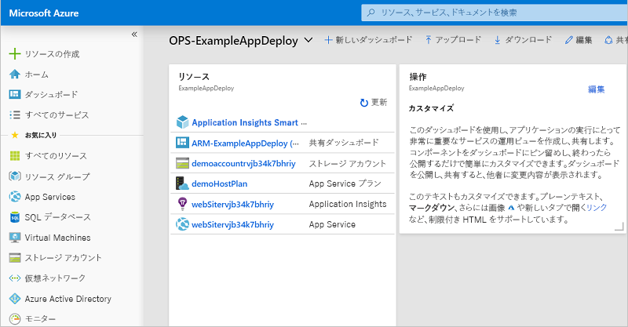

RBAC グループを使用して、ダッシュボードへのアクセスを管理できます。 また、デプロイした後で、ダッシュボードの外観をカスタマイズすることもできます。 ただし、リソース グループを再デプロイすると、ダッシュボードはテンプレートの既定の状態にリセットされます。 ダッシュボードの作成について詳しくは、「[プログラムによる Azure ダッシュボードの作成](../azure-portal/azure-portal-dashboards-create-programmatically.md)」をご覧ください。

## <a name="clean-up-resources"></a>リソースのクリーンアップ

Azure リソースが不要になったら、リソース グループを削除して、デプロイしたリソースをクリーンアップします。

1. Azure portal で、左側のメニューから **[リソース グループ]** を選択します。

1. リソース グループ名を選択します。

1. トップ メニューから **[リソース グループの削除]** を選択します。

## <a name="next-steps"></a>次の手順

このクイック スタートでは、Visual Studio を使用してテンプレートを作成およびデプロイする方法について説明しました。 次のチュートリアルでは、テンプレート リファレンスから情報を検索して、暗号化された Azure Storage アカウントを作成できるようにする方法を示します。

> [!div class="nextstepaction"]
> [暗号化されたストレージ アカウントを作成する](./resource-manager-tutorial-create-encrypted-storage-accounts.md)
